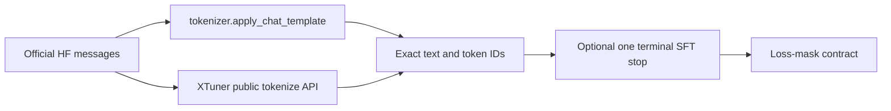

# Add Chat Template

## Goal

Treat the official Hugging Face tokenizer, or processor for a multimodal model,
as the rendering oracle. Produce the same conversation token sequence in
XTuner, supervise model-generated output by default, and supervise the
context-appropriate token that ends each assistant generation. Prove the
behavior through XTuner's public tokenize API and, when available, the target
vLLM and SGLang versions.

Keep the implementation small and model-local. Do not infer a template or stop
contract from another model in the family.

## 1. Establish the reference

1. Record the official HF repo or local directory, immutable revision, tokenizer
   class, Transformers version, and whether `trust_remote_code=True` is required.
2. Inspect the actual artifacts used by inference:
   `tokenizer_config.json`, `chat_template.jinja` or `chat_template`,
   `special_tokens_map.json`, `generation_config.json`, and `config.json`.
   Inspect `processor_config.json` and remote processor/template code when the
   official multimodal path uses `AutoProcessor.apply_chat_template`.
3. Run the bundled inventory against the same revision:

   ```bash
   python .claude/skills/add-chat-template/scripts/audit_hf_chat_template.py \
     <official-hf-model-or-local-dir> --trust-remote-code
   ```

   Omit `--trust-remote-code` unless the official model requires it. For
   model-specific branches such as tools, thinking, or multimodal inputs, pass a
   JSON case file with `--cases <path>`; see the script's `--help` output.
   The script inventories the tokenizer side; for a processor-owned multimodal
   template, run the corresponding `AutoProcessor` renderer separately.
4. Render every supported branch with the same `tokenizer.apply_chat_template`
   or `processor.apply_chat_template` entry point used by the official example.
   For multimodal models, do not assume tokenizer-only rendering reproduces
   media placeholders or processor expansion. Record all required template
   kwargs and their defaults, including
   `add_generation_prompt`, `continue_final_message`, tool definitions,
   thinking/reasoning flags, named templates, and multimodal options. Do not
   copy rendered strings from a model card when the executable tokenizer is
   available.
5. When the selected official template contains Jinja ``
   regions, call its `apply_chat_template` with `tokenize=True`,
   `return_dict=True`, and
   `return_assistant_tokens_mask=True`. Use its assistant mask as an additional
   oracle, then separately audit stop boundaries: a next-role stop token can sit
   outside the official generation region while still belonging to the previous
   assistant for SFT.
6. Pin the reference revision in tests or CI configuration. A moving HF branch
   is not a stable oracle.

## 2. Audit before implementing

Search these integration points first:

- `xtuner/v1/data_proto/templates/__init__.py`
- `xtuner/v1/data_proto/messages/`
- `xtuner/v1/data_proto/messages/__init__.py`
- `xtuner/v1/datasets/sft_tokenize_fn/openai.py`
- multimodal tokenize functions when applicable
- `tests/chat_template/` and `tests/datasets/`

If the model already exists, run its public tokenize path before changing it:

```python
tokenize_fn = OpenaiTokenizeFunctionConfig(chat_template="<name>").build(tokenizer)
result = tokenize_fn({"messages": messages, "tools": tools})
```

Compare the result with the official renderer and inspect existing tests. Find a
concrete failing message sequence before fixing a mismatch. Do not rewrite a
working implementation because its structure looks unusual.

Use `HybridChatTemplate` plus `ChatMessages` only when fixed role wrappers fully
express the official template. Add a dedicated
`xtuner/v1/data_proto/messages/<model>_chat.py` when rendering depends on
message history, tools, reasoning, content types, or the next role. Follow
`glm52_chat.py` and `qwen35_chat.py` as integration examples, not as rendering
specifications for another model.

## 3. Write the stop contract first

Inventory three distinct sources; do not collapse them into one `eos_token`:

1. **Configured generation stops**: `tokenizer.eos_token_id`, `config.json`,
   `generation_config.json`, including integer lists and stop strings.
2. **Template boundaries**: the exact token or token sequence following an
   assistant when the next item is user, tool/observation, system/developer, or
   the end of the sample.
3. **Engine stops**: the IDs and strings actually installed by the target vLLM
   and SGLang versions after loading the exported checkpoint.

Create an explicit table before writing the mask:

| Transition | Official serialized boundary | Token IDs | Engine mechanism | Loss when assistant loss is true |
|---|---|---|---|---|
| assistant → user | exact role/EOT sequence | exact IDs | EOS ID, stop ID/string, or parser | yes for the generated stop target |
| assistant tool call → tool | exact observation boundary | exact IDs | EOS ID, stop ID/string, or parser | yes for the generated stop target |
| final assistant → end | exact EOT/EOS, or documented training-only EOS | exact IDs | EOS ID or stop ID/string | yes |

Verify each token by both encoding the exact boundary and converting its ID back
to a token. Reject unknown-token conversions. Handle a multi-token stop as a
sequence rather than assuming every stop is one special token.

### Role tokens can belong to the preceding assistant

Some official templates have no dedicated per-turn EOT. The next role token is
then the token the model must generate to stop the previous assistant. In that
case, keep the official serialized order and assign loss only on that boundary
token or sequence to the preceding assistant:

```text
assistant answer <user-boundary> user text
                 ^ assistant loss  ^ masked
```

For a GLM-like protocol this can mean supervising the user boundary after a
normal answer, the observation boundary after a tool call, and the configured
terminal EOS only when no following role supplies a boundary.

Do not append a generic EOS after every assistant when the official inference
template places a role/observation boundary there. That creates training history
that vLLM and SGLang do not render. Conversely, when the official full-message
renderer omits the final token that the model must generate to terminate,
append exactly that one terminal token for SFT and document this single
training-only suffix.

Configured EOS IDs are alternatives, not a sequence to append together.
Supervise the actual context-specific stop token present in each training path.

## 4. Implement rendering and loss together

Prefer one cohesive renderer that returns rendered text plus a character- or
token-level loss mask. Keep context-dependent boundary ownership beside the
rendering branch that emits the boundary; avoid a collection of shallow helper
functions.

Apply these defaults:

- Treat `assistant` messages with no `loss` field as `loss=True`.
- Mask system/developer/user/tool inputs and role scaffolding unless the stop
  contract proves that a boundary is generated by the preceding assistant.
- Supervise all model-generated assistant components: visible content,
  reasoning that remains in the rendered sample, reasoning closing syntax,
  tool calls, and the appropriate stop target.
- Treat `loss=False` as masking the entire assistant output and its stop target.
- Mask `add_generation_prompt` completely; it is prompt scaffolding, not a
  demonstrated model output.
- Preserve explicit model behavior such as clearing historical reasoning only
  when the official template does so for the chosen kwargs.

If character offsets are used, verify special-token and Unicode boundaries with
the real tokenizer. A token overlapping a loss span needs a deliberate,
tested rule. Keep a slow, independent token-level oracle for regression tests;
do not call the production renderer from both sides of the same parity test.

Maintain exact rendering parity before any documented training suffix:



Do not use decoded-text equality as the sole check: decoding can hide a token-ID
mismatch.

## 5. Register the smallest integration

For a dedicated message implementation, update only the required seams:

1. Export the message class from `xtuner/v1/data_proto/messages/__init__.py`.
2. Add the public name and serving stop metadata to `CHAT_TEMPLATE_MAP`.
3. Dispatch that name in `OpenaiTokenizeFunction`; update multimodal dispatch
   only if the model uses it.
4. Update typed CLI/config literals only where they restrict the new name.

Keep `CHAT_TEMPLATE_MAP.stop_words` consistent with the discovered contract,
but do not treat it as proof of engine behavior. vLLM and SGLang load their
runtime stops from the exported HF artifacts and request/engine configuration.

## 6. Add good regression tests

Use the real official tokenizer/processor and XTuner's public tokenize
function. Mock only unavailable external services. Cover every supported
template branch with the smallest useful matrix:

- user → assistant, with `loss` omitted;
- assistant → user in a multi-turn conversation;
- assistant tool call → tool/observation → assistant;
- final assistant;
- `loss=False` followed by another role and at sample end;
- system/developer input;
- `add_generation_prompt=True`;
- reasoning enabled/disabled and historical reasoning behavior;
- tools and multimodal content when supported;
- repeated assistant text, Unicode, and adjacent special tokens to expose
  faulty substring or offset alignment.

Assert public behavior:

1. Official tokenizer/processor rendered text equals XTuner rendered text,
   except for the one explicitly documented final SFT suffix if required.
2. Official token IDs equal XTuner `input_ids` before that suffix.
3. `len(input_ids) == len(labels)` and every label is either the matching input
   ID or `IGNORE_INDEX`.
4. Assistant output receives loss by default; `loss=False` removes all of it.
5. Each transition's exact stop token IDs receive or do not receive loss as the
   stop table specifies.
6. User/tool content and generation prompts remain masked.
7. The fast implementation matches an independent slow oracle.

Test token positions and IDs directly. A substring assertion can supplement but
must not replace the loss assertion. Avoid snapshots that pass after both the
renderer and expected string are changed to the same incorrect value.

## 7. Validate vLLM and SGLang

Resolve exact target versions. Prefer the user's production versions; otherwise
inspect the current installed versions and latest stable official source. For
each engine:

1. Load the same exported tokenizer, `config.json`, and
   `generation_config.json`.
2. Compare the engine's chat-render/tokenize output with the official
   tokenizer/processor renderer for every stop-table transition.
3. Inspect or log the final stop token IDs/strings installed in the generation
   request. Distinguish tokenizer EOS, model generation-config EOS, request stop
   strings, and model-specific parsers.
4. Run generation smoke tests for a normal final answer and a tool call. Use a
   sufficiently high output limit and assert the engine reports a stop rather
   than a length limit, with no role leakage.

Obtain the repository GPU lock before a local GPU server or generation test. If
the exact runtime cannot be executed, audit the exact tagged engine source and
report the result as a static source audit, not runtime compatibility.

Switching from Chat Completions to Responses does not remove this requirement:
for ordinary HF models both interfaces ultimately render model messages through
the chat template.

## 8. Completion checklist

Finish only when the report includes:

- official HF repo, revision, and Transformers version;
- implementation path and whether it is generic or dedicated;
- rendering-parity matrix;
- stop-contract table with token strings, IDs, and loss ownership;
- tests proving default assistant loss and `loss=False`;
- vLLM/SGLang versions and runtime or exact-tag source validation;
- every intentional difference from the official renderer, normally at most a
  final training stop suffix.

If auditing an existing implementation, state which requirements already had
tests, which were missing, and the concrete mismatches found. Do not claim the
implementation is correct merely because a test file exists.
