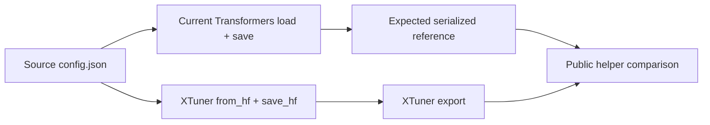

# Check HF Config Save

## Overview

Use `xtuner._testing.check_hf_config_save` to test the real public
`from_hf -> save_hf` path. Separate changes forced by the installed Transformers
version from fields dropped by XTuner, then protect fields that exact inference
engine versions use for model construction or weight loading.

## Workflow

### 1. Fix the scope and version matrix

1. Identify the source HF model directory, XTuner config class, export path, and
   any engine/version named by the user or failure log.
2. Record the executable environment versions for Python, Transformers, and any
   installed engines. Use the requested environment; otherwise follow the repo's
   default environment instructions.
3. A user-specified or production-log version takes precedence. If a component
   version is unspecified, look up the latest stable release from its official
   PyPI project/API or official release page and inspect the matching source tag.
   By default audit both vLLM and SGLang.
4. List every checked version in the result. Distinguish an installed runtime
   test from a static audit of an exact source tag.

Use a table with at least these columns:

| Component | Version | How selected | Validation |
|---|---:|---|---|
| Transformers | exact version | active environment | executable round-trip |
| vLLM | exact version | user/log/latest official | runtime or exact-tag source audit |
| SGLang | exact version | user/log/latest official | runtime or exact-tag source audit |

Do not write `latest` without resolving it to an exact version and source.

### 2. Establish the Transformers reference

Compare three raw JSON states:



- Read the source `config.json` before `AutoConfig` normalization.
- Load and save it directly with the active Transformers version. This is the
  serialized reference and captures forced defaults or `__post_init__` changes.
- Build through XTuner's public `get_model_config_from_hf`/`from_hf` API and call
  the public `save_hf` API.
- Compare the Transformers reference with the XTuner export. Do not use direct
  source-versus-export equality as the primary assertion: it misclassifies
  Transformers normalization as an XTuner bug.

Inspect the exact Transformers config implementation, including generated or
modular source and `__post_init__`, for every source-to-reference difference.
Typical examples are derived `head_dim`, generated `layer_types`, new defaults,
and serializer metadata, but never assume these examples cover a new model.

### 3. Audit inference-engine dependencies

For every changed, missing, newly defaulted, or architecture-selecting field:

1. Search the exact engine tag, not an arbitrary installed or main-branch copy.
2. Follow model registration, config access, module construction, and the weight
   loader. Search aliases, `getattr` defaults, direct attribute access, and tensor
   name/shape conditions.
3. Classify the use as one of:
   - module/parameter registration;
   - checkpoint key or tensor-shape selection;
   - layer topology or MoE routing;
   - attention/RoPE behavior;
   - ignored or default-compatible.
4. Encode every value-sensitive dependency as `HFConfigFieldDependency`, with
   exact engine version, JSON pointer, expected value, reason, and an official
   source permalink.

A field can be HF-equivalent yet engine-critical. For example, an engine may
register a checkpoint parameter only when a legacy routing field has one exact
value; omitting that field then becomes a real weight-loader failure.

Static source inspection proves the dependency but not end-to-end engine
compatibility. Run an engine checkpoint-load smoke test when the exact runtime
and required hardware are available. Otherwise report `exact-tag source audit`
and do not claim runtime success. Follow the repo GPU-lock instructions before
any local GPU run.

### 4. Add the model regression test

Delete narrow hand-written assertions that duplicate this contract, then add a
model test on the real public conversion path:

```python
import transformers

from xtuner._testing import HFConfigFieldDependency, check_hf_config_save
from xtuner.v1.model import get_model_config_from_hf


def test_save_hf_matches_transformers_and_engine_contracts():
    config = get_model_config_from_hf(SOURCE_HF_DIR)
    report = check_hf_config_save(
        config,
        SOURCE_HF_DIR,
        engine_dependencies=(
            HFConfigFieldDependency(
                engine="vllm",
                version="<exact-version>",
                path="/<json-field>",
                expected="<required-value>",
                reason="<construction or loader dependency>",
                source="<official exact-tag permalink>",
            ),
        ),
    )

    assert report.transformers_version == transformers.__version__
    assert report.checked_engine_versions == ("vllm==<exact-version>",)
```

The helper performs two independent checks:

- XTuner export matches the active Transformers direct round-trip.
- Exported values satisfy the declared inference-engine contracts, even when
  Transformers itself does not consume those fields.

Use `allowed_export_differences={"/json/pointer": "specific reason"}` only for
an intentional XTuner difference that is not already an engine dependency.
Every exception needs a non-empty model-level reason.

### 5. Prove the regression and run the matrix

1. Run the helper's own behavior tests.
2. Run the generated model test in the project's pinned Transformers version.
3. Run it in each user-requested/current upgraded Transformers environment.
4. If the old broken export is available, pass its `config.json` through the
   same helper and show that the expected missing/extra paths fail. This is the
   minimal proof that the test catches the original bug.
5. Run formatting and the smallest relevant model test suite.

Report:

- source-to-Transformers normalization paths;
- Transformers-reference-to-XTuner paths (normally none, apart from documented
  allowed contracts);
- engine dependency, expected value, exact version, and effect;
- which checks were executable and which were source-only.

## Guardrails

- Compare raw JSON, not only `AutoConfig` attributes; unknown compatibility
  fields may disappear from a newer config class while engines still read them.
- Exercise public APIs and real conversion behavior. Do not mock XTuner model
  internals.
- Do not replace the helper with a blanket list of expected keys.
- Do not silently refresh an engine version in a test. Re-audit its exact source
  before updating the version and permalink.
- HF semantic equivalence is not evidence of vLLM/SGLang compatibility.
- Preserve unrelated worktree changes and keep the implementation model-agnostic.
