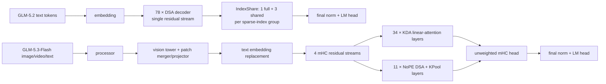

# GLM-5.3-Flash 与 GLM-5.2 结构对比及 XTuner 支持评估

## 结论概览

GLM-5.3-Flash 不是 GLM-5.2 的普通缩放版，而是一个新的原生多模态混合注意力 MoE 模型。二者共享词表规模、1M 上下文、前 3 层 dense MLP、shared-expert MoE、sigmoid NoAux router、MLA/DSA 概念和一份额外 MTP 权重；但 GLM-5.3-Flash 新增视觉塔、KDA 线性注意力、NoPE DSA、KPool 索引器和 4 流 mHC 残差，因此现有 `xtuner/v1/model/moe/glm52/` 不能通过改配置直接复用。

建议以 `zai-org/GLM-5.3-Flash-BF16` 为第一阶段的正确性基准，先落地文本塔 eager/PyTorch 正确路径，再补完整 VLM、MTP 和高性能 kernel。默认仓库 `zai-org/GLM-5.3-Flash` 是 native FP8 权重，应作为独立的加载/训练议题处理，不应与架构正确性混在同一阶段。

社区训练框架方面，NVIDIA NeMo AutoModel 与 Baidu Baige LoongForge 已经公开 GLM-5.3-Flash 训练/微调支持；上游 NVIDIA Megatron-LM 和 PyTorch TorchTitan 在 2026-09-20 的 main 分支仍未提供 `glm5_next` 模型实现。因此 XTuner 可以参考现有实现，但不能直接复用这些框架的模型类。

本文只做支持评估，不修改 XTuner 实现。

## 1. 依据与边界

- 本地参考：
  - `demo/glm5p3_flash_demo.py`
  - `xtuner/v1/model/moe/glm52/glm52.py`
  - `xtuner/v1/model/moe/glm52/dsa_mla.py`
  - `xtuner/v1/model/moe/glm52/mtp.py`
  - `xtuner/v1/module/attention/gated_deltanet.py`
  - `xtuner/v1/ops/sparse_mla/`
- HF 参考：
  - `zai-org/GLM-5.2`
  - `zai-org/GLM-5.3-Flash`
  - `zai-org/GLM-5.3-Flash-BF16`
  - Transformers 5.17 的 `transformers.models.glm5_next`
- 配置和 checkpoint 索引核查时间：2026-09-20。

`demo/glm5p3_flash_demo.py` 也说明二者是不同 HF 家族：GLM-5.2 使用 `GlmMoeDsaForCausalLM`，GLM-5.3-Flash 实际加载 `Glm5NextForConditionalGeneration` 和 `AutoProcessor`。

### 1.1 工具轮数与 Codex 配置

`~/.codex/glm.config.toml` 不是 Codex 读取的配置文件。Codex 的用户级配置是 `~/.codex/config.toml`，profile 文件是 `$CODEX_HOME/<profile>.config.toml`；项目级 `.codex/config.toml` 也不能覆盖 provider、模型和 profile 选择等宿主配置。

官方 Codex 配置项覆盖 model/provider、context window、自动压缩、MCP tool timeout/enabled、审批策略等，但没有“工具调用轮数”或 agent iteration 上限字段。因此：

- 若问题是模型倾向把任务拆成过多小步工具调用，应调整 `AGENTS.md` 的工作流指令、模型或 provider，而不是新增 GLM 专用 TOML；
- 若问题是某个运行器/平台的 hard turn/tool-call cap，应在对应 agent runtime 或服务配置中解决；
- 该问题不属于 GLM-5.3-Flash 模型结构，也不影响本文对 XTuner 支持工作的评估。

配置字段依据：<https://learn.chatgpt.com/codex/config-reference>。

## 2. 整体结构对比

| 维度 | GLM-5.2 | GLM-5.3-Flash | 支持影响 |
|---|---:|---:|---|
| HF `model_type` | `glm_moe_dsa` | `glm5_next` | 需要新的 config/import 分支 |
| HF architecture | `GlmMoeDsaForCausalLM` | `Glm5NextForConditionalGeneration` | 文本模型 vs compose/VLM |
| 模态 | text-only | image/video + text | 需要 vision tower、projector、processor |
| 参数量 | 约 753B total / 40B active | 约 320B total / 18B active | 训练与并行规模不同 |
| decoder 层数 | 78 | 45 | 新 schedule |
| hidden size | 6144 | 4096 | 新 config |
| MLP schedule | 3 dense + 75 sparse | 3 dense + 42 sparse | 基本可复用 |
| routed experts | 256 + 1 shared，top-8 | 288 + 1 shared，top-8 | MoE 主体可复用 |
| router | sigmoid NoAux，scale 2.5 | 相同 | 高度可复用 |
| attention schedule | 78 层 DSA | 34 层 KDA + 11 层 DSA | 需要混合注意力新实现 |
| residual | 每层单残差流 | 每层 4 个 mHC 残差流 | decoder 数据流需扩展 |
| MLP 激活 | 普通 SwiGLU | gate/up 限幅到 `[-10, 10]` 的 SwiGLU | 当前 clipped SwiGLU 语义不同 |
| MTP | 额外 layer 78，Transformers 主 forward 不构建 | 额外 layer 45，Transformers 主 forward 不构建 | 可借鉴，但 DSA 输入不同 |
| 默认权重 | BF16 | native FP8；另有 BF16 仓库 | 正确性优先使用 BF16 仓库 |

### 2.1 数据流差异



GLM-5.3-Flash 的 DSA 层索引为 `3, 7, 11, ..., 43`，其余 `0, 1, 2, 4, ...` 层为 KDA。前 3 层仍是 dense MLP，但从 `layer 3` 开始进入 sparse MoE。

## 3. 相同点：可以复用的部分

### 3.1 序列与 MoE 骨架

- `vocab_size=154880`，`max_position_embeddings=1,048,576`。
- `first_k_dense_replace=3`。
- 1 个 shared expert，top-8 routed experts。
- sigmoid `noaux_tc` router：
  - `n_group=1`
  - `topk_group=1`
  - `norm_topk_prob=true`
  - `routed_scaling_factor=2.5`
  - router 计算使用 float32
- `moe_intermediate_size=2048`，RMSNorm epsilon 为 `1e-5`。

XTuner 现有 `MoE`、`NoAuxRouterConfig`、expert fused-layout 转换和 GLM-5.2 的 expert 权重映射经验可以直接作为起点。

### 3.2 DSA 共同概念

两边的 DSA 都使用：

- 64 个 attention head；
- MLA latent KV；
- `index_topk=2048`；
- `index_head_dim=128`；
- `index_n_heads=32`；
- indexer 独立于主 MLA projection；
- top-k 结果使用 `-1` 表示无效 slot；
- checkpoint 中额外存放一层 MTP 权重，而 Transformers 普通 text forward 不把它构建进主 stack。

这些概念和部分权重映射可复用，但维度、位置编码和索引算法不能直接复用。

## 4. 关键差异

### 4.1 MLA/DSA：RoPE + 576 维变为 NoPE + 512 维

| 配置 | GLM-5.2 | GLM-5.3-Flash |
|---|---:|---:|
| `q_lora_rank` | 2048 | 1536 |
| `kv_lora_rank` | 512 | 512 |
| `qk_nope_head_dim` | 192 | 256 |
| `qk_rope_head_dim` | 64 | 0 |
| `v_head_dim` | 256 | 256 |
| absorbed query/key latent width | `512 + 64 = 576` | `512 + 0 = 512` |
| 主 attention RoPE | 有 | NoPE |
| indexer RoPE | 对 `q_pe/k_pe` 应用 interleaved RoPE | 无 RoPE 分量 |
| attention scaling | `256^-0.5` | `256^-0.5`，不能改为 `512^-0.5` |

GLM-5.3-Flash config 里仍保留 `indexer_rope_interleave=true`，但 `qk_rope_head_dim=0` 时该开关没有实际 RoPE 输入，不能据此实现 RoPE。

当前 `DSAMultiLatentAttention` 的 forward 明确拆分 `q_pe/k_pe` 并要求 `position_embeddings`，optimized SparseMLA wrapper 也固定校验 `dim=576`。因此需要一个 NoPE 分支：跳过 RoPE，absorbed query 和 compressed KV 都为 512 维，同时保留原始 `qk_head_dim=256` 对应的 scale。

### 4.2 IndexShare 变为 KPool

GLM-5.2 的主 stack 使用 `indexer_types` 调度：

- 21 层 `full`；
- 57 层 `shared`；
- 典型节奏为 1 层计算 indexer，后续 3 层复用 top-k；
- MTP iteration 也要求共享 indexer。

GLM-5.3-Flash 实际 checkpoint 中 45 个条目全部是 `full`。HF 实现保留了 `shared` 能力，但该配置没有使用跨层 IndexShare。

GLM-5.3-Flash 的 11 个主 stack DSA 层改为 KPool 索引器：

1. 对每个 token 生成 128 维 index key、128 维 pool gate score 和有效性位；
2. 从第一个有效 token 开始，每 `index_kpool=4` 个 token 组成一个 pool；
3. 用 `index_kpool_compress_ape` 和 token gate softmax 学出 pool 内加权 key；
4. 对 pool 打分，选择 `2048 / 4 = 512` 个 pool；
5. 展开 pool 得到 2048 个 raw token index；
6. 追加不完整 tail pool 中最多 3 个 token；
7. 用 `-1` padding 到固定宽度。

因此 KPool 输出的物理 top-k 宽度最大为：

```text
2048 + index_kpool - 1 = 2051
```

新增参数为：

- `indexer.index_kpool_compress_ape`
- `indexer.index_kpool_compress_gate`

当前 XTuner 的 token-level `torch_dsa_topk_indices` 和 DeepGEMM/TileLang indexer 均不实现 pool 选择、pool 展开和 tail 追加，不能只改 `index_topk`。

### 4.3 新增 KDA 线性注意力

GLM-5.3-Flash 的 34 层线性注意力是 Kimi-style KDA：

- 64 head，每 head 128 维；
- causal conv kernel 为 4；
- `q_proj/k_proj/v_proj` 分别投影后拼接进同一个 grouped causal conv；
- forget gate 是 `f_a_proj -> f_b_proj` 低秩路径，带 `dt_bias`、`A_log` 和 `-5.0` safe lower bound；
- input beta 为 `b_proj`；
- output gate 是 `g_a_proj -> g_b_proj`；
- core kernel 为 `chunk_kimi_delta_attention` / `recurrent_kimi_delta_attention`，并启用 QK L2 norm。

XTuner 的 `GatedDeltaNet` 提供了相关的 causal conv、gated norm、FLA custom op 和 sequence-parallel 经验，但不是同一 checkpoint layout：

| 项目 | 当前 GatedDeltaNet | GLM-5.3 KDA |
|---|---|---|
| QKV | fused `in_proj_qkv` | separate `q_proj/k_proj/v_proj` |
| forget gate | `in_proj_a + dt_bias` 直接投影 | `f_a_proj + f_b_proj` 低秩投影 |
| input beta | `in_proj_b` | `b_proj` |
| output gate | `in_proj_z` | `g_a_proj + g_b_proj` |
| core op | `chunk_gated_delta_rule` | `chunk_kimi_delta_attention` |
| decode | 训练路径为主 | 需 recurrent state path |

应新增 KDA module/config，而不是把 KDA 权重硬套进 `GatedDeltaNet`。

### 4.4 新增 4 流 mHC

GLM-5.3-Flash 引入 Manifold-Constrained Hyper-Connections：

- `hc_mult=4`，输入 embedding 扩展为约 `[B, S, 4, D]`；
- 每层有两个独立 mHC：`attn_hc` 和 `ffn_hc`；
- mHC 由 `fn/base/scale` 生成：
  - `pre`：把 4 个输入 stream 加权 collapse 成子层输入；
  - `post`：子层输出写入各 stream 的系数；
  - `comb`：4×4 residual mixer；
- `comb` 经过 20 次 Sinkhorn 行/列归一化投影到 doubly-stochastic manifold；
- `hc_eps=1e-6`；
- stack 结束时用 unweighted mean collapse 4 stream。

当前 XTuner decoder stack、micro-batch wrapper、activation offload 和 MTP 数据流基本假设 hidden states 是 `[B, S, D]`。第一阶段可以在层边界保存 flatten 后的 `[B, S, 4*D]`，每个 decoder layer 内部 view 回 `[B, S, 4, D]`，以减少对公共 `MoE` 栈的侵入；最终性能版再评估全程 4D layout。

### 4.5 新增限幅 SwiGLU

GLM-5.3-Flash 的 dense MLP、MoE expert 和 vision MLP 都使用：

```text
gate = clamp_max(gate, 10)
up   = clamp(up, -10, 10)
out  = silu(gate) * up
```

XTuner 现有 `clipped_swiglu` 是 GPT-OSS 形式：

```text
glu = gate * sigmoid(gate * alpha)
out = (up + 1) * glu
```

二者不是同一个函数。需要新增一个简单的 clamped SwiGLU act type，并同时传入 dense MLP 和 sparse expert 路径；只改 `moe_act_fn_cfg` 会漏掉前 3 层 dense MLP。

### 4.6 原生多模态

GLM-5.3-Flash 的顶层 config 嵌套 `text_config` 和 `vision_config`：

| Vision 配置 | 值 |
|---|---:|
| depth | 24 |
| hidden size | 1024 |
| attention heads | 16 |
| image size | 448 |
| patch size | 14 |
| temporal patch size | 2 |
| spatial merge size | 2 |
| output hidden size | 4096 |
| projection intermediate size | 10240 |

checkpoint 使用 `model.visual.*`、`model.language_model.*` 和顶层 `lm_head.*`。完整支持需要：

- vision patch embed、rotary position、24 层 vision block；
- patch merger/projector 和限幅 SwiGLU；
- image/video placeholder token 替换；
- `pixel_values`、`image_grid_thw`、video grid 与文本 sequence 的对齐；
- processor/chat template 和多模态 loss mask；
- vision/language/projector 的 freeze 与 sharding 策略。

Qwen3-VL/Qwen3.5 compose 结构是很好的工程模板，但 GLM vision 塔和 checkpoint key layout 不同，不能直接复用类名。

#### 4.6.1 与 Qwen3/Qwen3.5 vision 的复用边界

Qwen3-VL-4B 与 GLM-5.3-Flash 的部分规模值相近（例如 24 层、hidden 1024、16 heads、intermediate 4096、temporal/merge size 2），Qwen3.5 又已经有关闭 deepstack 的配置分支；但这些主要是形状巧合，不能把 Qwen vision 权重或模块类直接当成 GLM vision 使用。

| 部分 | 复用判断 | 原因 |
|---|---|---|
| `BaseComposeModel` / 输入注入框架 | 高度可复用 | 都需要 vision feature 替换 image/video placeholder，并可沿用 freeze/shard/save 的组织方式 |
| `SequenceContext` 多模态字段 | 可复用并需扩展 | 现有字段偏 Qwen 的 `pixel_values/image_grid_thw`；GLM HF 还显式区分 `pixel_values_videos/video_grid_thw` |
| Conv3d patch embed | 逻辑可直接复用 | Qwen 与 GLM 都是 temporal×patch×patch 的 stride conv；GLM 只是 patch size 为 14 |
| 非因果 varlen attention 执行框架 | 可复用工程模式 | packed `cu_seqlens`、FA/eager、SP all-to-all 的组织方式相近 |
| Vision attention module | 不能直接复用 | GLM 在 RoPE 前额外做 Q/K RMSNorm；Qwen 没有 |
| Vision block norm | 不能直接复用 | Qwen 是 LayerNorm；GLM 是 RMSNorm，且无 bias |
| Vision MLP | 不能直接复用 | Qwen 是两层 GELU MLP；GLM 是 gate/up/down + 限幅 SwiGLU |
| 位置编码 | 不能直接复用 | Qwen 使用 learned absolute pos embed + RoPE；GLM 无 learned absolute pos embed，只用 axial RoPE |
| spatial merge / projector | 不能直接复用 | Qwen 是 2×2 token concat + MLP merger；GLM 先 RMSNorm，再用 Conv2d downsample 到 4096，再走专用 merger |
| deepstack | 不适用 | Qwen3 使用 deepstack 分支；GLM-5.3-Flash 没有 deepstack 输出 |
| processor/chat template | 不能直接复用 | patch 对齐系数、image/video special token、`mm_token_type_ids` 和 video 展开规则不同 |

推荐做法是新建 `Glm53FlashVisionModel`：复用/抽取 Qwen 的 patch embed、varlen attention 调用、SP 通信和 compose 层输入替换逻辑；按 HF `Glm5NextVisionModel` 重写 block、axial RoPE、RMSNorm、Q/K norm、限幅 MLP、downsample 和 merger。不要继承 `Qwen3VLVisionModel` 后用大量 override 掩盖差异。

### 4.7 MTP

两个 checkpoint 都在主 stack 后额外保存一层 MTP 权重：

- GLM-5.2：`model.layers.78.*`；
- GLM-5.3-Flash：`model.language_model.layers.45.*`。

Transformers 5.17 的 `Glm5NextPreTrainedModel` 明确忽略 `layers.45.*`，因此第一阶段不构建 MTP 也能与 HF 普通 forward 对齐。GLM-5.3 MTP 层包含 KPool/NoPE DSA、MTP `enorm/hnorm/eh_proj/shared_head` 和 MoE，但没有主 stack 的 `hc_*` 参数。现有 GLM-5.2 MTP block 的显式 DSA top-k 传递思路可借鉴，但不能复用其 RoPE/576/IndexShare 假设。

## 5. 当前 XTuner 支持差距

| 领域 | 当前状态 | GLM-5.3-Flash 需要 | 差距 |
|---|---|---|---|
| HF config | `get_model_config_from_hf` 只识别 `glm_moe_dsa` | 识别 `glm5_next`，拆解 nested text/vision config | 新增 |
| model layer | `Glm52MoE` text-only | compose model + 新 text MoE model | 新增 |
| decoder residual | 单 stream `[B,S,D]` | 4 stream mHC | 新增 module 与数据流 |
| 线性注意力 | Qwen3.5 `GatedDeltaNet` | KDA module 和 Kimi delta kernel | 新增 |
| DSA | RoPE DSA，latent 576，IndexShare | NoPE DSA，latent 512，KPool | 新分支/新 indexer |
| top-k fallback | token-level top-k | pool top-k + 展开 + tail | 新增 |
| SparseMLA kernel | TileLang/cuDNN/FlashMLA 固定 576、top-k `% 64 == 0` | 512 维、最大 2051 宽度 | 新 kernel 或明确禁用旧 backend |
| MoE | NoAux router 可复用 | expert 数改为 288，激活改为限幅 SwiGLU | 小改 |
| dense MLP | 普通激活 | 限幅 SwiGLU | 小改 |
| VLM | Qwen3-VL/InternVL 框架可参考 | GLM vision tower/projector/processor | 新增 |
| checkpoint mapping | GLM-5.2 `model.*` | nested `model.language_model.*` + `model.visual.*` | 新 mapping |
| MTP | GLM-5.2 RoPE DSA MTP | KPool/NoPE MTP，非 mHC | 后续适配 |
| sequence parallel | DSA 与 GDN 各自支持 | mHC、KDA、NoPE DSA 联合支持 | 大 |
| expert parallel | MoE 通用框架可复用 | 288 experts + 新 attention shape | 中 |
| torch.compile | GLM-5.2 有专用边界 | mHC/KDA/KPool/NoPE DSA 新边界 | 需重新划分 |
| activation offload | 假设 GLM-5.2 DSA/top-k 生命周期 | 需覆盖 mHC stream 和 KDA state | 需适配 |
| FP8 | XTuner 有训练 FP8 能力 | 默认 HF checkpoint 为 native FP8 | 独立阶段 |

### 5.1 开源训练框架现状

核查时间为 2026-09-20。结论是“社区已有可用参考”，但不是“XTuner 可以直接借用模型类”：

本次代码检索对应的 main 提交：NeMo AutoModel `e2c47c5c`、LoongForge `43bd86d1`、NVIDIA Megatron-LM `fb6a123a`、TorchTitan `610bb6f6`。另外，“NeMo 支持”目前可验证的是 NVIDIA-NeMo/Automodel 路径，不是传统 NeMo Framework/Megatron recipe。

| 框架 | 支持状态 | 对 XTuner 的价值 |
|---|---|---|
| NVIDIA NeMo AutoModel | 已支持。提供 native config、image processor、vision tower、language model、HF state-dict adapter、packed CP/EP 训练路径和 MedPix EP72/CP2 recipe | 最完整的独立参考；可用于核对 KDA/KPool/mHC/NoPE 语义、FP8 反量化、CP/EP 边界和 parity 指标 |
| Baidu Baige LoongForge + Loong-Megatron | 已支持。提供 `glm5_next` config、BF16/FP8 pretrain/SFT 脚本、TP/PP/EP 拓扑、MTP 和 HF/Megatron checkpoint conversion | Megatron 系实现参考；可作为并行策略和 checkpoint mapping 对照 |
| NVIDIA Megatron-LM upstream | 未支持。main 分支有 experimental DSA 通用组件，但没有 `glm5_next` 模型/config；`NVIDIA/Megatron-LM#3507` 是 Mistral multimodal example 修复，不是 GLM-5.3-Flash 支持 | 只能复用底层 DSA/MoE/并行设计，不能按 config 直接训练 |
| PyTorch TorchTitan | 未支持。当前 main 分支没有 `glm5_next` 或 GLM-5.3-Flash 模型实现 | 只能参考 torch-native 训练组织方式 |
| Hugging Face Transformers | 有 `Glm5NextForConditionalGeneration` 参考实现和 processor | 适合 tiny random/BF16 correctness 与数据格式基准，不是 320B 工业训练方案 |
| vLLM / SGLang / KTransformers / llama.cpp / Unsloth | 主要是推理、serving、量化或低资源路径；GLM-5.3-Flash 的公开重点不在完整 BF16 多机训练 | 可参考 kernel/量化/长上下文 decode，不能替代训练参考 |

NeMo AutoModel 的当前边界需要单独记住：它支持 image training、FSDP2、activation checkpointing、EP 和 contiguous packed CP；TP、PP、video training、全模型单 GPU checkpoint loading 不支持。发布 recipe 使用 9 节 / 72 张 H100、EP72/CP2、2K packed 序列，并将 FP8 checkpoint 反量化为 BF16 训练。KDA 使用 FLA kernel，DSA 可用 SDPA reference 或 SM90+ cuDNN/FlashMLA 路径。

LoongForge 的发布脚本展示 TP8/PP5/EP8/ETP1、BF16/FP8、MTP loss 和 HF/Megatron 双向转换。它是 patched Megatron 栈，不等于 NVIDIA Megatron-LM upstream；引入 XTuner 时不能复制其启动参数来解决 XTuner 的模型实现和 HF config mapping 缺口。

参考入口：

- NeMo AutoModel GLM-5.3-Flash：<https://docs.nvidia.com/nemo/automodel/model-coverage/vision-language-models/thudm/glm-5-3-flash>；
- NeMo AutoModel recipe：<https://github.com/NVIDIA-NeMo/Automodel/blob/main/examples/vlm_finetune/glm5_next/glm5_3_flash_medpix_packed2k_ep72_cp2_100steps.yaml>；
- LoongForge：<https://github.com/baidu-baige/LoongForge>；
- LoongForge GLM-5.3-Flash examples：<https://github.com/baidu-baige/LoongForge/tree/master/examples/glm5_next>；
- NVIDIA Megatron-LM：<https://github.com/NVIDIA/Megatron-LM>；
- TorchTitan：<https://github.com/pytorch/torchtitan>。

## 6. 建议实施阶段

### Phase 0：环境和参考实现固定

1. 升级 Transformers 到包含 `glm5_next` 的版本（配置标称 5.16，本次参考源码为 5.17）。
2. 解决当前 `tokenizers==0.23.2` 不满足 Transformers `<=0.23.0` 的环境冲突。
3. 固定使用 `zai-org/GLM-5.3-Flash-BF16` 做 HF parity。
4. 保存 HF eager 路径的 tiny random config 和真实输入输出作为回归基准。

### Phase 1：文本塔 BF16 正确性

目标是不加载视觉权重，先让 45 层 text decoder 与 HF eager 对齐。

交付：

- 新 `Glm53FlashTextConfig` / model 类；
- `layers_type` 生成 34 KDA + 11 DSA；
- KDA module 与 PyTorch/FLA reference 路径；
- NoPE MLA 与 KPool DSA；
- 4 流 mHC decoder layer；
- dense/sparse 限幅 SwiGLU；
- `model.language_model.*` 权重映射；
- 只开放 `torch` SparseMLA backend，并在旧 backend 下明确报错。

验收：

- tiny random text config 与 HF eager forward logits/hidden states 一致；
- BF16 checkpoint 抽样层和完整 text forward 对齐；
- MoE router logits、top-k IDs、expert 输出一致；
- KPool 在短序列、padding、不完整 tail、长序列下索引一致；
- KDA chunk 路径和 recurrent 路径一致；
- mHC 输出与 HF 逐层对齐。

### Phase 2：完整 VLM

交付：

- GLM vision tower；
- patch merger/projector；
- image/video embedding 替换；
- processor 输入协议和 chat template；
- compose config 与 `model.visual.*` mapping；
- text-only prompt 的 dummy vision graph 路径；
- 多模态 freeze/shard 配置。

验收：

- `demo/glm5p3_flash_demo.py` 的真实图片输入 forward/generate 行为一致；
- text-only 输入不破坏 vision 参数的 autograd graph；
- image/video token loss mask 正确；
- HF save/load round-trip 不丢 key。

### Phase 3：MTP

交付：

- 加载 `model.language_model.layers.45.*`；
- MTP `enorm/hnorm/eh_proj/shared_head`；
- KPool/NoPE DSA MTP forward；
- MTP loss 与 speculative decoding 支持策略。

验收：

- 不启用 MTP 时主模型输出与 Phase 1/2 完全不变；
- 启用后 MTP hidden/logits 和 reference 对齐；
- MTP loss 不影响主 stack 梯度语义。

### Phase 4：高性能 kernel

按收益排序：

1. NoPE SparseMLA prefill/backward kernel，支持 512 latent；
2. KPool indexer kernel；
3. KDA chunk kernel 和 recurrent decode；
4. mHC Sinkhorn/bmm 融合；
5. 限幅 SwiGLU 融合。

需要注意 KPool tail 可产生 2051 宽度，旧 kernel 的 `% 64 == 0` 假设失效。可以在新 kernel 中显式支持变长有效宽度；不能用简单 padding 掩盖 576 维 kernel 不支持 512 维的问题。

### Phase 5：XTuner 训练能力完备化

- EP/ExpertTP/TP/SP/PP 组合；
- activation offload 对 mHC stream 和 KDA state 的生命周期处理；
- per-layer `torch.compile` 边界；
- BF16 训练、训练侧 FP8、native FP8 checkpoint 加载分别验证；
- 示例 SFT/RL 配置和支持列表文档。

## 7. 测试计划

测试应走 public API 和真实权重/config，不 mock XTuner 内部模块：

1. **Config 测试**：HF nested config 到 XTuner config 的字段、layer schedule、special token 和 vision config 完整性。
2. **权重覆盖测试**：BF16 checkpoint key 全覆盖，区分 expected vision/MTP missing 和真正缺失。
3. **模块 parity**：
   - KDA chunk/recurrent；
   - mHC 与最终 mean head；
   - KPool 索引；
   - NoPE absorbed MLA；
   - 限幅 SwiGLU。
4. **模型 parity**：tiny random text config 与 HF eager 全模型 forward/backward 对齐；再对 BF16 checkpoint 做 forward parity。
5. **VLM parity**：真实图片和视频样例经 HF processor 后全模型 forward 对齐。
6. **MTP parity**：主输出不变性 + MTP 输出对齐。
7. **kernel parity**：新 kernel 与 `torch` fallback 在随机 shape、padding、短序列和 2051 tail 场景下对齐。
8. **训练路径**：MoE router、aux loss、梯度、EP/SP、activation offload、compile 各自开启后与 eager 基准比较。

涉及本地 GPU 的测试先获取 `~/github/xtuner/zdev/gpu_lock.sh` 文件锁。

## 8. 主要风险

- **KDA 数值细节**：forget gate、safe lower bound、L2 norm、FP32 cast 和 FLA kernel 参数任何偏差都容易造成长序列累积误差。
- **mHC 形状侵入性**：公共 stack 隐式假设 3D hidden states；flatten-between-layers 能降低侵入，但需保证 activation offload、micro-batch 和 MTP 不破坏 stream 顺序。
- **KPool tail**：`2048 + 3` 是真实语义，不只是 kernel padding 问题。
- **optimized backend 误用**：旧 TileLang/cuDNN/FlashMLA wrapper 会直接拒绝或错误处理 512 维 NoPE 配置，必须在 config 层显式禁用。
- **native FP8**：默认 HF 仓库带 block-wise FP8 和复杂 exclude 列表，先不要用它判定架构正确性。
- **Transformers 版本**：当前默认环境的 Transformers 5.2 没有 `glm5_next`，且 tokenizers 版本冲突会让 import 失败。

## 9. 总体判断

GLM-5.3-Flash 的 MoE 和 DSA 概念与 GLM-5.2 相近，但四个新增主体——KDA、mHC、NoPE+KPool DSA、原生 VLM——都位于模型计算的关键路径上。最小可行路线是：

```text
BF16 text-only eager correctness
→ full multimodal correctness
→ MTP
→ high-performance kernels
→ parallelism / compile / offload / FP8
```

先复用 `MoE`、NoAux router、expert mapping、compose 框架和 GLM-5.2 MTP 经验；不要把 `Glm52MoE`、`DSAMultiLatentAttention` 或 `GatedDeltaNet` 当作可直接配置的目标实现。这样能把新代码限定在 config、GLM-5.3 专用 module、KPool/NoPE/KDA ops、VLM compose 和 checkpoint mapping 五个清晰边界内。
