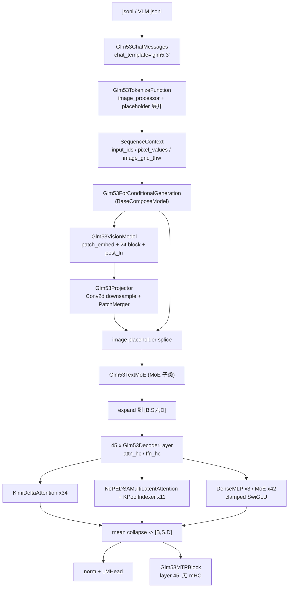
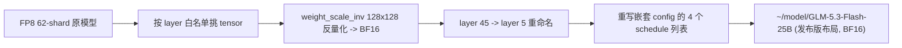
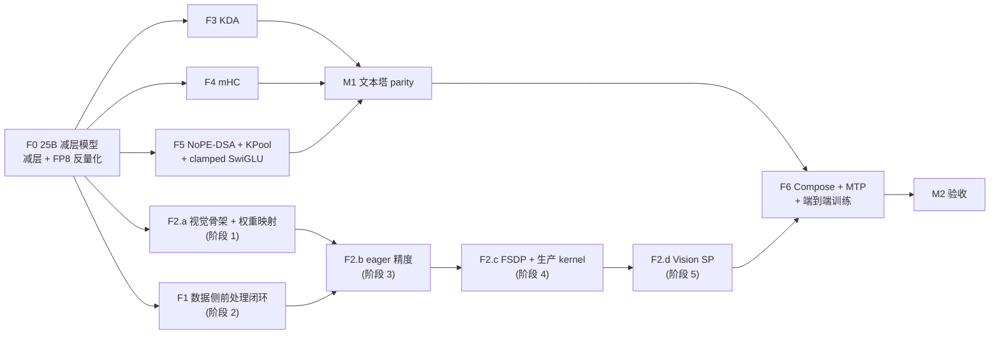

# XTuner 支持 GLM-5.3-Flash 设计文档

> 伪代码：`doc/xtuner_glm5p3flash_design.py`
> 前置调研：`doc/glm5p3flash_vs_glm5p2.md`、`~/github/Automodel/doc/glm5p3_flash_sft.md`
> VL 垂直设计（本文 F1/F2 的权威来源，作者 duanyanhui）：
> `/mnt/shared-storage-user/duanyanhui/workspace/dev/xtuner-mrope-amax/xtuner_glm53_flash_vl_vision_design.md`、
> `.../xtuner_glm53_flash_vl_develop_stages.md`
> 参考实现：HF `transformers 5.17` `models/glm5_next`、NeMo AutoModel `glm5_next`、
> XTuner `xtuner/v1/model/moe/glm52/`、`~/github/xtuner_dsv4`（mHC）、`~/github/xtuner-ncp-k3`（KDA）
> 核对时间：2026-09-21

## 总述

GLM-5.3-Flash 是原生多模态混合注意力 MoE：45 层 = 34 层 KDA 线性注意力 + 11 层 NoPE-KPool DSA，
每层 4 流 mHC 残差，288 routed experts，限幅 SwiGLU，外加 24 层视觉塔和一层 MTP。四个新主体
（KDA、mHC、NoPE+KPool DSA、VLM）全部在关键路径上，因此**不能**通过改 `glm52` 配置复用，需要新建
`xtuner/v1/model/moe/glm53/` 与 `xtuner/v1/model/compose/glm53/`，并向公共层补三个可复用
模块：`module/attention/kda.py`、`module/decoder_layer/mhc.py`、`ops/sparse_mla/kpool.py`。

本文把工作拆成 6 个可独立验收的 feature（F1~F6），给出每个 feature 的文件落点、数值契约、单测与
验收口径，并固定两条端到端验收线：25B 减层模型的 HF 数值一致性单测，和单机 8 卡 20 step 收敛训练。

其中 **F1（数据侧）与 F2（视觉塔）以 duanyanhui 的两份 VL 文档为权威来源**，本文只保留接口、
交接线，以及本次在 pinned transformers 5.17.0 上新核实/修正的外部契约（见 F1.b、F1.c）；
F3~F6（KDA、mHC、NoPE-DSA+KPool、MTP 与端到端训练）由本文完整定义。
命名统一用 `glm53` 前缀，与现有 `glm52` 文本模型一致；`glm5_next` 只用于指代 HF 的模型类型。

## 1. 目标与验收

| 项 | 内容 |
|---|---|
| 环境 | **统一 `conda activate pt29_glm2`**（文本链与 VL 链共用），torch 2.9.1，fla 0.4.2；**transformers pin `==5.17.0`**（见 3.3）。VL 阶段文档 §7.1 写的 `pt121_all_env` 作废，processor golden 必须在本 env 下重新生成 |
| 原模型 | `/mnt/shared-storage-gpfs2/gpfs2-shared-public/huggingface/hub/models--zai-org--GLM-5.3-Flash/snapshots/3f1971b7b5f7a528c9c4ef6212c8785298a8c24a/`（native FP8，62 shard，76108 tensor） |
| 验收模型 | `~/model/GLM-5.3-Flash-25B`（减层 + FP8 反量化为 BF16，约 24.9B） |
| 验收 1 | `tests/model/test_glm53.py::TestGlm53::test_fsdp_accuracy` — XTuner 与 transformers 前向 logits / loss 一致 |
| 验收 2 | `sft_glm53_tiny.sh` 单机 8 卡 20 step，loss 单调下降；覆盖 SP / EP / `XTUNER_ACTIVATION_OFFLOAD` / MTP |
| GPU | 任何占用本地 GPU 的脚本先取 `~/github/xtuner/zdev/gpu_lock.sh` 文件锁 |

## 2. 总体架构



### 2.1 文件落点

| 文件 | 归属 | 职责 |
|---|---|---|
| `xtuner/v1/module/attention/kda.py` | F3 | `KDAConfig` / `KimiDeltaAttention`，含 Ulysses SP 路径 |
| `xtuner/v1/module/decoder_layer/mhc.py` | F4 | `MHCConfig` / `hc_pre` / `hc_post` / `hc_split_sinkhorn` |
| `xtuner/v1/ops/act_fn.py` | F5 | 新增 `native_clamped_swiglu` |
| `xtuner/v1/ops/sparse_mla/kpool.py` | F5 | pool 构建 / 展开 + tail；打分与 top-k 复用现成 indexer kernel；另含 torch 参考实现 |
| `xtuner/v1/model/moe/glm53/nope_dsa_mla.py` | F5 | `NoPEDSAMLAConfig` / `NoPEDSAMultiLatentAttention` / `KPoolIndexer` |
| `xtuner/v1/model/moe/glm53/decoder_layer.py` | F4 | mHC 包裹的 dense / MoE decoder layer |
| `xtuner/v1/model/moe/glm53/glm53.py` | F4/F6 | `Glm53TextMoE` / `Glm53TextMoEConfig` |
| `xtuner/v1/model/moe/glm53/mtp.py` | F6 | MTP layer / block（无 mHC） |
| `xtuner/v1/model/compose/glm53/glm53_config.py` | F2 | `Glm53VisionConfig` / `Glm53ProjectorConfig` |
| `xtuner/v1/model/compose/glm53/modeling_vision.py` | F2 | `Glm53VisionModel`（patch_embed / axial RoPE / 24 block / post_ln） |
| `xtuner/v1/model/compose/glm53/modeling_projector.py` | F2 | `Glm53Projector`（downsample / merger） |
| `xtuner/v1/model/compose/glm53/vision_utils.py` | F2 | `flatten_video_grid_thw` |
| `xtuner/v1/model/compose/glm53/modeling_glm53.py` | **F6** | `Glm53ForConditionalGeneration` + compose config（F2 不含，见 F2 交接线） |
| `xtuner/v1/data_proto/messages/glm53_chat.py` | F1 | chat template 与 loss mask |
| `xtuner/v1/datasets/mllm_tokenize_fn/glm53_vl_tokenize_fn.py` | F1 | cache/runtime 双路径 tokenize |
| `xtuner/v1/datasets/data_item.py`、`collator.py`、`data_proto/sequence_context.py` | F1 | `Glm53VLDataItem`、`glm53_vl_sft_collator`、视频与 `mm_token_type_ids` 字段（含共享改动） |
| `xtuner/tools/model_converters/make_glm53_25b_hf.py` | F0 | 减层 + FP8 反量化 |
| `examples/v1/config/sft_glm53.py`、`sft_glm53_tiny.sh` | F6 | 端到端训练入口 |

## 3. 关键契约

### 3.1 权重布局：transformers 已内建 conversion mapping

发布版 checkpoint（zai-org）的键名与 `Glm5NextForConditionalGeneration` 的模块结构确实不同，
但 **transformers 5.17.0 已经内建了完整的双向转换**，注册在中央表
`transformers/conversion_mapping.py:552` 的 `"glm5_next"` 条目（**不在** `models/glm5_next/` 目录下，
按模型目录 grep 会漏掉）。13 个 converter 正好覆盖四处差异：

| 发布版 checkpoint（= XTuner 目标格式） | HF 模块结构 | transformers 的 converter |
|---|---|---|
| `layers.N.hc_attn_{fn,base,scale}` | `layers.N.attn_hc.{fn,base,scale}` | `WeightRenaming` ×3 |
| `layers.N.hc_ffn_{fn,base,scale}` | `layers.N.ffn_hc.{fn,base,scale}` | `WeightRenaming` ×3 |
| `self_attn.{A_log,dt_bias,f_a_proj,f_b_proj}` | `self_attn.forget_gate.{...}` | `WeightRenaming` ×4 |
| `self_attn.{q,k,v}_conv1d.weight`，各 `[Dqkv,1,4]` | `self_attn.conv1d.weight`，`[3*Dqkv,1,4]` | `WeightConverter(Concatenate(dim=0))`，顺序固定 q,k,v |
| `mlp.experts.{i}.{gate,up}_proj.weight` | `mlp.experts.gate_up_proj`（3D） | `WeightConverter(MergeModulelist(dim=0) + Concatenate(dim=1))` |
| `mlp.experts.{i}.down_proj.weight` | `mlp.experts.down_proj`（3D） | `WeightConverter(MergeModulelist(dim=0))` |

实测 round-trip（tiny 随机模型）：`save_pretrained` 写出的是**发布版布局**，
`from_pretrained` 读回后 `state_dict` 键集合相同、张量逐位相等。

**决策**：XTuner 的规范目标格式取**发布版布局**——它同时是真实 320B checkpoint 的格式、
vLLM / SGLang 读取的格式，以及 transformers `save_pretrained` 的输出格式，三者一致。
因此：

- `to_hf_key_list` / `save_hf` 对齐发布版布局（仍需写，因为 XTuner 自己的参数名如
  `fused_w1w3`、`mtp_block.*` 与 checkpoint 不同）；
- **不需要** XTuner 侧的 transformers 键桥接模块；验收 1 的单测直接
  `Glm5NextForConditionalGeneration.from_pretrained(GLM53_25B_PATH)` 即可；
- 上表的 concat 顺序与堆叠维度可直接用作 XTuner 侧 `fused_w1w3` / KDA 短卷积映射的权威参考。

`~/model/GLM-5.3-Flash-25B` 保存**发布版布局的 BF16**（FP8 反量化见 3.2），
XTuner 与 transformers 两侧都能直接加载。

### 3.2 25B 减层模型

减层原则：保留前 5 层主栈 + 原第 45 层 MTP，视觉塔与 embedding / lm_head 完整保留。

| 组成 | 参数量 |
|---|---:|
| `embed_tokens` + `lm_head` | 1.27B |
| 视觉塔 + downsample + merger | 0.57B |
| layer 0~2：KDA + dense MLP | 0.87B |
| layer 3：NoPE-DSA + MoE(288+1) | 7.40B |
| layer 4：KDA + MoE | 7.41B |
| layer 5（原 45）：MTP，NoPE-DSA + MoE | 7.43B |
| 合计 | **约 24.9B** |

`make_glm53_25b_hf.py` 相对 `make_glm52_30b_hf.py` 增加三件事：

1. 裁剪嵌套 `text_config` 的 `layer_types` / `mlp_layer_types` / `indexer_types` 到 5，
   并重写 `linear_attn_config.kda_layers=[0,1,2,4]`、`full_attn_layers=[3]`、`num_nextn_predict_layers=1`；
2. `model.language_model.layers.45.*` 重映射到 `layers.5.*`；`model.visual.*` 原样复制；
3. FP8 反量化：对每个带 `weight_scale_inv` 的张量按 128×128 block 乘回 scale 转 BF16，
   删除顶层 `quantization_config`。



### 3.3 transformers 版本必须 pin 5.17.0

`config.json` 里的 `transformers_version: 5.16.0` 只是写出该 config 的版本号，不代表 5.16.0 能加载它。
实测三个版本：

| 版本 | `glm5_next` | 权重键布局 | 可用性 |
|---|---|---|---|
| 5.16.0 | **不存在**（`transformers/models/` 下无该目录） | — | 不可用 |
| 5.16.1 | 存在（8 个文件） | 与 5.17.0 完全相同 | 有数值 bug，不可作 oracle |
| 5.17.0 | 存在 | 与 5.17.0 相同 | **推荐** |

5.16.1 → 5.17.0 有两处会直接影响 parity 的修改：

1. `chunk_kimi_delta_attention` 的 `decay_mask` 在 5.16.1 缺少严格上三角的 `-inf` 掩码，
   `(g_i - g_j).exp()` 在 `j > i` 的位置会产生非零值——KDA 的 chunk 内衰减算错；
2. vision RoPE 从 `Glm5NextVisionRotaryEmbedding(head_dim // 2)` 的手写实现改成 config 驱动的
   axial rope（`compute_axial_rope_parameters` + `recomposition_frequencies`），频率排布不同。

因此 F3（KDA）和 F2（视觉塔）的 parity 只有在 5.17.0 上才有意义。

依赖约束上没有冲突：5.17.0 要求 `tokenizers>=0.23.1,<0.24.0`，当前环境的 `tokenizers 0.23.2` 满足。
（调研文档提到的 `tokenizers<=0.23.0` 冲突是更早版本的约束，已不适用。）

**关键结论：5.16.x 的问题是数值 bug，不是能不能加载发布版 checkpoint。**
5.16.1 与 5.17.0 都内建了 `glm5_next` 的 conversion mapping（见 3.1），两者都能直接读发布版布局；
差别只在上面两处数值修复。所以 pin 5.17.0 的理由是 KDA decay_mask 与 vision RoPE，不是键名。

### 3.4 数值契约速查

| 组件 | 契约 |
|---|---|
| 主 attention | NoPE：`qk_rope_head_dim=0`，absorbed latent 512，`softmax_scale = qk_nope_head_dim^-0.5 = 256^-0.5`（`MultiLatentAttention` 中 `q_head_dim = 256 + 0`，自动成立） |
| KPool | `index_kpool=4`，先选 `2048/4=512` 个完整 pool，再追加至多 3 个 tail token，语义宽度 `2048+3=2051`；**输出 buffer 按所选 SparseMLA fwd 的对齐补齐**（FlashMLA 按 512 → 2560，TileLang 按 `block_I=64` → 2112），补位恒填 `-1` |
| indexer 打分 | `relu(q·k_pool * head_dim^-0.5)` 后按 `weights_proj * n_heads^-0.5` 加权求和；pool key 由 `softmax(gate_scores + index_kpool_compress_ape)` 在 pool 内加权平均 |
| mHC | `hc_mult=4`，`hc_eps=1e-6`，`hc_sinkhorn_iters=20`；`pre=σ(·)+eps`、`post=2σ(·)`、`comb=softmax(-1)+eps` 后 20 轮行/列归一；`hc_post` 用 `comb.transpose(-1,-2)` 归约 |
| mHC 收尾 | **无权重均值** `hidden.mean(dim=2)`，不同于 DeepSeek-V4 的可学习 head |
| KDA forget gate | `g = -5.0 * sigmoid(exp(A_log) * (f_b(f_a(x)) + dt_bias))`，`A_log`/`dt_bias` fp32 |
| KDA 其余 | QK L2 norm 在 kernel 内，`beta = sigmoid(b_proj(x))`，输出门 `g_a_proj -> g_b_proj`，`o_norm` 为 sigmoid-gated RMSNorm |
| clamped SwiGLU | `silu(clamp_max(gate,10)) * clamp(up,-10,10)`，dense MLP / routed expert / shared expert / vision MLP / merger 全部适用 |
| router | sigmoid NoAux，`n_group=1`，`topk_group=1`，`norm_topk_prob=True`，`routed_scaling_factor=2.5`，fp32 计算；correction bias 只影响选择 |
| indexer_types | 发布 config 45 层全是 `full`，**没有跨层 IndexShare**；MTP 也自带 indexer（checkpoint 中 indexer 共 12 份） |

最后一条带来一个重要简化：**主栈不需要 GLM-5.2 那套跨层 `dsa_topk_ids` 显式传递**，
`_call_decoder_layer` 不必扩展 DSA-ID 通道。配置层对 `indexer_types` 出现 `shared` 直接报错。

### 3.5 重要算子审计（对照 Automodel `44cf34834` 与已安装 fla 0.4.2）

逐个核对四个关键算子在 Automodel 的实际实现、XTuner 已有资产、以及本方案该选哪条路。

| 算子 | Automodel 实现 | XTuner 已有 | 结论 |
|---|---|---|---|
| KPool indexer 打分 | fp32 `einsum` + `query_chunk_size=32` + 逐文档 Python 循环，**无自定义 kernel** | TileLang `tl_indexer_fwd_impl`（bf16 GEMM / fp32 累加 / kernel 内 relu + head 加权）+ DeepGEMM FP8 + byte-radix top-k | **XTuner 领先**，按 F5.a 复用自己的 |
| NoPE SparseMLA | FlashMLA fwd + cuDNN bwd（`_SUPPORTED_ATTENTION_HEAD_DIMS = (512, 576)`） | FlashMLA fwd + **TileLang** bwd；TileLang fwd + cuDNN bwd | **借鉴 Automodel 的组合**，见下 |
| KDA | `fused_kda_gate` 先算门 + 显式 `sigmoid(beta)`，再调 `chunk_kda` | `~/github/xtuner-ncp-k3` 的 `kda.py`（把 `A_log`/`dt_bias` 交给 kernel） | **Automodel 对，ncp-k3 的调用约定与 fla 0.4.2 不兼容**，见下 |
| mHC | fp32 `F.linear` + `torch.matmul(comb.T, residual)`，**无 kernel** | `~/github/xtuner_dsv4` 的 `ops/hc_post.py`（Triton）与 `ops/mhc.py`（TileKernels，721 行，含 expand / pre_apply_mix / post / sinkhorn 的 fwd+bwd） | **XTuner 领先**，从 dsv4 移植 |

#### 3.5.1 KDA：ncp-k3 的调用约定在 fla 0.4.2 上会静默算错

已安装 `fla 0.4.2` 的签名是：

```python
chunk_kda(q, k, v, g, beta, scale=None, initial_state=None, output_final_state=False,
          use_qk_l2norm_in_kernel=False, use_gate_in_kernel=False,
          cu_seqlens=None, cu_seqlens_cpu=None, safe_gate=False, lower_bound=None,
          disable_recompute=False, return_intermediate_states=False,
          cp_context=None, transpose_state_layout=False, **kwargs)
```

**没有 `A_log` / `dt_bias` / `use_beta_sigmoid_in_kernel`**。而 ncp-k3 的 `kda.py` 是这样调的：

```python
chunk_kda(..., A_log=a_log, dt_bias=dt_bias,
          use_gate_in_kernel=True, use_beta_sigmoid_in_kernel=True,
          safe_gate=True, lower_bound=-5.0)
```

这三个 kwarg 会落进 `**kwargs` 被**静默丢弃** —— 门控不会施加 `A_log`/`dt_bias`/下界，`beta` 不会过
sigmoid，而且不报错。直接移植 ncv-k3 会得到一个能跑、能收敛、但数值完全错的 KDA。

正确写法按 Automodel：门控在 kernel **外**用 FLA 的融合门算子算好再传进去。

```python
from fla.ops.kda.gate import fused_kda_gate   # 有独立的 fwd/bwd Triton kernel（KDAGateFunction）

gate = fused_kda_gate(g_raw.view(B, S, H, D), A_log, dt_bias=dt_bias, lower_bound=-5.0)
beta = self.b_proj(hidden).float().sigmoid()
o, _ = chunk_kda(q=q, k=k, v=v, g=gate, beta=beta,
                 use_qk_l2norm_in_kernel=True, transpose_state_layout=True,
                 safe_gate=(lower_bound is not None), cu_seqlens=cu_seqlens)
```

`fla.ops.kda.gate.naive_kda_lowerbound_gate` 的源码是
`lower_bound * sigmoid(exp(A_log) * (g + dt_bias))`，与 HF `Glm5NextTextForgetGate` **逐字一致**，
可直接用作 F3 第一个单测的 oracle。

另外 Automodel 按序列长度分派 kernel：`seq_len > 64`（或开 CP）用 `chunk_kda`，否则用
`fused_recurrent_kda`；`safe_gate` 只传给 chunk 路径。XTuner 沿用同一分派。

#### 3.5.2 NoPE SparseMLA：不需要改 TileLang kernel

上一版说"必须改 TileLang 的 `tail_dim == 0`"——那只在坚持用 TileLang 时成立。
对照 Automodel 与 XTuner 现有 wrapper 后，更省的路是绕开 TileLang：

| 组件 | 512 latent | 2051 宽度 | XTuner 现状 |
|---|---|---|---|
| FlashMLA fwd | **原生支持**（Automodel 的 `(512, 576)` 白名单） | 按 `_FLASH_MLA_TOPK_ALIGNMENT = 512` 补到 **2560** | 被 `_validate_tilelang_sparse_mla_inputs` 的 `q.shape[-1] == 576` 挡住 |
| cuDNN bwd | 无维度硬编码，走 `topk_length` + `clamp_min(0)` | 任意宽度 | `cudnn_dsa.py` 里已经这么写了 |
| TileLang fwd/bwd | `tail_dim=0` 触发 `next_power_of_2(0)==2` 断言失败 | 按 `block_I=64` 补到 2112 | 需要改 kernel |

XTuner 现有两个 backend 各带一半 TileLang（`flash_mla` = FlashMLA fwd + **TileLang** bwd；
`cudnn_dsa` = **TileLang** fwd + cuDNN bwd），恰好都躲不开。所以 F5.b 改为：

1. 把 `_validate_tilelang_sparse_mla_inputs` 里的 `576` / `value_dim==512` 硬校验参数化为
   `(head_dim, value_dim)` 白名单 `{(576, 512), (512, 512)}`；
2. 新增 fwd/bwd 独立选择的 **`flash_mla_cudnn`** backend（FlashMLA fwd + cuDNN bwd），
   与 Automodel 的 `cudnn_sparse_attention` 等价；
3. top-k 宽度按所选 fwd 的对齐补：FlashMLA → `ceil(2051/512)*512 = 2560`，
   TileLang → `ceil(2051/64)*64 = 2112`。对齐值由 backend 决定，不写死。

**待验证**：Automodel 在进 FlashMLA 前做了 `_compact_and_sort_indices`（压实成升序有效前缀 +
每行 `topk_length`）。XTuner 现有 `flash_mla` 路径直接传 `-1` 散落的 indices 且 GLM-5.2 在生产跑通，
说明排序可能不是必需。F5 要显式验证"是否必须压实排序"，不要凭现状假设。

保留 TileLang 的 `tail_dim=0` 改造作为**备选**（若目标硬件无 FlashMLA/cuDNN），不进第一版。

#### 3.5.3 mHC：从 dsv4 移植，不要照抄 Automodel

Automodel 的 mHC 是两处慢路径：

```python
# 1) K=16384, N=24 的 fp32 GEMM —— 无 tensor core（sm80_xmma_gemm_f32f32_*）
pre_w, post_w, comb_w = F.linear(flat, self.fn.float()).split([hc, hc, hc * hc], dim=-1)
# 2) K=hc_mult=4，低于 Hopper wgmma tile 下限，cuBLAS 回落 CUDA-core，带宽受限
hidden = post.to(dtype).unsqueeze(-1) * update.unsqueeze(-2) + torch.matmul(comb.to(dtype).transpose(-1, -2), residual)
```

XTuner 的 dsv4 分支已经量化过第 2 条的代价并做了 kernel：pack=16384 下约 3 ms/call、
86 call/step ≈ 250 ms/step，因此有 `xtuner/v1/ops/hc_post.py`（Triton `hc_post_fused`）与
`xtuner/v1/ops/mhc.py`（TileKernels 后端，含 `expand` / `pre_apply_mix` / `post` / `sinkhorn` /
`head_compute_mix` 的 fwd+bwd）。GLM-5.3 是 45 层 × 2 个 mHC = **90 call/step**，同一量级。

因此 F4 的实现顺序是：dsv4 的 `hc_pre` / `hc_post` / `hc_split_sinkhorn` 直接移植 →
默认走 bf16 Linear（cuBLAS fp32 累加）+ Triton `hc_post_fused` →
`XTUNER_USE_MHC_KERNELS=1` 时切 TileKernels → HF-parity 开关保留全 fp32 eager 路径做 bitwise 锚点。

**从 Automodel 借的是精度工程，不是 kernel**：`base` / `scale` 放进一个独立的
`_fp32_params` 子模块（`Glm5NextHyperConnectionFp32Params`），让 FSDP2 的 `MixedPrecisionPolicy`
按 FSDP unit 生效时不会把它们降到 bf16。KDA 的 `A_log` / `dt_bias` 同理
（Automodel 的 `Glm5NextKDAFp32Params`，并特意保持 checkpoint 原始 layout 以免 DTensor
在 checkpoint planning 阶段丢掉第 0 维）。这比只靠 `hf_save_cfg.fp32_keys_pattern` 更稳。

#### 3.5.4 从 Automodel 明确**不**借的部分

| 项 | 原因 |
|---|---|
| 逐文档 Python 循环 + `query_chunk_size=32` 的 DSA forward | 每文档每 32 个 query 一次 launch，pack=16384 多文档时 launch 开销极大；XTuner 走 packed `cu_seqlens` + 一次 kernel |
| SDPA 路径里 `scatter_add_` 造 `[1, chunk, length]` 稠密 bool mask | 只适合做 correctness reference，XTuner 用 `-1` 索引直接喂 SparseMLA |
| indexer 的 fp32 einsum | XTuner 有 bf16/FP8 的 TileLang / DeepGEMM 路径 |
| mHC 的 fp32 `F.linear` 与 K=4 `matmul` | 见 3.5.3 |

### 3.6 序列切分：Automodel 的 contiguous CP vs XTuner 的 Ulysses SP

Automodel 的 `cp.py`（341 行）解决的是和 XTuner 不同的问题：它走 **context parallel**
（序列分片、跨 rank 传递状态），XTuner 走 **Ulysses SP**（序列分片后 all-to-all 换成 head 分片）。
对 KDA 这种有左到右状态的算子，两者的代价结构完全不同。

| | Automodel contiguous CP | XTuner Ulysses SP（ncp-k3 `forward_for_sp`） |
|---|---|---|
| KDA 输入 | 保持 `[1, S/cp, D]`，全部 head | all-to-all 换成 `[1, S, H/sp, D]`，全序列、部分 head |
| 短卷积 | 从前一个 rank 收 `kernel-1=3` 个 token 的左 halo（`conv_cp_send_recv_fwd`） | 在全序列上算，权重按 channel 切 |
| recurrent state | `send_recv_fwd` 左→右传，backward 右→左 | **不需要**，每个 rank 自己算完整序列的部分 head |
| 通信量/层 | halo 3·C + state `[H, D, D]` fp32 ≈ 4 MB × (cp-1) | 6 次 all-to-all，各 ~S·C/sp |
| 依赖结构 | **串行**，延迟 ∝ cp_size | 全并行 |
| 硬约束 | 分片必须**连续**，不能用 load-balanced 置换 | `num_heads % sp_size == 0`（64 heads，宽松） |

**本方案继续用 Ulysses SP**：XTuner 的 MHA / GDN / DSA 全部是这条路径，KDA 的 SP 实现在
ncp-k3 已经有（只是调用约定要按 3.5.1 更正），不引入第二条并行轴。

#### 3.6.1 XTuner 现有 SP 布局对 KDA/KPool 是安全的（但要写成显式约束）

核对了两处：

- `split_for_sequence_parallel` 是 `input.narrow(dim, rank * split_size, ...)` —— **连续切分**，
  不是 zigzag / load-balanced 置换；
- `SequenceContext.split` 先 `pad_to_multiple_of(input_ids, sp_size)` 再切 ——
  每个 rank 拿到等长、**非空**的分片，并保留全局 `cu_seq_lens` 与 `shard_start` / `shard_size`。

所以 Automodel 文件头那句警告（"KDA 有左到右状态，generic load-balanced CP 置换无效"）
在 XTuner 当前布局下不成立。但这是**隐式**成立的，必须写进约束：

> **若将来为 causal 负载均衡引入 zigzag / load-balanced SP 切分，KDA 的短卷积与 recurrent
> 状态、以及 KPool 的按文档分池都会静默出错。** GLM-5.3 的 SP 必须保持连续切分。

建议在 `Glm53TextMoE` 里加一条 `seq_ctx` 布局断言（分片连续且等长），而不是靠注释。

#### 3.6.2 `all_gather_backward_anchor`：XTuner 现在不需要，但它划出一条禁止线

Automodel 需要这个 autograd 锚点，是因为它**逐文档**执行 DSA：一个短样本可能让某个 CP rank 的
连续区间里一个有效 query 都没有，那个 rank 就不会进入 all-gather 的 backward，集合通信失配、挂死。

XTuner 不会踩到：`SequenceContext.split` 保证每个 rank 分片非空，且 DSA 是对整个 packed 序列
一次 kernel，不做逐文档 Python 循环。但这正好说明**为什么不能引入逐文档循环**：

> 禁止在 SP 下按文档循环执行 attention。一旦某 rank 对某文档无 query，就需要
> Automodel 那套 backward 锚点来保持集合通信对称；XTuner 的单 kernel packed 路径没有这个问题，
> 也不应该为了对齐 HF 的逐文档语义而退化成循环。

#### 3.6.3 padding 语义差异

| | Automodel | XTuner |
|---|---|---|
| padding 表示 | `doc_ids == 0`，forward 里 `if doc_ids[doc_start] <= 0: continue` 直接跳过 | `SequenceContext.split` 把 padding 追加成**尾部一个额外 document**（`cu_seq_lens[-1] += new_padding`） |
| 对 KPool 的影响 | 完全不计算 | padding 自成文档 ⇒ 池不会跨到真实文档，**语义安全**；但会为 padding 白算一遍 indexer 与 attention |

语义上 XTuner 是对的，代价是尾部 padding 的无效计算。是否值得加一条"跳过 padding 文档"的
短路，等 F6 profile 到 padding 占比后再定，不进第一版。

#### 3.6.4 VLM 的 splice 时机：两套做法，要选一条写清楚

- **Automodel**：`shard_batch_for_glm5_next_cp(..., shard_primary=False)` ——
  `labels` / `position_ids` / `padding_mask` 等 no-grad 流提前切，但 `input_ids` 与媒体保持全局，
  等 `forward` 里把 image feature splice 进**完整**的 embedding 序列之后，再切可微的 primary 流；
- **XTuner（Qwen3-VL 现状）**：先切，再在 `get_placeholder_mask` 里 all-gather `input_ids`
  与 visual feature，按本 rank 的 placeholder 数切出对应的 feature 段。

两者都正确。本方案**沿用 XTuner 现有做法**（复用 `BaseComposeModel` 框架，避免改 collator 的切分时机），
但必须满足 duanyanhui 设计文档 §8.3 的约束：`mm_token_type_ids` 与 `input_ids` 走**同一个**
pad / truncate / split 结果，不能按本 rank 的 begin/end token 局部推导 modality。
F6 的 splice 用全局 `mm_token_type_ids`（或 `raw_input_ids`）算 mask 再切，不用本地 `input_ids`。

#### 3.6.5 若将来确实需要 CP

fla 0.4.2 已经带了完整的 CP 原语：`fla.ops.cp` 导出 `build_cp_context` /
`conv_cp_send_recv_fwd/bwd` / `send_recv_fwd/bwd` / `chunk_delta_h`，`FLACPContext` 的字段是
`group / cu_seqlens / cu_seqlens_cpu / is_first_rank / is_last_rank / pre_num_ranks /
post_num_ranks / conv1d_kernel_size / pre_num_conv_tokens`。

选 CP 而不是 Ulysses 的判据只有两个：序列长到 all-to-all 的 `S·C/sp` 通信成为瓶颈，
或者并行度需要超过 head 数（KDA 64 heads / DSA 单 KV group）。两条在当前 pack 长度下都不成立，
因此 CP 列为后续议题，不进本方案。

### 3.7 视觉部分：VL 设计文档 与 Automodel / HF 5.17 的交叉核对

拿 duanyanhui 的视觉设计文档逐条对 Automodel `vision.py`（268 行）与 HF 5.17 核对，
**结构与数值语义全部一致**，没有实现层面的分歧；但有 4 处需要修订或注意。

一致的部分（不再展开）：模块命名与 `model.visual.` 前缀、forward 顺序
`patch_embed -> blocks -> post_layernorm -> downsample -> merger`、Conv3d/Conv2d 的 kernel=stride、
RoPE 频率布局 `[h, w, h, w]` 与 merge-block-major 位置展开、RoPE 前的 Q/K RMSNorm、
RMSNorm block norm、限幅 SwiGLU、merger 的 `proj -> LayerNorm -> GELU -> clamped SwiGLU`、
`last_hidden_state` = downsample 后 / `pooler_output` = merger 后。

#### 3.7.1 §16.7 的禁止事项成立，但给出的机制不成立

设计文档 §16.7 说：把未展开的 `[t,h,w]` 直接传进 vision tower，
"两种表示 patch 总数相同，所有 shape/计数校验都发现不了混用，只会**静默改变 attention 边界**"。

实测不是这样。`get_vision_cu_seqlens(merge_temporal=False)` 与 `get_vision_position_ids`
**本身就是 t-aware** 的（前者 `repeat_interleave(h*w, t)`，后者按文档说明"h/w indices are still
repeated `t` times for video inputs"）。两个视频 `[[3,4,6],[2,2,4]]` 与其展开形式实测：

```text
cu_seqlens  unexpanded [0, 24, 48, 72, 80, 88]
cu_seqlens  expanded   [0, 24, 48, 72, 80, 88]   -> 完全相同
position_ids           (88, 2) vs (88, 2)        -> 逐元素相同
```

Automodel 的 `_vision_cu_seqlens` / `_vision_position_ids` 用同样的 t-aware 公式，
所以它的 vision tower 对两种表示是**等价**的。

真正有差异的只有下游的 feature 分组：

```text
split_sizes(unexpanded, per-video) [18, 4]
split_sizes(expanded,   per-frame) [6, 6, 6, 2, 2]
```

**修订**：禁止事项本身保留（与 HF `get_video_features` 保持一致的约定），但理由改为
"影响 feature 分组与 `num_img_tokens` 的 per-ViT-sequence 语义"，而不是"改变 attention 边界"。
对应的测试重心也要从 F2（视觉塔）移到 F1（`num_img_tokens` 必须是 `[H*W] * grid_t`）。
vision tower 入口的 `assert grid_thw[:, 0].eq(1).all()` 保留为**约定检查**，不是数值护栏。

#### 3.7.2 HF 的 RoPE docstring 与代码矛盾，照注释写会踩坑

`Glm5NextVisionRotaryEmbedding.forward` 的注释是：

```python
# position_ids: (2, N) — row 0 = h coords, row 1 = w coords
```

但同类的 `recomposition_frequencies` 里是 `freq_h, freq_w = freq[:, 0], freq[:, 1]`，
需要 `(N, 2)`；`get_vision_position_ids` 实际返回的也是 `(total_tokens, 2)`。
注释是错的。按注释实现会 shape 报错（不是静默），但会浪费定位时间——F2 直接按 `(N, 2)` 写。

#### 3.7.3 Automodel 是 image-only，video 没有可对照实现

```python
if pixel_values_videos is not None:
    raise NotImplementedError("GLM-5.3 AutoModel onboarding currently supports images, not video training")
```

含义有两条：

1. 设计文档阶段 3 的 `test_video_vision_forward_backward_bitwise_parity` **只能对 HF**，
   Automodel 没有 video 路径可交叉验证；
2. Automodel 的 splice 是 `mask = input_ids == self.config.image_token_id` ——
   在 image-only 下正确，**有 video 时会连视频帧一起命中**（视频帧展开后也是 `<|image|>`，见 F1.b）。
   GLM-5.3 的 video splice 不能抄 Automodel，必须用 `mm_token_type_ids`。

#### 3.7.4 `Glm53VisionConfig` / `Glm53ProjectorConfig` 的字段名要对齐 checkpoint

设计文档 §5.1 已声明"默认值仅作占位，PR 1 必须逐字段核对"，这里先把实测差异列出来，
因为两个 config 都是 `extra="forbid"`，直接用 `config.json` 的 vision_config 构造会失败：

| 设计文档 §5.1 | checkpoint / HF 实际 | 说明 |
|---|---|---|
| `num_attention_heads: int = 16` | checkpoint 字段是 **`num_heads`** | HF 两个名字都认（`num_attention_heads` 是别名）；XTuner 侧要能吃 `num_heads` |
| `rope_parameters: dict`（必填） | checkpoint vision_config **没有这个字段** | HF 填默认 `{'rope_theta': 10000.0, 'rope_type': 'axial'}`。XTuner 必须给同样的默认值，否则必填字段会挡住构造 |
| `text_hidden_size: int = 4096`（projector） | checkpoint 字段是 **`out_hidden_size`** | 值相同，命名不同 |
| `head_dim` | checkpoint **没有**，HF 推导 `hidden_size // num_attention_heads = 64` | 与 §5.1 的注记一致，不需要显式字段 |

checkpoint vision_config 的完整字段集（实测）：
`attention_bias, attention_dropout, depth, hidden_act, hidden_size, image_size, in_channels,
initializer_range, intermediate_size, model_type, num_heads, out_hidden_size, patch_size,
projection_intermediate_size, rms_norm_eps, spatial_merge_size, swiglu_limit, temporal_patch_size`。

#### 3.7.5 一处 nit

Automodel 的 `Glm5NextVisionMLP` 把 bias 硬编码成 `bias=True`，而 HF 是
`Glm5NextVisionMLP(config, bias=config.attention_bias)`。当前 checkpoint `attention_bias=True`，
两者数值一致；XTuner 按 HF 写（由 config 驱动），不要跟 Automodel 硬编码。

## 4. Feature 拆分

### F1 数据侧前处理闭环：chat template、TokenizeFn、Collator、Packing

> 本 feature 的详细契约以 duanyanhui 的两份文档为准：
> `~duanyanhui/workspace/dev/xtuner-mrope-amax/xtuner_glm53_flash_vl_vision_design.md` §7~§8（下称"视觉设计文档"）
> 与 `xtuner_glm53_flash_vl_develop_stages.md` §3（下称"阶段文档"，对应其**阶段 2**）。
> 本节只记录与本文其余部分的接口、以及本次在 pinned 5.17.0 上**新核实**的事实。

**交付**

```text
xtuner/v1/data_proto/messages/glm53_chat.py              # chat template + loss mask
xtuner/v1/datasets/mllm_tokenize_fn/glm53_vl_tokenize_fn.py  # cache/runtime 双路径
xtuner/v1/datasets/data_item.py                          # + Glm53VLDataItem
xtuner/v1/data_proto/sequence_context.py                 # + pixel_values_videos / video_grid_thw / mm_token_type_ids
xtuner/v1/datasets/collator.py                           # + glm53_vl_sft_collator；build_text_ctx_labels 返回保留索引
```

**F1.a chat template**

GLM-5.3-Flash 的 jinja 与已落地的 `glm52_chat.py` 只差两处，按同构改写，不另起框架：

1. `reasoning_effort` 取值域从 `{high, max}` 扩到 `{low, high, max}`；
2. 媒体不再渲染成 `<reminder>` 文本，而是
   `<|begin_of_image|><|image|><|end_of_image|>` / `<|begin_of_video|><|video|><|end_of_video|>` /
   `<|begin_of_audio|><|end_of_audio|>`。

loss mask 沿用 GLM-5.2 口径：`<|user|>` / `<|observation|>` 作为上一轮 assistant 的停止目标计 loss，
`<think>` 开标签是模板脚手架不计 loss，思维链正文与 `</think>` 计 loss，最后一轮无角色边界时补 `<|endoftext|>`。

**F1.b 两段式 placeholder 协议（本次核实，修正阶段文档 §3.1 的一处假设）**

chat template 输出的是**未展开**的单个占位 token；展开由 `Glm5NextProcessor` 完成，且图片与视频的
展开结果**共用 `<|image|>`**：

| 阶段 | 图片 | 视频 |
|---|---|---|
| chat template 渲染后 | `<\|begin_of_image\|><\|image\|><\|end_of_image\|>` | `<\|begin_of_video\|><\|video\|><\|end_of_video\|>` |
| processor 展开后 | `<\|image\|>` × `prod(image_grid_thw)/merge_unit` | 每个 tubelet 一段：`<\|begin_of_image\|>` + `<\|image\|>` × `(H*W/merge_unit)` + `<\|end_of_image\|>` + `"{ts:.1f} seconds"`，重复 `grid_t` 次 |

由此得到三条必须写进实现的结论：

1. **`video_token_id`（154855）在展开后的 `input_ids` 里不出现**，它只是展开前的 marker。
   阶段文档 §3.1 注释"`video_token_id` 与 `image_token_id` 不同，图片/视频 placeholder 不共用"
   对展开后的序列不成立；视觉设计文档 §9.8 的预判（"可能共用 `<|image|>`"）是对的。
   依赖 `input_ids == video_token_id` 来定位视频 span 的代码会全部失效。
2. **视频的每个 tubelet 之间夹着真实文本 token** `"{ts:.1f} seconds"`（`replace_frame_token_id`）。
   cache 阶段预测 `num_tokens` 必须把这些时间戳文本算进去；
   "placeholder 数 == `sum(prod(grid_thw))/merge_unit`" 这条断言对视频**只在 placeholder 维度成立**，
   不能推广成"视觉 span 长度"。时间戳取自 `metadata.timestamps[::2]`（步长 2 对应 `temporal_patch_size`）。
3. 区分 image/video 的唯一可靠依据就是 `mm_token_type_ids`——这正是视觉设计文档 §8.2 / §9.8 要求
   它作为未来 LLM-SP modality 掩码唯一根基的原因。

**F1.c 本次核实的其余外部契约（阶段文档 §2.4 / 视觉设计文档 §2.3 的重验清单）**

| 待验项 | 在 pinned 5.17.0 上的结论 |
|---|---|
| processor 是否输出 `mm_token_type_ids` | **存在**。`Glm5NextProcessor.model_input_names` 含该字段，`Glm5NextProcessorKwargs._defaults` 里 `return_mm_token_type_ids=True` 默认开启 |
| 其取值语义 | `create_mm_token_type_ids`：对 `<\|begin_of_video\|>`/`<\|end_of_video\|>` 做 cumsum 得到 `is_video_modality`，`image_token_id` 位置在视频 span 内取 2、否则取 1，其余 0 —— 与设计文档 §8.1 的 0/1/2 契约一致 |
| cache 阶段能否不解码媒体 | **可以**。`Glm5NextImageProcessor.get_number_of_image_patches(h, w, images_kwargs)` 与 `Glm5NextVideoProcessor.get_number_of_video_patches(...)` 都是纯几何 API，`Glm5NextProcessor._get_num_multimodal_tokens` 就是它们的调用方。视觉设计文档 §7.1 "若官方未暴露纯几何 API 则 import 内部 helper" 的退路不必启用 |
| resize 规则 | `smart_resize(num_frames=temporal_patch_size, ...)`，由 `min_image_tokens=16` / `max_image_tokens=8000` 动态约束——与 Qwen 的 `smart_resize` 不是同一个函数，禁止移植（对应 §16.1） |
| `grid_t` 语义 | `patchify`：奇数帧用尾帧 `expand` 复制补齐后 `grid_t = padded_num_frames // temporal_patch_size`，确认是 tubelet 数而非原始帧数 |
| `get_vision_cu_seqlens` 的 `merge_temporal` | 默认 `False`，即**每个 temporal slice 是独立 attention sequence**，与视觉设计文档 §2.2 一致 |

**F1.d 与本文其余部分的接口**

- `num_img_tokens` 语义固定为"每条 ViT attention sequence 的 raw patch 长度"：图片每张一个 `H*W`，
  视频每个 tubelet 一个 `H*W`（`[H*W] * grid_t`）。**不得照抄 qwen3_vl 的 per-video 单条 `t*h*w`。**
- `merge_unit = spatial_merge_size ** 2`，全链路不得硬编码 `4`（§16.1）。
- `build_text_ctx_labels` 改为返回保留的 instance 索引是**共享改动**，必须同时给 qwen3_vl / intern_s1
  补回归测试；这条会与文本侧 F6 的端到端训练在同一棵树上冲突，需要先合入。
- 单样本只允许 image-only 或 video-only，混合媒体显式 `NotImplementedError`。

**单测**：见阶段文档 §3.5 的 14 个用例；另需补一条本次新发现对应的回归：
`test_glm53_video_span_uses_image_token_not_video_token` —— 断言展开后的 `input_ids` 中不含
`video_token_id`，且视频 span 内的 `mm_token_type_ids` 全为 2。

**依赖**：与 F3~F5 完全并行；是 F2 的前置（阶段文档把前处理排在 eager 精度之前，理由是精度失败时
可以排除数据侧嫌疑）。参考技能 `.agents/skills/add-chat-template/SKILL.md`。

### F2 视觉塔与 projector

> 详细契约以视觉设计文档 §4~§6、§9~§13 与阶段文档 §2/§4/§5/§6（阶段 1、3、4、5）为准。
> 本节只记录边界划分与本文其余部分的衔接。

**交付**

```text
xtuner/v1/model/compose/glm53/
├── __init__.py
├── glm53_config.py          # Glm53VisionConfig / Glm53ProjectorConfig
├── modeling_vision.py       # Glm53VisionModel(BaseModel)
├── modeling_projector.py    # Glm53Projector(BaseModel)
└── vision_utils.py          # flatten_video_grid_thw
```

**本 feature 不含 `modeling_glm53.py`**（compose model）与 compose config —— 那属于 F6，
理由见视觉设计文档 §16.5：视觉模块必须先独立完成精度闭环，不与 KDA/DSA/MoE/mHC 混在同一次 review。
因此 F2 与 F6 之间有一条明确的交接线：

```text
F2 交出：Glm53VisionModel.forward(hidden_states, grid_thw, sp_mesh) -> [N_patch, 1024]
        Glm53Projector.forward(hidden_states)                       -> [N_patch/merge_unit, 4096]
        flatten_video_grid_thw(video_grid_thw)                      -> [[1,h,w], ...]
F6 接手：BaseComposeModel 三段挂载、image/video feature splice、
        dummy 视觉图、freeze 策略、完整 HF index 合并
```

**模块边界**（与 HF `model.visual` 的对应）

| XTuner | HF checkpoint key |
|---|---|
| `vision_tower.{patch_embed, rotary_pos_emb, blocks, post_layernorm}` | `model.visual.{patch_embed, blocks, post_layernorm}.*` |
| `multi_modal_projector.{downsample, merger}` | `model.visual.{downsample, merger}.*` |

HF 把两者都放在 `model.visual` 下，所以精度对比必须是
`HF model.visual` vs `XTuner vision_tower + multi_modal_projector`，不能只比 `pooler_output`。

**与 Qwen3-VL 的复用边界**（复用执行框架，不继承 `Qwen3VLVisionModel`）

| 位置 | GLM 行为 |
|---|---|
| block norm | RMSNorm（无 bias），非 LayerNorm |
| attention | RoPE 前对 Q/K 各做 head-dim RMSNorm；`qkv`/`proj` 带 bias（`attention_bias=True`） |
| 位置编码 | 纯 2D axial RoPE，无时间轴；频率布局 `[h, w, h, w]` 覆盖整个 head dim；位置按 merge-block-major 展开；每个 temporal slice 重复同一组 `(h, w)` |
| attention 边界 | `get_vision_cu_seqlens(merge_temporal=False)`，每个 temporal slice 独立 sequence |
| MLP | gate/up/down + 限幅 SwiGLU，带 bias |
| merger | `proj -> LayerNorm -> GELU -> 限幅 SwiGLU(gate/up/down)`，无 bias |
| deepstack | 不存在，**不要返回空 list 伪装 Qwen 接口** |

**视频 grid 表示**（视觉设计文档 §7.3 / §16.7）

vision tower 的 `grid_thw` 输入契约是**已展开**的 `[1, h, w]` 行，`t` 的展开由上游
`flatten_video_grid_thw` 完成——这与 qwen3_vl "在 vision 模块内部消化 `t`" 的契约相反。

**注意机制**（见 3.7.1，修订了视觉设计文档 §16.7 的说法）：两种表示产生的 `cu_seqlens` 与
`position_ids` **完全相同**（HF 与 Automodel 的公式本身就是 t-aware），所以混用**不会**改变
attention 边界。真正受影响的是下游 feature 分组 `split_sizes = grid.prod(-1) // merge_unit`
（per-video vs per-frame）与 `num_img_tokens` 的 per-ViT-sequence 语义。
入口的 `assert grid_thw[:, 0].eq(1).all()` 是约定检查，回归重心在 F1。

**Vision SP**（视觉设计文档 §9，阶段文档阶段 5）

```text
merge_unit = spatial_merge_size ** 2
multiple   = sp_size * merge_unit
padded_n   = ceil_div(N, multiple) * multiple      # 尾部补零 + 合法 fake grid
local_n    = padded_n // sp_size                   # 保证 local_n % merge_unit == 0
```

- attention 必须走 Ulysses all-to-all（`[all heads, local seq]` ↔ `[local heads, global seq]`），
  **不得让每个 rank 对本地 patch 独立做 attention**（§16.4）；
- 反向 all-to-all 后 projector 本地执行，不需要先 gather；
- pixel patch、RoPE position、`cu_seqlens` 从同一份全局 `grid_thw` 构造、同一 offset 切分；
- 图片与视频**分两次** vision forward，便于分别与 HF `get_image_features` / `get_video_features` 对齐；
- gather 后按 `num_valid_patches // merge_unit` trim 掉 padding feature。

**开发顺序与验收**（阶段文档的阶段划分，与本文 feature 的对应）

| 阶段文档 | 本文 | 门槛 |
|---|---|---|
| 阶段 1 依赖与骨架 | F2.a | 视觉权重 bitwise 加载；meta 构造只 materialize 视觉子模块 |
| 阶段 2 前处理闭环 | **F1** | 单样本 / collator / pack 拆包三级与 HF 一致 |
| 阶段 3 eager 精度 | F2.b | 7 个检查点逐层 `rtol=0, atol=0`；图片/视频 fwd+bwd bitwise（conv 梯度按确定性边界放宽） |
| 阶段 4 FSDP 与生产 kernel | F2.c | FSDP+SP=1 parity；compile 等价；FlashAttention `atol=rtol=2e-2`、cosine ≥ 0.999；save round-trip |
| 阶段 5 Vision SP | F2.d | SP=1/2/4 fwd/bwd 一致；padding 不破坏 2×2 merge；FSDP+SP=4 |

backward 对比用**固定随机 VJP**（`manual_seed(0)` 的 `randn`），不用 `output.sum()`；
SP backward 用固定全局 probe、padding probe 置零、各 rank 本地 backward 后 `all_reduce`，
不得对 gathered 全局输出重复算 loss（否则梯度被放大 `sp_size` 倍）。

**依赖**：F1 的阶段 2 门槛（阶段 3 的**验收**必须在其之后；**编码**可并行）。

### F3 KDA 线性注意力

**交付**：`xtuner/v1/module/attention/kda.py`（`KDAConfig` / `KimiDeltaAttention`），
并把 `TransformerConfig.linear_attention` 的类型放宽为 `GatedDeltaNetConfig | KDAConfig | None`。

**关键设计**

`~/github/xtuner-ncp-k3` 的 `kda.py` 的**模块结构**可以直接用（独立 `q/k/v_conv1d`、
`f_a_proj -> f_b_proj` 低秩 forget gate、fp32 `A_log`/`dt_bias`、Ulysses SP 路径），
与发布版 GLM 键名逐项对齐；GLM 用低秩输出门，因此以 `use_full_rank_gate=False` 构建。

**但它的 `chunk_kda` 调用约定不能照抄**——在已安装的 fla 0.4.2 上会静默算错（见 3.5.1）。
门控必须在 kernel 外用 `fla.ops.kda.gate.fused_kda_gate` 先算好，`beta` 显式过 sigmoid：

```python
gate = fused_kda_gate(g_raw.view(B, S, H, D), A_log, dt_bias=dt_bias, lower_bound=-5.0)
beta = self.b_proj(hidden).float().sigmoid()
o, _ = chunk_kda(q=q, k=k, v=v, g=gate, beta=beta,
                 use_qk_l2norm_in_kernel=True, transpose_state_layout=True,
                 safe_gate=(lower_bound is not None), cu_seqlens=cu_seqlens)
```

kernel 分派按 Automodel：`seq_len > 64` 或开 CP 用 `chunk_kda`，否则 `fused_recurrent_kda`。

`A_log` / `dt_bias` 放进独立的 fp32 holder 子模块（Automodel 的 `Glm5NextKDAFp32Params` 做法），
并保持 checkpoint 原始 layout；这比只依赖 `hf_save_cfg.fp32_keys_pattern` 更能抗住 FSDP2
`MixedPrecisionPolicy` 与 checkpoint planning。

**单测**（`tests/model/test_glm53_kda.py`，单卡 GPU）

1. forget gate parity：`fused_kda_gate(...)` 与 `naive_kda_lowerbound_gate(...)` 与 HF
   `Glm5NextTextForgetGate` 三者一致（后两者源码逐字相同，是免费的 oracle）；
   另加一条**反向护栏**：断言 `chunk_kda` 的签名里不含 `A_log`/`dt_bias`/`use_beta_sigmoid_in_kernel`，
   防止有人按 ncp-k3 的写法把它们塞进 `**kwargs` 被静默吞掉（3.5.1）；
2. 模块 parity：同权重下 `KimiDeltaAttention` 与 HF `Glm5NextTextLinearAttention` 输出一致（单文档、多文档 packed）；
3. packed 文档隔离：两条拼接文档的输出等于分别单独前向的拼接；
4. SP parity：`sp_size=2/4` 下 `forward_for_sp` 与非 SP 一致（`@pytest.mark.gpu`，需 GPU 锁）。

**依赖**：无。可最先启动。

### F4 mHC 四流残差

**交付**

- `xtuner/v1/module/decoder_layer/mhc.py`：`MHCConfig`、`hc_split_sinkhorn`、`hc_pre`、`hc_post`、`unshard_hc_params`；
- `xtuner/v1/model/moe/glm53/decoder_layer.py`：`Glm53DenseDecoderLayer` / `Glm53MoEDecoderLayer`；
- `xtuner/v1/model/moe/glm53/glm53.py`：`Glm53TextMoE` 重写 `_decoder_stack` / `_micro_batch_decoder_stack`。

**关键设计**

采用 HF / AutoModel 的做法：**栈内部始终保持 `[B, S, 4, D]`**，每个子层前由 `hc_pre` collapse 成
`[B, S, D]`。这样 KDA、NoPE-DSA、DenseMLP、通用 `MoEBlock` / dispatcher 全部无需理解 4 流。
调研文档里"层边界 flatten 成 `[B,S,4*D]`"的方案不采用——它需要在每层入口/出口各插一次 view，
反而让 activation offload 的张量身份更难追踪。

对公共栈的侵入被压缩到一个方法：

```python
@override
def _decoder_stack(self, *, hidden_states, **kwargs):
    streams = hidden_states.unsqueeze(-2).expand(-1, -1, self.hc_mult, -1).contiguous()
    streams = super()._decoder_stack(hidden_states=streams, **kwargs)
    return streams.mean(dim=-2)   # Glm5NextTextHyperHead：无权重均值
```

`MoE._forward` 因此在 `_decoder_stack` 前后看到的仍是 `[B,S,D]`：`self.norm` / `lm_head` /
MTP 消费的 `layer_hidden_states` 全部不用改。`.contiguous()` 不能省——`hc_pre` 的 `flatten(2)` 与
`hc_post` 的 view 都假定稠密布局。

**kernel 策略**（见 3.5.3）：Automodel 没有 mHC kernel，它的 fp32 `F.linear`（K=16384/N=24，
无 tensor core）与 K=4 的 `torch.matmul`（低于 Hopper wgmma tile 下限，cuBLAS 回落 CUDA-core）
正是 dsv4 已经量化并修掉的两条慢路径。GLM-5.3 是 45 层 × 2 = **90 call/step**，与 dsv4 同量级，
因此直接移植 dsv4 的 `xtuner/v1/ops/hc_post.py`（Triton `hc_post_fused`）与
`xtuner/v1/ops/mhc.py`（TileKernels，含 expand / pre_apply_mix / post / sinkhorn / head_compute_mix
的 fwd+bwd），保留三级分派：

```text
XTUNER_V4_HF_PARITY=1   -> 全 fp32 eager，bitwise 锚点（优先级最高）
XTUNER_USE_MHC_KERNELS=1-> TileKernels mhc 后端
默认                     -> bf16 Linear（cuBLAS fp32 累加）+ Triton hc_post_fused
回退                     -> eager（CPU / 非 bf16 / 无 Triton）
```

精度策略：`base` / `scale` 放进独立的 fp32 holder 子模块（Automodel 的
`Glm5NextHyperConnectionFp32Params` 做法，抗 FSDP2 `MixedPrecisionPolicy`）；
`fn` 保持 checkpoint dtype，在 GEMM 处按分派决定是否 `.float()`；Sinkhorn 20 轮全程 fp32；
`hc_fn` 等参数在进入 compile 区前用 `unshard_hc_params` 提前 `full_tensor()`，避免每层 3 次 graph break。

`hc_post` 的 `[B,S,H,H,D]` 中间量在 eager 下会真实 materialize（pack=16384、H=4、D=4096 约 8GB），
所以默认路径走 Triton kernel；纯 eager 分支用 `torch.matmul(comb.transpose(-1,-2), residual)`，
并且必须在 compile cfg 里。

**单测**（`tests/model/test_glm53_mhc.py`，CPU + 单卡）

1. Sinkhorn：输出行/列和逼近 1，`comb` 非对称，`hc_mult=1` 退化为普通 pre-norm 残差；
2. `hc_pre` / `hc_post` 与 HF `Glm5NextTextHyperConnection` + decoder layer 残差表达式逐元素一致；
3. `hc_head` 为均值而非加权（回归测试，防止误抄 V4 的 `hc_head_fn`）；
4. `_decoder_stack` 的 expand/collapse 在 `XTUNER_ACTIVATION_OFFLOAD=1` 下前向数值不变。

**依赖**：无。与 F3 并行。

### F5 NoPE DSA + KPool indexer + 限幅 SwiGLU（生产级算子）

**交付**

- `xtuner/v1/ops/act_fn.py` 新增 `native_clamped_swiglu`；`MoEActFnConfig.act_type` 增加 `"clamped_swiglu"`；
  `DenseMLP` / `MoEMLP` 增加 `swiglu_limit`（dense 前 3 层与 shared expert 都要覆盖）。
- `xtuner/v1/ops/sparse_mla/kpool.py`：pool 构建 / pool 展开 + tail，以及 `torch_kpool_topk_indices`
  **参考实现**（correctness-only）。
- `xtuner/v1/model/moe/glm53/nope_dsa_mla.py`：`NoPEDSAMLAConfig` / `NoPEDSAMultiLatentAttention` / `KPoolIndexer`。
- `xtuner/v1/ops/sparse_mla/tilelang_sparse_mla_fwd.py`（及 bwd）：放开 `tail_dim == 0` 的 NoPE 分支。

#### F5.a KPool 的生产路径：拆成三段，重的一段复用现成 kernel

`torch_kpool_topk_indices` 的 einsum 会 materialize `[S, Ni, P]` fp32——S=16384 时是 8.6 GB，
**只能做参考实现**。但 KPool 不需要新写重 kernel：它的昂贵部分是 XTuner 已有生产 kernel 的
DSA indexer 的一个 4 倍小的实例。

| 段 | 计算量 | 生产实现 |
|---|---|---|
| **A. pool 构建** | `O(S · Di)`：gather `[P, kpool, Di]` + pool 内 softmax + 加权和 | 纯 PyTorch，inductor 可全融合；中间量 4 MB 量级，无需自定义 kernel |
| **B. pool 打分 + top-k** | GEMM `S × P × Ni × Di`，logits `[S, P]`，top-k 选 512 | **直接复用** `_tilelang_dsa_topk_indices_from_ranges` / `lmdeploy_fp8_dsa_topk_indices` |
| **C. pool 展开 + tail** | gather `[S, 512, kpool]` → `[S, 2048]`，再拼 3 个 tail | 单次 gather，带宽受限；输出规模与 GLM-5.2 的 `[S,1,2048]` 同量级 |

**B 段为什么能零改动复用**：`_tilelang_dsa_topk_indices_from_ranges(q, k, weights, starts, ends, index_topk)`
对 key 序列长度**没有任何假设**——`tl_indexer_fwd_impl` 里 `seq_len_kv` 是 `T.dynamic`，
`starts/ends` 是每个 query 在 **key 索引空间**的半开因果区间。因此只要传：

```text
k      = pool_key      [P, Di]          # 而不是 token key [S_k, Di]
starts/ends            [S] int32        # pool 空间的因果区间，而不是 token 空间
index_topk = 512       = index_topk // index_kpool
```

kernel 本体一行不用改。`weights` 的 `n_heads**-0.5` 与 `index_head_dim**-0.5` 缩放、
kernel 内的 `max(s, 0)`（即 relu）与 head 加权求和，语义与 HF `Glm5NextTextIndexer` 完全一致。

**规模对比**（S=16384，`Ni=32`，`Di=128`，`kpool=4` ⇒ `P=4096`）：

| | GLM-5.2 token-level（已有生产 kernel） | GLM-5.3 KPool |
|---|---:|---:|
| 打分 GEMM | `S·S·Ni·Di` = 1.1e12 MAC | `S·(S/4)·Ni·Di` = **2.7e11 MAC** |
| logits 缓冲 | `[16384, 16384]` fp32 = 1.07 GB | `[16384, 4096]` fp32 = **268 MB** |
| top-k | 16384 选 2048 | 4096 选 **512** |

即 KPool 在关键路径上比 XTuner 已经在跑的 GLM-5.2 indexer **便宜 4 倍**。另外两处正好命中现成特化：

- `lmdeploy_sparse_index_topk._SUPPORTED_TOPK = (512, 2048)` —— KPool 的 512 有已编译的 byte-radix 特化；
- `DEEPGEMM_MQA_SUPPORTED_HEADS = (32, 64, 128)` 且要求 `index_head_dim == 128` ——
  GLM-5.3 的 `index_n_heads=32` / `index_head_dim=128` 命中，FP8 indexer 路径可直接启用。

logits 缓冲的进一步压缩沿用现成的 `query_chunk_size`（TileLang selector 的查询分块），
把 `[S, P]` 降到 `[chunk, P]`。

**indexer 全程 `torch.no_grad()`**（`freeze_dsa_indexer=True`）+ `reuse_during_recompute`：
没有反向，A/C 两段也不需要反向 kernel，重算时不重复计算。

因此 A、C 两段留在 PyTorch 是合理的工程选择，不是性能妥协；**若后续 profile 显示 C 段的
`[S, 2048]` int32 写出成为瓶颈，再把 B 的 top-k 输出直接在一个 Triton kernel 里展开 + 追 tail**，
省掉一次中间 `[S, 512, 4]` 的往返。这属于可选优化，不进第一版。

#### F5.b NoPE SparseMLA：换 backend 组合，而不是改 kernel

**结论见 3.5.2**：FlashMLA 原生支持 512 head_dim，cuDNN backward 无维度硬编码，
所以生产路径是 **FlashMLA fwd + cuDNN bwd**（等价于 Automodel 的 `cudnn_sparse_attention`），
XTuner 只需要放开校验 + 新增这个 backend 组合，**不需要改 TileLang kernel**。

TileLang 路径作为备选（无 FlashMLA/cuDNN 的硬件），其约束如下，改造不进第一版：

| 约束（`tilelang_sparse_mla_fwd.py`） | NoPE 下的情况 | 处理 |
|---|---|---|
| `assert dim_plus_tail_dim == 576` | NoPE 是 512 | 接口层断言，kernel 本体按 `(dim, tail_dim, topk)` 参数化；放开为白名单 `{(576,512), (512,512)}` |
| `assert dim == next_power_of_2(dim)` | `dim = d_v = 512` ✓ | 无需改 |
| `assert tail_dim == next_power_of_2(tail_dim)` | `tail_dim = 0`，而 `next_power_of_2(0) == 2` ✗ | **必须改**：放开 `tail_dim == 0`，并把 `K_tail_shared` 的加载与 tail GEMM 整段跳过 |
| `assert topk % block_I == 0`（`block_I=64`） | `2048 + kpool - 1 = 2051` ✗ | 输出宽度直接定成 **2112 = 33×64**，尾部填 `-1`（多 3% 槽位，无语义影响） |
| `-1` 语义 | kernel 内 `mask = Indices != -1`，masked 槽位置 `-inf` | 已支持，GLM-5.2 路径已在生产验证 |

`sm_scale` 由调用方显式传入（`256^-0.5`），不会走 kernel 里 `1/(dim+tail_dim)` 的默认值，
所以 `tail_dim=0` 不影响 scale。bwd kernel 需要同样的 `tail_dim == 0` 处理。

**backend 策略**（取代早先"只允许 torch"的结论）：

```text
indexer:
  torch          参考实现，单测 / CPU / 小 shape；生产禁用（O(S·Ni·P) 中间量）
  tilelang       默认；pool key + pool 空间因果区间，kernel 零改动
  deep_gemm_fp8  FP8 加速；index_n_heads=32 / index_head_dim=128 已命中约束

sparse_mla:
  torch            参考实现
  flash_mla_cudnn  默认生产路径（新增）：FlashMLA fwd + cuDNN bwd，宽度按 512 对齐 -> 2560
  flash_mla        现有（FlashMLA fwd + TileLang bwd）：bwd 侧带 TileLang，NoPE 下不可用
  cudnn_dsa        现有（TileLang fwd + cuDNN bwd）：fwd 侧带 TileLang，NoPE 下不可用
  tilelang         需 tail_dim=0 改造，备选，宽度按 64 对齐 -> 2112
```

配置层按上表做白名单校验，未支持的组合在 `build()` 阶段报错，不在运行时静默出错。

#### F5.c 限幅 SwiGLU

`clipped_swiglu`（GPT-OSS 的 `(up+1)·gate·sigmoid(alpha·gate)`）与 GLM 语义不同，必须新增。
fused expert 路径走 `native_clamped_swiglu(fused_gate_up, limit=10)`；
非 fused 的 `DenseMLP` / `MoEMLP` 走 `swiglu_limit` 参数分支。

**单测**（`tests/model/test_glm53_dsa.py`，单卡 GPU）

1. KPool 索引集合与 HF `Glm5NextTextIndexer` 一致（把 packed 单文档等价成 HF 的 batch 输入比对），
   覆盖：短序列（不足一个池）、完整池、不完整 tail、`always_select_tail` 开关、多文档 packed；
2. 池不跨文档：构造两条长度非 `kpool` 倍数的文档，断言选中的 index 都落在本文档区间内；
3. **backend parity**：`torch` 参考实现 vs `tilelang` 生产路径在同一批随机 shape 上索引集合相同
   （集合相等即可，不要求顺序一致）；
4. **宽度契约**：输出宽度恒为 `pad_to_multiple(index_topk + kpool - 1, 64)` = 2112，
   `2051..2111` 恒为 `-1`；喂给 SparseMLA 不改变结果（与宽度 2051 的 torch 路径数值一致）；
5. NoPE absorbed MLA 与 HF `Glm5NextTextAttention`（eager + 同一组 topk）输出一致；
   `flash_mla_cudnn` 与 torch 后端 fwd/bwd 一致；另验证 FlashMLA 是否要求压实排序的索引前缀；
6. `clamped_swiglu` 与 HF `Glm5NextTextMLP` / `Glm5NextTextExperts._apply_gate` 一致；
7. 未放开的 backend 组合在 config 构建期抛错。

**性能验收**：11 个 DSA 层在 `pack=16384` 下 indexer + SparseMLA 的单层耗时，
对照同 shape 的 GLM-5.2 DSA 层（理论上 indexer 应快约 4 倍）；记录到 PR 描述。

**依赖**：无。与 F3 / F4 并行，是关键路径上最重的一项。

### F6 端到端训练与 MTP

**交付**

- `Glm53TextMoEConfig.from_hf` / `hf_config` / `to_hf_key_list` / `param_to_safetensor`；
- `get_model_config_from_hf` 增加 `glm5_next` 分支；
- `xtuner/v1/model/moe/glm53/mtp.py`；
- **`xtuner/v1/model/compose/glm53/modeling_glm53.py`**：`Glm53ForConditionalGeneration(BaseComposeModel)`
  与 compose config —— 这是 F2 明确不做、留给本 feature 的交接件（视觉设计文档 §16.5）；
- `examples/v1/config/sft_glm53.py` 与 `sft_glm53_tiny.sh`。

**Compose 层要做的事**（F2 交出模块后）

1. 按 `BaseComposeConfig` 的三段挂载 `vision_tower` / `multi_modal_projector` / `language_model`；
2. image / video **分两次** 视觉 forward；video 先过 `flatten_video_grid_thw` 再进 vision tower；
3. feature splice：用 `mm_token_type_ids` 区分 image(1) / video(2) 位置，**不能**用
   `input_ids == video_token_id`（展开后不存在该 token，见 F1.b）；数量不符立即抛错，
   不得复制 Qwen compose 里 `except Exception` 后继续训练的行为（§16.2）；
4. 纯文本 batch 走 dummy 视觉图 `+ feats.sum() * 0.0`，保证 FSDP 下各 rank 视觉参数对称；
   `only_llm_forward=True` 时跳过；
5. 完整 HF index 合并（vision / projector / language 三段 save plan 汇总成一个
   `model.safetensors.index.json`）——F2 阶段只分别验证了各自的 save plan。

**MTP**

checkpoint 里 `layers.45` 有 `enorm` / `hnorm` / `eh_proj` / `shared_head.norm` 与完整的 DSA + MoE，
但**没有 `hc_*`**。因此 MTP decoder layer 用同一个 `Glm53MoEDecoderLayer` 但以 `use_mhc=False`
构建，走普通 pre-norm 残差；`MoE._forward` 传给 `mtp_block` 的 `layer_hidden_states` 已经是 mean-collapse
后的 `[B,S,D]`，与 MTP 的单流假设天然吻合。键映射沿用 GLM-5.2 的写法（`mtp_block.layers.0.*`
→ `layers.45.*`，`final_layernorm` → `shared_head.norm`），但因为不存在 IndexShare，
不需要 `GLM52MTPBlock` 那套 `dsa_topk_ids` 传递。

**并行与优化开关**

| 能力 | 处理 |
|---|---|
| SP（Ulysses） | 三条独立路径：KDA head-shard all-to-all（F3）；NoPE-DSA query 分片 + indexer key/gate all-gather（F5，pool 必须在全局序列上构建，见 `kpool.py` 模块 docstring）；Vision SP 走 merge-aligned padding + Ulysses + local projector（F2 阶段 5）。注意 Vision SP 与 LLM SP 是两类切分，compose 层需在 projector 输出后按 LLM visual mask 重分布（视觉设计文档 §9.1/§9.8） |
| EP / ExpertTP | 288 experts 走通用 `MoEBlock` + dispatcher，无需改动；EP 要求 `288 % ep_size == 0`（8/4/2 均可） |
| `XTUNER_ACTIVATION_OFFLOAD` | offload 对象改为每层入口的 4 流张量 `[B,S,4,D]`；`offload_block_idx` 仍按 `layer_idx >= first_k_dense_replace` 计数，与 GLM-5.2 同构 |
| `torch.compile` | 边界：`hc_pre` / `hc_post` 必须在内（否则 5D 中间量爆显存）、`MoEBlock.forward` fullgraph、`KimiDeltaAttention.forward`、`NoPEDSAMultiLatentAttention.forward` non-fullgraph；EP 时按 GLM-5.2 惯例摘掉整层边界 |
| FP8 训练 | 复用现有 `Float8Config`；`kv_b_proj` 与 GLM-5.2 同理保持 BF16（absorbed 路径直接读权重） |
| native FP8 加载 | 本期不做，由 F0 的离线反量化覆盖；作为独立议题 |
| 生产 kernel | 本期**不写新 kernel**：indexer 复用 TileLang/DeepGEMM（F5.a），SparseMLA 复用 FlashMLA fwd + cuDNN bwd（F5.b），mHC 从 dsv4 移植 Triton/TileKernels（F4），KDA 用 FLA 的 `fused_kda_gate` + `chunk_kda`（F3）。默认 `SPARSE_MLA_BACKEND=flash_mla_cudnn` |

**端到端验收**

`sft_glm53_tiny.sh` 以 `sft_glm_tiny.sh` 为模板，默认 profile：

```text
NPROC_PER_NODE=8  EP_SIZE=4  SP_SIZE=1  PACK_MAX_LENGTH=16384  TOTAL_STEP=20
SPARSE_MLA_BACKEND=flash_mla_cudnn  XTUNER_ACTIVATION_OFFLOAD=1  MODEL_COMPILE=1  FP8=0
```

另外跑三组开关组合做冒烟：`SP_SIZE=2 EP_SIZE=4`、`EP_SIZE=8 SP_SIZE=1`、`XTUNER_ACTIVATION_OFFLOAD=0`。
判据：20 step loss 单调下降趋势明确，各组合 step-0 loss 互相一致（数值路径等价），无 OOM / NaN。

**依赖**：F1~F5 全部完成。

## 5. 测试矩阵

| 层级 | 测试 | 设备 | 对照 |
|---|---|---|---|
| config | `tests/model/test_glm53_config.py` | CPU | 嵌套 config 字段、layer schedule、`indexer_types` 含 `shared` 报错、非 torch backend 报错 |
| 权重键 | `tests/model/test_glm53_weight_mapping.py` | CPU | XTuner `to_hf_key_list` 与 25B checkpoint 全键覆盖、无 unexpected/missing；`save_hf` round-trip 键集合与张量一致 |
| chat | `tests/data/test_glm53_chat.py` | CPU | `apply_chat_template` + loss mask |
| 数据（F1） | `tests/datasets/test_glm53_vl_{tokenize_fn,collator,packing}.py` | CPU | 阶段文档 §3.5 的 14 个用例 + `test_glm53_video_span_uses_image_token_not_video_token` |
| 视觉（F2） | `tests/model/test_glm53_vision{,_sp,_utils}.py` | 1~8 GPU | 逐层 bitwise（7 检查点）、fwd/bwd bitwise、FSDP、compile、kernel 容差、SP=1/2/4 |
| 文本模块 | `tests/model/test_glm53_{kda,mhc,dsa}.py` | 1 GPU | HF `Glm5NextText{LinearAttention,HyperConnection,Attention,Indexer}` |
| 整模型 | `tests/model/test_glm53.py::test_fsdp_accuracy` | 8 GPU | HF `Glm5NextForConditionalGeneration` 的 logits / loss |
| 并行 | `tests/model/test_glm53.py::test_sp_ep_parity` | 8 GPU | SP1/EP1 基线 |
| 端到端 | `sft_glm53_tiny.sh` | 8 GPU | 20 step 收敛 |

所有测试走公开 API 与真实权重，不 mock 项目内模块；占用本地 GPU 的用例先取 `zdev/gpu_lock.sh` 文件锁。
真实 checkpoint 测试统一用 `GLM_5_3_FLASH_PATH` env 开关（缺失则 skip 并显式提示，不静默通过），
确定性测试加 `XTUNER_DETERMINISTIC=true`。processor golden 必须记录生成时的 transformers 版本与
processor revision，升级依赖时重跑契约测试（视觉设计文档 §11.2/§16.9）。

## 6. 里程碑



两条链可并行：文本链 F3/F4/F5 → M1，视觉链 F2.a → F1 → F2.b → F2.c → F2.d，在 F6 汇合。
阶段文档对视觉链设了硬门禁：**每完成一个阶段停下，输出产出清单与自测结果，等 review 通过再进下一阶段**。
M1 之前不引入任何 optimized kernel；M1 的判据是 25B 模型纯文本前向与 HF eager 一致。

需要提前协调的一处冲突：F1 要改 `build_text_ctx_labels` 的返回值（共享 builder，波及
qwen3_vl / intern_s1），F6 的端到端训练会在同一棵树上跑通数据链路，这条共享改动应先于 F6 合入
并带上两条现有路径的回归测试。

## 7. 风险与对策

| 风险 | 对策 |
|---|---|
| XTuner 侧 `to_hf_key_list` 与发布版 checkpoint 键不匹配 | 25B 模型生成后先跑全键覆盖检查（`strict=True` 加载 + `save_hf` round-trip）；transformers 侧无需桥接，其 conversion mapping 已覆盖（3.1） |
| 按模型目录 grep 找不到 conversion mapping 而误判「HF 不支持发布版布局」 | `glm5_next` 的 mapping 注册在中央表 `transformers/conversion_mapping.py`，不在 `models/glm5_next/`；判断 HF 能否加载某 checkpoint 要用 `get_checkpoint_conversion_mapping(model_type)`，不要只看模型目录 |
| KDA forget gate 在 FLA kernel 内的语义与 HF 表达式不等价 | F3 第一个单测就比对等效 `g`，不等价则改为显式计算后以 `use_gate_in_kernel=False` 传入 |
| KPool 在 packed 多文档下分池跨文档，造成跨样本泄漏 | 池起点按 `cu_seq_lens_q` 逐文档重置，并用"选中 index 必须落在本文档区间"的断言做回归 |
| 把 `torch_kpool_topk_indices` 当生产路径 | 它 materialize `[S, Ni, P]` fp32（S=16384 时 8.6 GB），只作参考实现；生产走 tilelang/deep_gemm_fp8，config 层按 backend 白名单校验（F5.a/F5.b） |
| 照抄 ncp-k3 的 `chunk_kda` 调用，`A_log`/`dt_bias`/`use_beta_sigmoid_in_kernel` 被 `**kwargs` 静默吞掉 | fla 0.4.2 无这三个参数，会算出能收敛但错误的 KDA。用 `fused_kda_gate` 外置门控；单测加签名护栏（3.5.1） |
| 误以为 NoPE 512 必须改 TileLang kernel | FlashMLA 原生支持 512、cuDNN bwd 无维度硬编码；走 `flash_mla_cudnn` 组合即可（3.5.2）。TileLang 的 `tail_dim=0` 改造只是备选 |
| mHC 照抄 Automodel 的 fp32 `F.linear` + K=4 `matmul` | 两条都是慢路径（无 tensor core / 低于 wgmma tile 下限），90 call/step 量级；从 dsv4 移植 `hc_post.py` 与 `mhc.py`（3.5.3） |
| top-k 宽度对齐值写死 | 对齐值由 backend 决定（FlashMLA 512 → 2560，TileLang 64 → 2112），从 backend 查询而不是硬编码；另加宽度契约单测 |
| FlashMLA 是否要求压实排序的索引前缀未验证 | Automodel 进 FlashMLA 前做 `_compact_and_sort_indices`，XTuner 现有 `flash_mla` 路径直传散落 `-1` 且 GLM-5.2 跑通；F5 显式验证，不凭现状假设 |
| `hc_post` 在 eager 下 materialize 5D 张量导致 OOM | compile cfg 必须包含 `hc_post`；关闭 compile 时走 matmul 分支，并在文档与代码注释里写明 |
| mHC 4D 张量破坏 activation offload / micro-batch 的张量身份 | offload 窗口按 4D 张量注册；`_micro_batch_decoder_stack` 同步改写并加开关组合冒烟 |
| 25B 模型参数量估算与实际偏差 | 生成脚本打印实际参数量；偏离 25B ±10% 时调整保留层数 |
| native FP8 加载误差与实现误差混淆 | 架构正确性一律用 BF16 25B 模型判定，native FP8 作为独立阶段 |
| 环境被降级到 5.16.0/5.16.1，parity 结果不可信 | 测试 session 启动时断言 `transformers.__version__ == "5.17.0"`；5.16.0 无 `glm5_next`，5.16.1 的 KDA decay_mask 与 vision RoPE 有 bug |
| 用 `input_ids == video_token_id` 定位视频 span | 展开后不存在该 token（F1.b）。一律用 `mm_token_type_ids`；补 `test_glm53_video_span_uses_image_token_not_video_token` 做回归 |
| 视频 tubelet 之间的时间戳文本被漏算，cache 预测 `num_tokens` 偏小 | cache 与 runtime 共用同一份 placeholder 展开代码；`test_glm53_tokenize_cache_runtime_video_parity` 逐字段比对 |
| 把未展开的 `[t,h,w]` grid 传进 vision tower | patch 总数相同、不会报错，只会静默改 attention 边界。vision tower 入口断言 `grid_thw[:, 0].eq(1).all()`（§16.7） |
| Vision SP 与 LLM SP 混淆，或 SP 后局部推导 modality | 两类 SP 在 compose 层显式分开；modality 一律取全局 `mm_token_type_ids`（§9.1/§9.8/§16.3） |
| `build_text_ctx_labels` 的共享改动打挂 qwen3_vl / intern_s1 | 该改动必须带两条现有路径的回归测试，并先于 F6 合入 |
| 将来引入 zigzag / load-balanced SP 切分 | KDA 的短卷积与 recurrent 状态、KPool 的按文档分池都会静默出错；GLM-5.3 必须保持连续切分，并在模型入口加布局断言（3.6.1） |
| 为对齐 HF 语义把 attention 退化成逐文档 Python 循环 | SP 下会出现某 rank 无有效 query，需要 Automodel 那套 backward 锚点才不挂死；XTuner 走单 kernel packed 路径，禁止引入循环（3.6.2） |
| SP 下用本地 `input_ids` 推导 image/video modality | 必须用全局 `mm_token_type_ids`（或 `raw_input_ids`）算完 mask 再切（3.6.4、§8.3、§16.3） |

## 总结

落地路径是：先用 `make_glm53_25b_hf.py` 固定一个 BF16 的 25B 参照模型（F0：减层 + FP8 反量化，
保持发布版布局），之后分两条链并行推进。

**文本链（本文完整定义）**：KDA（F3）、mHC（F4）、NoPE-DSA + KPool + 限幅 SwiGLU（F5）三个模块级
parity 汇成文本塔 parity（M1）。

**视觉链（以 duanyanhui 的 VL 设计文档与阶段文档为准）**：视觉骨架与权重映射 → 数据侧前处理闭环（F1）
→ eager 逐层 bitwise（F2.b）→ FSDP 与生产 kernel（F2.c）→ Vision SP（F2.d），每阶段带 review 门禁。

两条链在 F6 汇合：补 compose model、MTP，打通 SP / EP / activation offload / compile 的端到端训练。

新代码被限定在六个清晰边界内：三个公共模块（KDA / mHC / KPool op）、一个文本模型目录
`model/moe/glm53/`、一个视觉目录 `model/compose/glm53/`、一份数据侧实现，以及一个离线权重转换脚本。
公共栈的改动有四处：`TransformerConfig.linear_attention` 类型放宽、`MoEActFnConfig` 增加
`clamped_swiglu`、`DenseMLP` / `MoEMLP` 增加 `swiglu_limit`，以及 `SequenceContext` 增加
`pixel_values_videos` / `video_grid_thw` / `mm_token_type_ids` 与 `build_text_ctx_labels` 返回保留索引
（后者是唯一会波及现有 qwen3_vl / intern_s1 路径的改动，需要额外回归）。
