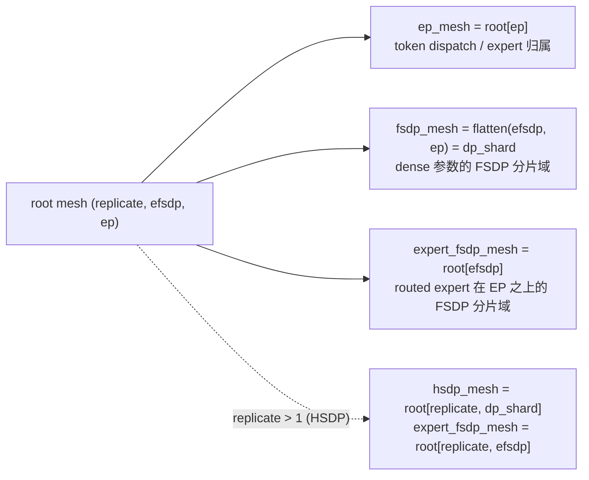

# MoE EP 与 FSDP 解耦（dp2ep 布局）

Expert Parallelism（EP）与 FSDP 解耦，是把 EP 从"与 FSDP 正交的 mesh 维度"改成"FSDP shard 维度的子维度"（torchtitan 称之为 dp2ep）。解耦后 dense 参数在完整的 data-parallel shard 域上分片、不再沿 EP 复制；routed expert 保持按 EP 切分专家，再只沿剩余的 `efsdp` 维做 FSDP。配置入口是 `FSDPConfig.decouple_ep_fsdp`，默认关闭，关闭时旧路径不受影响。



## 1. 问题：EP 把 FSDP 分片度锁死

旧路径的 MoE 训练 mesh 是二维 `(fsdp, ep)`，且 `fsdp = world_size / ep_size`。两类参数的 data-parallel 语义不同，却共用这一张 mesh：

| 参数 | 旧路径 placement | 后果 |
|---|---|---|
| routed expert | `Shard(0)` on `ep`，再 FSDP over `fsdp` | 正确，且与新路径数学同构 |
| dense（attention / router / shared expert / embedding / lm_head） | `Replicate()` on `ep`（`_replicate_other_params`），再 FSDP over `fsdp` | 参数、梯度、优化器状态在 EP 维复制 `ep` 份；每步一次额外的 coalesced all-reduce 补梯度 |
| HSDP | `assert ep_size == 1` | HSDP 与 EP 不能共存 |

EP 越大，dense 侧越亏。以 GLM-5.2-30B 单机 8 卡为例，EP=8 时每卡保存一份完整的 dense 参数与 fp32 优化器状态，legacy 路径 EP=8 的 reserved 显存顶到约 132 GiB 的 allocator 上限（allocated 峰值 120 GiB），每步触发 allocator 释放重试，步时退化到 EP=4 的 7 倍（见 §5）。

## 2. 目标布局

```text
dp_shard  = hsdp_sharding_size or world_size      # dense 参数的 FSDP 分片数
replicate = world_size / dp_shard                  # HSDP 副本数，无 HSDP 时为 1
efsdp     = dp_shard / ep                          # routed expert 在 EP 之上的 FSDP 分片数

root mesh = (replicate, efsdp, ep)                 # ep 保持最内维：EP group 仍是连续 rank
dense     : FSDP over flatten(efsdp, ep) = dp_shard          (+ replicate 上 HSDP)
expert    : Shard(0) over ep  +  FSDP over efsdp             (+ replicate 上 HSDP)
```

约束从 `fsdp = world / ep`（死）变成 `ep | dp_shard`（活）。routed expert 的数学与旧路径完全相同：旧路径在 `world/ep` 个 rank 上 FSDP，新路径在 `efsdp = dp_shard/ep` 个 rank 上 FSDP，无 HSDP 时二者就是同一组 rank。新旧差异全部集中在 dense 侧。

单机 8 卡的三个典型拓扑：

| 配置 | root mesh | dense 每卡持有 | routed expert 每卡持有 |
|---|---|---|---|
| EP=8（旧） | `(fsdp=1, ep=8)` | 100%（8 份复制） | 1/8 的 expert |
| EP=8，解耦 | `(1, efsdp=1, ep=8)` | 1/8 | 1/8 的 expert（与旧路径相同） |
| EP=4（旧） | `(fsdp=2, ep=4)` | 1/2（4 份复制） | 1/4 的 expert，再在 rank r 与 r+4 之间 FSDP 对半 |
| EP=4，解耦 | `(1, efsdp=2, ep=4)` | 1/8 | 同上（rank r 与 r+4 构成 efsdp group） |
| 16 卡，EP=8，`hsdp_sharding_size=8` | `(replicate=2, efsdp=1, ep=8)` | 节点内 1/8，跨节点复制 | 节点内 EP=8，跨节点复制并由 HSDP 归约 |

"EP=8 且 FSDP=8"不再是矛盾配置：对 dense 而言 FSDP shard 数是 8；对 expert 而言 `efsdp = 1`，因为 expert 已被 EP 切成 8 份。

## 3. 实现

各小节的"位置"行给出文件与行号，行号对应分支 `feat/decouple-ep-fsdp` 的代码提交 `5923dc1d`（2026-09-03）。

### 3.1 配置与校验

位置：`xtuner/v1/config/fsdp.py` 48–65，`xtuner/v1/model/moe/moe.py` 1665–1678。

```python
# xtuner/v1/config/fsdp.py
decouple_ep_fsdp: bool = False          # 默认关闭，旧路径不受影响

def model_post_init(self, __context):
    if self.hsdp_sharding_size is not None:
        if self.decouple_ep_fsdp:
            assert self.hsdp_sharding_size % self.ep_size == 0   # 必须存在整数 efsdp
        else:
            assert self.ep_size == 1                             # 旧断言只在旧路径保留
```

`MoE._init_decoupled_device_mesh` 再次校验 `world_size % dp_shard == 0` 与 `dp_shard % ep_size == 0`。ExpertTP（`expert_tp_size > 1`）与解耦同时开启时抛 `NotImplementedError`，ETP 的 `(Shard, InterleavedShard)` 二维 placement 需要单独设计 mesh 维。

### 3.2 单一 root mesh

位置：`xtuner/v1/model/moe/moe.py` 1651–1716（`_init_decoupled_device_mesh`），1486–1492（分流）。

```python
# xtuner/v1/model/moe/moe.py::_init_decoupled_device_mesh（节选）
world_size = dist.get_world_size()
dp_shard = fsdp_config.hsdp_sharding_size or world_size
replicate_size = world_size // dp_shard
efsdp_size = dp_shard // ep_size

root_mesh = init_device_mesh(
    device, (replicate_size, efsdp_size, ep_size),
    mesh_dim_names=(f"{prefix}.replicate", f"{prefix}.efsdp", f"{prefix}.ep"),
)
self._world_mesh = root_mesh
self.ep_mesh = root_mesh[ep_name]                                          # dispatcher 用，接口不变
self.fsdp_mesh = root_mesh[efsdp_name, ep_name]._flatten(dp_shard_name)    # dense 的一维 dp_shard
if replicate_size > 1:                                                     # HSDP
    self.hsdp_mesh = root_mesh[replicate_name, dp_shard_name]
    self.expert_fsdp_mesh = root_mesh[replicate_name, efsdp_name]
else:
    self.hsdp_mesh = None
    self.expert_fsdp_mesh = root_mesh[efsdp_name]
```

所有子 mesh 从同一个 root 派生：

- `ep_mesh = root[ep]`：dispatcher / DeepEP 拿到的 EP group 不变，仍是节点内连续 rank。`MoE.__init__` 里先建的 `ep_mesh` 通过 PyTorch 的 mesh 相等性 hash 被重新挂到这个 root 上，因此 `ep` 维必须沿用旧名字 `{prefix}.ep`；
- `fsdp_mesh = root[efsdp, ep]._flatten("dp_shard")`：语义仍是"dense 参数的一维 shard group"，`_fsdp_foreach_allgather`、`Float8Handler.build_reduce_mesh` 等既有消费者无需改动；
- `hsdp_mesh = root[replicate, dp_shard]`（仅 `replicate > 1`）：dense 的 HSDP mesh，与旧路径契约一致；
- `expert_fsdp_mesh = root[efsdp]` 或 `root[replicate, efsdp]`：新增属性，只在解耦路径上非空，dense 模型恒为 `None`。

同源很重要：FSDP2 要求已是 DTensor 的参数与 FSDP mesh 共享同一个 root，expert 参数最终要同时带 EP shard 和 `efsdp` 上的 `_StridedShard`。`efsdp = 1` 时该维保留而不是省略——对 expert 做的那次 `fully_shard` 是 mixed precision policy 生效的地方（torchtitan #1324 的同一注释）。

### 3.3 两级 `fully_shard`

位置：`xtuner/v1/model/moe/moe.py` 1194–1225（decoder layer），1250–1260（prefetch），1328–1360（MTP），1631–1649（helper）。

```python
# xtuner/v1/model/moe/moe.py::fully_shard（节选）
decoupled = self.fsdp_config.decouple_ep_fsdp
if not decoupled and (self.ep_mesh.size() > 1 or tp_enabled):
    self._replicate_other_params(self)        # 旧路径：dense 在 ep 维 Replicate；解耦路径跳过

for layer_idx, layer in self.layers.items():
    if decoupled:                             # 1) 先包 MoEBlock -> expert_fsdp_mesh
        self._fully_shard_expert_blocks(layer, mp_policy=mp_policy, reshard_after_forward=...)
    ...
    self._fully_shard(                        # 2) 再包整层 -> dense 的 fsdp_mesh / hsdp_mesh
        mesh=self.fsdp_mesh if self.hsdp_mesh is None else self.hsdp_mesh, module=layer, ...
    )

for layer_cur, layer_next in zip(layers[:-1], layers[1:]):
    if decoupled:                             # expert 的 all-gather 与下一层 dense 一起预取
        layer_cur.set_modules_to_forward_prefetch([*self._expert_blocks(layer_cur), layer_next])

@staticmethod
def _expert_blocks(module):
    return [m for m in module.modules() if isinstance(m, MoEBlock)]

def _fully_shard_expert_blocks(self, module, mp_policy, reshard_after_forward):
    for expert_block in self._expert_blocks(module):
        self._fully_shard(mesh=self.expert_fsdp_mesh, module=expert_block, mp_policy=mp_policy, ...)
```

解耦路径跳过 `_replicate_other_params`：dense 参数进入 `fully_shard` 时是普通 tensor，由 FSDP 在完整 `dp_shard` 上分片。每个 decoder layer 先把所有 `MoEBlock`（只含 routed expert 的 grouped linear 与激活）在 `expert_fsdp_mesh` 上 `fully_shard`，再在 dense mesh 上包装整层；FSDP2 会保留内层的 expert wrapper，把 expert 参数从外层 param group 中排除。MTP layer 使用同样的两级包装。forward prefetch 列表同时包含下一层与其 expert block，让 expert 的 all-gather 与 attention 重叠，而不是串行等在 MoE block 前。

### 3.4 梯度归约

位置：`xtuner/v1/model/moe/moe.py` 1392–1396（分流），1583–1629（`_scale_and_reduce_grad_decoupled`）。

不变式：每个参数的最终梯度等于全 data-parallel world 上的均值，与 `ep` / `efsdp` 取值无关。

```python
# xtuner/v1/model/moe/moe.py::_scale_and_reduce_grad_decoupled（节选）
for name, param in self.trainable_parameters():
    if param.grad is None:
        continue
    if ep_size > 1 and ".experts" in name:
        param.grad.div_(ep_size)              # expert：FSDP 已在 efsdp 上求均值，剩余因子是 ep
        continue
    if not isinstance(param, DTensor):
        continue
    if any(isinstance(p, Shard) for p in param.placements):
        continue                              # FSDP 管理的参数（含 _StridedShard）：FSDP 已归约
    replicate_dims = [names[i] for i, p in enumerate(param.placements) if isinstance(p, Replicate)]
    flat_mesh = param.device_mesh[replicate_dims]._flatten() if len(replicate_dims) > 1 else param.device_mesh[replicate_dims[0]]
    grad = param.grad.to_local()
    grad.div_(flat_mesh.size())               # 全 Replicate 的 ignored fp32 参数：手工求均值
    grads_by_group.setdefault(flat_mesh.get_group(), []).append(grad)

for group, grads in grads_by_group.items():   # 每个 group 一次 coalesced all-reduce
    with dist._coalescing_manager(group=group):
        for grad in grads:
            dist.all_reduce(grad, ReduceOp.SUM, group=group)
```

| 参数类 | 谁完成归约 | 解耦路径的额外动作 |
|---|---|---|
| dense FSDP 参数（任一 `Shard` placement） | FSDP 在 `dp_shard` 上 reduce-scatter；HSDP 再跨 `replicate` all-reduce | 无（旧路径的手工跨 EP all-reduce 删除） |
| routed expert | FSDP 在 `efsdp` 上 reduce-scatter，但每个 expert 已看过整个 EP group 路由来的 token | `grad.div_(ep)`，与 NeMo AutoModel 的 `ep_ratio = dp_shard / efsdp` 相同 |
| FSDP ignored、各维全 `Replicate` 的 fp32 参数（`fp32_keys_pattern` 命中的 dense 参数） | 无人归约 | 沿所有 `Replicate` 维 flatten 后做一次 coalesced all-reduce 求均值 |

这也是解耦路径不能复用旧梯度逻辑的原因：旧 dense 是 EP replicate，需要手工跨 EP 归约；新 dense 已由 FSDP 在完整 `dp_shard` 上归约，再做一次就是重复归约。注意第三行与 HSDP 无关：无 HSDP 时 world mesh 仍是三维 `(1, efsdp, ep)`，ignored 参数在三个维度上都是 `Replicate`，仍需这次 all-reduce。

### 3.5 FP8

位置：`xtuner/v1/float8/float8_handler.py` 121–161、166–239、316–335；`xtuner/v1/float8/fsdp_utils.py` 127–137；`xtuner/v1/model/moe/moe.py` 1165–1176；`xtuner/v1/model/base.py` 1015。

tile-wise FP8 需要知道每个本地权重会被多少个 FSDP rank 切分（决定 padding），以及 scale 的 reduce-max 应跨哪些 rank。解耦后 dense 与 expert 的答案不同：

```python
# xtuner/v1/float8/float8_handler.py::pad_for_fsdp（节选）
num_fsdp_chunks = fsdp_mesh.size(-1)                                  # dense：dp_shard 份
if expert_fsdp_mesh is not None and isinstance(module, TileWiseFloat8GroupedLinear):
    num_fsdp_chunks = expert_fsdp_mesh.size(-1)                       # routed expert：efsdp 份
padded_out_features = Float8Handler.get_num_features_after_pad(tensor_size, 0, num_fsdp_chunks)

# ::_build_decoupled_reduce_meshes（节选）
dense_shard_size = fsdp_mesh.size(-1)                                 # 连续 rank，stride 1
expert_shard_size = expert_fsdp_mesh.size(-1)
expert_stride = world_size // expert_fsdp_mesh.size()                 # == ep_size
self.tilewise_reduce_mesh_mapping = self._build_strided_reduce_mesh_mapping(
    model, (TileWiseFloat8Linear,), dense_shard_size, 1)
self.expert_tilewise_reduce_mesh_mapping = self._build_strided_reduce_mesh_mapping(
    model, (TileWiseFloat8GroupedLinear,), expert_shard_size, expert_stride)
```

- dense linear 按 `dp_shard` 的 chunk 数 padding，reduce mesh 的 rank stride 为 1；
- grouped-expert linear 按 `efsdp` 的 chunk 数 padding，reduce mesh 的 rank stride 为 `ep`；
- scale 预计算（`precompute_tilewise_float8_scale_for_fsdp`）新增 `module_types` 参数，按 dense / expert 两类各执行一次。

旧路径 `expert_fsdp_mesh is None`，走原有的单 mesh 代码。tensor-wise FP8 只作用于 dense linear，shard group 仍是 `fsdp_mesh`，无需改动。

### 3.6 HF 权重与 DCP

位置：无代码改动。依赖 `xtuner/v1/utils/load_spec.py` 的 `LoadSpec.from_tensor`、`RuntimeLayout.from_dtensor`、`plan_hf_save`；验证脚本 `tests/model/run_decoupled_ep_fsdp_ckpt.py`。

`LoadSpec.from_tensor` 直接从 DTensor placement 记录 shard 历史，新 placement 无需特殊处理：

```text
routed expert（解耦 + HSDP）
  DTensor placement : (Replicate, _StridedShard(0), Shard(0))  on (replicate, efsdp, ep)
  LoadSpec.shards   : [ShardDescriptor(dim=0, group=ep), ShardDescriptor(dim=0, group=efsdp)]   # Replicate 不产生 shard
dense（解耦 + HSDP）
  DTensor placement : (Replicate, Shard(0))                    on (replicate, dp_shard)
  LoadSpec.shards   : [ShardDescriptor(dim=0, group=dp_shard)]
```

同步 HF save 按 shard 描述逆向 unshard 后再走模型已有的 HF key / fused-expert 映射；DCP 按 DTensor placement 保存并在载入时 reshard。因此没有为任何模型重写 `state_dict_adapter`，工作量在于让新 mesh 产出正确的 `LoadSpec`。

### 3.7 RL 权重同步

位置：`xtuner/v1/model/base.py` 1916–1947；`xtuner/v1/rl/weight_update/weight_iterator.py` 140–149、196–208、236–247；测试 `tests/rl/test_weight_iterator.py` 234–418。

Turbomind 的 layer-wise 更新只 gather FSDP shard、保留 EP-local 的 expert 切片。`BaseModel._fsdp_foreach_allgather` 按每个 `LoadSpec` 选择 gather group：

```python
# xtuner/v1/model/base.py::_fsdp_gather_group
def _fsdp_gather_group(self, load_spec, fsdp_group, expert_fsdp_group):
    if expert_fsdp_group is None:
        return fsdp_group
    if any(self._is_same_process_group(shard.group, expert_fsdp_group) for shard in load_spec.shards):
        return expert_fsdp_group      # spec 带 efsdp shard：只 gather efsdp，EP shard 保留
    return fsdp_group                 # dense：gather dp_shard
```

compose 模型（如 Qwen3.5-VL MoE）曾有一个 owner 选择错误：`WeightIterator.iter_layer_batches` 从 language tower 取参数与 `LoadSpec`，却用外层 compose 模型的 mesh 做 gather。compose 模型本身在 world mesh 上包装、没有 `expert_fsdp_mesh`，也不维护自己的 `load_spec_mapping`，于是 language tower 的 `efsdp` shard（HSDP 时连 `dp_shard` shard）被当作"应保留"的 shard 而不 gather，Turbomind 收到的是 rank-local 碎片。现在 gather 由参数所属的子模块执行，并从该子模块的 `load_spec_mapping` 取 spec：

```python
# xtuner/v1/rl/weight_update/weight_iterator.py::_param_owner
def _param_owner(model, name):
    if isinstance(model.config, BaseComposeConfig):
        for submodule in ("language_model", "vision_tower", "multi_modal_projector"):
            if name.startswith(f"{submodule}."):
                return getattr(model, submodule), name[len(submodule) + 1 :]
    return model, name                # plain 模型：owner 就是自己，行为不变
```

`tests/rl/test_weight_iterator.py::TestLayerBatchesGatherWithParamOwner` 用假 process group 固定了 `efsdp = 2` 与 HSDP 两种拓扑下每个 tensor 的完整形状与取值。

## 4. 与参考实现的对照

| 项目 | mesh | expert 的 FSDP 维 | 梯度修正 | HSDP + EP |
|---|---|---|---|---|
| torchtitan（#1324 起） | `(pp, dp_replicate, dp_shard_mod_ep, dp_shard_in_ep, cp, tp)` | `dp_shard_mod_ep = dp_shard·cp / ep`，派生 | FSDP gradient divide factor（#1551） | 首日支持 |
| NeMo AutoModel | `device_mesh(dp_replicate, dp_shard_cp)` + `moe_mesh(ep, ep_shard)` | `ep_shard`，派生 | 显式 `grad.div_(ep_ratio)` | 支持 |
| Megatron-Core（Megatron-FSDP） | expert 参数在 expert data-parallel group 上分片 | `dp·cp / ep`，派生 | 框架内部 | 支持 |
| XTuner 本方案 | `(replicate, efsdp, ep)` | `efsdp = dp_shard / ep`，派生 | 显式 `grad.div_(ep)` | mesh 与数学路径支持，多机未实测 |

三个参考实现都把 expert 的 FSDP 维当作派生量而不是独立配置，本方案与之一致。实现上采用 torchtitan #1324 的"两次 `fully_shard`"法，对 torch 版本要求最低；`shard_placement_fn` 单次包装、expert dim-1 分片（#1561）留作后续优化。

## 5. 验证结论与边界

| 项目 | 证据 | 边界 | 链接 |
|---|---|---|---|
| mesh / placement / 两级 FSDP（L0） | fake-PG 下 8/16/64 rank 共 29 例；旧布局在开关关闭时逐项固定 | 需要一张空闲 GPU 建 CUDA context，不通信 | [test_decoupled_ep_fsdp_mesh.py](../../tests/model/test_decoupled_ep_fsdp_mesh.py)、[baseline.md](https://github.com/silencelamb/xtuner/blob/feat/decouple-ep-fsdp/reports/baseline.md) |
| BF16 训练语义（L1） | tiny Qwen3-MoE 50 步：解耦 EP8 vs 旧 EP8 loss 最大相对差 `1.9e-5`（旧 EP8 vs EP1 为 `2.5e-5`）；3.4B 模型每卡 dense 参数 836 → 105 MiB，峰值 allocated 11861 → 8203 MiB，步时 170 → 158 ms | 单机；reduction order 不同，不是逐 bit 相同 | [L1.md](https://github.com/silencelamb/xtuner/blob/feat/decouple-ep-fsdp/reports/L1.md)、[run_decoupled_ep_fsdp_numerics.py](../../tests/model/run_decoupled_ep_fsdp_numerics.py) |
| `efsdp > 1`、HSDP + EP（L2） | 单机缩比拓扑 `(1,2,4)`、`(2,1,4)`、`(2,2,2)` 均在噪声内；16/64 rank 形状由 L0 固定 | 真正的双节点 collective 未跑 | [L2.md](https://github.com/silencelamb/xtuner/blob/feat/decouple-ep-fsdp/reports/L2.md)、[decisions.md D10](https://github.com/silencelamb/xtuner/blob/feat/decouple-ep-fsdp/reports/decisions.md) |
| HF / DCP（L3） | 刚 `from_hf` 后导出 807 个 key 全部 bit-exact；DCP 同布局 resume 与跨布局 reshard 后 loss 连续 | 未覆盖 async save、FP8 checkpoint、GLM/MTP 导出、world size 变化 | [L3.md](https://github.com/silencelamb/xtuner/blob/feat/decouple-ep-fsdp/reports/L3.md)、[run_decoupled_ep_fsdp_ckpt.py](../../tests/model/run_decoupled_ep_fsdp_ckpt.py) |
| FP8 | 3.4B 与 GLM-5.2 tile-wise FP8 训练 20 步稳定，差异量级接近同配置重复噪声 | FP8 + HSDP、FP8 + checkpoint 未测 | [L3.md](https://github.com/silencelamb/xtuner/blob/feat/decouple-ep-fsdp/reports/L3.md)、[GLM52.md](https://github.com/silencelamb/xtuner/blob/feat/decouple-ep-fsdp/reports/GLM52.md) |
| GLM-5.2-30B，8×H200 目标配方 | EP4：1.688 s / 99.5 GiB → 1.658 s / 83.5 GiB；EP8：11.8 s / 120.0 GiB → 1.64 s / 76.3 GiB | EP8 的加速来自离开 allocator 上限（legacy 每步 2–3 次 alloc retry，解耦为 0），不是 collective 本身快 7 倍 | [GLM52.md](https://github.com/silencelamb/xtuner/blob/feat/decouple-ep-fsdp/reports/GLM52.md) |
| RL 权重同步 | plain MoE 的 per-spec gather 逻辑成立；compose 的 owner 错误已修复并有单测 | 未做真实 Turbomind 端到端对拍 | [test_weight_iterator.py](../../tests/rl/test_weight_iterator.py#L234-L418) |
| legacy 兼容 | 开关默认关闭，旧分支执行逻辑未改动，L0 旧布局回归通过 | 未做 base-vs-branch 端到端逐 tensor 对照 | [baseline.md](https://github.com/silencelamb/xtuner/blob/feat/decouple-ep-fsdp/reports/baseline.md)、[decisions.md](https://github.com/silencelamb/xtuner/blob/feat/decouple-ep-fsdp/reports/decisions.md) |

`reports/` 下的报告不随代码 PR 合入，链接指向 fork 分支 `feat/decouple-ep-fsdp` 上的固定地址；测试与脚本是仓库内相对链接。

## 6. 已知限制与后续工作

### 6.1 `fp32_keys_pattern` 命中 routed expert 时梯度不归约

`HFSaveCfg.fp32_keys_pattern` 用 HF key 正则把少量参数保留在 fp32 并排除在 FSDP 之外，内置用途是 Qwen3.5 linear-attention 的 `A_log`、norm 这类 dense 小参数。`BaseModel._fully_shard` 对命中的参数分两种处理：普通 tensor 先 `distribute_tensor(Replicate on world_mesh)` 再放进 `ignored_params`；已经是 DTensor 的参数原样放进 `ignored_params`。routed expert 在 `build_grouped_linear` 里就已经是 `Shard(0)` on `ep` 的 DTensor，走的是第二种。

于是一旦某条 pattern 命中 expert，会同时发生两件事：

1. expert 不再被 `_fully_shard_expert_blocks` 沿 `efsdp` 分片，每个 `efsdp` rank（HSDP 时每个 replica）各持一份完整的 EP-local expert；
2. `_scale_and_reduce_grad_decoupled` 看到参数名含 `.experts`，只做 `/ep` 就 `continue`，不会走第三行的 Replicate 维 all-reduce。

每个 `efsdp` rank 的 expert 梯度只含自己 EP group 的 token 贡献，optimizer 一步之后同一个 expert 在不同 `efsdp` rank 上的权重就不再相同，训练静默出错。`efsdp = replicate = 1`（如单机 EP=8）时没有第二份副本，问题不显现；当前内置 pattern 也都只匹配 dense，GLM-5.2 没有 pattern，所以现有实验没有触发。旧路径同样存在这个边界：ignored expert 不会沿 `fsdp` 分片，`fsdp > 1` 时一样分叉。

修法：短期在解耦路径检测到 pattern 命中 `MoEBlock` 参数时直接报错；完整方案是把这类 expert 表达成 `Replicate(replicate), Replicate(efsdp), Shard(0)(ep)`，先走 §3.4 第三行的 Replicate 维 all-reduce 求均值，再 `/ep`。这与 §7.2 的 `expert_fsdp = False` 模式是同一套实现。

### 6.2 "什么是 expert 参数"有两套判定标准

| 环节 | 判定依据 | 位置 |
|---|---|---|
| FSDP 包装 | 模块类型 `isinstance(m, MoEBlock)` | `MoE._expert_blocks` |
| 梯度缩放 | 参数名 `".experts" in name` | `MoE._scale_and_reduce_grad_decoupled`（旧路径 `scale_and_reduce_grad` 同样） |
| FP8 padding / reduce mesh | 模块类型 `TileWiseFloat8GroupedLinear` | `Float8Handler.pad_for_fsdp` / `_build_decoupled_reduce_meshes` |
| RL gather | `LoadSpec.shards` 中是否有 `efsdp` group 的 shard | `BaseModel._fsdp_gather_group` |

今天它们恰好一致，因为 `MoEDecoderLayer` 把 `MoEBlock` 挂在 `experts` 属性下（`shared_experts` 不含 `.experts` 子串，不会误伤）。两个方向都可能失效：

- 新模型把 `MoEBlock` 挂到别的属性名（如 `moe`）：expert 会被 `expert_fsdp_mesh` 分片，reduce-scatter 只在 `efsdp` 上求均值，但名字里没有 `.experts`，不做 `/ep`，梯度被放大 `ep` 倍，等价于 expert 的学习率乘以 `ep`，没有任何报错；
- 某个 dense 参数名恰好含 `.experts`（如 `experts_router`）：会被 `/ep`，梯度缩小 `ep` 倍。

修法：在 `_fully_shard_expert_blocks` 包装时记录 expert 参数的 id / FQN 集合，梯度缩放、FP8、save / RL 都查这一份，删除按名字匹配的分支。

### 6.3 其它

- 新拓扑约束目前用 `assert`，应改为 Pydantic validator + `ValueError`。
- 两次不同 mesh 的 `fully_shard` 与 `DeviceMesh._flatten(name)` 只在 torch 2.8 / 2.9 验证；`pyproject.toml` 声明 `torch>=2.6`，需要补 CI 或为该开关声明更高的最低版本。
- L1–L3 是人工实验脚本（写 JSON、打印统计），不是会失败的 pytest gate。
- ExpertTP 与解耦互斥；expert dim-1 分片、`shard_placement_fn` 单次包装留作优化。

## 7. 开放问题（请架构师决策）

### 7.1 是否保留 HSDP 与 EP 的共存

保留的成本很低。`replicate` 维由同一个 `init_device_mesh` 调用产生，HSDP 专属代码只有 `hsdp_mesh` / `expert_fsdp_mesh` 的二维选择；`replicate` 上的 all-reduce 由 FSDP2 完成。梯度路径没有任何 HSDP 分支：§3.4 三行规则中，前两行与 HSDP 无关，第三行在无 HSDP 时同样需要（world mesh 仍是三维）。去掉 HSDP 能省的只是几行 mesh 选择和 L2 的两个验证拓扑，梯度处理不会因此变简单。

保留的收益是多机拓扑：EP 留在节点内时，`hsdp_sharding_size = 8` 让 dense 的 all-gather / reduce-scatter 也留在 NVLink 域内，跨机只剩一次梯度 all-reduce；这是 torchtitan、AutoModel 都支持的组合，也是 DESIGN 中 64 卡场景的前提。目前 XTuner 对 HSDP 使用确实不多（compose 模型的 `init_world_mesh` 还标着 TODO），且本方案的 HSDP + EP 只在单机缩比拓扑验证过。

建议：保留 mesh 与数学路径，在文档中标为"experimental，多机未验证"；若维护者希望收窄支持面，只需在 `FSDPConfig` 中对 `decouple_ep_fsdp and hsdp_sharding_size is not None` 抛错，待双节点验证后再放开，代码不必删除。

### 7.2 `efsdp` 是否作为独立配置暴露

三个参考实现都不暴露：expert 的 data-parallel 语义要求 `ep × efsdp = dp_shard`，即每个 token 在整个 world 上恰好被计算一次，`efsdp` 因此只能是派生量。Megatron-Core 只暴露 `--expert-model-parallel-size`，expert 的 FSDP 分片域是 `dp·cp / ep`；torchtitan、AutoModel 同理。

接入 MoonEP / UltraEP 这类动态冗余 expert 的通信库时，需要的不是另一个 `efsdp` 数值，而是一种新模式："expert 不做 FSDP"。从公开资料看，这两个库在每层 MoE 前按实时负载把热 expert 复制到其它 EP rank 并预取权重，要求 EP-local 的 expert 权重在 MoE 计算窗口之外也是完整可寻址的；而 FSDP 分片的 expert 只在 all-gather 窗口内完整，且 FSDP 单元是整个 `MoEBlock`。当 `ep == dp_shard` 时（如单机 EP=8）`efsdp = 1` 已自动满足；当 `ep < dp_shard` 时，"不做 FSDP"意味着 expert 在 `efsdp` 维上复制，这是 placement 的改变而不是分片数的改变：

```text
expert_fsdp = True （现状）: Shard(0) on ep + _StridedShard on efsdp        FSDP reduce-scatter，再 /ep
expert_fsdp = False（新增）: Shard(0) on ep + Replicate on (replicate, efsdp) 手工 all-reduce 求均值，再 /ep
```

后者的梯度处理正是 §3.4 第三行已经存在的"沿 Replicate 维 all-reduce"分支，也正是修复 §6.1（fp32 pattern 命中 expert）所需的实现，两件事可以一次做完。代价是 expert 参数与优化器状态在 `efsdp` 维复制、失去 FSDP wrapper 提供的 mixed precision（需手工 cast）。

建议：`efsdp` 保持派生；不新增整数配置。等 MoonEP / UltraEP 接入启动时，在 `FSDPConfig` 增加 `expert_fsdp: bool = True`（或 `expert_shard_mode: "fsdp" | "replicate"`）。root mesh 不变，`ep_mesh` 仍是最内层连续 rank 的 group，dispatcher 的替换与本方案正交。

## 8. 合入建议

按 torchtitan 的演进顺序拆分：

1. 基础解耦：配置开关、root mesh、两级 `fully_shard`、梯度归约、L0 fake-PG 测试；
2. 生态：FP8 per-class padding / reduce mesh、`LoadSpec` 驱动的 HF / DCP、RL per-spec gather 与 compose owner 修复；
3. 文档与后续：本文、§6 的限制项。

`decouple_ep_fsdp` 默认 `False`，两个代码 PR 都不改动旧路径的执行逻辑，出问题时一键回退。
