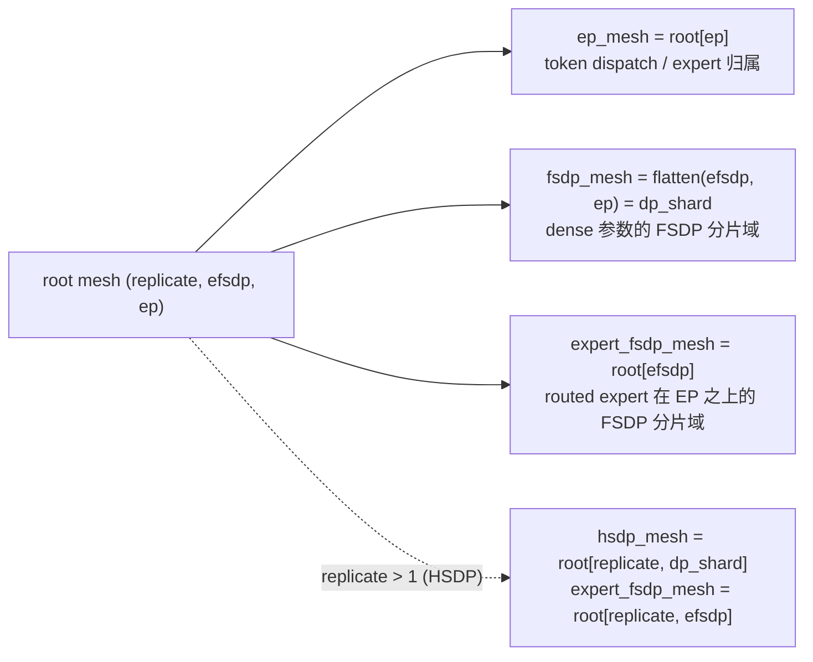

# MoE EP 与 FSDP 解耦（dp2ep 布局）

Expert Parallelism（EP）与 FSDP 解耦，是把 EP 从"与 FSDP 正交的 mesh 维度"改成"FSDP shard 维度的子维度"（torchtitan 称之为 dp2ep）。解耦后 dense 参数在完整的 data-parallel shard 域上分片、不再沿 EP 复制；routed expert 保持按 EP 切分专家，再只沿剩余的 `efsdp` 维做 FSDP。配置入口是 `FSDPConfig.decouple_ep_fsdp`，默认关闭，关闭时旧路径不受影响。



## 1. 问题：EP 把 FSDP 分片度锁死

旧路径的 MoE 训练 mesh 是二维 `(fsdp, ep)`，且 `fsdp = world_size / ep_size`。两类参数的 data-parallel 语义不同，却共用这一张 mesh：

| 参数 | 旧路径 placement | 后果 |
|---|---|---|
| routed expert | `Shard(0)` on `ep`，再 FSDP over `fsdp` | 正确，且与新路径数学同构 |
| dense（attention / router / shared expert / embedding / lm_head） | `Replicate()` on `ep`（`_replicate_other_params`），再 FSDP over `fsdp` | 参数、梯度、优化器状态在 EP 维复制 `ep` 份；每步一次额外的 coalesced all-reduce 补梯度 |
| HSDP | `assert ep_size == 1` | HSDP 与 EP 不能共存 |

EP 越大，dense 侧越亏。以 GLM-5.2-30B 单机 8 卡为例，EP=8 时每卡保存一份完整的 dense 参数与 fp32 优化器状态，legacy 路径 EP=8 的 reserved 显存顶到约 132 GiB 的 allocator 上限（allocated 峰值 120 GiB），每步触发 allocator 释放重试，步时退化到 EP=4 的 7 倍（见 §5）。

## 2. 目标布局

```text
dp_shard  = hsdp_sharding_size or world_size      # dense 参数的 FSDP 分片数
replicate = world_size / dp_shard                  # HSDP 副本数，无 HSDP 时为 1
efsdp     = dp_shard / ep                          # routed expert 在 EP 之上的 FSDP 分片数

root mesh = (replicate, efsdp, ep)                 # ep 保持最内维：EP group 仍是连续 rank
dense     : FSDP over flatten(efsdp, ep) = dp_shard          (+ replicate 上 HSDP)
expert    : Shard(0) over ep  +  FSDP over efsdp             (+ replicate 上 HSDP)
```

约束从 `fsdp = world / ep`（死）变成 `ep | dp_shard`（活）。routed expert 的数学与旧路径完全相同：旧路径在 `world/ep` 个 rank 上 FSDP，新路径在 `efsdp = dp_shard/ep` 个 rank 上 FSDP，无 HSDP 时二者就是同一组 rank。新旧差异全部集中在 dense 侧。

单机 8 卡的三个典型拓扑：

| 配置 | root mesh | dense 每卡持有 | routed expert 每卡持有 |
|---|---|---|---|
| EP=8（旧） | `(fsdp=1, ep=8)` | 100%（8 份复制） | 1/8 的 expert |
| EP=8，解耦 | `(1, efsdp=1, ep=8)` | 1/8 | 1/8 的 expert（与旧路径相同） |
| EP=4（旧） | `(fsdp=2, ep=4)` | 1/2（4 份复制） | 1/4 的 expert，再在 rank r 与 r+4 之间 FSDP 对半 |
| EP=4，解耦 | `(1, efsdp=2, ep=4)` | 1/8 | 同上（rank r 与 r+4 构成 efsdp group） |
| 16 卡，EP=8，`hsdp_sharding_size=8` | `(replicate=2, efsdp=1, ep=8)` | 节点内 1/8，跨节点复制 | 节点内 EP=8，跨节点复制并由 HSDP 归约 |

"EP=8 且 FSDP=8"不再是矛盾配置：对 dense 而言 FSDP shard 数是 8；对 expert 而言 `efsdp = 1`，因为 expert 已被 EP 切成 8 份。

## 3. 实现

### 3.1 配置与校验

`FSDPConfig.decouple_ep_fsdp: bool = False`。旧断言"HSDP 要求 `ep_size == 1`"只在开关关闭时保留；开关打开时改为要求 `hsdp_sharding_size % ep_size == 0`，即必须存在整数 `efsdp`。`MoE._init_decoupled_device_mesh` 再次校验 `world_size % dp_shard == 0` 与 `dp_shard % ep_size == 0`。ExpertTP（`expert_tp_size > 1`）与解耦同时开启时抛 `NotImplementedError`，ETP 的 `(Shard, InterleavedShard)` 二维 placement 需要单独设计 mesh 维。

### 3.2 单一 root mesh

`MoE._init_decoupled_device_mesh` 一次性建立 `(replicate, efsdp, ep)` root，所有子 mesh 从它派生：

- `ep_mesh = root[ep]`：dispatcher / DeepEP 拿到的 EP group 不变，仍是节点内连续 rank；
- `fsdp_mesh = root[efsdp, ep]._flatten("dp_shard")`：语义仍是"dense 参数的一维 shard group"，`_fsdp_foreach_allgather`、`Float8Handler.build_reduce_mesh` 等既有消费者无需改动；
- `hsdp_mesh = root[replicate, dp_shard]`（仅 `replicate > 1`）：dense 的 HSDP mesh，与旧路径契约一致；
- `expert_fsdp_mesh = root[efsdp]` 或 `root[replicate, efsdp]`：新增属性，只在解耦路径上非空，dense 模型恒为 `None`。

所有子 mesh 同源很重要：FSDP2 要求已是 DTensor 的参数与 FSDP mesh 共享同一个 root，expert 参数最终要同时带 EP shard 和 `efsdp` 上的 `_StridedShard`。`efsdp = 1` 时该维保留而不是省略——对 expert 做的那次 `fully_shard` 是 mixed precision policy 生效的地方（torchtitan #1324 的同一注释）。

### 3.3 两级 `fully_shard`

解耦路径跳过 `_replicate_other_params`：dense 参数进入 `fully_shard` 时是普通 tensor，由 FSDP 在完整 `dp_shard` 上分片。每个 decoder layer 的包装顺序变为：

1. `_fully_shard_expert_blocks`：找出该层的所有 `MoEBlock`（只含 routed expert 的 grouped linear 与激活），在 `expert_fsdp_mesh` 上先做一次 `fully_shard`；
2. 再在 dense 的 `fsdp_mesh` / `hsdp_mesh` 上包装整个 layer。FSDP2 会保留内层的 expert wrapper，把 expert 参数从外层 param group 中排除。

MTP layer 使用同样的两级包装。forward prefetch 列表同时包含下一层与其 expert block，让 expert 的 all-gather 与 attention 重叠，而不是串行等在 MoE block 前。

### 3.4 梯度归约

不变式：每个参数的最终梯度等于全 data-parallel world 上的均值，与 `ep` / `efsdp` 取值无关。`MoE._scale_and_reduce_grad_decoupled` 只做三件事：

| 参数类 | 谁完成归约 | 解耦路径的额外动作 |
|---|---|---|
| dense FSDP 参数（任一 `Shard` placement） | FSDP 在 `dp_shard` 上 reduce-scatter；HSDP 再跨 `replicate` all-reduce | 无（旧路径的手工跨 EP all-reduce 删除） |
| routed expert | FSDP 在 `efsdp` 上 reduce-scatter，但每个 expert 已看过整个 EP group 路由来的 token | `grad.div_(ep)`，与 NeMo AutoModel 的 `ep_ratio = dp_shard / efsdp` 相同 |
| FSDP ignored、各维全 `Replicate` 的 fp32 参数（`fp32_keys_pattern` 命中的 dense 参数） | 无人归约 | 沿所有 `Replicate` 维 flatten 后做一次 coalesced all-reduce 求均值 |

这也是解耦路径不能复用旧梯度逻辑的原因：旧 dense 是 EP replicate，需要手工跨 EP 归约；新 dense 已由 FSDP 在完整 `dp_shard` 上归约，再做一次就是重复归约。注意第三行与 HSDP 无关：无 HSDP 时 world mesh 仍是三维 `(1, efsdp, ep)`，ignored 参数在三个维度上都是 `Replicate`，仍需这次 all-reduce。

### 3.5 FP8

tile-wise FP8 需要知道每个本地权重会被多少个 FSDP rank 切分（决定 padding），以及 scale 的 reduce-max 应跨哪些 rank。解耦后 dense 与 expert 的答案不同：

- dense linear 按 `dp_shard` 的 chunk 数 padding，reduce mesh 的 rank stride 为 1；
- grouped-expert linear 按 `efsdp` 的 chunk 数 padding，reduce mesh 的 rank stride 为 `ep`；
- `Float8Handler.pad_for_fsdp` 接受可选的 `expert_fsdp_mesh`，`build_reduce_mesh` 为两类参数各建一套 tile-wise reduce mesh，scale 预计算按类各执行一次。

旧路径 `expert_fsdp_mesh is None`，走原有的单 mesh 代码。tensor-wise FP8 只作用于 dense linear，shard group 仍是 `fsdp_mesh`，无需改动。

### 3.6 HF 权重与 DCP

`LoadSpec.from_tensor` 直接从 DTensor placement 记录 shard 历史（EP 的 `Shard(0)`、`efsdp` 上的 `_StridedShard`、HSDP 的 `Replicate` 不产生 shard）。同步 HF save 按 shard 描述逆向 unshard 后再走模型已有的 HF key / fused-expert 映射；DCP 按 DTensor placement 保存并在载入时 reshard。因此没有为任何模型重写 `state_dict_adapter`，工作量在于让新 mesh 产出正确的 `LoadSpec`。

### 3.7 RL 权重同步

Turbomind 的 layer-wise 更新只 gather FSDP shard、保留 EP-local 的 expert 切片。`BaseModel._fsdp_foreach_allgather` 按每个 `LoadSpec` 选择 gather group：spec 含 `efsdp` 上的 shard 时用 `expert_fsdp_mesh` 的 group，否则用 `fsdp_mesh` 的 group。

compose 模型（如 Qwen3.5-VL MoE）曾有一个 owner 选择错误：`WeightIterator.iter_layer_batches` 从 language tower 取参数与 `LoadSpec`，却用外层 compose 模型的 mesh 做 gather。compose 模型本身在 world mesh 上包装、没有 `expert_fsdp_mesh`，也不维护自己的 `load_spec_mapping`，于是 language tower 的 `efsdp` shard（HSDP 时连 `dp_shard` shard）被当作"应保留"的 shard 而不 gather，Turbomind 收到的是 rank-local 碎片。现在 gather 由参数所属的子模块（language / vision / projector）执行，并从该子模块的 `load_spec_mapping` 取 spec；`tests/rl/test_weight_iterator.py::TestLayerBatchesGatherWithParamOwner` 用假 process group 固定了 `efsdp = 2` 与 HSDP 两种拓扑下每个 tensor 的完整形状与取值。

## 4. 与参考实现的对照

| 项目 | mesh | expert 的 FSDP 维 | 梯度修正 | HSDP + EP |
|---|---|---|---|---|
| torchtitan（#1324 起） | `(pp, dp_replicate, dp_shard_mod_ep, dp_shard_in_ep, cp, tp)` | `dp_shard_mod_ep = dp_shard·cp / ep`，派生 | FSDP gradient divide factor（#1551） | 首日支持 |
| NeMo AutoModel | `device_mesh(dp_replicate, dp_shard_cp)` + `moe_mesh(ep, ep_shard)` | `ep_shard`，派生 | 显式 `grad.div_(ep_ratio)` | 支持 |
| Megatron-Core（Megatron-FSDP） | expert 参数在 expert data-parallel group 上分片 | `dp·cp / ep`，派生 | 框架内部 | 支持 |
| XTuner 本方案 | `(replicate, efsdp, ep)` | `efsdp = dp_shard / ep`，派生 | 显式 `grad.div_(ep)` | mesh 与数学路径支持，多机未实测 |

三个参考实现都把 expert 的 FSDP 维当作派生量而不是独立配置，本方案与之一致。实现上采用 torchtitan #1324 的"两次 `fully_shard`"法，对 torch 版本要求最低；`shard_placement_fn` 单次包装、expert dim-1 分片（#1561）留作后续优化。

## 5. 验证结论与边界

| 项目 | 证据 | 边界 |
|---|---|---|
| mesh / placement / 两级 FSDP | `tests/model/test_decoupled_ep_fsdp_mesh.py`，fake-PG 下 8/16/64 rank 共 29 例；旧布局在开关关闭时逐项固定 | 需要一张空闲 GPU 建 CUDA context，不通信 |
| BF16 训练语义（L1） | tiny Qwen3-MoE 50 步：解耦 EP8 vs 旧 EP8 loss 最大相对差 `1.9e-5`（旧 EP8 vs EP1 为 `2.5e-5`）；3.4B 模型每卡 dense 参数 836 → 105 MiB，峰值 allocated 11861 → 8203 MiB，步时 170 → 158 ms | 单机；reduction order 不同，不是逐 bit 相同 |
| `efsdp > 1`、HSDP + EP（L2） | 单机缩比拓扑 `(1,2,4)`、`(2,1,4)`、`(2,2,2)` 均在噪声内；16/64 rank 形状由 L0 固定 | 真正的双节点 collective 未跑 |
| HF / DCP（L3） | 刚 `from_hf` 后导出 807 个 key 全部 bit-exact；DCP 同布局 resume 与跨布局 reshard 后 loss 连续 | 未覆盖 async save、FP8 checkpoint、GLM/MTP 导出、world size 变化 |
| FP8 | 3.4B 与 GLM-5.2 tile-wise FP8 训练 20 步稳定，差异量级接近同配置重复噪声 | FP8 + HSDP、FP8 + checkpoint 未测 |
| GLM-5.2-30B，8×H200 目标配方 | EP4：1.688 s / 99.5 GiB → 1.658 s / 83.5 GiB；EP8：11.8 s / 120.0 GiB → 1.64 s / 76.3 GiB | EP8 的加速来自离开 allocator 上限（legacy 每步 2–3 次 alloc retry，解耦为 0），不是 collective 本身快 7 倍 |
| RL 权重同步 | plain MoE 的 per-spec gather 逻辑成立；compose 的 owner 错误已修复并有单测 | 未做真实 Turbomind 端到端对拍 |
| legacy 兼容 | 开关默认关闭，旧分支执行逻辑未改动，L0 旧布局回归通过 | 未做 base-vs-branch 端到端逐 tensor 对照 |

详细数据见 `reports/L1.md`、`reports/L2.md`、`reports/L3.md`、`reports/GLM52.md`（不随代码 PR 合入）。

## 6. 已知限制与后续工作

- `fp32_keys_pattern` 命中 routed expert 时（当前内置 pattern 均不命中），该 expert 只被 `ignored_params` 排除而不会沿 `efsdp` 分片，梯度路径只做 `/ep`，`efsdp > 1` 或 `replicate > 1` 时副本会分叉。短期应显式拒绝；完整方案见 §7.2，与"expert 不做 FSDP"模式是同一实现。
- expert 的分类在 FSDP 包装时按 `MoEBlock` 类型，在梯度缩放时按参数名含 `.experts`，不是同一事实来源；应在包装时记录 expert 参数身份，梯度、FP8、save / RL 复用。
- 新拓扑约束目前用 `assert`，应改为 Pydantic validator + `ValueError`。
- 两次不同 mesh 的 `fully_shard` 与 `DeviceMesh._flatten(name)` 只在 torch 2.8 / 2.9 验证；`pyproject.toml` 声明 `torch>=2.6`，需要补 CI 或为该开关声明更高的最低版本。
- L1–L3 是人工实验脚本（写 JSON、打印统计），不是会失败的 pytest gate。
- ExpertTP 与解耦互斥；expert dim-1 分片、`shard_placement_fn` 单次包装留作优化。

## 7. 开放问题（请架构师决策）

### 7.1 是否保留 HSDP 与 EP 的共存

保留的成本很低。`replicate` 维由同一个 `init_device_mesh` 调用产生，HSDP 专属代码只有 `hsdp_mesh` / `expert_fsdp_mesh` 的二维选择；`replicate` 上的 all-reduce 由 FSDP2 完成。梯度路径没有任何 HSDP 分支：§3.4 三行规则中，前两行与 HSDP 无关，第三行在无 HSDP 时同样需要（world mesh 仍是三维）。去掉 HSDP 能省的只是几行 mesh 选择和 L2 的两个验证拓扑，梯度处理不会因此变简单。

保留的收益是多机拓扑：EP 留在节点内时，`hsdp_sharding_size = 8` 让 dense 的 all-gather / reduce-scatter 也留在 NVLink 域内，跨机只剩一次梯度 all-reduce；这是 torchtitan、AutoModel 都支持的组合，也是 DESIGN 中 64 卡场景的前提。目前 XTuner 对 HSDP 使用确实不多（compose 模型的 `init_world_mesh` 还标着 TODO），且本方案的 HSDP + EP 只在单机缩比拓扑验证过。

建议：保留 mesh 与数学路径，在文档中标为"experimental，多机未验证"；若维护者希望收窄支持面，只需在 `FSDPConfig` 中对 `decouple_ep_fsdp and hsdp_sharding_size is not None` 抛错，待双节点验证后再放开，代码不必删除。

### 7.2 `efsdp` 是否作为独立配置暴露

三个参考实现都不暴露：expert 的 data-parallel 语义要求 `ep × efsdp = dp_shard`，即每个 token 在整个 world 上恰好被计算一次，`efsdp` 因此只能是派生量。Megatron-Core 只暴露 `--expert-model-parallel-size`，expert 的 FSDP 分片域是 `dp·cp / ep`；torchtitan、AutoModel 同理。

接入 MoonEP / UltraEP 这类动态冗余 expert 的通信库时，需要的不是另一个 `efsdp` 数值，而是一种新模式："expert 不做 FSDP"。从公开资料看，这两个库在每层 MoE 前按实时负载把热 expert 复制到其它 EP rank 并预取权重，要求 EP-local 的 expert 权重在 MoE 计算窗口之外也是完整可寻址的；而 FSDP 分片的 expert 只在 all-gather 窗口内完整，且 FSDP 单元是整个 `MoEBlock`。当 `ep == dp_shard` 时（如单机 EP=8）`efsdp = 1` 已自动满足；当 `ep < dp_shard` 时，"不做 FSDP"意味着 expert 在 `efsdp` 维上复制，这是 placement 的改变而不是分片数的改变：

```text
expert_fsdp = True （现状）: Shard(0) on ep + _StridedShard on efsdp        FSDP reduce-scatter，再 /ep
expert_fsdp = False（新增）: Shard(0) on ep + Replicate on (replicate, efsdp) 手工 all-reduce 求均值，再 /ep
```

后者的梯度处理正是 §3.4 第三行已经存在的"沿 Replicate 维 all-reduce"分支，也正是修复 §6 第一条（fp32 pattern 命中 expert）所需的实现，两件事可以一次做完。代价是 expert 参数与优化器状态在 `efsdp` 维复制、失去 FSDP wrapper 提供的 mixed precision（需手工 cast）。

建议：`efsdp` 保持派生；不新增整数配置。等 MoonEP / UltraEP 接入启动时，在 `FSDPConfig` 增加 `expert_fsdp: bool = True`（或 `expert_shard_mode: "fsdp" | "replicate"`）。root mesh 不变，`ep_mesh` 仍是最内层连续 rank 的 group，dispatcher 的替换与本方案正交。

## 8. 合入建议

按 torchtitan 的演进顺序拆分：

1. 基础解耦：配置开关、root mesh、两级 `fully_shard`、梯度归约、L0 fake-PG 测试；
2. 生态：FP8 per-class padding / reduce mesh、`LoadSpec` 驱动的 HF / DCP、RL per-spec gather 与 compose owner 修复；
3. 文档与后续：本文、§6 的限制项。

`decouple_ep_fsdp` 默认 `False`，两个代码 PR 都不改动旧路径的执行逻辑，出问题时一键回退。
