# Rollout Trace Store 生命周期管理简化版

## 1. 文档目标

本文是 `trace_store_lifecycle.md` 的简化版设计。旧文档保留，用于记录更细的事件和异常分支；本文只解释 Trace Store session 在一次 RL 训练链路中的主生命周期。

这一版进一步简化：生命周期核心只保留 `state`。之前讨论过的 `write_txns`、`outcome`、`lease`、`retention` 不作为核心字段。

一句话：

```text
state 决定这条 session 当前能做什么、不能做什么。
```

本版按当前实现边界收敛三个规则：

1. `RolloutState.status == ABORTED` 且 `enable_partial_rollout=True` 是唯一允许复用老 `session_id` 的续跑路径。它不是失败重试，也不是新 attempt，而是同一条 session 在已有历史轨迹上继续 rollout。
2. 除上述 partial resume 外，失败重试、超时后重启、worker 失败后重新调度，都必须使用新的 `session_id`。因此当前版本不要求在所有事件里额外携带 `attempt_id` / generation；如果未来允许失败重试复用 `session_id`，必须重新引入 generation fencing。
3. 多轮 LLM call 在 Trace Store 里按 session 级别处理。一次 agent loop 内任意一轮 LLM call 出现不可恢复失败、commit 失败或协议校验失败，都认为整条 session 不再可用，进入 `ToBeReleased`，由 Store 释放整棵 session tree。当前版本不做节点级 partial release，也不把 failed trace 的 prefix 用于失败重试。

## 2. 主状态

Trace Store session 保留 6 个互斥主状态。

| 状态 | 含义 | 能否物理释放 |
| --- | --- | --- |
| `RolloutRunning` | rollout 还没有形成最终可训练结果；包括 agent loop 正在运行、多轮 LLM call 继续写入，或 `ABORTED + enable_partial_rollout=True` 后等待 resume | 不能 |
| `RolloutFinished` | rollout 已经完成且未被过滤，等待训练侧 export | 不能 |
| `TrainRunning` | 训练侧已经 export trace，TrainingWorker 仍可能依赖 Store object refs | 不能 |
| `TrainFinished` | 训练侧已经完成 materialize / 消费，不再依赖 Store object refs | 不能；下一步进入 `ToBeReleased` |
| `ToBeReleased` | session 已经不再服务 rollout 或 training，等待 Trace Store 统一释放 | 可以由 Store 尝试释放 |
| `Released` | Store 已释放 object refs，并删除 session metadata；实现上可以表现为 session 不再存在 | 终态 |

几个关键约定：

- `ABORTED + enable_partial_rollout=True` 保持 `RolloutRunning`，并复用老 `session_id` 做 partial resume。
- `ABORTED + enable_partial_rollout=False`、任一不可恢复 LLM call 失败、`commit_response` 失败都会使整个 session 进入 `ToBeReleased`。
- `RolloutFinished` 在本文里不是泛指“agent loop 停了”，而是“这条 rollout 已经完成且未被过滤”。
- `TrainRunning` 本身就表达了训练侧还在使用 Store 对象，因此不再单独维护 `lease = active`。
- `ToBeReleased` 是 release pending。它不是资源已经释放，只表示可以进入 Store 统一清理流程。
- Trace Store 的状态只决定是否保留 / 释放历史轨迹，不决定 ReplayBuffer / producer 是否继续采样或重试这个样本。
- 如果 ReplayBuffer / producer 因失败、超时、worker 崩溃等原因决定重跑同一个样本，必须创建新的 `session_id`；旧 session 只负责按自身状态完成释放。

## 3. 状态机

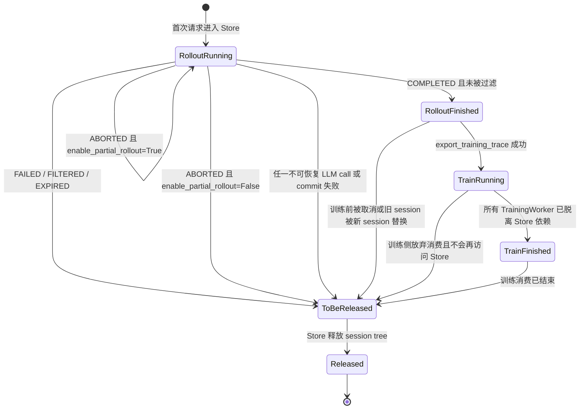

状态机里的线表示状态转移原因。进入 `ToBeReleased` 不代表已经释放，只代表这条 session 已经不应该继续参与 rollout 或 training。

## 4. Rollout 阶段

Rollout 阶段拆成两段：

```text
RolloutRunning -> RolloutFinished
RolloutFinished -> TrainRunning
```

第一段由 rollout 侧返回结果和 ReplayBuffer / producer 的判定共同决定；第二段由训练侧 export 是否成功决定。

### 4.1 RolloutRunning -> RolloutFinished / ToBeReleased

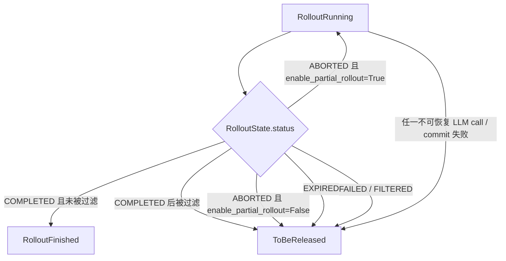

`RolloutRunning` 表示 session 仍属于 rollout 生产阶段。多轮 agent loop 中，多个 LLM call 会持续写入同一棵 session tree。当前简化版采用 session 级 all-or-nothing 语义：只要其中任意一轮 LLM call 出现不可恢复失败，或者某次 `commit_response` 失败，整条 session 都进入 `ToBeReleased`。

注意：下面的状态映射只影响 Rollout Trace Store 是否保留历史轨迹，不影响 ReplayBuffer / producer 是否继续采样。`ABORTED + enable_partial_rollout=True` 是唯一会复用老 `session_id` 的路径；其他失败、超时、worker 崩溃后的重跑，都必须从 ReplayBuffer 重新采样原始样本并使用新的 `session_id`。

`RolloutState.status` 和 Trace Store 状态的关系如下。

| `RolloutState.status` | Trace Store 状态转移 | 说明 |
| --- | --- | --- |
| `COMPLETED` 且未被过滤 | `RolloutRunning -> RolloutFinished` | completed rollout 可以进入训练读取阶段。 |
| `COMPLETED` 后被过滤 | `RolloutRunning -> ToBeReleased` | `producer.put_generated_group` 会对 completed group 做 `is_valid_sample_fn`，不通过时会置为 `FILTERED`；Trace Store 不需要继续保留历史轨迹。 |
| `ABORTED` 且 `enable_partial_rollout=True` | 保持 `RolloutRunning` | 复用老 `session_id`，基于已有历史轨迹继续 partial rollout。 |
| `ABORTED` 且 `enable_partial_rollout=False` | `RolloutRunning -> ToBeReleased` | 不做 partial resume；Trace Store 历史轨迹不再复用，可以释放。 |
| `EXPIRED` | `RolloutRunning -> ToBeReleased` | 过期样本不应继续复用旧 Trace Store 历史轨迹；采样侧是否重跑由 ReplayBuffer / producer 决定。 |
| `FAILED` | `RolloutRunning -> ToBeReleased` | failed rollout 不形成可训练 trace，全部进入释放等待。 |
| `FILTERED` | `RolloutRunning -> ToBeReleased` | 样本业务上不可训练。 |
| `INIT` | 保持 `RolloutRunning` | 尚未形成有效 rollout 返回，不触发释放。 |
| `ARCHIVED` | 不作为 rollout 生产阶段的正常返回 | 如果作为历史状态出现，不应该推动进入 `RolloutFinished`；是否保留由外部归档策略决定。 |

因此，`COMPLETED` 需要再经过过滤判断：未被过滤进入 `RolloutFinished`，被过滤进入 `ToBeReleased`。`FAILED` 和 `EXPIRED` 对 Trace Store 来说都直接进入 `ToBeReleased`。

多轮 LLM call 的失败规则如下。

| 事件 | Trace Store 状态转移 | 说明 |
| --- | --- | --- |
| 第 1 到第 N-1 轮 LLM call 成功，第 N 轮 LLM call 出现不可恢复失败 | `RolloutRunning -> ToBeReleased` | 已写入的历史轨迹不再作为失败重试的 prefix 复用，释放整棵 session tree。 |
| 第 N 轮 rollout 返回 `ABORTED`，且 `enable_partial_rollout=True` | 保持 `RolloutRunning` | 这是 partial resume 路径，后续继续使用老 `session_id`。 |
| 某轮 LLM call 返回字段不满足 completed contract | `RolloutRunning -> ToBeReleased` | rollout worker 应将状态置为 `FAILED`；Trace Store 按 failed session 处理。 |
| 某轮 `commit_response` 失败 | `RolloutRunning -> ToBeReleased` | 这条 session 不能再进入 `RolloutFinished`；需要清理已 staged 或已部分挂载的对象。 |
| producer 因失败、超时、worker 崩溃决定重跑同一个样本 | 新建 `session_id`，旧 session 进入 `ToBeReleased` | 新旧 session 通过不同 `session_id` 隔离，旧事件不能影响新 session。 |

#### 4.1.1 Worker completed contract

rollout worker 返回 `Status.COMPLETED` 前必须满足 completed contract：

| 字段 / 条件 | 要求 |
| --- | --- |
| `response_ids` | 当 `return_token_ids=True` 时必须存在且非空 |
| `logprobs` | 当 `return_logprob=True` 时必须存在且和 `response_ids` 对齐 |
| `routed_experts` | 当启用 routed experts 采集时必须存在 |
| `response` | 正常 completed 输出应有可用文本 |
| 长度一致性 | token、logprob、routed experts 等 token-level 字段必须能和本次生成对齐 |

如果这些条件不满足，应该由 rollout worker 把 `RolloutState.status` 标记为 `FAILED`，并设置 `error_msg`。Trace Store 可以保留防御性校验，但不应该把字段缺失当成正常 commit 分支处理。

#### 4.1.2 ABORTED

`Status.ABORTED` 是否保留历史轨迹，取决于 `enable_partial_rollout`。

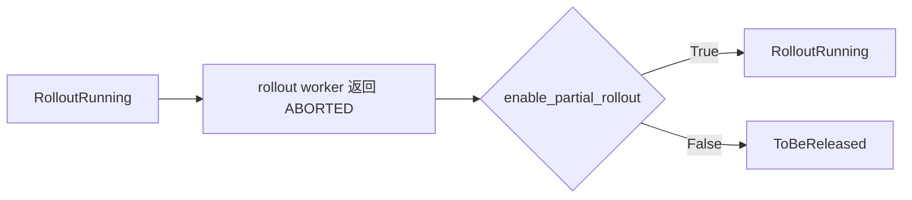

`enable_partial_rollout=True` 时，`ABORTED` 是同一条 session 的 partial resume 路径，Trace Store 保留历史轨迹，后续继续使用老 `session_id`。

`enable_partial_rollout=False` 时，`ABORTED` 不再复用历史轨迹，进入 `ToBeReleased`。ReplayBuffer / producer 如果要重跑，必须基于原始样本创建新的 `session_id`。

注意：只有 `RolloutState.status == ABORTED` 且 `enable_partial_rollout=True` 才能复用老 `session_id`。`FAILED`、`EXPIRED`、`commit_response` 失败、协议校验失败、worker 崩溃后的失败重试，都不能复用旧 `session_id`。

### 4.2 RolloutFinished -> TrainRunning

`RolloutFinished` 表示 rollout 侧已经提供了一条可训练样本，但训练侧还没有开始消费 Trace Store。

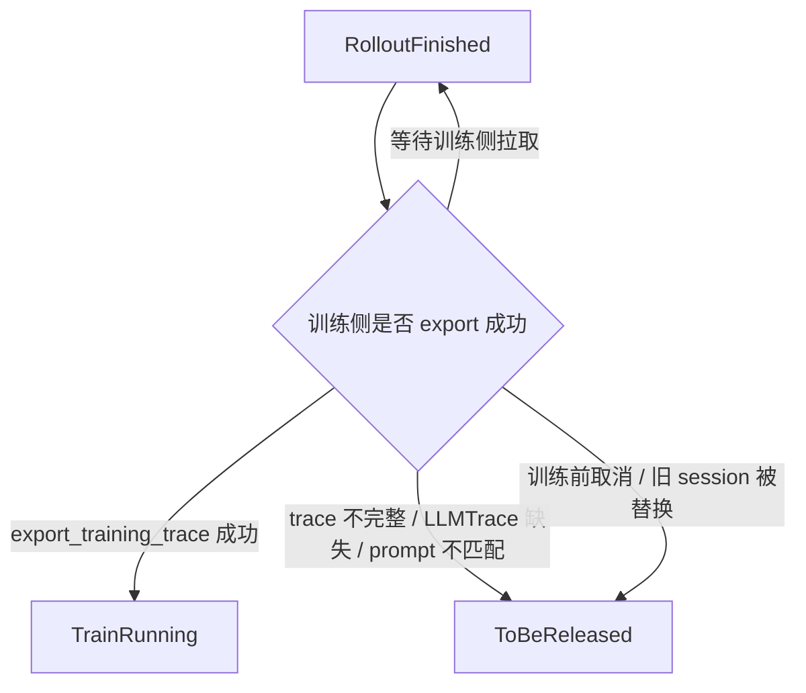

`RolloutFinished -> TrainRunning` 的条件：

1. 训练侧可以从 LLMTrace 渲染出完整 `prompt_text`。
2. `export_training_trace(session_id, prompt_text)` 能完整命中 Trace Store。
3. token-level 字段可以组成训练样本。
4. TrainingWorker 即将消费 Store 返回的 object keys / object refs。

如果 export 前发现 LLMTrace 缺失、prompt render 失败、Trace Store prefix 不完整、object key 缺失，说明这条样本已经无法训练，应进入 `ToBeReleased`。

## 5. 训练阶段

训练阶段用 `TrainRunning` 和 `TrainFinished` 表达原来 lease 想表达的保护语义。

`TrainRunning` 的含义是：训练侧已经通过 `export_training_trace` 接管了这条 session，并且 TrainingWorker 可能还会通过 object keys / object refs 从 Trace Store 读取 token-level 数据。只要还处在这个状态，Trace Store 就不能释放 session tree。

`TrainFinished` 是 Trace Store 视角的完成态：训练侧已经把需要的数据 materialize 到本地 batch / tensor，后续不会再访问 Trace Store 里的 object refs。它不要求 optimizer step、backward 或参数更新已经完成，只要求 Store 对这条 session 已经没有被训练侧继续读取的可能。

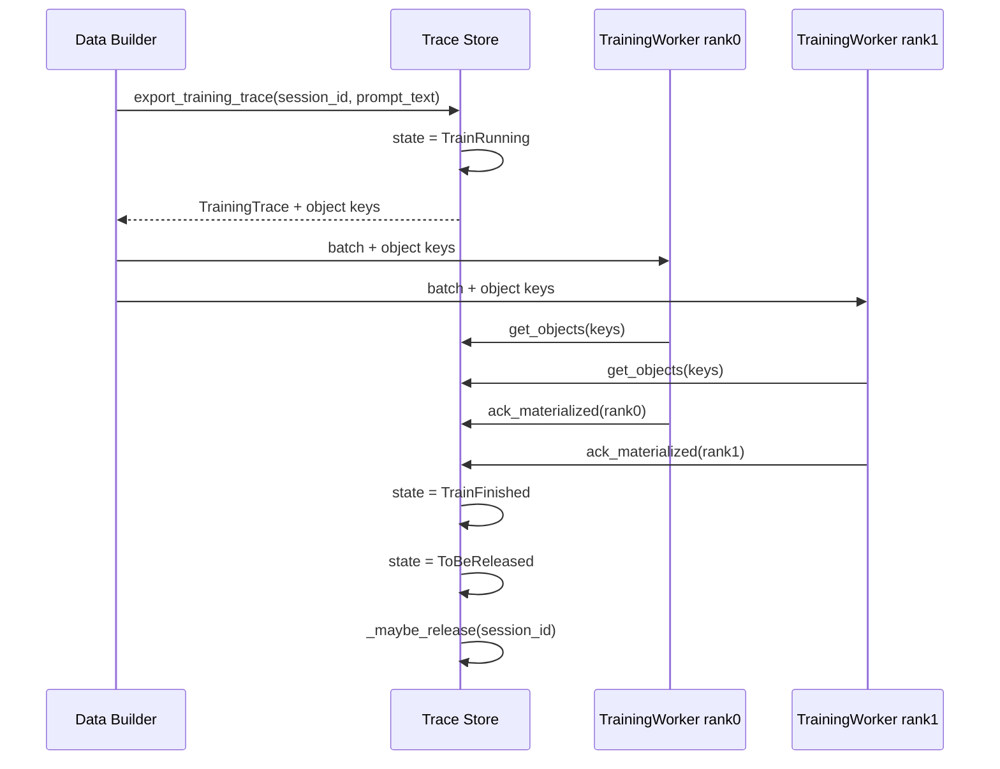

### 5.1 TrainRunning -> TrainFinished / ToBeReleased

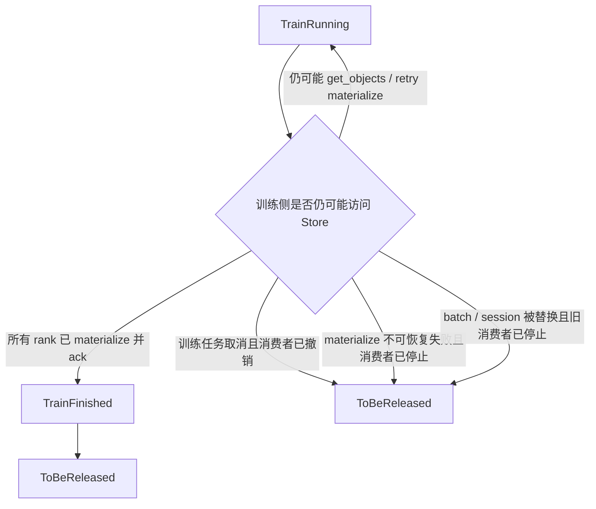

正常路径是：

```text
TrainRunning -> TrainFinished -> ToBeReleased
```

异常放弃路径是：

```text
TrainRunning -> ToBeReleased
```

两条路径的区别是：`TrainFinished` 表示训练侧成功拿走了这条 session 需要的数据；`TrainRunning -> ToBeReleased` 表示训练侧已经放弃这条 session，且系统确认不会再有 TrainingWorker 访问 Store。

| 事件 | 状态转移 | 说明 |
| --- | --- | --- |
| 所有 TrainingWorker rank 都完成 `get_objects`，并确认本地 batch / tensor 已 materialize | `TrainRunning -> TrainFinished` | 这是训练阶段的正常完成路径。 |
| 部分 rank 还没 ack materialized | 保持 `TrainRunning` | 任意 rank 仍可能读取 Store，不能释放。 |
| `get_objects` 临时失败，但训练侧会重试 | 保持 `TrainRunning` | 可恢复失败不应该触发释放，否则重试会读不到 object refs。 |
| 训练任务取消，并且 Data Builder / Trainer 已撤销这条 batch，确认没有 worker 会继续读取 Store | `TrainRunning -> ToBeReleased` | 这条 trace 不再训练，也不会被继续读取。 |
| TrainingWorker materialize 发现不可恢复错误，并且训练侧决定放弃该 session | `TrainRunning -> ToBeReleased` | 例如 object key 永久缺失、object ref 已损坏、反序列化失败、字段 shape 无法组成 batch。 |
| 当前 batch / session 被新 batch / session 替换，旧消费者已全部停止 | `TrainRunning -> ToBeReleased` | 旧 session 不应继续占用 Store 资源。 |
| 训练进程崩溃但调度器会用同一条 trace 重试 | 保持 `TrainRunning` | 因为后续重试仍依赖 Store。 |
| 训练进程崩溃且调度器明确放弃该 session | `TrainRunning -> ToBeReleased` | 前提仍然是确认不会再有消费者访问 Store。 |

进入 `ToBeReleased` 的判断条件不是“训练出现错误”，而是“训练侧已经不再依赖 Store”。因此，训练阶段的释放判断必须先回答两个问题：

1. 是否还有 TrainingWorker 可能持有 object keys / object refs？
2. 是否还有 Data Builder / Trainer 可能基于这条 session 重试 materialize？

只要任一问题答案是“是”，状态都必须保持 `TrainRunning`。只有两个答案都是否，才允许进入 `TrainFinished` 或 `ToBeReleased`。

### 5.2 训练阶段进入 ToBeReleased 的情况

`TrainRunning` 下需要进入 `ToBeReleased` 的情况可以归纳为三类。

| 类别 | 典型情况 |
| --- | --- |
| 训练侧主动放弃 | step 取消、trainer 停止、batch 被撤销、旧 session 被替换 |
| materialize 不可恢复失败 | object key 永久缺失、object ref 损坏、反序列化失败、shape / length 校验无法组成 batch |
| 重试窗口结束 | worker 崩溃后不再重试、materialize 超时后被调度器放弃 |

这些情况有一个共同前提：**所有训练侧消费者都已经停止，或者被调度器明确撤销**。如果还有任何消费者可能继续读取 Store，即使训练看起来已经失败，也必须保持 `TrainRunning`。

### 5.3 训练阶段不应该释放的情况

- `TrainRunning` 表示训练侧可能还没有 materialize 完，Trace Store 不能释放。
- 单个 worker 还在 `get_objects`、等待 `get_objects` 或准备重试时，不能释放。
- 部分 rank 已经 materialize，但其他 rank 还没有确认时，不能释放。
- 训练侧只是 backpressure、队列堆积或临时不可用时，不能释放。
- materialize 失败但调度器还会用同一条 session 重试时，不能释放。
- 只有确认 TrainingWorker 已经 materialize 完，或者训练消费失败但所有消费者都不会再依赖 Store，才能离开 `TrainRunning`。

## 6. 何时进入 ToBeReleased

`ToBeReleased` 是统一释放等待状态。正常完成和异常退出都会进入这里；具体原因先由调用方日志或上游状态表达。

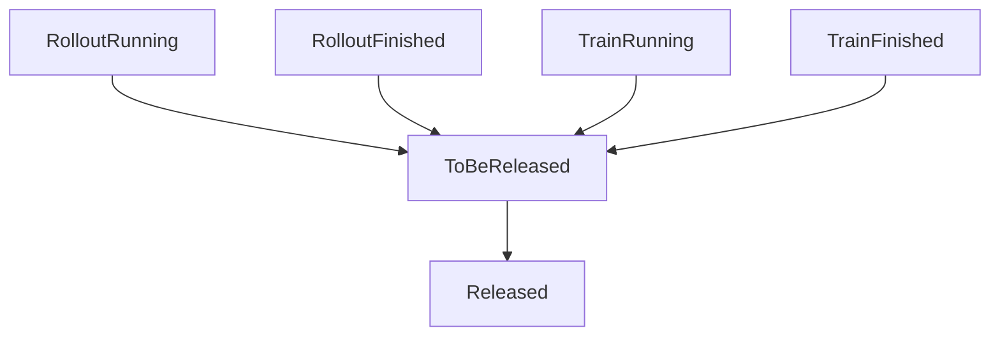

从不同状态进入 `ToBeReleased` 的原因如下。

| 来源状态 | 进入 `ToBeReleased` 的情况 |
| --- | --- |
| `RolloutRunning` | rollout failed / skipped / final cancelled / timeout |
| `RolloutRunning` | rollout worker 返回 `FAILED` |
| `RolloutRunning` | rollout worker 返回 `ABORTED`，且 `enable_partial_rollout=False` |
| `RolloutRunning` | rollout_state 变为 `EXPIRED` |
| `RolloutRunning` | `commit_response` 失败，staged objects 无法形成完整 committed trace |
| `RolloutRunning` | 失败、超时或 worker 崩溃后重跑，并创建了新的 `session_id`，旧 session 不再继续写入 |
| `RolloutRunning` | completed rollout 未通过 reward / filter / rule 判定，不能进入训练 |
| `RolloutFinished` | 训练前被取消、过期且被明确放弃、旧 session 被替换 |
| `RolloutFinished` | LLMTrace 缺失、prompt render 失败、Trace Store 字段不完整，导致无法构造训练样本 |
| `TrainRunning` | TrainingWorker materialize 不可恢复失败，且训练侧确认放弃这条 session |
| `TrainRunning` | object key 永久缺失、object ref 损坏、反序列化失败，且不会再重试 |
| `TrainRunning` | 训练任务取消、batch 被撤销、旧 session 被替换，且所有消费者都不会再依赖 Store |
| `TrainRunning` | materialize 超时或 worker 崩溃后，调度器明确放弃该 session |
| `TrainFinished` | 训练侧已经完成 materialize，不再依赖 Store object refs |

以下情况不能直接进入 `ToBeReleased`：

| 情况 | 处理方式 |
| --- | --- |
| `Status.ABORTED` 且 `enable_partial_rollout=True` | 保持 `RolloutRunning`，继续使用老 `session_id` resume |
| TrainingWorker 仍可能依赖 Store object refs | 保持 `TrainRunning` |
| materialize / get_objects 失败但训练侧还会重试 | 保持 `TrainRunning` |
| 只有部分 TrainingWorker rank 完成 materialize | 保持 `TrainRunning` |
| 失败、超时、worker 崩溃后的重跑复用旧 `session_id` | 不允许；必须新建 `session_id` |

## 7. 释放判断

`Released` 不是外部模块直接设置的状态，而是 `_maybe_release(session_id)` 的结果。

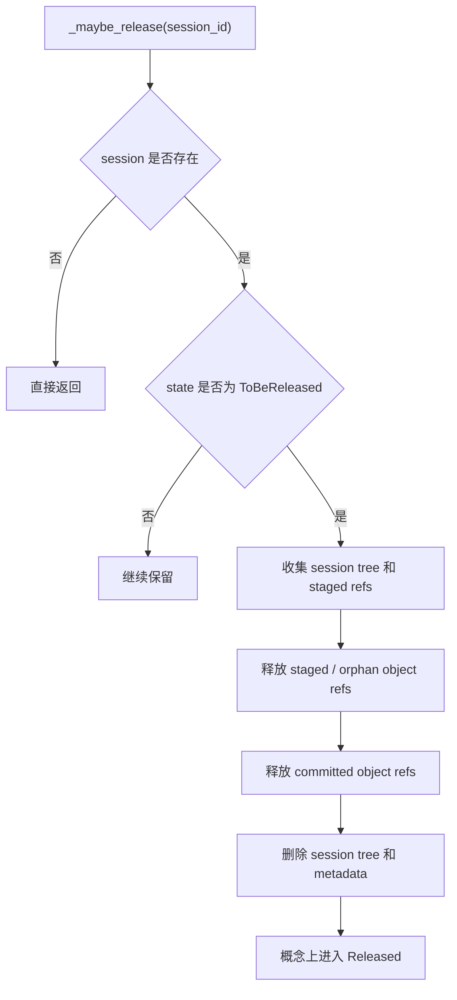

对应伪代码：

```python
def _maybe_release(session_id: str) -> None:
    session = sessions.get(session_id)
    if session is None:
        return
    if session.state != "ToBeReleased":
        return
    _release_staged_objects(session_id)
    _release_committed_objects(session)
    _delete_session_tree(session)
    _delete_session_metadata(session_id)
```

这里不再检查 `lease` 或 `retention`，因为它们已经被状态表达：

- 训练侧仍可能依赖 Store object refs 时，状态必须停留在 `TrainRunning`。
- 多轮 LLM call 仍在继续写入，或 `ABORTED + enable_partial_rollout=True` 等待 resume 时，状态必须停留在 `RolloutRunning`。
- 只有进入 `ToBeReleased`，才表示这些保留理由都已经消失。

释放必须覆盖两类对象：

1. 已经挂到 session tree 上的 committed objects。
2. `commit_response` 过程中已经 staged / pinned、但还没有完整挂到 session tree 上的 objects。

因此实现上需要有 staged object registry，或者保证 `commit_response` 具备原子 rollback 能力。否则一次半提交失败可能留下 session tree 看不到的孤儿 object refs。

## 8. 常见路径

### 8.1 正常训练路径

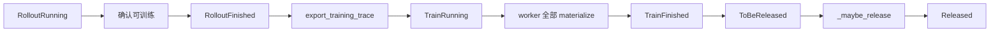

### 8.2 rollout 阶段不可恢复失败

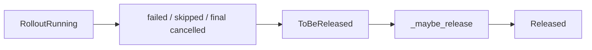

### 8.3 rollout 完成后不可训练

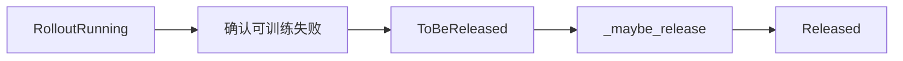

### 8.4 aborted 处理

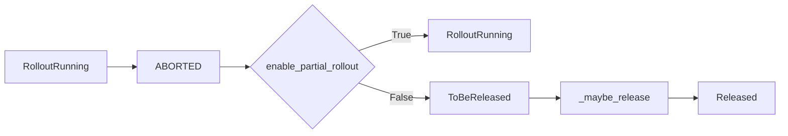

`enable_partial_rollout=True` 时，`ABORTED` 是 partial resume 路径，继续使用老 `session_id`。`enable_partial_rollout=False` 时，`ABORTED` 对 Trace Store 是释放路径；采样侧如果要重跑，必须重新采样原始样本并创建新的 `session_id`。

## 9. 设计约束

1. `state` 是互斥枚举，同一 session 同一时刻只能处于一个主状态。
2. Trace Store 的释放粒度是整个 session tree，不做单个 LLM call 粒度释放。
3. 外部模块不能直接调用物理 `release(session_id)`。
4. 外部模块只能上报语义事件，例如 rollout 可训练、rollout 丢弃、训练消费完成、训练消费失败。
5. Trace Store actor 是唯一能执行物理释放的地方。
6. `_maybe_release` 必须幂等，可以在每个事件后调用。
7. `ABORTED + enable_partial_rollout=True` 是唯一允许复用老 `session_id` 的 partial resume 路径。
8. 失败重试、超时重跑、worker 崩溃后重跑都必须使用新的 `session_id`。
9. 任一不可恢复 LLM call 失败、`FAILED`、`EXPIRED`、`ABORTED + enable_partial_rollout=False` 或 `commit_response` 失败，都会使整个 session 进入 `ToBeReleased`。
10. `EXPIRED` 对 Trace Store 是释放路径，进入 `ToBeReleased`；是否重新采样由 ReplayBuffer / producer 决定。
11. `TrainRunning` 不能释放；离开 `TrainRunning` 的事件必须保证 TrainingWorker 不再依赖 Store object refs。
12. `ToBeReleased` 是唯一允许进入物理释放流程的状态。
13. 当前版本只支持 `ABORTED + enable_partial_rollout=True` 这一种 partial resume；如果后续要支持 failed prefix resume，需要重新设计可恢复 prefix、resume TTL 和 generation fencing。
