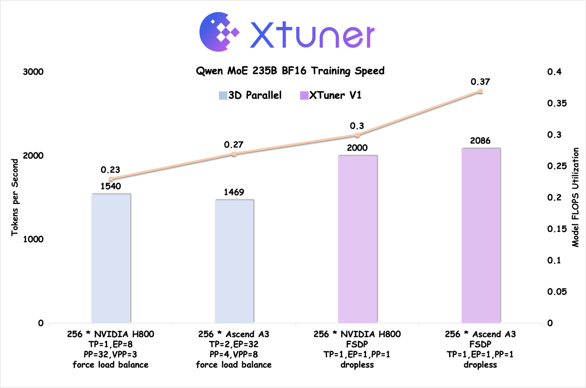
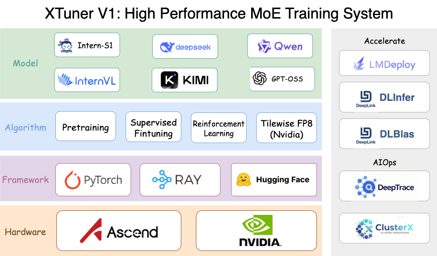

.. xtuner documentation master file, created by
   sphinx-quickstart on Tue Jan  9 16:33:06 2024.
   You can adapt this file completely to your liking, but it should at least
   contain the root `toctree` directive.

.. |checked| unicode:: U+2713
.. |unchecked| unicode:: U+2717

Welcome to XTuner V1 English Documentation
==========================================

.. figure:: ./_static/image/logo.png
  :align: center
  :alt: xtuner
  :class: no-scaled-link

.. raw:: html

   

   <strong>LLM One-Stop Toolbox
   </strong>
   

   

   
   <a class="github-button" href="https://github.com/InternLM/xtuner" data-show-count="true" data-size="large" aria-label="Star">Star</a>
   <a class="github-button" href="https://github.com/InternLM/xtuner/subscription" data-icon="octicon-eye" data-size="large" aria-label="Watch">Watch</a>
   <a class="github-button" href="https://github.com/InternLM/xtuner/fork" data-icon="octicon-repo-forked" data-size="large" aria-label="Fork">Fork</a>
   

.. toctree::
   :hidden:
   :maxdepth: 2
   :caption: Getting Started

   get_started/index.rst

.. toctree::
   :hidden:
   :maxdepth: 3
   :caption: Pretraining & Fine-tuning

   pretrain_sft/tutorial/index.rst

.. toctree::
   :hidden:
   :maxdepth: 3
   :caption: Reinforcement Learning

   rl/tutorial/rl_grpo_trainer.md

.. toctree::
   :hidden:
   :maxdepth: 3
   :caption: Advanced Tutorial

   pretrain_sft/advanced_tutorial/index.rst
   rl/advanced_tutorial/index.rst

.. toctree::
   :hidden:
   :maxdepth: 3
   :caption: Benchmark

   benchmark/index.rst

.. toctree::
   :hidden:
   :maxdepth: 2
   :caption: API

   Pretrain & SFT Trainer  <api/trainer>
   Config <api/config>
   RL Trainer <api/rl_trainer>
   RL Config <api/rl_config>
   Loss Context <api/loss_ctx>

XTuner V1 is a next-generation LLM training engine specifically designed for ultra-large-scale MoE models. Unlike traditional 3D parallel training architectures, XTuner V1 is optimized for the mainstream MoE training scenarios prevalent in today's academic research.

🚀 Speed Benchmark
==================================

Key Features
=============
**📊 Dropless Training**

- **Scalable without complexity:** Train 200B-scale MoE models without expert parallelism; 600B models require only intra-node expert parallelism
- **Optimized parallelism strategy:** Smaller expert parallelism dimension compared to traditional 3D approaches, enabling more efficient Dropless training

**📝 Long Sequence Support**

- **Memory-efficient design:** Train 200B MoE models on 64k sequence lengths without sequence parallelism through advanced memory optimization techniques
- **Flexible scaling:** Full support for DeepSpeed Ulysses sequence parallelism with linearly scalable maximum sequence length
- **Robust performance:** Maintains stability despite expert load imbalance during long sequence training

**⚡ Superior Efficiency**

- **Massive scale:** Supports MoE training up to 1T parameters
- **Breakthrough performance:** First to achieve FSDP training throughput that surpasses traditional 3D parallel schemes for MoE models above 200B scale
- **Hardware optimization:** Achieves training efficiency on Ascend A3 Supernode that exceeds NVIDIA H800

🔥 Roadmap
==========

XTuner V1 is committed to continuously improving training efficiency for pre-training, instruction fine-tuning, and reinforcement learning of ultra-large MoE models, with special focus on Ascend NPU optimization.

🚀 Training Engine
--------------------

Our vision is to establish XTuner V1 as a versatile training backend that seamlessly integrates with the broader open-source ecosystem.

+------------+-----------+----------+-----------+
|   Model    |  GPU(FP8) | GPU(BF16)| NPU(BF16) |
+============+===========+==========+===========+
| Intern S1  |    ✅     |    ✅    |    ✅     |
+------------+-----------+----------+-----------+
| Intern VL  |    ✅     |    ✅    |    ✅     |
+------------+-----------+----------+-----------+
| Qwen3 Dense|    ✅     |    ✅    |    ✅     |
+------------+-----------+----------+-----------+
| Qwen3 MoE  |    ✅     |    ✅    |    ✅     |
+------------+-----------+----------+-----------+
| GPT OSS    |    ✅     |    ✅    |    ❌     |
+------------+-----------+----------+-----------+
| Deepseek V3|    ✅     |    ✅    |    ❌     |
+------------+-----------+----------+-----------+
| KIMI K2    |    ✅     |    ✅    |    ❌     |
+------------+-----------+----------+-----------+

🧠 Algorithm
--------------

The algorithm component is actively evolving. We welcome community contributions - with XTuner V1, scale your algorithms to unprecedented sizes!

**Implemented**

- ✅ **Multimodal Pre-training** - Full support for vision-language model training
- ✅ **Multimodal Supervised Fine-tuning** - Optimized for instruction following
- ✅ `GRPO <https://arxiv.org/pdf/2402.03300>`_ - Group Relative Policy Optimization

**Coming Soon**

- 🔄 `MPO <https://arxiv.org/pdf/2411.10442>`_ - Mixed Preference Optimization
- 🔄 `DAPO <https://arxiv.org/pdf/2503.14476>`_ - Dynamic Sampling Policy Optimization
- 🔄 **Multi-round Agent Reinforcement Learning** - Advanced agent training capabilities

⚡ Inference Engine Integration
-----------------------------------

Seamless deployment with leading inference frameworks:

* |checked| LMDeploy
* |unchecked| vLLM
* |unchecked| SGLang

🤝 Contributing
-----------------

We appreciate all contributions to XTuner. Please refer to `Contributing Guide <.github/CONTRIBUTING.md>`_ for the contributing guideline.

🙏 Acknowledgments
-------------------

The development of XTuner V1's training engine has been greatly inspired by and built upon the excellent work of the open-source community. We extend our sincere gratitude to the following pioneering projects:

**Training Engine:**

- [Torchtitan](https://github.com/pytorch/torchtitan) - A PyTorch native platform for training generative AI models
- [Deepspeed](https://github.com/deepspeedai/DeepSpeed) - Microsoft's deep learning optimization library
- [MindSpeed](https://gitee.com/ascend/MindSpeed) - Ascend's high-performance training acceleration library
- [Megatron](https://github.com/NVIDIA/Megatron-LM) - NVIDIA's large-scale Transformer training framework.

**Reinforcement Learning:**

XTuner V1's reinforcement learning capabilities have been enhanced through insights and best practices from:

- [veRL](https://github.com/volcengine/verl) - Volcano Engine Reinforcement Learning for LLMs
- [SLIME](https://github.com/THUDM/slime) - THU's scalable RLHF implementation
- [AReal](https://github.com/inclusionAI/AReaL) - Ant Reasoning Reinforcement Learning for LLMs
- [OpenRLHF](https://github.com/OpenRLHF/OpenRLHF) - An Easy-to-use, Scalable and High-performance RLHF Framework based on Ray

We are deeply grateful to all contributors and maintainers of these projects for advancing the field of large-scale model training.

🖊️ Citation
-----------

.. code-block:: bibtex

   @misc{2023xtuner,
       title={XTuner: A Toolkit for Efficiently Fine-tuning LLM},
       author={XTuner Contributors},
       howpublished = {\url{https://github.com/InternLM/xtuner}},
       year={2023}
   }

Open Source License
======================

The project is released under the `Apache License 2.0 <LICENSE>`_. Please also adhere to the Licenses of models and datasets being used.
