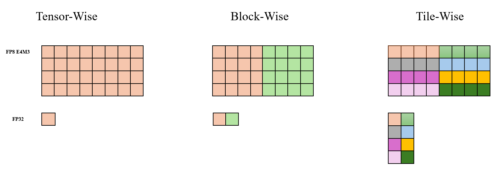
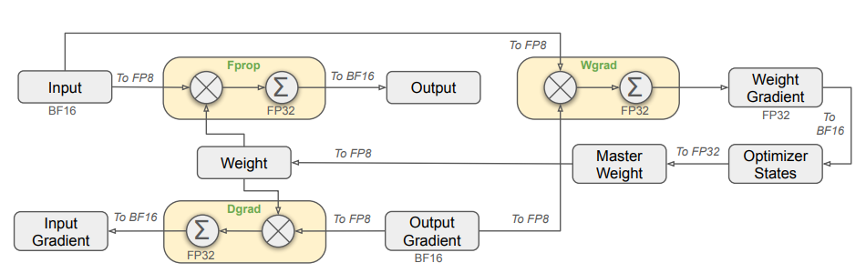
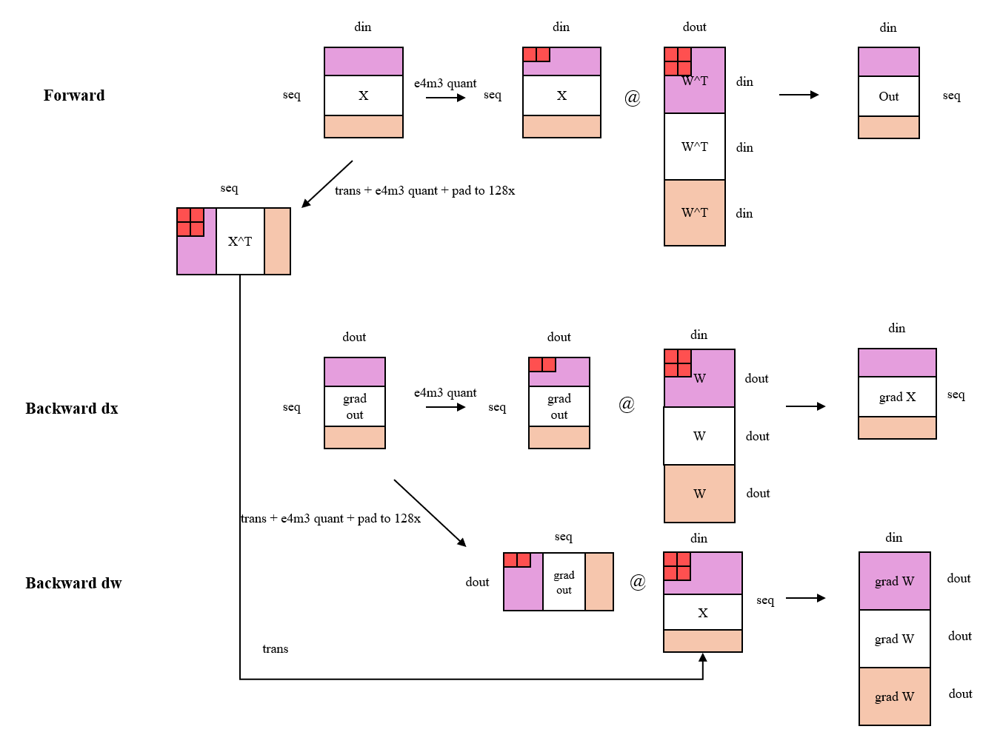

# FP8 Training

Hopper architecture GPUs introduce a new data type FP8 (8-bit floating point), which can significantly improve matrix multiplication computing efficiency. Below we will introduce how to use FP8 for training in XTuner.

## Why Choose FP8

1. Reduce communication volume and improve communication speed: XTuner V1 is developed based on PyTorch FSDP. Compared with BF16, using FP8 communication can significantly alleviate the inherent bottleneck of large FSDP communication volume.
2. Improve matrix multiplication computing efficiency.
3. Save GPU memory: Compared with BF16 training, FP8 training saves FP8 Tensor instead of BF16 Tensor in the PyTorch computation graph for Linear and Grouped Linear layers. This can significantly reduce the GPU memory overhead of the computation graph.
4. Accuracy is guaranteed: To avoid falling into the dilemma of "don't worry about whether I'm right or not, just ask if I'm fast", XTuner adopts fine-grained FP8 quantization mode, optimizing training speed while ensuring training accuracy.

## Benchmark

Parallel Configuration | Training Configuration | SeqLen | GlobalBatchSize | GPUNum | TimePerIter (s) | Tokens/GPU/Second
-- | -- | -- | -- | -- | -- | --
tp1, ep1, pp1 | BF16 | 65536 | 256 | 256 | 32.77 | 2000
tp1, ep1, pp1 | FP8  | 65536 | 256 | 256 | 26.75 | 2450

[profile data](https://drive.google.com/file/d/1TW-DbsUCckKJS36-5YHJo73L1Nvlpv6h/view?usp=sharing)

## How to Use XTuner FP8 Training

### Environment Preparation

First check if the GPU is Hopper architecture or above:

```python
import torch

print(torch.cuda.is_available() and torch.cuda.get_device_capability() >= (8, 9))
```

Install the `AdaptiveGEMM` library:

```{code-block} shell
:caption: Install AdaptiveGEMM

pip install git+https://github.com/InternLM/AdaptiveGEMM.git@main
```

### Using XTuner's Linear and Grouped Linear Modules

```python
import torch
from xtuner.v1.float8 import TileWiseFloat8Linear, TileWiseFloat8GroupedLinear

# (bs, seq, dim)
x = torch.randn(1, 32768, 1024, device='cuda', dtype=torch.bfloat16, requires_grad=True)
linear = TileWiseFloat8Linear(in_features=1024, out_features=2048, bias=False, device='cuda', dtype=torch.bfloat16)
out = linear(x)
out.mean().backward()

x = torch.randn(1, 32768, 1024, device='cuda', dtype=torch.bfloat16)
grouped_linear = TileWiseFloat8GroupedLinear(in_features=1024, out_features=2048, num_routed_experts=4, moe_bias=False).to(dtype=torch.bfloat16, device='cuda')
tokens_per_expert = torch.tensor([1000, 4000, 6000, 32768 - 11000], device='cuda')
out = grouped_linear(x, tokens_per_expert)
out.mean().backward()
```

```{tip}
:class: margin

1. Single testing of `TileWiseFloat8Linear` and `TileWiseFloat8GroupedLinear` is difficult to reflect the ideal end-to-end speed, because quantization of weights is time-consuming. It needs to be combined with FSDP to achieve optimal training efficiency (FP8 communication can be used, and each rank only quantizes its own slice parameters, making the weight quantization overhead negligible). Usage see next subsection.

2. It is normal for the first execution of fwd + bwd to be slower, and the speed will return to normal upon subsequent executions.
```

### Using XTuner FP8 Training

Step 1, refer to the [Selecting Model](model-cfg) section to build a model_cfg instance and configure float8_cfg:

```{code-block} python
:caption: Building Model Configuration

from xtuner.v1.model import Qwen3Dense8BConfig
from xtuner.v1.float8.config import Float8Config, ScalingGranularity

float8_cfg = Float8Config(
    scaling_granularity_gemm=ScalingGranularity.TILEWISE,
    scaling_granularity_grouped_gemm=ScalingGranularity.TILEWISE,
)

model_cfg = Qwen3Dense8BConfig(float8_cfg=float8_cfg)
```

Step 2, refer to the [Fine-tuning Large Models with Trainer](trainer-sft) section for subsequent content to build `trainer`.

Step 3, launch training, complete code is as follows:

````{toggle}
```diff
from xtuner.v1.model import Qwen3Dense8BConfig
from xtuner.v1.config import LRConfig, AdamWConfig
from xtuner.v1.train import Trainer
+ from xtuner.v1.float8.config import Float8Config, ScalingGranularity

+ float8_cfg = Float8Config(
+     scaling_granularity_gemm=ScalingGranularity.TILEWISE,
+     scaling_granularity_grouped_gemm=ScalingGranularity.TILEWISE,
+ )

- model_cfg = Qwen3Dense8BConfig()
+ model_cfg = Qwen3Dense8BConfig(float8_cfg=float8_cfg)
dataset_cfg = []
optim_cfg = AdamWConfig(lr=6e-05)
lr_cfg = LRConfig(lr_type="cosine", lr_min=1e-6)

load_from = "<model path>" # If in fine-tuning mode, must specify, otherwise will train from scratch
tokenizer = "<tokenizer path, usually same as model path>"

trainer = Trainer(
    model_cfg=model_cfg,
    tokenizer_path=tokenizer,
    load_from=load_from,
    optim_cfg=optim_cfg,
    dataset_cfg=dataset_cfg,
    lr_cfg=lr_cfg,
)
trainer.fit()
```
````

After writing the above Python script, name it `toy_train.py`, and we can launch distributed training through `torchrun`:

```{code-block} bash
:caption: Launch Training

torchrun --nproc_per_node=8 toy_train.py
```

Congratulations, you have implemented a XTuner FP8 training entry yourself! You can fully customize your training parameters in this script.

## XTuner FP8 Training Strategy

### FP8 Quantization

XTuner adopts symmetric quantization:

```python
s = absmax(x) / q_max
q = clip(x / s, q_min, q_max)
```

XTuner supports the following three quantization granularities: Tensor-Wise, Block-Wise, and Tile-Wise, as shown in the figure below. Elements of the same color share the same quantization parameters. In actual use, block_size and tile_size are generally set to 128.



XTuner adopts the "just-in-time scaling" quantization method, which calculates the corresponding scaling factor (scales) in real time based on the input Tensor.

### FP8 Operators

We extended the following two capabilities related to Grouped GEMM based on [DeepGemm](https://github.com/deepseek-ai/DeepGEMM/tree/3b3783d06cd4d06ac4ba048633e604151d1ee535) (thanks to the DeepSeek team for their contribution to the open source community):

1. Support cases where Group Size M is not 128x to meet actual training needs, details see our paper [TMA-Adaptive FP8 Grouped GEMM](https://arxiv.org/abs/2508.16584).
2. Support Grouped Linear's Backward operator Group K GEMM.

It should be noted that to ensure performance meets expectations, the Group K GEMM operator requires Group Size K to be a multiple of 128, which puts higher requirements on our AutoGrad design, details see next subsection.

### FP8 Mixed Precision Training

XTuner FP8 refers to the FP8 training strategy in DeepSeek V3, as shown in the figure below. For main compute-intensive operators (such as GEMM and Grouped GEMM), we use FP8 to accelerate computation. The operator accepts FP8 input and gets BF16 output. The three Linear Modules involved in GEMM computation in the figure below all use FP8 computation, which we name Fprop (Forward Pass), Dgrad (Activation Backward
Pass) and Wgrad (Weight Backward Pass). Compared with BF16, FP8 halves the theoretical time consumption of GEMM. At the same time, only FP8 Tensor needs to be saved in the PyTorch computation graph to complete Backward computation, thus saving the GPU memory overhead of the computation graph.



Furthermore, XTuner refines the AutoGrad computation logic of FP8 Linear and Grouped Linear. Here we take the more complex Grouped Linear as an example. As shown in the figure below, in Forward and Backward dx computation, we adopt Tile-Wise quantization strategy for activation values and Block-Wise quantization strategy for model weights. In Backward dw computation, in pursuit of performance advantages, we adopt Tile-Wise quantization strategy for Grad Output and Block-Wise quantization strategy for Forward input X.

One thing that needs special explanation in the figure is that in the calculation of Backward dw, we performed Transpose + Block-Wise FP8 Quantize + Pad to 128x + Transpose operations on the input X during Forward. This is because, in order to achieve ideal computing efficiency, FP8 GEMM operator and Grouped GEMM operator require the layout of the lhs matrix to be Row-Major, while the rhs matrix is Column-Major. At the same time, as mentioned in the previous section, Group K GEMM operator requires Group Size K to be divisible by 128. We fuse Transpose + Block-Wise FP8 Quantize + Pad to 128x into one operator to improve computing efficiency.

