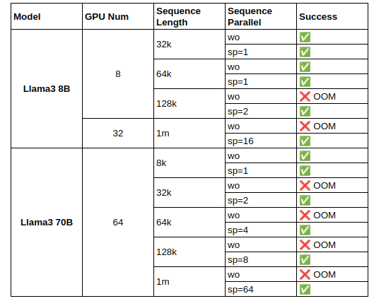

## Introduction to Reward Model

### Overview

The Reward Model is a crucial component in the reinforcement learning process. Its primary task is to predict reward values based on given inputs, guiding the direction of the learning algorithm. In RLHF (Reinforcement Learning from Human Feedback), the Reward Model acts as a proxy for human preferences, helping the reinforcement learning algorithm optimize strategies more effectively.

In large language model training, the Reward Model typically refers to the Preference Model. By providing good and bad (chosen & rejected) responses to the same prompts during training, it fits human preferences and predicts a reward value during inference to guide the optimization of the Actor model in the RLHF process.

Applications of the Reward Model include but are not limited to:

- **RLHF Training**: During RLHF training such as the Proximal Policy Optimization (PPO) algorithm, the Reward Model provides reward signals, improve the quality of generated content, and align it more closely with human preferences.
- **BoN Sampling**: In the Best-of-N (BoN) sampling process, users can use the Reward Model to score multiple responses to the same prompt and select the highest-scoring generated result, thereby enhancing the model's output.
- **Data Construction**: The Reward Model can be used to evaluate and filter training data or replace manual annotation to construct DPO training data.

### Features of Reward Model Training in XTuner

The Reward Model training in XTuner offers the following significant advantages:

1. **Latest Training Techniques**: XTuner integrates the Reward Model training loss function from InternLM2, which stabilizes the numerical range of reward scores and reduces overfitting on simple samples (see [InternLM2 Technical Report](https://arxiv.org/abs/2403.17297) for details).

2. **Reducing Memory Waste**: Due to the length differences in chosen and rejected data in preference datasets, padding tokens during data concatenation can cause memory waste. In XTuner, by utilizing the variable-length attention feature from Flash Attention2, preference pairs are packed into the same sequence during training, significantly reducing memory waste caused by padding tokens. This not only improves memory efficiency but also allows for training larger models or handling more data under the same hardware conditions.

3. **Efficient Training**: Leveraging XTuner's QLoRA training capabilities, we can perform full parameter training only on the Reward Model's Value Head, while using QLoRA fine-tuning on the language model itself, substantially reducing the memory overhead of model training.

4. **Long Text Training**: With XTuner's sequence parallel functionality, long text data can be trained efficiently.

### Getting Started

Refer to the [Quick Start Guide](./quick_start.md) to understand the basic concepts. For more information on configuring training parameters, please see the [Modifying Reward Model Settings](./modify_settings.md) section.

### Open-source Models

We use XTuner to train the  InternLM2 Reward Models from the InternLM2 Technical Report, welcome to download and use:

| Model                     | Transformers(HF)                                                                 | ModelScope(HF)                                                                                             | OpenXLab(HF)                                                                                                                                                | RewardBench Score |
| ------------------------- | -------------------------------------------------------------------------------- | ---------------------------------------------------------------------------------------------------------- | ----------------------------------------------------------------------------------------------------------------------------------------------------------- | ----------------- |
| **InternLM2-1.8B-Reward** | [🤗internlm2-1_8b-reward](https://huggingface.co/internlm/internlm2-1_8b-reward) | [internlm2-1_8b-reward](https://modelscope.cn/models/Shanghai_AI_Laboratory/internlm2-1_8b-reward/summary) |  | 80.6              |
| **InternLM2-7B-Reward**   | [🤗internlm2-7b-reward](https://huggingface.co/internlm/internlm2-7b-reward)     | [internlm2-7b-reward](https://modelscope.cn/models/Shanghai_AI_Laboratory/internlm2-7b-reward/summary)     |    | 86.6              |
| **InternLM2-20B-Reward**  | [🤗internlm2-20b-reward](https://huggingface.co/internlm/internlm2-20b-reward)   | [internlm2-20b-reward](https://modelscope.cn/models/Shanghai_AI_Laboratory/internlm2-20b-reward/summary)   |   | 89.5              |
