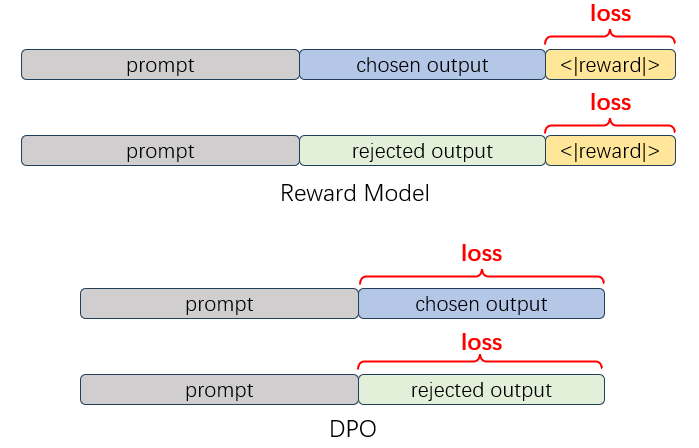

## Preference Dataset

### Overview

XTuner's Reward Model, along with DPO, ORPO, and other algorithms that training on preference data, adopts the same data format. Each training sample in the preference dataset needs to contain the following three fields: `prompt`, `chosen`, and `rejected`. The values for each field follow the [OpenAI chat message](https://platform.openai.com/docs/api-reference/chat/create) format. A specific example is as follows:

```json
{
  "prompt": [
    {
      "role": "system",
      "content": "You are a helpful assistant."
    },
    {
      "role": "user",
      "content": "Who won the world series in 2020?"
    },
    {
      "role": "assistant",
      "content": "The Los Angeles Dodgers won the World Series in 2020."
    },
    {
      "role": "user",
      "content": "Where was it played?"
    }
  ],
  "chosen": [
    {
      "role": "assistant",
      "content": "The 2020 World Series was played at Globe Life Field in Arlington, Texas."
    }
  ],
  "rejected": [
    {
      "role": "assistant",
      "content": "I don't know."
    }
  ]
}
```

When conducting Reward Model training or DPO training, XTuner processes the preference dataset into different training labels based on the type of training task.



As shown in the above image, for Reward Model training, we follow the ChatGPT training method by adding a special `<|reward|>` token at the end of the conversation data and calculating the loss only on the logits output by this token. For DPO series algorithm training, we mask the tokens in the prompt part and calculate the loss only on the chosen and rejected responses. In the configuration file, we control the dataset type through the `is_reward` and `is_dpo` fields in the dataset.

### Training with Custom Data

After understanding the data format of a single sample, you only need to save the converted data in [JSON Lines](https://jsonlines.org/) format. Each line in the file is a sample.

```json
{"prompt": [{"content": "How can I learn to better regulate my emotions as a grown adult?", "role": "user"}], "chosen": [{"content": "You could do emotional regulation exercises with me, and try to notice and practice ways that you could better control your emotions in real life.", "role": "assistant"}], "rejected": [{"content": "Do you mean how can you learn to be more emotionally mature?", "role": "assistant"}]}
{"prompt": [{"content": "What are some interesting things I can add to a grilled cheese sandwich?", "role": "user"}, {"content": "A tomato, a slice of pickle, some chopped pickles, some chopped green onions.  Also, some mayonnaise if you like.", "role": "assistant"}, {"content": "Sounds great. Anything else?", "role": "user"}], "chosen": [{"content": "If you’d like something a little different, I recommend grating some horseradish on top of the sandwich.", "role": "assistant"}], "rejected": [{"content": "Maybe some nice fresh basil?", "role": "assistant"}]}
{"prompt": [{"content": "How do I bob for apples?", "role": "user"}], "chosen": [{"content": "Ah!  Do you mean the game of “applesauce,” or do you mean the idea of “to bob for apples”?", "role": "assistant"}], "rejected": [{"content": "Sorry, I don’t know that term.", "role": "assistant"}]}
......
```

After preparing the custom dataset, you need to fill in the path to your saved data in the `data_files` field in the configuration file. You can load multiple JSONL files simultaneously for training.

```python
#######################################################################
#                      PART 3  Dataset & Dataloader                   #
#######################################################################
train_dataset = dict(
    type=build_preference_dataset,
    dataset=dict(
        type=load_jsonl_dataset,
        data_files=[
            '/your/jsonl/path/here.jsonl',
            '/your/another/jsonl/path/here.jsonl'
        ]),
)
```

### Training with Open Source Datasets

Similar to configuring SFT data in XTuner, when using open-source datasets from Hugging Face, you only need to define a mapping function `map_fn` to process the dataset format into XTuner's data format.

Taking `Intel/orca_dpo_pairs` as an example, this dataset has `system`, `question`, `chosen`, and `rejected` fields, with each field's value in text format instead of the [OpenAI chat message](https://platform.openai.com/docs/api-reference/chat/create) format. Therefore, we need to define a mapping function for this dataset:

```python
def intel_orca_dpo_map_fn(example):
    prompt = [{
        'role': 'system',
        'content': example['system']
    }, {
        'role': 'user',
        'content': example['question']
    }]
    chosen = [{'role': 'assistant', 'content': example['chosen']}]
    rejected = [{'role': 'assistant', 'content': example['rejected']}]
    return {'prompt': prompt, 'chosen': chosen, 'rejected': rejected}
```

As shown in the code, `intel_orca_dpo_map_fn` processes the four fields in the original data, converting them into `prompt`, `chosen`, and `rejected` fields, and ensures each field follows the [OpenAI chat message](https://platform.openai.com/docs/api-reference/chat/create) format, maintaining uniformity in subsequent data processing flows.

After defining the mapping function, you need to import it in the configuration file and configure it in the `dataset_map_fn` field.

```python
train_dataset = dict(
    type=build_preference_dataset,
    dataset=dict(
        type=load_dataset,
        path='Intel/orca_dpo_pairs'),
    tokenizer=tokenizer,
    max_length=max_length,
    dataset_map_fn=intel_orca_dpo_map_fn,
)
```
