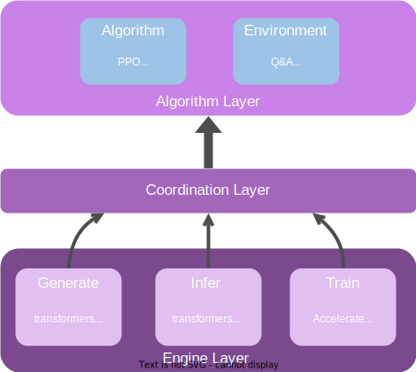

.. _xtuner_rlhf_arch:

System Architecture
-------------------

The architecture of XTuner-RLHF is shown as follows:

Engine Layer
~~~~~~~~~~~~

The engine layer decouples training, inference, and generation, allowing users to choose different engines for these processes. For example, transformers can be used for training and inference, while the vLLM can be used for generation. The advantages of a multi-engine design include:

**Flexibility and Adaptability**: Different projects may have different requirements and constraints. Integrating multiple frameworks allows users to choose the most suitable tool for their specific situation, enhancing development efficiency and effectiveness.

**Performance Optimization**: Different frameworks may perform differently on various tasks. Users can choose the framework that performs best for a specific task to achieve optimal performance.

**Cross-Platform Compatibility**: Some frameworks perform better on specific platforms or support specific hardware. Providing multiple framework options ensures compatibility and optimization across different platforms and hardware.

**Ease of Use**: Some frameworks may be more user-friendly and suitable for rapid prototyping, while others may be better suited for large-scale deployment. Users can choose the appropriate framework based on the development stage.

Coordination Layer
~~~~~~~~~~~~~~~~

The coordination layer provides model-level operation interfaces to the upper algorithm layer, simplifying interactions with the underlying engines. It also adapts to different training and inference frameworks and models, managing and scheduling multiple model resources to ensure efficient system operation.

Algorithm Layer
~~~~~~~~~~~~~~~

The algorithm layer implements various reinforcement learning algorithms and environments, i.e., specific training strategies and application scenarios. This includes various reinforcement learning algorithms such as PPO and KTO, as well as different task environments such as Q&A (question and answer) and LR (logical reasoning).

Ray
~~~

XTuner-RLHF integrates Ray for distributed training, inference, and generation, providing efficient resource management and task scheduling capabilities:

**Abstraction from Underlying Clusters and Hardware**: Ray provides an abstraction layer, allowing users to ignore the details of the underlying hardware. Whether using local clusters or cloud resources, Ray can uniformly manage and schedule tasks, simplifying the development and deployment process.

**Efficient Resource Management**: Resources such as CPU and GPU can be dynamically allocated according to task requirements, ensuring efficient use of computational resources and improving overall system performance.

**Automated Fault Recovery**: Ray has built-in fault tolerance mechanisms, capable of automatically detecting and recovering failed tasks, ensuring system stability and reliability while reducing the need for manual intervention.

**High Scalability**: Ray can easily scale to large clusters, supporting hundreds or even thousands of nodes. This allows the system to scale horizontally to meet the demands of large-scale data processing and computation.

**Flexible Task Scheduling**: Ray can schedule tasks flexibly based on priority and resource requirements, optimizing task execution order, reducing task waiting time, and improving system throughput.