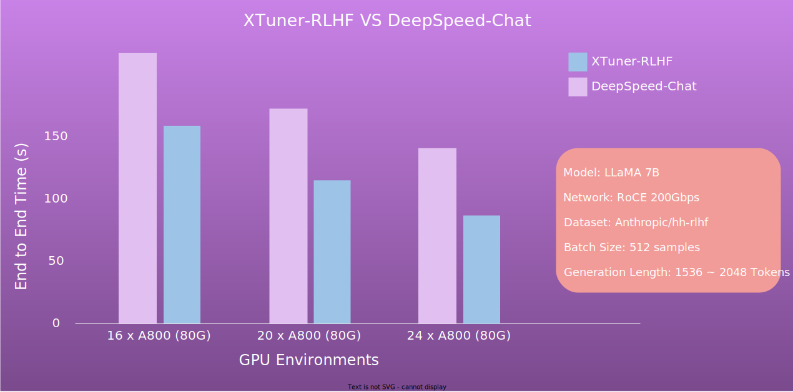

.. _xtuner_rlhf_overview:

XTuner-RLHF Overview
====================

Introduction
------------

XTuner-RLHF provides support for the last step in the RLHF process (:ref:`rlhf_intro`) - training the Actor Model using reinforcement learning algorithms, with the following advantages:

- **Dual Engine**: XTuner-RLHF allows users to choose different frameworks for training, inference, and generation. For instance, Huggingface engines can be used for training and inference, while the vLLM engine can be used for generation.

- **Ray**: XTuner-RLHF integrates Ray for distributed training, inference, and generation, offering efficient resource management and task scheduling capabilities. Users do not need to focus on the details of the underlying cluster. Whether on local clusters or the cloud, Ray can uniformly manage resources and schedule tasks, simplifying the development and deployment process.

- **Scalability**: XTuner-RLHF adopts a layered architecture design (:ref:`xtuner_rlhf_arch`), dividing the system into the engine layer, scheduling layer, and algorithm layer. This allows for easy extension of different training and inference engines and reinforcement learning algorithms.

Speed Benchmark
------------------------------------------

Quick Start
-----------

Refer to :ref:`xtuner_rlhf_quick_start`.

Future Prospects
----------------

In the future, XTuner-RLHF plans to integrate the following features:

- **Training/Inference Backend**: Support for various training and inference frameworks, such as InternEvo and LMDeploy.

- **Reinforcement Learning Environments**: Integration of multiple reinforcement learning environments beyond text dialogue, such as logical reasoning, code generation, etc.

- **Reinforcement Learning Algorithms**: Support for various reinforcement learning algorithms beyond PPO, such as KTO, and more.