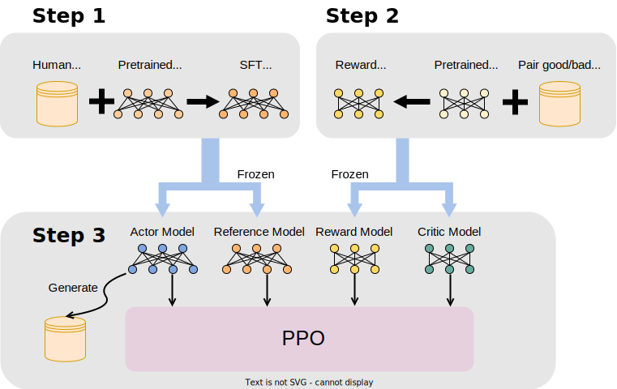

.. _rlhf_intro:

Introduction to RLHF
====================

What is RLHF?
-------------

RLHF (Reinforcement Learning with Human Feedback) is a training method that combines reinforcement learning with human feedback. By leveraging human feedback, RLHF aims to improve the performance of machine learning models, particularly in natural language processing and generation tasks.

The core idea of RLHF is to introduce human feedback as a reward signal within the traditional reinforcement learning framework to guide model training. By incorporating human feedback, RLHF can better capture and reflect user needs and preferences, thereby enhancing the practical application of the model.

Three Core Processes of RLHF
----------------------------

RLHF consists of three core processes: Supervised Fine-Tuning (SFT), training the Reward Model, and Proximal Policy Optimization (PPO), as shown in the figure below:

1. Supervised Fine-Tuning (SFT)
~~~~~~~~~~~~~~~~~~~~~~~~~~~~~~~

Supervised Fine-Tuning (SFT) is the initial stage of RLHF, aimed at fine-tuning a pre-trained model using supervised data to obtain the Actor Model. The specific steps are as follows:

- **Data Preparation**: Collect and prepare high-quality, labeled training data, which usually comes from expert annotations or extensive user interaction records.

- **Model Initialization**: Choose a pre-trained large model (such as GPT-3, BERT, etc.) as the initial model.

- **Fine-Tuning**: Use the collected supervised data to fine-tune the pre-trained model. During fine-tuning, the model gradually adjusts its parameters by minimizing the error between the predicted output and the true labels.

The goal of SFT is to enable the model to perform well on predefined tasks, providing a good initial state. The fine-tuned model serves as the Actor Model for subsequent reinforcement learning training. XTuner provides tools for fine-tuning; see the :ref:`custom_sft_dataset` section for details.

2. Training the Reward Model
~~~~~~~~~~~~~~~~~~~~~~~~~~~~

Training the Reward Model (RM) is the second core process of RLHF, aimed at establishing a reward function to evaluate the quality of model outputs based on human feedback. The specific steps are as follows:

- **Data Collection**: Collect data containing human feedback, such as comparisons or ratings of different responses generated by the model.

- **Data Processing**: Convert the collected feedback data into the format required for training the reward model, such as constructing pairs of samples with comparative advantages and disadvantages.

- **Model Training**: Use the processed feedback data to train the reward model. The reward model is usually a neural network that, by learning from feedback data, can generate a reward score for any input to evaluate output quality.

The goal of the reward model is to accurately reflect human preferences for different outputs, guiding policy optimization in the subsequent reinforcement learning phase.

3. Training the Actor Model with Reinforcement Learning Algorithms
~~~~~~~~~~~~~~~~~~~~~~~~~~~~~~~~~~~~~~~~~~~~~~~~~~~~~~~~~~~~~~~~~~

The final and most complex process of RLHF is using reinforcement learning algorithms to optimize the Actor Model obtained in the SFT stage based on human feedback. Typically, the Proximal Policy Optimization (PPO) algorithm is used, with the specific steps as follows:

- **Initialize Policy**: Use the model fine-tuned through SFT as the initial policy model, i.e., the Actor Model.

- **Sample Data**: Generate a large number of samples using the current policy, including the model outputs and their corresponding contexts.

- **Compute Rewards**: Use the trained reward model to compute reward scores for the generated sample data.

- **Policy Update**: Update the model parameters using the PPO algorithm.

The goal of PPO is to iteratively optimize the Actor Model so that its outputs not only meet task requirements but also better align with human preferences. This process involves four models:

- **Reference Model**: The model fine-tuned through SFT, which remains unchanged during the PPO process.

- **Actor Model**: Initialized as the model fine-tuned through SFT and iteratively optimized during the PPO process.

- **Reward Model**: The reward model trained based on human feedback data, providing short-term rewards for the Actor Model's outputs, and remaining unchanged during the PPO process.

- **Critic Model**: Initialized as the Reward Model, providing long-term rewards for the Actor Model's outputs, and iteratively optimized during the PPO process.

These four models involve three types of operations:

- **Training**: Training models and optimizing parameters, involving the Actor Model and Critic Model.

- **Inference**: Models obtain logits based on input token sequences, involving all four models.

- **Generation**: Models iteratively predict and output the next token based on input token sequences until the EOS Token (End of Sequence), involving the Actor Model.