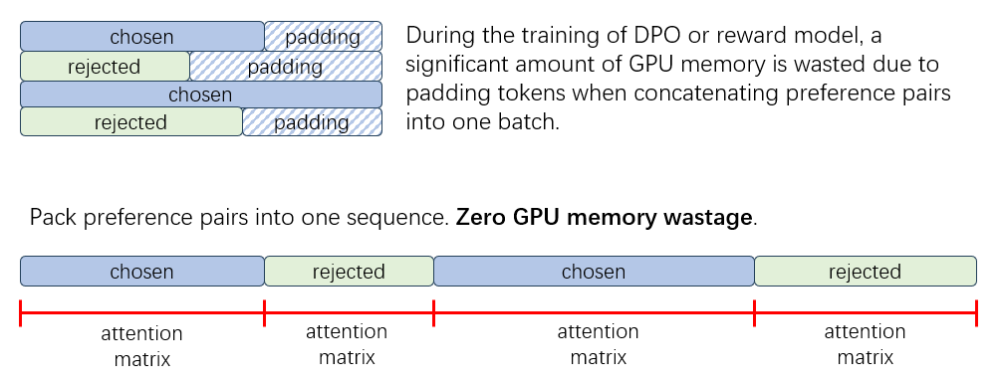

## DPO 介绍

### 简介

DPO（Direct Preference Optimization，直接偏好优化）是一种在大语言模型训练中用于直接优化模型偏好的方法。与传统的强化学习方法不同，DPO 直接使用人类偏好数据进行模型优化，从而提高生成内容的质量，使其更符合人类偏好。DPO 利用人类偏好数据，直接对模型进行优化，省略了训练 Reward Model 的训练过程，与 PPO 相比进一步省去了 Critic Model，不但避免了复杂的强化学习算法，减少了训练开销，同时还提高了训练效率。

DPO 拥有大量的衍生算法，它们对 DPO 的损失函数进行了一定程度上的改进，我们在 XTuner 中除了 DPO 还实现了[Identity Preference Optimisation (IPO)](https://huggingface.co/papers/2310.12036)，[Kahneman-Tversky Optimisation (KTO)](https://github.com/ContextualAI/HALOs)等论文中的损失函数，如需使用这些算法，请参考[修改 DPO 配置](./modify_settings.md)章节。我们也提供了一些[示例配置](https://github.com/InternLM/xtuner/tree/main/xtuner/configs/dpo)用于参考。

除了 DPO 之外，还出现了如 [ORPO](https://arxiv.org/abs/2403.07691) 等无需参考模型的对齐算法。ORPO 采用了对数比值（odds ratio）的概念来优化模型，通过在模型训练过程中惩罚那些被拒绝的样本，从而更有效地适应被选择的样本。ORPO 消除了对参考模型的依赖，使得训练过程更加简化且高效。XTuner 中 ORPO 的训练方式与 DPO 非常类似，我们提供了一些  ORPO 的[示例配置](https://github.com/InternLM/xtuner/tree/main/xtuner/configs/orpo)，用户可以参考 DPO 的教程对配置进行修改。

### XTuner 中 DPO 训练的优势

XTuner 中的 DPO 训练具备以下显著优势：

1. **支持最新的算法**：XTuner除了支持标准的 DPO 之外，还支持了大量的衍生算法，同时也支持ORPO等不依赖参考模型的高效算法。

2. **减少显存浪费**：由于偏好数据中的 chosen 和 rejected 数据通常存在长度上的差异，因此在训练数据的拼接时会存在填充（padding token）,造成显存浪费。在 XTuner 中，基于 Flash Attention2 中的[变长注意力](https://xtuner.readthedocs.io/zh-cn/latest/acceleration/varlen_flash_attn.html)功能，我们在训练过程中通过将偏好数据打包到同一个序列中，显著减少了由于 padding token 带来的显存浪费。这不仅提高了显存的利用效率，还使得在相同硬件条件下可以训练更大的模型或处理更多的数据。

3. **高效训练**：借助 XTuner 的 QLoRA 训练功能，参考模型能够被转化为移除LoRA适配器的语言模型，从而省去了参考模型权重的显存占用，大幅降低了 DPO 的训练开销。

4. **长文本训练**: 借助 XTuner 的序列并行功能，能够对长文本数据进行训练。

### 开始训练

请参阅[快速上手](./quick_start.md)来了解最基本的概念，若希望了解更多训练参数配置相关的内容，请参考[修改DPO配置](./modify_settings.md)章节。
