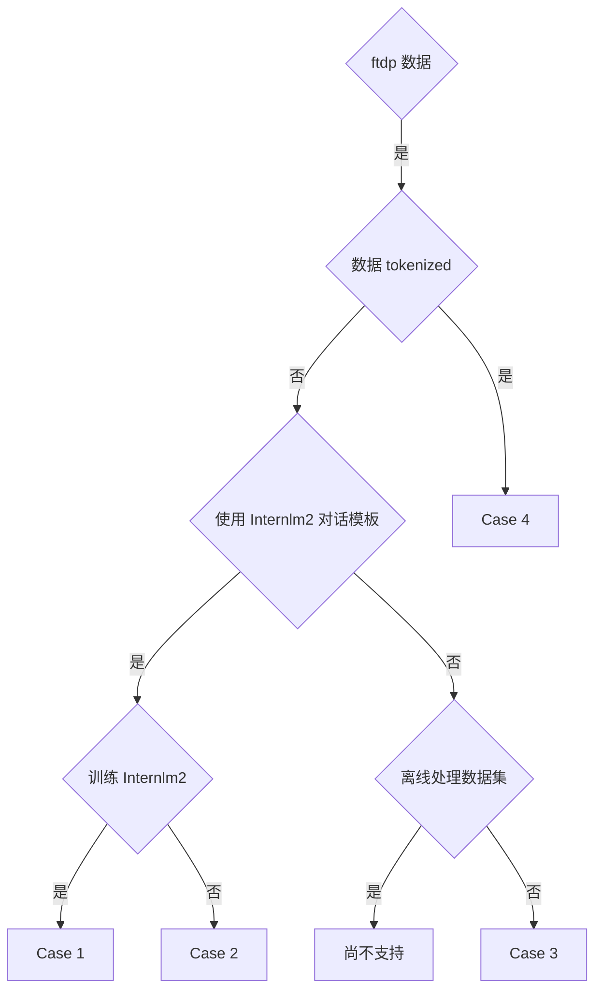

# InternEVO 训练场景

本节介绍了 4 种 InternEVO 的训练场景：

- [Case 1: 使用 Processed 数据集训练 InternLM2](Case1.rst)
- [Case 2: 使用 Processed 数据集训练非 InternLM2 模型](Case2.rst)
- [Case 3: 使用 Processed 普通对话数据集训任意模型](Case3.rst)
- [Case 4: 使用 Tokenized 数据集训练 InternLM2](Case4.rst)

请先参考下方流程图，选择自己的使用场景。其中，开源版 internlm2-chat 模型所使用的训练数据集对应流程图中的 Case 4。

