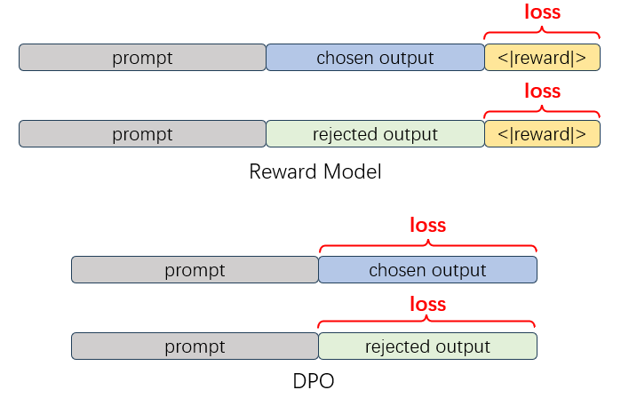

## 偏好数据集

### 简介

XTuner 的 Reward Model 与 DPO、ORPO 等依赖偏好数据的算法都采用了同样的数据格式，偏好数据集中的每一条训练样本需要包含以下三个字段：`prompt`、`chosen`、`rejected`。其中每个字段的值都使用了 [OpenAI chat message](https://platform.openai.com/docs/api-reference/chat/create) 格式。一个具体的例子如下所示：

```json
{
  "prompt": [
    {
      "role": "system",
      "content": "You are a helpful assistant."
    },
    {
      "role": "user",
      "content": "Who won the world series in 2020?"
    },
    {
      "role": "assistant",
      "content": "The Los Angeles Dodgers won the World Series in 2020."
    },
    {
      "role": "user",
      "content": "Where was it played?"
    }
  ],
  "chosen": [
    {
      "role": "assistant",
      "content": "The 2020 World Series was played at Globe Life Field in Arlington, Texas."
    }
  ],
  "rejected": [
    {
      "role": "assistant",
      "content": "I don't know."
    }
  ]
}
```

当进行 Reward Model 训练或是 DPO 训练时，xtuner 会根据训练任务类型的不同，将偏好数据集处理为不同的训练标签。



如上图所示，当进行 Reward Model 训练时，我们参考 ChatGPT 的训练方式，在对话数据的最后添加一个特殊的`<|reward|>` token，只对该 token 输出的 logits 计算损失。而当进行 DPO 系列算法的训练时，我们则会屏蔽掉 prompt 部分的 token，只对 chosen 和 rejected 的回复部分计算损失。在配置文件中，我们通过 dataset 中的 `is_reward` 和 `is_dpo` 两个字段来控制数据集的类型。

### 使用自定义数据进行训练

在理解了单个样本的数据格式之后，我们只需要将转换好的数据保存为[JSON Lines](https://jsonlines.org/)格式即可。文件中的每一行都是一个样本。

```json
{"prompt": [{"content": "How can I learn to better regulate my emotions as a grown adult?", "role": "user"}], "chosen": [{"content": "You could do emotional regulation exercises with me, and try to notice and practice ways that you could better control your emotions in real life.", "role": "assistant"}], "rejected": [{"content": "Do you mean how can you learn to be more emotionally mature?", "role": "assistant"}]}
{"prompt": [{"content": "What are some interesting things I can add to a grilled cheese sandwich?", "role": "user"}, {"content": "A tomato, a slice of pickle, some chopped pickles, some chopped green onions.  Also, some mayonnaise if you like.", "role": "assistant"}, {"content": "Sounds great. Anything else?", "role": "user"}], "chosen": [{"content": "If you’d like something a little different, I recommend grating some horseradish on top of the sandwich.", "role": "assistant"}], "rejected": [{"content": "Maybe some nice fresh basil?", "role": "assistant"}]}
{"prompt": [{"content": "How do I bob for apples?", "role": "user"}], "chosen": [{"content": "Ah!  Do you mean the game of “applesauce,” or do you mean the idea of “to bob for apples”?", "role": "assistant"}], "rejected": [{"content": "Sorry, I don’t know that term.", "role": "assistant"}]}
......
```

在准备完自定义数据集之后，你需要将你保存的数据路径填入配置文件中的 `data_files` 字段，你可以同时加载多个 jsonl 数据进行训练。

```python
#######################################################################
#                      PART 3  Dataset & Dataloader                   #
#######################################################################
train_dataset = dict(
    type=build_preference_dataset,
    dataset=dict(
        type=load_jsonl_dataset,
        data_files=[
            '/your/jsonl/path/here.jsonl',
            '/your/another/jsonl/path/here.jsonl'
        ]),
)
```

### 使用开源数据集进行训练

与 XTuner 配置 SFT 数据一样，在使用 huggingface 上的开源数据集时，我们只需要定义映射函数 map_fn，将开源数据集格式处理为 XTuner 中的数据格式即可。

这里我们以 Intel/orca_dpo_pairs 为例，该数据集有 `system`、`question`、`chosen`、`rejected` 四个字段，并且每个字段的值为 text 而非 [OpenAI chat message](https://platform.openai.com/docs/api-reference/chat/create) 格式。因此我们需要为该数据集定义一个 map_fn：

```python
def intel_orca_dpo_map_fn(example):
    prompt = [{
        'role': 'system',
        'content': example['system']
    }, {
        'role': 'user',
        'content': example['question']
    }]
    chosen = [{'role': 'assistant', 'content': example['chosen']}]
    rejected = [{'role': 'assistant', 'content': example['rejected']}]
    return {'prompt': prompt, 'chosen': chosen, 'rejected': rejected}
```

通过代码可以看到，`intel_orca_dpo_map_fn` 对原数据中的四个字段进行处理，将其转换为了 `prompt`、`chosen`、`rejected` 三个字段，并且每个字段都处理为了[OpenAI chat message](https://platform.openai.com/docs/api-reference/chat/create) 格式，确保了后续数据处理流程的统一。

完成了 map_fn 的定义之后，需要在配置文件中 import 该函数，并在 `dataset_map_fn` 字段中进行配置。

```python
train_dataset = dict(
    type=build_preference_dataset,
    dataset=dict(
        type=load_dataset,
        path='Intel/orca_dpo_pairs'),
    tokenizer=tokenizer,
    max_length=max_length,
    dataset_map_fn=intel_orca_dpo_map_fn,
)
```
