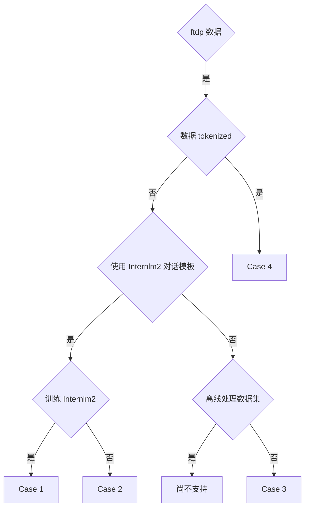

ftdp 是一个闭源的处理数据工具，开源社区用户可以忽略此文档。

本节介绍了常见的 4 种使用 ftdp 数据集训练的使用场景：

- [Case 1: 使用 Processed 数据集训练 InternLM2](Case1.md)
- [Case 2: 使用 Processed 数据集训练非 InternLM2 模型](Case2.md)
- [Case 3: 使用 Processed 普通对话数据集训任意模型](Case3.md)
- [Case 4: 使用 Tokenized 数据集训练 InternLM2](Case4.md)

请先参考下方流程图，选择自己的使用场景。

