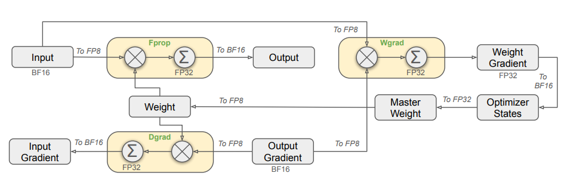

# FP8 训练

Hopper 架构的 GPU 引入了新的数据类型 FP8（8-bit floating point），可显著提升矩阵乘法的计算效率。下面将介绍如何在 XTuner 中使用 FP8 进行训练。

## 为什么选择 FP8

1. 降低通信量、提升通信速度：XTuner V1 基于 PyTorch FSDP 开发。相较 BF16，使用 FP8 通信可显著缓解 FSDP 通信量大的固有瓶颈。
2. 提升矩阵乘计算效率。
3. 节约显存：与 BF16 训练相比，FP8 训练中 Linear 和 Grouped Linear 层 PyTorch 计算图中保存的是 FP8 Tensor 而非 BF16 Tensor。可大幅降低计算图的显存开销。
4. 精度具有保证：为了避免陷入“你别管我对不对，就问你快不快”的窘境，XTuner 采用了细粒度的 FP8 量化模式，在保证训练精度的前提下优化了训练速度。

## BenchMark

并行配置 | 训练配置 | SeqLen | GlobalBatchSize | GPUNum | TimePerIter (s) | Tokens/GPU/Second
-- | -- | -- | -- | -- | -- | --
tp1, ep1, pp1 | BF16 | 65536 | 256 | 256 | 32.77 | 2000
tp1, ep1, pp1 | FP8  | 65536 | 256 | 256 | 26.75 | 2450

[profile data](https://drive.google.com/file/d/1TW-DbsUCckKJS36-5YHJo73L1Nvlpv6h/view?usp=sharing)

## 如何使用 XTuner FP8 训练

### 环境准备

首先检查 GPU 是否为 Hopper 及以上架构：

```python
import torch

print(torch.cuda.is_available() and torch.cuda.get_device_capability() >= (8, 9))
```

安装 `AdaptiveGEMM` 库：

```{code-block} shell
:caption: 安装 AdaptiveGEMM

pip install git+https://github.com/InternLM/AdaptiveGEMM.git@main
```

### 使用 XTuner 的 Linear 和 Grouped Linear 模块

```python
import torch
from xtuner.v1.float8 import TileWiseFloat8Linear, TileWiseFloat8GroupedLinear

# (bs, seq, dim)
x = torch.randn(1, 32768, 1024, device='cuda', dtype=torch.bfloat16, requires_grad=True)
linear = TileWiseFloat8Linear(in_features=1024, out_features=2048, bias=False, device='cuda', dtype=torch.bfloat16)
out = linear(x)
out.mean().backward()

x = torch.randn(1, 32768, 1024, device='cuda', dtype=torch.bfloat16)
grouped_linear = TileWiseFloat8GroupedLinear(in_features=1024, out_features=2048, num_routed_experts=4, moe_bias=False).to(dtype=torch.bfloat16, device='cuda')
tokens_per_expert = torch.tensor([1000, 4000, 6000, 32768 - 11000], device='cuda')
out = grouped_linear(x, tokens_per_expert)
out.mean().backward()
```

```{tip}
:class: margin

1. 单测 `TileWiseFloat8Linear` 与 `TileWiseFloat8GroupedLinear` 难以体现端到端的理想速度，因为对权重的量化较耗时。需结合 FSDP 才能达到最佳训练效率（可用 FP8 通信，且每个 rank 仅量化自身切片参数，使权重量化开销可忽略）。用法见下一小节。

2. 首次执行 fwd + bwd 速度较慢是正常现象，再次执行速度就会恢复正常。
```

### 使用 XTuner FP8 训练

第一步，参考 [选择模型](model-cfg) 一节构建 model_cfg 实例，并配置 float8_cfg：

```{code-block} python
:caption: 构建模型配置

from xtuner.v1.model import Qwen3Dense8BConfig
from xtuner.v1.float8.config import Float8Config, ScalingGranularity

float8_cfg = Float8Config(
    scaling_granularity_gemm=ScalingGranularity.TILEWISE,
    scaling_granularity_grouped_gemm=ScalingGranularity.TILEWISE,
)

model_cfg = Qwen3Dense8BConfig(float8_cfg=float8_cfg)
```

第二步，参考 [使用 Trainer 进行大模型微调](trainer-sft) 一节后续内容构建 `trainer`。

第三步，启动训练，完整代码如下：

````{toggle}
```diff
from xtuner.v1.model import Qwen3Dense8BConfig
from xtuner.v1.config import LRConfig, AdamWConfig
from xtuner.v1.train import Trainer
+ from xtuner.v1.float8.config import Float8Config, ScalingGranularity

+ float8_cfg = Float8Config(
+     scaling_granularity_gemm=ScalingGranularity.TILEWISE,
+     scaling_granularity_grouped_gemm=ScalingGranularity.TILEWISE,
+ )

- model_cfg = Qwen3Dense8BConfig()
+ model_cfg = Qwen3Dense8BConfig(float8_cfg=float8_cfg)
dataset_cfg = []
optim_cfg = AdamWConfig(lr=6e-05)
lr_cfg = LRConfig(lr_type="cosine", lr_min=1e-6)

load_from = "<模型路径>" # 如果是微调模式，必须指定，否则会重头训练
tokenizer = "<tokenizer 路径，通常和模型路径一致>"

trainer = Trainer(
    model_cfg=model_cfg,
    tokenizer_path=tokenizer,
    load_from=load_from,
    optim_cfg=optim_cfg,
    dataset_cfg=dataset_cfg,
    lr_cfg=lr_cfg,
)
trainer.fit()
```
````

写完上述 python 脚本后，命名为 `toy_train.py`，我们就能通过 `torchrun` 启动分布式训练了：

```{code-block} bash
:caption: 启动训练

torchrun --nproc_per_node=8 toy_train.py
```

恭喜你，已经自己实现了一个 XTuner 的 FP8 训练入口！你可以在这个脚本里尽情地发挥，定制化自己的训练参数。

## XTuner FP8 训练策略

### FP8 量化

XTuner 采用对称量化：

```python
s = absmax(x) / q_max
q = clip(x / s, q_min, q_max)
```

XTuner 支持以下三种量化粒度：Tensor-Wise, Block-Wise 和 Tile-Wise，如下图所示。相同颜色的元素共享同一个量化参数。在实际使用中，block_size 和 tile_size 一般会设置为 128。


XTuner 采用了 "just-in-time scaling" 的量化方法，该策略根据输入 Tensor 实时计算出对应的缩放因子 (scales) 。

### FP8 算子

我们基于 [DeepGemm](https://github.com/deepseek-ai/DeepGEMM/tree/3b3783d06cd4d06ac4ba048633e604151d1ee535) 扩展了以下两项与 Grouped GEMM 相关的能力（感谢 DeepSeek 团队对开源社区的贡献）：

1. 支持 Group Size M 非 128x 的情况以满足实际训练需求，细节见我们的论文 [TMA-Adaptive FP8 Grouped GEMM](https://arxiv.org/abs/2508.16584) 。
2. 支持 Grouped Linear 的 Backward 算子 Group K GEMM。

需要额外说的是，为确保性能符合预期，Group K GEMM 算子要求 Group Size K 为 128 的倍数，这对我们的 AutoGrad 涉及提出了更高的要求，详情请见下一小节。

### FP8 混合精度训练

XTuner FP8 参考了 DeepSeek V3 中的 FP8 训练策略，如下图所示。对于主要的计算密集型算子（例如 GEMM 和 Grouped GEMM），我们采用了 FP8 来加速计算。算子接受 FP8 的输入并得到 BF16 的输出。下图中三个 Linear Module 涉及到的 GEMM 计算均使用 FP8 计算，我们将其命名为 Fprop (Forward Pass), Dgrad (Activation Backward
Pass) 和 Wgrad (Weight Backward Pass)。与 BF16 相比，FP8 让 GEMM 的理论耗时减半。同时， PyTorch 计算图中只需保存 FP8 Tensor 即可完成 Backward 计算，进而节约了计算图的显存开销。



进一步地，XTuner 细化了 FP8 Linear 和 Grouped Linear 的 AutoGrad 计算逻辑。这里我们以较为复杂的 Grouped Linear 为例展开介绍。如下图所示，在 Forward 和 Backward dx 计算中，我们对激活值采用了 Tile-Wise 的量化策略，对模型权重采用了 Block-Wise 的量化策略。而在 Backward dw 计算中，为了追求性能优势，我们对 Grad Output 采用了 Tile-Wise 的量化策略，而对 Forward 的输入 X 采用了 Block-Wise 的量化策略。

图中有一个需要特殊说明的地方是，在 Backward dw 的计算中，我们对 Forward 时的输入 X 进行了 Transpose + Block-Wise FP8 Quantize + Pad to 128x + Transpose 的操作，这是因为，为了达到理想的计算效率，FP8 GEMM 算子和 Grouped GEMM 算子要求 lhs 矩阵的 layout 是 Row-Major 的，而 rhs 矩阵则是 Column-Major。同时，如上一小节所述，Group K GEMM 算子要求 Group Size K 可以被 128 整除，我们把 Transpose + Block-Wise FP8 Quantize + Pad to 128x 融合成了一个算子以提高计算效率。


