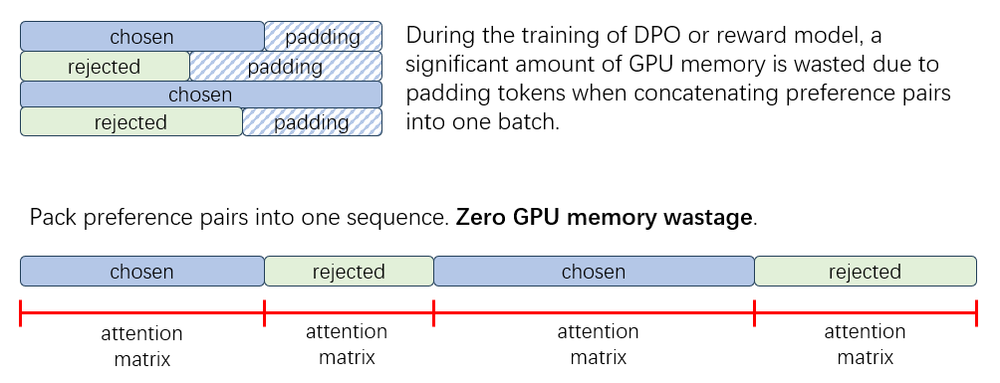

## Reward Model 介绍

### 简介

Reward Model（奖励模型）是强化学习过程中一个关键的组成部分。它的主要任务是根据给定的输入和反馈来预测奖励值，从而指导学习算法的方向。在RLHF（Reinforcement Learning from Human Feedback）中，Reward Model 通过整合人类反馈，帮助强化学习算法更有效地优化策略。

在大语言模型训练中，Reward Model 通常指的是偏好模型（Preference Model）。通过在训练时提供相同提示词的好与坏（chosen&rejected）的回复来拟合人类的偏好，并在推理时预测出一个奖励值，以指导 RLHF 过程中 Actor 模型的优化过程。

Reward Model的应用场景包括但不限于：

- **RLHF训练**：在使用 Proximal Policy Optimization（PPO）算法进行 RLHF 训练时，Reward Model提供奖励信号，指导模型优化策略，提高生成内容的质量并使其更贴近人类偏好。
- **BoN采样**：在 Best-of-N（BoN）采样过程中，用户可以使用 Reward Model 对同一个提示词的多条回复进行打分，并选择奖励得分最高的生成结果，从而提升模型的输出效果。
- **数据构造**：Reward Model 可以用于评估和过滤训练数据，或者也可以使用 Reward Model 替代人工标注来构造 DPO 训练数据。

### XTuner 中 Reward Model 训练的优势

XTuner 中的 Reward Model 训练具备以下显著优势：

1. **使用最新的训练技巧**：XTuner 中集成了 InternLM2 中的 Reward Model 训练损失函数，可以稳定奖励得分的数值范围，也可以减少在简单样本上的过拟合（具体可参考 [InternLM2 技术报告](https://arxiv.org/abs/2403.17297)）。

2. **减少显存浪费**：由于偏好数据中的 chosen 和 rejected 数据通常存在长度上的差异，因此在训练数据的拼接时会存在填充（padding token）,造成显存浪费。在 XTuner 中，基于 Flash Attention2 中的变长注意力功能，我们在训练过程中通过将偏好数据打包到同一个序列中，显著减少了由于 padding token 带来的显存浪费。这不仅提高了显存的利用效率，还使得在相同硬件条件下可以训练更大的模型或处理更多的数据。

3. **高效训练**：借助 XTuner 的 QLoRA 训练功能，我们能够仅对 Reward Model 的 Value Head 进行全参数训练，而对语言模型本身使用 QLoRA 微调，大幅降低了模型训练的显存开销。

4. **长文本训练**: 借助 XTuner 的序列并行功能，能够对长文本数据进行训练。

### 开始训练

请参[阅快速上手](./quick_start.md)来了解最基本的概念，若希望了解更多训练参数配置相关的内容，请参考[修改Reward Model配置](./modify_settings.md)章节。

### 开源模型

我们使用 XTuner 训练了 InternLM2 技术报告中的 Reward Model，欢迎下载使用：

| Model                     | Transformers(HF)                                                                 | ModelScope(HF)                                                                                             | OpenXLab(HF)                                                                                                                                                | RewardBench Score |
| ------------------------- | -------------------------------------------------------------------------------- | ---------------------------------------------------------------------------------------------------------- | ----------------------------------------------------------------------------------------------------------------------------------------------------------- | ----------------- |
| **InternLM2-1.8B-Reward** | [🤗internlm2-1_8b-reward](https://huggingface.co/internlm/internlm2-1_8b-reward) | [internlm2-1_8b-reward](https://modelscope.cn/models/Shanghai_AI_Laboratory/internlm2-1_8b-reward/summary) |  | 80.6              |
| **InternLM2-7B-Reward**   | [🤗internlm2-7b-reward](https://huggingface.co/internlm/internlm2-7b-reward)     | [internlm2-7b-reward](https://modelscope.cn/models/Shanghai_AI_Laboratory/internlm2-7b-reward/summary)     |    | 86.6              |
| **InternLM2-20B-Reward**  | [🤗internlm2-20b-reward](https://huggingface.co/internlm/internlm2-20b-reward)   | [internlm2-20b-reward](https://modelscope.cn/models/Shanghai_AI_Laboratory/internlm2-20b-reward/summary)   |   | 89.5              |
