.. _xtuner_rlhf_arch:

系统架构
-------------

XTuner-RLHF 模块的架构如图所示：

算法层
~~~~~~~~~~~~~

算法层实现不同的强化学习算法和环境，即具体的训练策略和应用场景。包括 PPO、DPO 等各种强化学习算法，以及 Q&A（问答）、LR（逻辑推理）等不同的任务环境。

调度层
~~~~~~~~~~~~~

中间的调度层向上层算法提供模型级别操作接口，简化与底层引擎的交互，同时向下适配不同的训练框架和模型，负责多模型资源的统筹和调度，确保系统高效运行。

引擎层
~~~~~~~~~~~~~

引擎层对训练、推理和生成进行了解耦，支持用户选用不同的引擎进行训练、推理和生成，比如可选用 transformers 进行训练和推理，选用 vLLM 进行生成。多引擎设计的优点在于：

**灵活性和适应性**：不同的项目可能有不同的需求和限制。集成多个框架可以让用户根据具体情况选择最合适的工具，提升开发效率和效果。

**性能优化**：不同框架在不同类型的任务上可能有不同的性能表现。用户可以选择在特定任务上表现最优的框架，以达到最佳性能。

**跨平台兼容性**：某些框架在特定平台上表现更好，或仅支持特定的硬件。提供多个框架选择可以确保在不同平台和硬件上的兼容性和优化。

**易用性**：一些框架可能更加用户友好，适合快速原型开发；而另一些框架可能更适合大规模部署。用户可以根据开发阶段选择合适的框架。

分布式框架 Ray
~~~~~~~~~~~~~~~

作为 InternLM 内部孵化的项目，RLHF 系统自 2023 年 5 月项目伊始，就采用了 Ray 作为分布式框架来进行高效的训练、推理和生成，使系统具备了以下特点：

**屏蔽底层集群差异**：Ray 提供了计算集群的抽象，使得用户无需关注底层真实集群的实现细节：无论是本地 Kubernetes 或 Slurm 集群，抑或是云端资源，Ray 都能统一管理和调度任务，从而简化开发和部署流程。

**高效的资源管理**：可以动态调整计算资源的分配，根据任务的需求灵活调度 CPU、GPU 等资源，确保高效利用计算资源，提升系统整体性能。

**扩展性强**：可以方便地扩展到大规模集群，支持数百乃至数千个节点。这使得系统可以根据需求进行水平扩展，满足大规模数据处理和计算的需求。

**灵活的任务调度**：可以根据任务的优先级和资源需求进行灵活调度，优化任务执行顺序，减少任务的等待时间，提高系统吞吐量。

**自动化故障恢复**：Ray 内置了一定的容错机制，能够检测并尝试恢复失败的任务，提升了系统的稳定性和可靠性，减少了人为干预的需要。

致谢
~~~~~~~~~~~~~

在探索和实现 RLHF 系统的旅途中，我们有幸见证了众多杰出的开源项目，它们如同璀璨的星辰，照亮了我们前行的道路。举例来说：

- `ColossalChat <https://github.com/hpcaitech/ColossalAI/tree/main/applications/ColossalChat/coati/ray#detach-experience-makers-and-trainers>`_：巧妙地运用了 Ray 来实现分布式 PPO，将 trainer 和 experience makers 分布于不同的节点，提升了计算效率。
- `ATorch <https://github.com/intelligent-machine-learning/dlrover/tree/master/atorch>`_：采用“训练-推理解耦 + 高性能推理后端”的创新设计，兼容开源 vLLM 引擎作为推理后端，支持了千亿模型高效指令微调。
- `OpenRLHF <https://github.com/OpenLLMAI/OpenRLHF>`_：一个简单易用、富有开源精神的 RLHF 训练框架，基于 Ray、DeepSpeed、vLLM 和 HF Transformers 等开源项目，实现了高性能的 PPO 等算法。

我们对开源社区的开发者们怀有深深的敬意和感激。他们不仅分享了宝贵的知识和经验，更以开放的心态，促进了大模型 RLHF 系统生态的繁荣与发展。我们相信，正是这种无私的分享精神，让我们的社区更加强大，也让技术的进步更加迅速。再次感谢每一位贡献者，是你们的努力让这个世界变得更加美好。