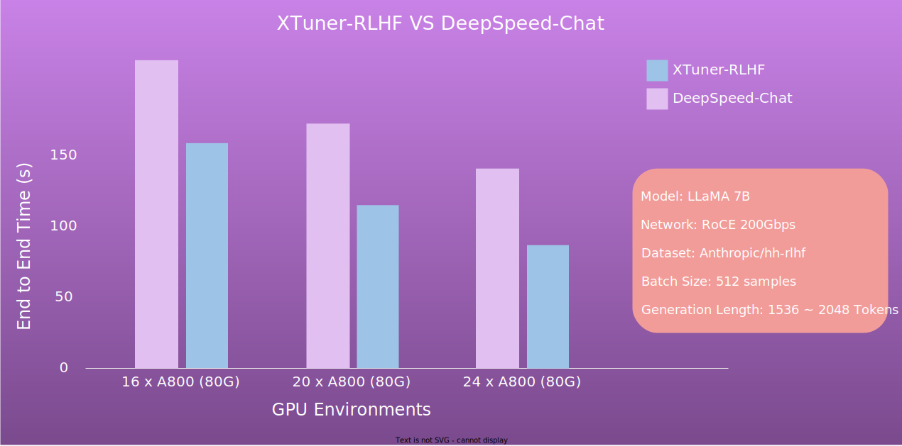

.. _xtuner_rlhf_overview:

XTuner-RLHF 总览
============

简介
------------

XTuner-RLHF 模块提供了对 RLHF 流程（:ref:`rlhf_intro`）中最后一个步骤 —— 使用强化学习算法训练 Actor Model —— 的支持，具有以下优势：

- **双引擎**：XTuner-RLHF 支持用户选择不同的框架进行训练、推理和生成，比如可选用 Huggingface 引擎进行训练和推理，选用 vLLM 引擎进行生成。

- **Ray**：XTuner-RLHF 集成了 Ray 来进行分布式训练、推理和生成，提供了高效的资源管理和任务调度功能，用户无需关注底层集群细节，无论是在本地集群还是云端，Ray 都能统一管理资源、调度任务，从而简化开发和部署流程。

- **可扩展性**：XTuner-RLHF 采用分层架构设计（:ref:`xtuner_rlhf_arch`），整个系统分为引擎层、调度层和算法层，可以方便地扩展不同的训练推理引擎和强化学习算法。

与 DeepSpeed-Chat 性能对比
------------

快速上手
------------

参见 :ref:`xtuner_rlhf_quick_start`。

未来展望
-------------

未来，XTuner-RLHF 计划集成以下功能：

- **训练/推理后端**：支持多种训练推理框架，如 InternEvo 和 LMDeploy。

- **强化学习环境**：除文本对话外，集成多种强化学习环境，如逻辑推理、代码生成等。

- **强化学习算法**：除 PPO 外，支持各种强化算法，如KTO等。