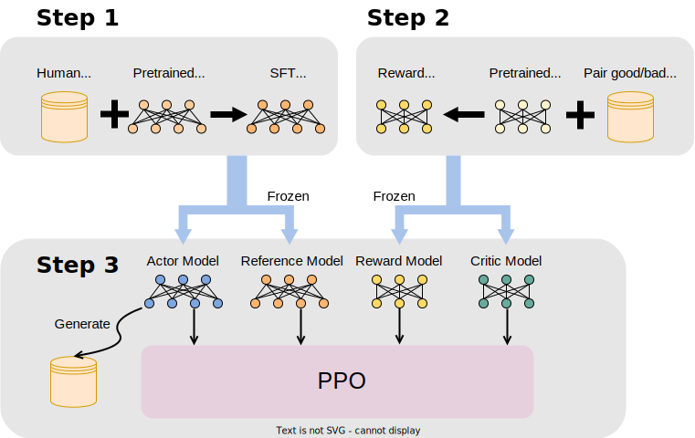

.. _rlhf_intro:

RLHF 介绍
============

什么是 RLHF ？
------------

RLHF（Reinforcement Learning with Human Feedback）是一种结合了强化学习和人类反馈的训练方法。通过利用人类反馈，RLHF 旨在改进机器学习模型的性能，特别是在自然语言处理和生成任务中的表现。

RLHF 的核心思想是在传统的强化学习框架中引入人类反馈作为奖励信号，以此来指导模型的训练。通过引入人类反馈，RLHF 能够更好地捕捉和反映用户的需求和偏好，从而提高模型的实际应用效果。

RLHF 的三个核心流程
------------

RLHF 包含三个核心流程：监督微调（SFT）、训练奖励模型、近端策略优化（PPO），如下图所示：

1. 监督微调（SFT）
~~~~~~~~~~~~~

监督微调（Supervised Fine-Tuning, SFT）是 RLHF 的初始阶段，其目的是通过有监督的数据对预训练模型进行微调，得到 Actor Model。具体步骤如下：

- **数据准备**：收集和准备高质量的、有标签的训练数据，这些数据通常来自专家标注或大量用户交互记录。

- **模型初始化**：选择一个预训练的大模型（如 GPT-3、BERT 等）作为初始模型。

- **微调训练**：使用收集到的有监督数据，对预训练模型进行微调。微调过程中，模型通过最小化预测输出与真实标签之间的误差，逐步调整参数。

SFT 的目标是使模型能够在预定义的任务上表现良好，提供一个良好的初始状态，微调后的模型作为 Actor Model 参与后续的强化学习训练。XTuner提供了微调的配套工具，具体用法可见 :ref:`custom_sft_dataset` 一节。

2. 训练奖励模型
~~~~~~~~~~~~~

奖励模型（Reward Model, RM）的训练是 RLHF 的第二个核心流程，其目的是通过人类反馈来建立一个用于评价模型输出质量的奖励函数。具体步骤如下：

- **数据收集**：收集包含人类反馈的数据，这些反馈可以是对模型生成的不同响应的比较、评分等。

- **数据处理**：将收集到的反馈数据转换为训练奖励模型所需的格式，例如，构建包含优劣对比的样本对。

- **模型训练**：使用处理后的反馈数据训练奖励模型。奖励模型通常是一个神经网络，它通过学习反馈数据，能够为任意输入生成一个奖励分数，用以评价输出质量。

奖励模型的目标是准确反映人类对不同输出的偏好，从而在后续的强化学习阶段指导策略优化。

3. 使用强化学习算法训练 Actor Model
~~~~~~~~~~~~~

RLHF 的最后一个流程，也是最复杂的流程，是使用强化学习算法，通过人类反馈优化 SFT 阶段得到的 Actor Model。一般采用近端策略优化（Proximal Policy Optimization，PPO）算法，具体步骤如下：

- **初始化策略**：使用经过 SFT 微调后的模型作为初始策略模型，即 Actor Model。

- **采样数据**：通过当前策略生成大量的样本数据，这些数据包括模型的输出及其对应的上下文。

- **计算奖励**：使用训练好的奖励模型为生成的样本数据计算奖励分数。

- **策略更新**：使用 PPO 算法更新模型参数。

PPO 的目标是通过多轮迭代训练，不断优化 Actor Model，使其生成的输出不仅符合任务要求，还能够更好地满足人类偏好，这个过程涉及到四个模型，分别是：

- **Reference Model**：经过 SFT 微调后的模型，在 PPO 过程中保持不变。

- **Actor Model**：初始化为 SFT 微调后的模型，在 PPO 过程中会进行迭代优化。

- **Reward Model**：基于人类反馈数据训练得到的奖励模型，对 Actor Model 的输出给出短期奖励，在 PPO 过程中保持不变。

- **Critic Model**：初始化为 Reward Model，对 Actor Model 的输出给出长期奖励，在 PPO 过程中会进行迭代优化。

这四个模型涉及三种操作，分别是：

- **训练**：训练模型，优化参数，Actor Model 和 Critic Model 涉及此操作。

- **推理**：模型根据输入 Token 序列得到 Logits，四个模型均涉及此操作。

- **生成**：模型根据输入 Token 序列迭代预测并输出下一个 token，直到 EOS Token（End of Sequence），Actor Model 涉及此操作。