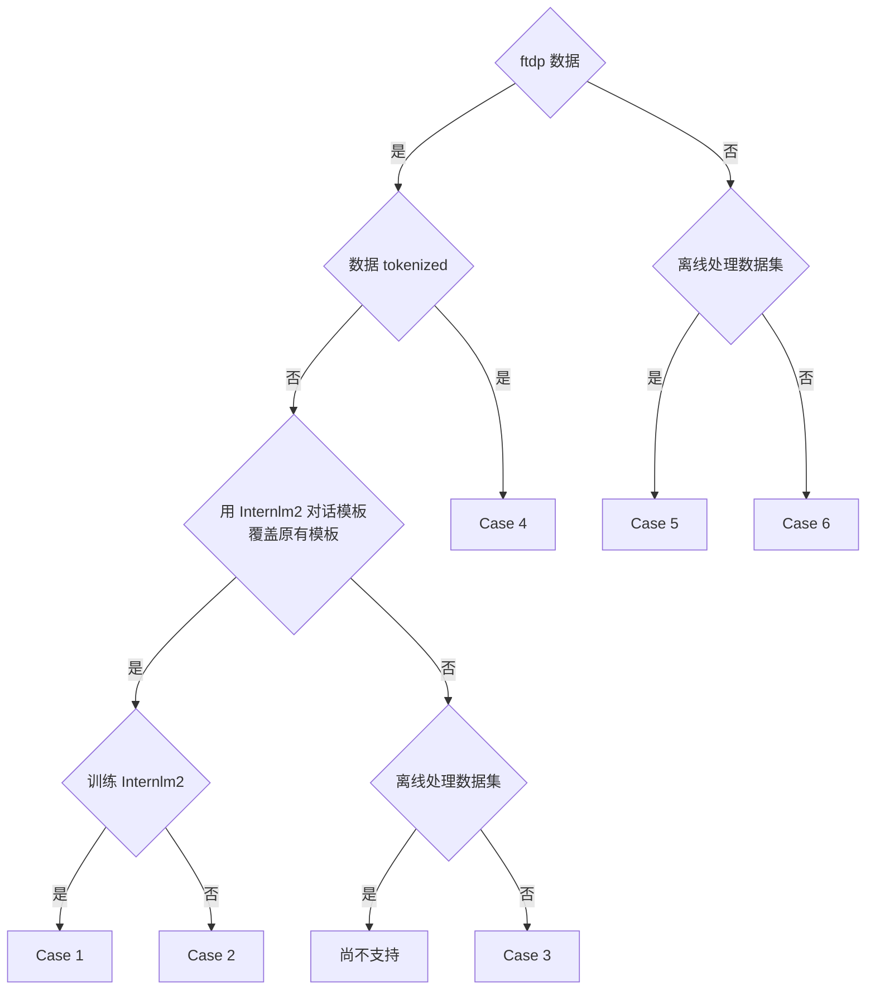

本文介绍了常见的 6 种使用场景：

- [Case 1](Case1.md)
- [Case 2](#case-2)
- [Case 3](#case-3)
- [Case 4](#case-4)
- [Case 5](#case-5)
- [Case 6](#case-6)

请先参考下方流程图，选择自己的使用场景。

```mermaid
graph TD;
    A{ftdp 数据}
    A -->|是| B{数据 tokenized}
    B -->|否| C{"用 Internlm2 对话模板
覆盖原有模板"}
    C -->|是| D{训练 Internlm2 }
    D -->|是| E[Case 1]
    D -->|否| F[Case 2]
    C -->|否| G{离线处理数据集}
    G -->|是| H[尚不支持]
    G -->|否| I[Case 3]
    B -->|是| J[Case 4]
    A -->|否| K{离线处理数据集}
    K -->|是| L[Case 5]
    K -->|否| M[Case 6]
```
