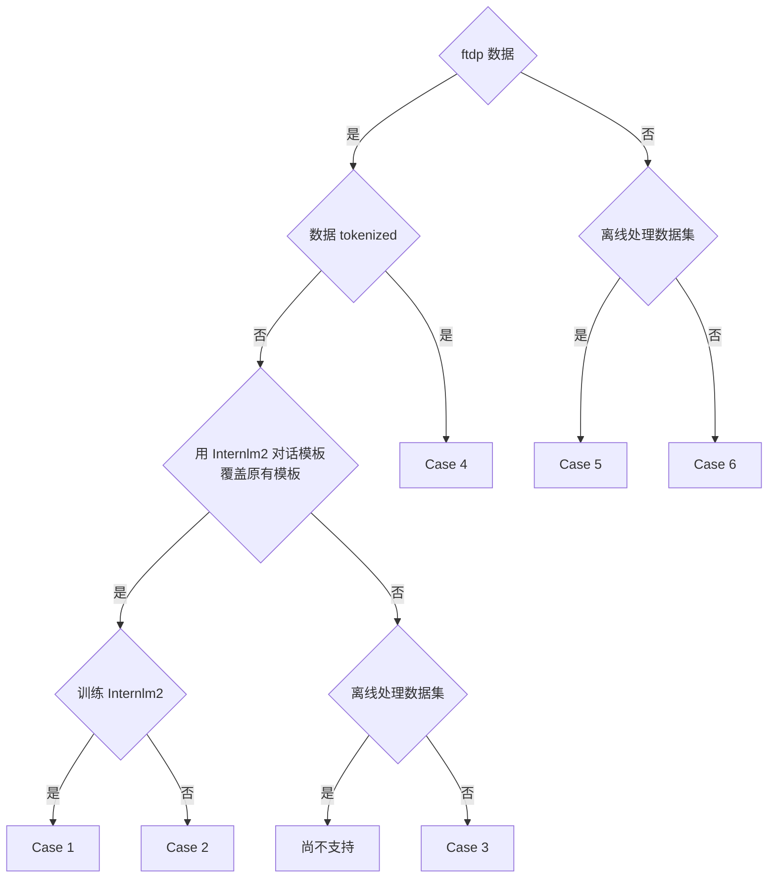

本文介绍了常见的 6 种使用场景：

- [Case 1](#case-1)
- [Case 2](#case-2)
- [Case 3](#case-3)
- [Case 4](#case-4)
- [Case 5](#case-5)
- [Case 6](#case-6)

请先参考下方流程图，选择自己的使用场景。



# Case 1

使用尚未 token 化的 ftdp 数据训练 Internlm2 模型的场景。

## Step 1, 离线处理数据集

ftdp 把 sft 任务的数据处理划分为三个类型，原始数据（origin）、预处理数据（processed）和 token 过的数据（tokenized）。使用以下命令可离线 token 化 ftdp 格式的预处理数据（processed）数据集：

```
python xtuner/tools/tokenize_ftdp_datasets.py \
    --processed-dir /path/to/preprocessed/data \
    --tokenized-dir /path/to/tokenized/data \
    --tokenizer-path pretrained_model_name_or_path
```

上述命令中：

1. `--processed-dir` 需要指定预处理后的，具有 ftdp 标准格式的数据路径；
2. `--tokenized-dir` 需要指定为 token 化后的数据存储路径；
3. `--tokenizer-path pretrained_model_name_or_path` 中的 `pretrained_model_name_or_path` 同 `from_pretrained` 接口中的 `pretrained_model_name_or_path`。

上述命令执行成功后，会在 `/path/to/tokenized/data/chatml_llamav13_32k` 路径下保存两个子文件夹——`train` 和 `valid`。

## Step 2, 导出模板 config 文件

XTuner 中目前提供了训练 Internlm2 的模板 config，使用命令：

```
xtuner copy-cfg internlm2_7b_w_tokenized_dataset .
```

可将训练 Internlm2 的模板 config 导出至当前目录下。

## Step 3, 修改模板 config 文件

修改模板 config 文件中的训练数据路径为真实数据路径，其中 `/path/to/tokenized/data` 与 Step 1 中的 `/path/to/tokenized/data` 为同一个路径：

```diff
...

#######################################################################
#                          PART 1  Settings                           #
#######################################################################
# Model
pretrained_model_name_or_path = 'internlm/internlm2-7b'
use_varlen_attn = True

# Data
- dataset_folder = '/path/to/sft/data/folder'
+ dataset_folder = '/path/to/tokenized/data/chatml_llamav13_32k/train'
prompt_template = PROMPT_TEMPLATE.internlm2_chat
max_length = 32768
pack_to_max_length = True
...
```

在使用 DeepSpeed 训练模型时，如需在保存 checkpoint 时只保存模型权重，而不保存优化器状态，可参考以下步骤：

1. 确保 mmengine 版本大于等于 0.10.3

```
pip install 'mmengine>=0.10.3'
```

2. 修改 Config 文件，CheckpointHook 增加 save_optimizer=False

```diff
default_hooks = dict(
    # record the time of every iteration.
    timer=dict(type=IterTimerHook),
    # print log every 100 iterations.
    logger=dict(type=LoggerHook, interval=1),
    # enable the parameter scheduler.
    param_scheduler=dict(type=ParamSchedulerHook),
    # save checkpoint per epoch.
   checkpoint=dict(
        type=CheckpointHook,
+       save_optimizer=False,
        by_epoch=False,
        interval=save_steps,
        max_keep_ckpts=save_total_limit),
    # set sampler seed in distributed evrionment.
    sampler_seed=dict(type=DistSamplerSeedHook),
)
```

需要注意，经过以上设置后，训练过程不可 resume 。

## Step 4, 获取数据顺序 （可选）

运行下面的代码可获取数据顺序，并存为 txt 文件：

```
python xtuner/tools/get_data_order.py \
    --data-folder /path/to/tokenized/data \
    --save-folder /folder/to/save/data/order \
    --file-type ${file_type}
```

其中，`--file-type ${file_type}` 表示需要统计所有以 `${file_type}` 为文件名后缀的文件的顺序。

例如，需要获取 `/path/to/tokenized/data` 路径下所有以 `.bin` 结尾的文件的顺序，并保存在当前路径下，那么上述命令需要改为：

```
python xtuner/tools/get_data_order.py \
    --data-folder /path/to/tokenized/data \
    --save-folder . \
    --file-type .bin
```

同时，需要进一步修改 Step 2 中的 Config 文件，并设置数据顺序文件路径：

```diff
...
#######################################################################
#                      PART 3  Dataset & Dataloader                   #
#######################################################################
train_dataset = dict(
    type=build_packed_dataset,
    dataset_cfg=dict(
        type=load_intern_repo_tokenized_dataset,
-       data_order_path=None,
+       data_order_path='/folder/to/save/data/order/'+'data_order.txt',
        folder=dataset_folder,
        min_length=0,
        file_type='.bin'
    ),
    packed_length=max_length,
    seed=1024)
```

## Step 5, 启动训练

在 slurm 集群调度系统中可以通过以下命令启动训练：

```
srun ${SRUN_ARGS} xtuner train internlm2_7b_w_tokenized_dataset_copy.py --launcher slurm --deepspeed deepspeed_zero1
```

在阿里云 DLC 中可通过以下命令启动训练：

```diff
export NCCL_IB_TC=136
export NCCL_IB_SL=5
export NCCL_IB_GID_INDEX=3
export NCCL_SOCKET_IFNAME=bond0
export NCCL_DEBUG=INFO
export NCCL_IB_HCA=mlx5
export NCCL_IB_TIMEOUT=22
export NCCL_IB_QPS_PER_CONNECTION=8
export NCCL_NET_PLUGIN=none

export NCCL_BUFFSIZE=2097152
export PYTORCH_CUDA_ALLOC_CONF=max_split_size_mb:512
- export EXP_NAME=debug
+ export EXP_NAME=your_exp_name
export PYTHONPATH='.':$PYTHONPATH
source ~/.bashrc
+ cd /path/to/xtuner
+ conda activate conda_env_name

export NPROC_PER_NODE=${KUBERNETES_CONTAINER_RESOURCE_GPU}
export PORT=${MASTER_PORT}
export NNODES=${WORLD_SIZE}
export NODE_RANK=${RANK}
export ADDR=${MASTER_ADDR}

echo ${KUBERNETES_CONTAINER_RESOURCE_GPU}
echo ${WORLD_SIZE}
echo ${MASTER_PORT}
echo ${MASTER_ADDR}
echo ${RANK}
xtuner train internlm2_7b_w_tokenized_dataset_copy.py \
    --deepspeed deepspeed_zero1 \
    --work-dir work_dirs/${EXP_NAME}

```

## Step 6, 转模型

deepspeed 转 hf：

```
python xtuner/tools/model_converters/pth_to_hf.py internlm2_7b_w_tokenized_dataset_copy.py /src/model/path /hf/dst/model/path
```

hf 转 Turbomind：

```
lmdeploy convert internlm2-chat-7b /hf/dst/model/path --dst-path /turbomind/dst/model/path
```

## Step 7，Turbomind 评测

评测前需要按照[Opencompass 使用文档](https://aicarrier.feishu.cn/wiki/PR28wWg3tiY2xCkuysccRBNenIf#RNcbdEVZ9oulPQxFz9gcOxwjnff)准备环境。

使用内部版 Opencompass 的 ca949db74502a68c8a900afdf751c584fb7c7655 这个 commit id 进行评测。在 `configs/sft_cfg/7B/Ampere_chatml_v053/` 目录下添加如下 config ：

```diff
import os.path as osp
from copy import deepcopy

from mmengine.config import read_base

with read_base():
    # datasets
    from ...dataset_collections.medium_chat_sft_v053 import \
        base_datasets, longtext_datasets, math_agent_datasets, cibench_datasets, plugin_eval_datasets
    # summarizer
    from ...summarizers.medium_chat_sft_v053 import summarizer
    # clusters
    from ...clusters.slurm_llmit2 import infer, eval
    # lark robot
    from ...lark import lark_bot_url
    # base models cfg
    from .base_model.base_model_turbomind import base_model_cfg, base_longtext_model_cfg, base_agent_llm_cfg, base_math_agent_cfg, \
        base_cibench_agent_cfg, base_plugin_eval_model_cfg

# ------------------ change here ↓ ------------------
models_path = [
+     '/path/to/turbomind_model'
]

# users can set `auto`, `spot`, or `reserved`. Defaults to `auto`.
infer['runner']['quotatype'] = 'auto'
infer['runner']['max_num_workers'] = 32
infer['runner']['partition'] = 'llmit2'

eval['runner']['quotatype'] = 'auto'
eval['runner']['max_num_workers'] = 64
eval['runner']['partition'] = 'llmit2'
# ------------------ change end ------------------

# ------------------ default settings ↓ ------------------
# careful to change the following settings

# add different eval models
base_models = []
longtext_models = []
math_agent_models = []
cibench_agent_models = []
plugin_eval_models = []
for model_path in models_path:
    if model_path.endswith('/'):
        model_path = model_path[:-1]
    abbr = osp.split(osp.split(model_path)[0])[-1]
    ckpt_iter = osp.split(model_path)[-1]

    summarizer_abbr = f"{abbr}@{ckpt_iter}"

    tmp_base_model_cfg = deepcopy(base_model_cfg)
    tmp_base_model_cfg['abbr'] = f"{abbr}@{ckpt_iter}"
    tmp_base_model_cfg['summarizer_abbr'] = summarizer_abbr
    tmp_base_model_cfg['path'] = model_path

    # process base model
    base_models.append(tmp_base_model_cfg)

    # process longtext model
    tmp_longtext_model_cfg = deepcopy(base_longtext_model_cfg)
    tmp_longtext_model_cfg['abbr'] = f"{abbr}@{ckpt_iter}-longtext"
    tmp_longtext_model_cfg['summarizer_abbr'] = summarizer_abbr
    tmp_longtext_model_cfg['path'] = model_path
    longtext_models.append(tmp_longtext_model_cfg)

    # set agent model cfg
    tmp_agent_llm_cfg = deepcopy(base_agent_llm_cfg)
    tmp_agent_llm_cfg['path'] = model_path

    # process math agent model
    tmp_math_agent_cfg = deepcopy(base_math_agent_cfg)
    tmp_math_agent_cfg['abbr'] = f"{abbr}@{ckpt_iter}-math-react"
    tmp_math_agent_cfg['summarizer_abbr'] = summarizer_abbr
    tmp_math_agent_cfg['llm'] = tmp_agent_llm_cfg
    math_agent_models.append(tmp_math_agent_cfg)

    # process cibench agent model
    tmp_cibench_agent_cfg = deepcopy(base_cibench_agent_cfg)
    tmp_cibench_agent_cfg['abbr'] = f"{abbr}@{ckpt_iter}-cibench-react"
    tmp_cibench_agent_cfg['summarizer_abbr'] = summarizer_abbr
    tmp_cibench_agent_cfg['llm'] = tmp_agent_llm_cfg
    cibench_agent_models.append(tmp_cibench_agent_cfg)

    # process plugin eval model
    tmp_plugin_eval_model_cfg = deepcopy(base_plugin_eval_model_cfg)
    tmp_plugin_eval_model_cfg['abbr'] = f"{abbr}@{ckpt_iter}-plugin-eval"
    tmp_plugin_eval_model_cfg['summarizer_abbr'] = summarizer_abbr
    tmp_plugin_eval_model_cfg['path'] = model_path
    plugin_eval_models.append(tmp_plugin_eval_model_cfg)

del tmp_base_model_cfg, tmp_longtext_model_cfg, tmp_agent_llm_cfg, \
    tmp_math_agent_cfg, tmp_cibench_agent_cfg, tmp_plugin_eval_model_cfg

# set all models
model_dataset_combinations = []
models = []
datasets = []

# The agent test is relatively slow, so they placed first.
# process longtext datasets
model_dataset_combinations.append(dict(models=longtext_models, datasets=longtext_datasets))
models.extend(longtext_models)
datasets.extend(longtext_datasets)
# process math agent datasets
model_dataset_combinations.append(dict(models=math_agent_models, datasets=math_agent_datasets))
models.extend(math_agent_models)
datasets.extend(math_agent_datasets)
# process cibench agent datasets
model_dataset_combinations.append(dict(models=cibench_agent_models, datasets=cibench_datasets))
models.extend(cibench_agent_models)
datasets.extend(cibench_datasets)
# process plugin eval datasets
model_dataset_combinations.append(dict(models=plugin_eval_models, datasets=plugin_eval_datasets))
models.extend(plugin_eval_models)
datasets.extend(plugin_eval_datasets)

# process base datasets
model_dataset_combinations.append(dict(models=base_models, datasets=base_datasets))
models.extend(base_models)
datasets.extend(base_datasets)

# ------------------ default settings end ------------------

```

# Case 2

使用尚未 token 化的 ftdp 数据训练其他模型（以 Mistral 为例），且需要用 Internlm2 对话模板覆盖原有对话模板以便让模型掌握 agent 、tool 能力。

## Step 1, 离线处理数据集

ftdp 把 sft 任务的数据处理划分为三个类型，原始数据（origin）、预处理数据（processed）和 token 过的数据（tokenized）。使用以下命令可离线 token 化 ftdp 格式的预处理数据（processed）数据集：

```
python xtuner/tools/tokenize_ftdp_datasets.py \
    --processed-dir /path/to/preprocessed/data \
    --tokenized-dir /path/to/tokenized/data \
    --tokenizer-path pretrained_model_name_or_path \
    --tokenizer-w-special-tokens-save-dir /path/to/save/new/tokenizer
```

上述命令中：

1. `--processed-dir` 需要指定预处理后的，具有 ftdp 标准格式的数据路径（同 Case 1）；
2. `--tokenized-dir` 需要指定为 token 化后的数据存储路径（同 Case 1）；
3. `--tokenizer-path pretrained_model_name_or_path` 中的 `pretrained_model_name_or_path` 同 `from_pretrained` 接口中的 `pretrained_model_name_or_path`（同 Case 1）；
4. 由于除 Internlm2 外的其他模型（如 mistral 等）没有 internlm2-chat 模型的智能体、工具调用等功能的对话模板，因此对于非 internlm2 模型，需要将 internlm2-chat 对话模板中的一些特殊字符（如：\<|im_start|>、\<|plugin|>等）加入到新模型的 tokenizer 的 special tokens 中，需要通过 `--tokenizer-w-special-tokens-save-dir` 指定新 tokenizer 的存储路径。**同时，后续训练过程需要使用新保存的 tokenizer 而非原始 tokenizer。**

## Step 2, 导出模板 config 文件

XTuner 中目前提供了训练 Mistral 的模板 config，使用命令：

```
xtuner copy-cfg mistral_7b_w_tokenized_dataset .
```

可将训练 Mistral 的模板 config 导出至当前目录下。

## Step 3, 修改模板 config 文件

修改模板 config 文件中的训练数据路径为真实数据路径，其中 `/path/to/tokenized/data` 与 Step 1 中的 `/path/to/tokenized/data` 为同一个路径。同时，需要修改 tokenizer 路径为 Step 1 保存的路径 `/path/to/save/new/tokenizer`。

```diff
...

#######################################################################
#                          PART 1  Settings                           #
#######################################################################
# Model
pretrained_model_name_or_path = 'mistralai/Mistral-7B-v0.1'
# 已经使用 Internlm2 的对话模板覆盖了 Mistral 的原有模板，new tokenizer 中已经
# 添加了 Internlm2 对话模板中的特殊字符。
# 请参考 docs/zh_cn/user_guides/finetune_custom_dataset.md
- tokenizer_path = '/new/tokenizer/path'
+ tokenizer_path = '/path/to/save/new/tokenizer'
use_varlen_attn = True

# Data
- dataset_folder = '/path/to/sft/data/folder'
+ dataset_folder = '/path/to/tokenized/data/chatml_llamav13_32k/train'
# 已经使用 Internlm2 的对话模板覆盖了 Mistral 的原有模板
prompt_template = PROMPT_TEMPLATE.internlm2_chat
max_length = 32768
pack_to_max_length = True
...
```

## Step 4, 5, 6, 7, 同 Case 1

注：训练前期（几十个 iters）loss 偏高是正常现象，因为模型需要时间学习 Internlm2 的对话模板。

# Case 3

使用尚未 token 化的 ftdp 数据进行训练，保持待训练模型的对话模板不变，且不需要进行离线处理的场景。

## Step 1, 导出模板 config 文件

XTuner 中目前提供了训练 Internlm2 的模板 config，使用命令：

```
xtuner copy-cfg internlm2_7b_w_untokenized_dataset .
```

可将训练 Internlm2 的模板 config 导出至当前目录下。

## Step 2, 修改模板 config 文件

修改模板 config 文件中的训练数据路径为真实数据路径：

```diff
...

#######################################################################
#                          PART 1  Settings                           #
#######################################################################
# Model
pretrained_model_name_or_path = 'internlm/internlm2-7b'
use_varlen_attn = True

# Data
- dataset_folder = '/mnt/petrelfs/share_data/caoweihan/v1_sample_with_legal_cate'
+ dataset_folder = '/path/to/untokenized/data'
prompt_template = PROMPT_TEMPLATE.internlm2_chat
max_length = 32768
pack_to_max_length = True
...
```

## Step 3, 获取数据顺序 （可选）

运行下面的代码可获取数据顺序，并存为 txt 文件：

```
python xtuner/tools/get_data_order.py \
    --data-folder /path/to/untokenized/data \
    --save-folder /folder/to/save/data/order \
    --file-type ${file_type}
```

其中，`--file-type ${file_type}` 表示需要统计所有以 `${file_type}` 为文件名后缀的文件的顺序。

例如，需要获取 `/path/to/untokenized/data` 路径下所有以 `.json` 结尾的文件的顺序，并保存在当前路径下，那么上述命令需要改为：

```
python xtuner/tools/get_data_order.py \
    --data-folder /path/to/untokenized/data \
    --save-folder . \
    --file-type .json
```

同时，需要进一步修改 Step 2 中的 Config 文件，并设置数据顺序文件路径：

```diff
...
#######################################################################
#                      PART 3  Dataset & Dataloader                   #
#######################################################################
train_dataset = dict(
    type=build_packed_dataset,
    dataset_cfg=dict(
        type=load_intern_repo_tokenized_dataset,
-       data_order_path=None,
+       data_order_path='/folder/to/save/data/order/'+'data_order.txt',
        folder=dataset_folder,
        min_length=0,
        file_type='.bin'
    ),
    packed_length=max_length,
    seed=1024)
```

## Step 4, 5, 6, 同 Case 1 Step 5, 6, 7

# Case 4

使用已经 token 化的 ftdp 数据训练 Internlm2 模型。

同 Case 1，只需跳过 Step 1 即可。

# Case 5

使用常规格式（非 ftdp 格式）数据进行训练，且需要离线处理原始数据。

## Step 1, 导出模板 config 文件

XTuner 中提供了用于自定义数据集微调的模板 config ，与其他基于 huggingface hub 上的数据集微调的 config 相比，只有数据部分进行了微小的修改，例如：

```diff
+ data_files = ['/path/to/json/file.json']
train_dataset = dict(
    ...,
-   dataset=dict(type=load_dataset, path='tatsu-lab/alpaca'),
+   dataset=dict(type=load_dataset, path='json', data_files=data_files),
    ...
)
```

可使用以下命令查看 XTuner 中提供的用于自定义数据集微调的模板 config：

```
xtuner list-cfg -p custom_dataset
```

若想基于 Internlm2 进行全量微调，可从上述命令输出结果中选择 `internlm2_7b_full_finetune_custom_dataset_e1` 并导出至当前目录下：

```
xtuner copy-cfg internlm2_7b_full_finetune_custom_dataset_e1 .
```

## Step 2, 修改模板 config 文件

首先，需要修改 Step 1 中导出的模板 config 中的训练数据路径部分：

```diff
- data_files = ['/path/to/json/file.json']
+ data_files = ['/path/to/your/json/file1.json',
+               '/path/to/your/json/file2.json', ...]
```

其次，需要修改 config 模板中的数据格式对应部分。若数据集满足以下格式，则不需修改：

```
[
    {
        "conversation": [
            {
                "system": "",
                "input": "xxx",
                "output": "xxx"
            },
            {
                "input": "xxx",
                "output": "xxx"
            }
        ]
    },
...
]
```

若不满足，则可以通过 `xtuner list-dataset-format` 命令查看 XTuner 中支持的数据集格式，并修改 config 模板中的数据格式对应部分。例如自定义数据集满足 Alpaca 格式，则可以修改：

```diff
+ from xtuner.dataset.map_fns import alpaca_map_fn
#######################################################################
#                      PART 3  Dataset & Dataloader                   #
#######################################################################
train_dataset = dict(
    type=process_hf_dataset,
    ...,
-   dataset_map_fn=None,
+   dataset_map_fn=alpaca_map_fn，
    ...
)
```

## Step 3, 离线处理数据集

使用以下命令可离线预处理原始数据：

```
python xtuner/tools/process_untokenized_datasets.py \
    internlm2_7b_full_finetune_custom_dataset_e1_copy.py  \
    --save-folder /folder/to/save/processed/dataset
```

这里的第一个参数为 Step 2 中修改过的 config 文件，第二个参数为预处理过的数据集的保存路径。**注意，上述命令会在 internlm2_7b_full_finetune_custom_dataset_e1_copy.py 同级目录下新建一个 internlm2_7b_full_finetune_custom_dataset_e1_copy_modified.py 文件，后续训练中需要使用该配置文件，而非 internlm2_7b_full_finetune_custom_dataset_e1_copy.py。**

## Step 4, 启动训练

**注意，训练中需要使用 Step 3 新生成的 internlm2_7b_full_finetune_custom_dataset_e1_copy_modified.py 文件，而非 internlm2_7b_full_finetune_custom_dataset_e1_copy.py 文件。**

在 slurm 集群调度系统中可以通过以下命令启动训练：

```
srun ${SRUN_ARGS} xtuner train internlm2_7b_full_finetune_custom_dataset_e1_copy_modified.py --launcher slurm --deepspeed deepspeed_zero1
```

在阿里云 DLC 中可通过以下命令启动训练：

```diff
export NCCL_IB_TC=136
export NCCL_IB_SL=5
export NCCL_IB_GID_INDEX=3
export NCCL_SOCKET_IFNAME=bond0
export NCCL_DEBUG=INFO
export NCCL_IB_HCA=mlx5
export NCCL_IB_TIMEOUT=22
export NCCL_IB_QPS_PER_CONNECTION=8
export NCCL_NET_PLUGIN=none

export NCCL_BUFFSIZE=2097152
export PYTORCH_CUDA_ALLOC_CONF=max_split_size_mb:512
- export EXP_NAME=debug
+ export EXP_NAME=your_exp_name
export PYTHONPATH='.':$PYTHONPATH
source ~/.bashrc
+ cd /path/to/xtuner
+ conda activate conda_env_name

export NPROC_PER_NODE=${KUBERNETES_CONTAINER_RESOURCE_GPU}
export PORT=${MASTER_PORT}
export NNODES=${WORLD_SIZE}
export NODE_RANK=${RANK}
export ADDR=${MASTER_ADDR}

echo ${KUBERNETES_CONTAINER_RESOURCE_GPU}
echo ${WORLD_SIZE}
echo ${MASTER_PORT}
echo ${MASTER_ADDR}
echo ${RANK}
xtuner train internlm2_7b_full_finetune_custom_dataset_e1_copy_modified.py \
    --deepspeed deepspeed_zero1 \
    --work-dir work_dirs/${EXP_NAME}
```

## Step 5, 6 同 Case 1 Step 6, 7

# Case 6

使用常规格式（非 ftdp 格式）数据进行训练，且不需要离线处理原始数据。

## Step 1, 2 同 Case 5 Step 1, 2

## Step 3, 启动训练

在 slurm 集群调度系统中可以通过以下命令启动训练：

```
srun ${SRUN_ARGS} xtuner train internlm2_7b_full_finetune_custom_dataset_e1_copy.py --launcher slurm --deepspeed deepspeed_zero1
```

若训练数据集较大，可能需要在训练前设置环境变量 `XTUNER_DATASET_TIMEOUT` 为一个更大的数（默认为 30 分钟超时，可以酌情将其调大，如：120）：

```
XTUNER_DATASET_TIMEOUT=120 srun ${SRUN_ARGS} xtuner train internlm2_7b_full_finetune_custom_dataset_e1_copy.py --launcher slurm --deepspeed deepspeed_zero1
```

在阿里云 DLC 中可通过以下命令启动训练：

```diff
export NCCL_IB_TC=136
export NCCL_IB_SL=5
export NCCL_IB_GID_INDEX=3
export NCCL_SOCKET_IFNAME=bond0
export NCCL_DEBUG=INFO
export NCCL_IB_HCA=mlx5
export NCCL_IB_TIMEOUT=22
export NCCL_IB_QPS_PER_CONNECTION=8
export NCCL_NET_PLUGIN=none

export NCCL_BUFFSIZE=2097152
export PYTORCH_CUDA_ALLOC_CONF=max_split_size_mb:512
- export EXP_NAME=debug
+ export EXP_NAME=your_exp_name
export PYTHONPATH='.':$PYTHONPATH
source ~/.bashrc
+ cd /path/to/xtuner
+ conda activate conda_env_name

export NPROC_PER_NODE=${KUBERNETES_CONTAINER_RESOURCE_GPU}
export PORT=${MASTER_PORT}
export NNODES=${WORLD_SIZE}
export NODE_RANK=${RANK}
export ADDR=${MASTER_ADDR}

echo ${KUBERNETES_CONTAINER_RESOURCE_GPU}
echo ${WORLD_SIZE}
echo ${MASTER_PORT}
echo ${MASTER_ADDR}
echo ${RANK}
xtuner train internlm2_7b_full_finetune_custom_dataset_e1_copy_modified.py \
    --deepspeed deepspeed_zero1 \
    --work-dir work_dirs/${EXP_NAME}
```

同理，对于大数据集，需要酌情调整环境变量 `XTUNER_DATASET_TIMEOUT`。
