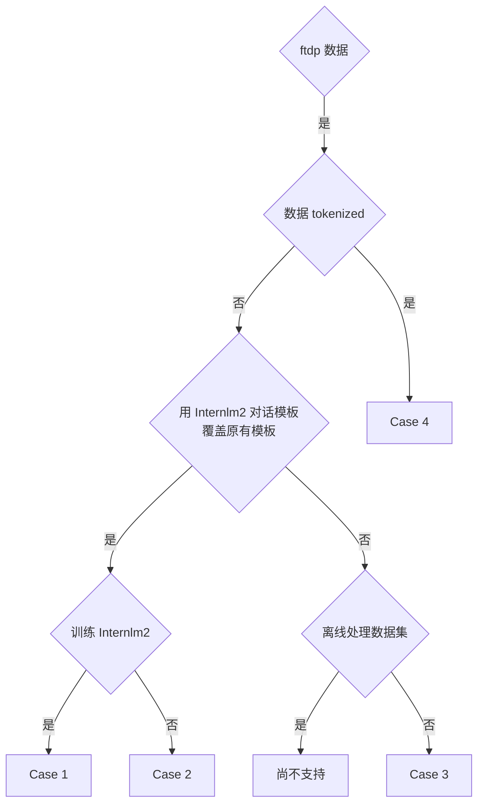

本节介绍了常见的 4 种使用 ftdp 数据集训练的使用场景：

- [Case 1](Case1.md)
- [Case 2](Case2.md)
- [Case 3](Case3.md)
- [Case 4](Case4.md)

请先参考下方流程图，选择自己的使用场景。

```mermaid
graph TD;
    A{ftdp 数据}
    A -->|是| B{数据 tokenized}
    B -->|否| C{"用 Internlm2 对话模板
覆盖原有模板"}
    C -->|是| D{训练 Internlm2 }
    D -->|是| E[Case 1]
    D -->|否| F[Case 2]
    C -->|否| G{离线处理数据集}
    G -->|是| H[尚不支持]
    G -->|否| I[Case 3]
    B -->|是| J[Case 4]
```
