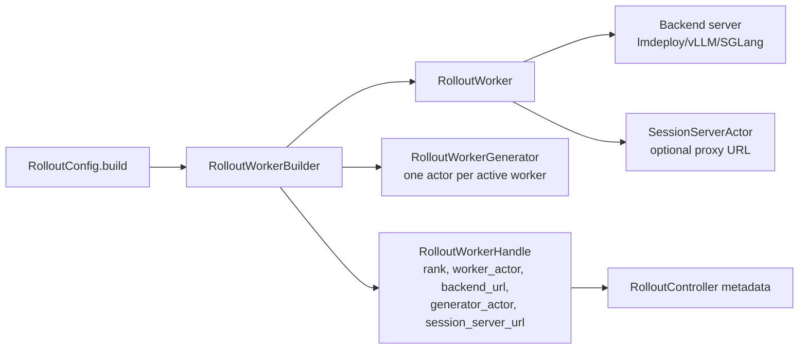
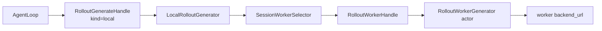
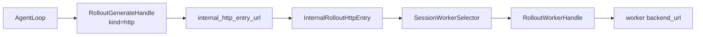
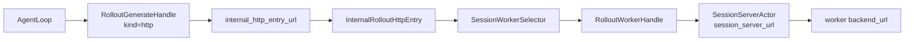
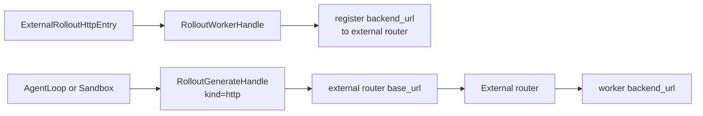
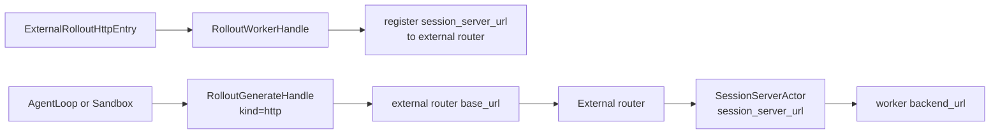

# Rollout Generate Refactor Requirements

## 背景

当前 rollout controller 和 rollout worker 同时承担控制面、生成数据面、健康检测与失败恢复等多类职责，导致调用路径复杂、序列化开销高，并且普通 agent 与 agentic/sandbox 场景存在不一致的生成入口。

本轮重构先聚焦职责拆分和生成路径解耦，不在第一版引入健康检测和失败恢复。

## 核心需求

### 1. 删除健康检测和失败恢复

第一版使用纯净模型，假设 rollout backend、server、worker 不会失败。

需要删除或避免引入以下逻辑：

- worker/server 健康检测、探活、ready/liveness 轮询
- worker 失败标记、降级、屏蔽
- 自动恢复、重启 failed worker
- 健康检测状态在 controller、worker、router 之间同步

这类能力后续如果重新引入，需要作为独立设计处理，不应混入本轮 generate 解耦。

### 2. generate 从 controller 和 worker 中彻底移出

`RolloutController.generate` 和 `RolloutWorker.generate` 都不应该保留。

目标职责边界：

- `RolloutController`：只负责中心化控制面，例如 runtime 初始化、worker metadata、权重同步、offload/onload、pause/continue、endpoint/router 启动。
- `RolloutWorker`：只负责 backend server 生命周期和 backend 控制，例如启动服务、权重更新、KV cache 控制、pause/continue。
- 独立生成模块：负责真正的数据生成调用、请求/响应转换、parser、partial rollout 等生成相关逻辑。

### 3. worker 侧生成类需要评估普通类与 Ray actor 形态

controller 侧拆出的生成入口相对轻量，可以优先按普通 async 类实现。

worker 侧生成模块可能包含 tokenizer、partial rollout handler、parser、状态转换等重操作，因此需要评估两种实现方式：

#### 方案 A：生成类本身是 Ray actor

每个 active worker 绑定一个 generation actor，数量与 active worker 一致，并尽量调度到对应 worker 所在节点或资源附近。

优点：

- 重逻辑天然隔离，不阻塞调用方进程。
- partial rollout handler、tokenizer 等状态可以常驻 actor 内。
- 和 worker 一一绑定，路由关系清晰。

缺点：

- 引入 Ray actor/grpc 序列化开销。
- 需要管理 actor 生命周期和 placement。
- 轻量单轮推理场景可能不划算。

#### 方案 B：生成类保持普通类，重操作外包

主 generate 类保持普通 async 类；当启用 tokenizer、partial rollout handler 等重操作时，将这些重操作单独外包给 Ray actor 或其他执行器。

优点：

- 无重操作时路径最短，避免额外 Ray 序列化。
- 可按需引入远程执行能力。
- 更适合简单单轮推理场景。

缺点：

- 接口拆分更复杂，需要明确哪些步骤属于主流程，哪些步骤可外包。
- partial/tokenize actor 的生命周期和路由关系仍需设计。
- 如果重操作很多，主流程可能变成多个远程调用，反而增加复杂度。

当前第一版选择方案 A。普通类/重操作外包方案先不进入实现，后续只有在明确需要进一步降低 Ray actor 调用开销时再单独评估。

当前实现原则：

- 第一版统一使用 `RolloutWorkerGenerator`，每个 active rollout worker 绑定一个生成 actor。
- agentloop 运行时只负责按 session 选择 worker，然后直接调用对应 `RolloutWorkerGenerator`，不经过 controller。
- partial rollout 不再通过 controller 全局开关传播，而是作为单次 generate 调用参数进入生成模块，避免跨请求共享状态。
- 对外入口集中在 `xtuner/v1/rl/rollout/rollout_generator.py`，内部实现集中在 `xtuner/v1/rl/rollout/_generation/`，避免 controller/worker 文件继续承载生成细节。

### 4. controller 拆分出的生成入口只是可选路径

generate 解耦后，生成路径需要支持至少三种运行模式：

#### 模式 1：调用内部 generate 接口

agentloop 直接调用 xtuner 内部的独立 generate 类或接口。

适用场景：

- 普通内联 agentloop
- 希望减少 controller 中转
- 希望减少不必要序列化

#### 模式 2：调用 xtuner 内部 routed url

xtuner 内部启动 routed HTTP endpoint，对外暴露一个 routed url。agentloop 通过该 url 生成，请求再路由到对应 worker 的生成 URL。

适用场景：

- 需要 HTTP 接口兼容
- agentloop 不适合直接调用 Ray/Python 接口
- 希望由 xtuner 内部管理 router

#### 模式 3：调用外部 routed 注册服务

xtuner 将每个 worker 的生成 URL 注册到外部 router，由外部服务提供 routed url。agentloop/sandbox 使用外部 routed url 生成。

适用场景：

- agentic/sandbox 场景
- 需要第三方 router、隔离部署或独立扩容
- 不希望 xtuner 内部 router 成为中心化瓶颈

实现上，模式 2 和模式 3 对 agentloop 都是 HTTP 生成路径，因此统一为 `kind="http"`。
二者区别只体现在 HTTP 入口来源：`http_entry="internal"` 表示 XTuner 启动内部 router，
`http_entry="external"` 表示 XTuner 将 worker 生成 URL 注册到外部 router。

代码上这两类入口对称命名为 `InternalRolloutHttpEntry` 和 `ExternalRolloutHttpEntry`。
`InternalRolloutHttpEntry` 是 XTuner 内部 FastAPI 转发入口；`ExternalRolloutHttpEntry`
不转发请求，只复用 routedapiproxy 注册逻辑，将 worker 生成 URL 注册到外部 router。

worker 生成 URL 由 `http_worker_url_source` 控制：

- `backend`：使用 worker backend url，适合评测或不需要 SessionServer 增强逻辑的简单场景。
- `session`：使用每个 worker 外层的 SessionServer url，适合需要 session id、token cache、trace/replay 等增强逻辑的 agentic 场景。内部 router 会自动把选出的 `session_id` 写入请求体；外部 router 场景要求调用方或外部 router 保留/注入 `session_id`。

## 运行流程图

### 公共启动流程

所有模式共享同一套 worker 构建流程。`RolloutWorkerBuilder` 启动 active worker、收集 backend URL 和 SessionServer URL，并为每个 active worker 创建一个 `RolloutWorkerGenerator` actor。

### 1. 本地生成：`kind="local"`

`AgentLoop` 持有 `RolloutGenerateHandle`，其中包含 `LocalRolloutGenerator`。运行时按 session 选择 worker，然后直接调用该 worker 绑定的 `RolloutWorkerGenerator` actor。controller 不在数据生成路径上。

参与类：

- `RolloutGenerateHandle`
- `LocalRolloutGenerator`
- `SessionWorkerSelector`
- `RolloutWorkerHandle`
- `RolloutWorkerGenerator`

### 2. 内部 router，直接走 backend：`kind="http", http_entry="internal", http_worker_url_source="backend"`

XTuner 启动 `InternalRolloutHttpEntry`。agentloop 只看到一个 internal router base URL。router 按 session 选择 worker，并把请求转发到 worker 的 `backend_url`。这条路径不经过 `SessionServerActor`。

参与类：

- `RolloutGenerateHandle`
- `InternalRolloutHttpEntry`
- `SessionWorkerSelector`
- `RolloutWorkerHandle`

### 3. 内部 router，走 SessionServer：`kind="http", http_entry="internal", http_worker_url_source="session"`

XTuner 仍然启动 `InternalRolloutHttpEntry`，但 router 选择 worker 后转发到 `session_server_url`。router 会把选出的 `session_id` 写入请求体，满足 `SessionServer` 的 session/cache/trace 逻辑。

参与类：

- `RolloutGenerateHandle`
- `InternalRolloutHttpEntry`
- `SessionWorkerSelector`
- `RolloutWorkerHandle`
- `SessionServerActor`

### 4. 外部 router，注册 backend：`kind="http", http_entry="external", http_worker_url_source="backend"`

XTuner 不转发请求，只通过 `ExternalRolloutHttpEntry` 复用 routedapiproxy 注册逻辑，将每个 worker 的 `backend_url` 注册到外部 router。agentloop/sandbox 访问外部 router，由外部 router 转发到 worker backend。

参与类：

- `RolloutGenerateHandle`
- `ExternalRolloutHttpEntry`
- `RolloutWorkerHandle`
- 外部 router 服务

### 5. 外部 router，注册 SessionServer：`kind="http", http_entry="external", http_worker_url_source="session"`

XTuner 通过 `ExternalRolloutHttpEntry` 复用 routedapiproxy 注册逻辑，将每个 worker 的 `session_server_url` 注册到外部 router。agentloop/sandbox 访问外部 router，由外部 router 转发到 SessionServer，再到 worker backend。该模式要求调用方或外部 router 保留/注入 `session_id`。

参与类：

- `RolloutGenerateHandle`
- `ExternalRolloutHttpEntry`
- `RolloutWorkerHandle`
- `SessionServerActor`
- 外部 router 服务

## 非目标

本轮暂不处理：

- 健康检测、失败恢复、自动重启
- worker/router 的复杂容错状态同步
- CI 和旧单测兼容修复
- SGLang 和 vLLM 分支的逻辑正确性
- 外部 router 的完整协议细节
- gateway 内部的所有东西都可以忽略

## 当前判断

本轮重构应先完成纯净职责拆分：

1. 删除健康检测和失败恢复。
2. 将 controller/worker 的 generate 完全外移。
3. 明确独立生成模块的接口和运行模式。
4. 再评估 worker 侧生成模块采用普通类、Ray actor，还是普通类加重操作外包的混合方案。
