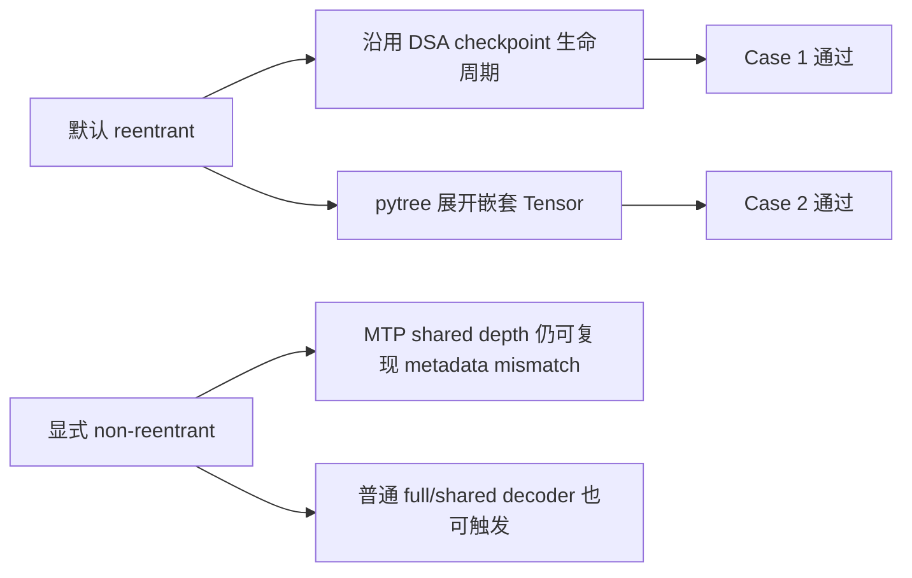
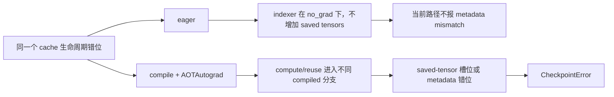
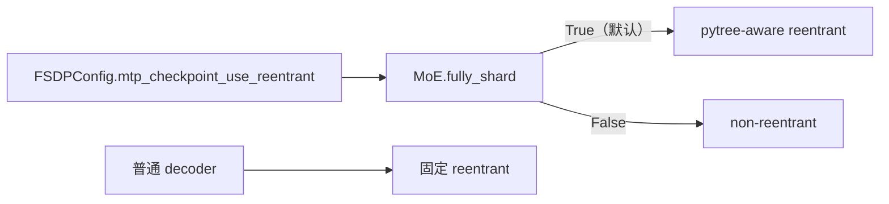
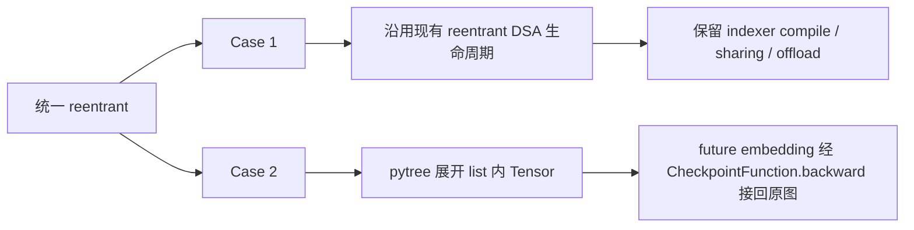
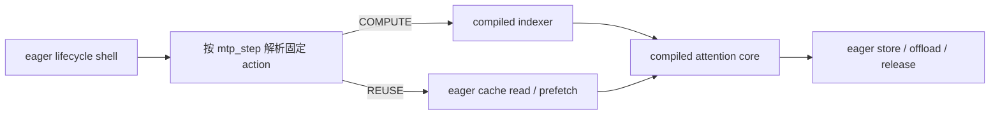

# GLM MTP checkpoint：reentrant / non-reentrant 反例与边界

## 总结

两个原始反例要求相反：MTP depth2 的 compile/cache 路径在 non-reentrant 下发生 metadata mismatch，micro2 的嵌套 Tensor 输入在普通 reentrant 下发生二次 backward。现已落地方案一：MTP 默认统一使用 **reentrant + pytree flatten**，递归展开 checkpoint 输入中的 Tensor。该实现保留 indexer compile、top-k iteration sharing 和 offload，并使两个真实 Case 都通过；`mtp_checkpoint_use_reentrant=False` 仅保留为显式 non-reentrant 开关。

本轮进一步确认：non-reentrant 的 metadata mismatch **不依赖 MTP**。无 MTP 时，只要两个普通 GLM DSA decoder 形成 `full -> shared` top-k 共享关系、两层都做 non-reentrant checkpoint，并同时开启 compile 和 DSA top-k offload，也会出现同类错误。MTP 是更容易触发该状态交互的结构，但不是根因的必要条件。



下文统一使用 PyTorch 的正式术语 `reentrant` 和 `non-reentrant`；问题中的 `entrant / no entrant` 分别指这两种模式。

## 两个原始 MTP 反例

两个反例都通过真实 `TrainEngine.train_step()` 路径复现，未 mock 项目内模块。为排除无关变量，主 decoder 的 `recompute_ratio` 都设为 `0`；MTP 因 `share_weights=True` 仍会被强制 checkpoint。

| 配置 | non-reentrant metadata 反例 | reentrant micro2 反例 |
|---|---:|---:|
| GPU / EP | `1 / 1` | `2 / 2` |
| SP | 关闭 | 关闭 |
| intra-layer micro-batch | `1` | `2` |
| compile | 开启 | 关闭 |
| activation offload | 关闭 | 关闭 |
| DSA top-k offload | 开启 | 关闭 |
| MTP logical depth | `2` | `1` |
| MTP physical layer | `1`，共享权重 | `1`，共享权重 |
| checkpoint 模式 | non-reentrant | reentrant |
| 结果 | `CheckpointError: different metadata` | `backward through the graph a second time` |

第一条反例继续缩减后的必要触发项是：compile、DSA top-k offload、共享 MTP 物理层的两个 logical depth。关闭 compile、关闭 top-k offload或把 MTP depth 降到 `1`，错误都消失；activation offload、SP 和 EP 都不是必要条件。

第二条反例在关闭 SP、compile、activation offload、top-k offload，并把 MTP depth 降为 `1` 后仍会失败。保留 EP2/all2all 是因为当前 EP1 dispatcher 不支持该 domino micro-batch 入口，不代表 EP2 是异常根因。

### Case 1：non-reentrant 为什么 metadata mismatch

先给结论：**同一个 checkpoint 的 original forward 计算了 indexer，backward replay 却错误地跳过了 indexer。** non-reentrant checkpoint 要求这两次执行保存相同的反向传播材料；开启 compile 后，这个要求被破坏，于是报 metadata mismatch。

为什么会走不同分支？当前 DSA cache 用 `torch.is_grad_enabled()` 区分 checkpoint 阶段：

| checkpoint 模式 | original forward | backward replay | DSA 能否分清阶段 |
|---|---|---|---|
| reentrant | grad 关闭 | grad 开启 | 能 |
| non-reentrant | grad 开启 | grad 开启 | 不能 |

reentrant original 会被识别出来，设置 `checkpoint_active`，并记录“还有几次 MTP original/replay 要使用 cache”。non-reentrant 的 original 也是 grad enabled，DSA 把它当成普通 forward，没有正确推进这些计数。真正 replay 时，cache 中便残留了不该复用的内容。

失败过程如下：

1. 两个 logical depth 共用一个物理 MTP layer，因此也共用这个 layer 的 top-k cache。
2. Depth 1 original：cache 为空，执行 indexer，并把 top-k 写入 cache。
3. Depth 2 original：看到 cache 已存在，直接复用，不再执行 indexer。
4. backward 逆序开始，先 replay depth 2。它再次复用 cache，和自己的 original 行为一致。
5. 再 replay depth 1。对 non-reentrant 而言，为了重建相同的保存清单，它应当和自己的 original 一样重新执行 indexer；但当前 cache 生命周期仍认为旧 top-k 可复用，所以跳过了 indexer。
6. 于是 depth 1 的两次执行不一致：`original=COMPUTE`，`replay=REUSE`。

这里的“应当重新执行”只针对 non-reentrant。reentrant original 在 `no_grad` 下不建立内部 autograd graph，也没有保存清单需要和 replay 对齐，因此 replay 可以有意复用离散 top-k；当前 DSA cache 计数正是用来保证这份 cache 在两次 replay 完成后正确释放。


#### 为什么这个反例必须开启 compile

compile **不是根因**。根因始终是上面的 `COMPUTE != REUSE`；compile 只是让 checkpoint 能观察到这项差异。

可以把 non-reentrant checkpoint 理解成在核对两张“保存清单”：

```text
original forward: 保存槽位 0、1、2、...
backward replay:  重新产生槽位 0、1、2、...
checkpoint:       逐个比较两个槽位的 shape / dtype / device
```

不开 compile 时：

- `DSAIndexer.forward()` 整体在 `torch.no_grad()` 下运行，只产生不需要梯度的整数 top-k 索引。
- 因此 original 多执行一次 indexer，并不会让 eager autograd 多保存一组反向传播 Tensor。
- replay 虽然错误地从 cache 取索引，但后面的 SparseMLA 仍收到相同 shape/dtype 的 top-k。两张“保存清单”在当前路径上仍能对齐，所以不报 metadata mismatch。

开启 compile 后：

- autograd 看到的不再只是一个个 eager 算子。Dynamo 会把前向计算切成若干 compiled block，AOTAutograd 再为每个 block 生成 backward。
- “计算 indexer 并写 cache”和“从 offload cache 读取”会经过不同的 Python 分支和 graph break。graph break 表示当前编译图在这里结束，后面的 Tensor 计算会从新的 compiled block 继续。
- 因而 depth 1 original 的 compiled 执行序列与 replay 不同。compiled block 交给 checkpoint 的“保存清单”随之错位，同一个编号可能对应两个业务含义不同的 Tensor；只要二者 metadata 不同，checkpoint 就会报错。

这里最容易混淆的一点是：**compile 没有让 indexer 参与反向传播。** `DSAIndexer.forward()` 仍然处于 `no_grad`，它本身依旧不会保存 backward Tensor。compile 改变的是其他可求导计算被 autograd 记录和保存的方式：

- eager 模式以单个算子为单位建立 autograd 节点。indexer 前后多走一个不求导分支，不会改变后续 SparseMLA 算子需要保存的 Tensor。
- compile 模式先把一段可求导计算打包成 compiled block，再由 AOTAutograd 为整个 block 生成 backward。这个 compiled block 的 forward 会一次性交出一组 backward 所需的输入和中间结果，checkpoint 看到的是这组展开后的 Tensor。
- Python cache 判断和 offload prefetch/read 会产生 graph break。`COMPUTE` 与 `REUSE` 走过的 graph break 不同，前后被打包成的 compiled block 组合也可能不同，因此它们一次性交出的 Tensor 组不再一一对应。

可以用下面的简化示意理解。字母只代表“某个为 backward 保存的 Tensor”，不对应真实变量名：

```text
不开 compile：
  original COMPUTE: indexer(no_grad, 不产生槽位) -> SparseMLA 保存 [A, B, C]
  replay   REUSE:   cache read(不产生槽位)       -> SparseMLA 保存 [A, B, C]
  checkpoint 比较 metadata:                     [A, B, C] == [A, B, C]

开启 compile：
  original COMPUTE: Python/graph break -> compiled blocks -> 保存 [A, B, C, D]
  replay   REUSE:   prefetch/graph break -> 另一组 blocks  -> 保存 [A, X, C, D]
  checkpoint 比较 metadata: 槽位 1 是 B 对 X，metadata 不同，因此报错
```

上例中的 `[A, B, C, D]` 和 `[A, X, C, D]` 只是解释“打包边界变化后，同一编号可能对应不同 Tensor”。`==` 也只表示两边的 shape、dtype、device 等 metadata 对齐，不表示 Tensor 数值相等。真实执行中还可能表现为槽位整体前移或后移。checkpoint 不理解这些 Tensor 的业务含义，只会按出现顺序比较同一编号。

因此，报 `different metadata` 不等于“top-k 索引本身的 shape 一定变了”。更可能的含义是：original 与 replay 进入了不同的 compiled block 序列，导致保存清单错位，checkpoint 正在拿两个业务含义不同的 Tensor 做比较。



DSA top-k offload 是另一个显性触发条件。它让 REUSE 路径多出“从 CPU cache prefetch/read 回 GPU”的步骤，使 COMPUTE 与 REUSE 两条 compiled 路径差得更明显。关闭 compile 或 top-k offload，只是让当前错误不再以 metadata mismatch 的形式暴露；depth 1 的 original/replay 仍然走了不同分支，cache 生命周期并没有被修好。

单变量证据是：仅设置 `index_share_for_mtp_iteration=False`，让两个 logical depth 都重新计算 indexer，原失败测试立即通过。关闭 MTP depth2、compile 或 DSA top-k offload 也都会使当前错误消失；后两项是让分支差异表现为 saved-tensor metadata mismatch 的触发条件，logical-depth cache 生命周期错位才是根因。

### Case 2：reentrant 为什么 backward through graph twice

修复前的问题可以归结为一句话：**checkpoint 看到了 list，却没有看到 list 里面的 Tensor。**

假设 micro2 调用形式是：

```python
mtp_layer(hidden, future_embeddings=[embedding_0, embedding_1])
```

`CheckpointWrapper` 只做一层 kwargs 打包，效果可简化为：

```python
CheckpointFunction.apply(run_function, hidden, [embedding_0, embedding_1])
```

`CheckpointFunction.forward()` 只检查这一层参数。它能看到 `hidden` 是 Tensor，却只看到第二个参数是普通 list；它不会继续进入 list 查找 `embedding_0` 和 `embedding_1`。所以这两个 embedding 没有在 replay 前 detach，仍连接着原始 `embed_tokens` autograd graph。

失败过程如下：

1. reentrant backward 重新执行 MTP forward，并在 `CheckpointFunction.backward()` 内部发起一次 backward。
2. 因为 list 内的 embedding 没有 detach，这次内部 backward 会直接进入原始 embedding graph。
3. 原始 embedding graph 第一次被 backward 使用后，其中为反向传播保存的 Tensor 会被释放。
4. 外层 `loss.backward()` 随后沿 main LM/MTP 的正常路径再次到达同一 embedding graph。
5. 同一张图被第二次使用，但保存的 Tensor 已经释放，于是报 `Trying to backward through the graph a second time`。

micro1 不会触发，是因为它直接传入一个 `future_embeddings: Tensor`。这个 Tensor 位于参数顶层，checkpoint 能看到它，会在 replay 前正确 detach。

当前 pytree 修复先递归展开参数：

```text
打包前: hidden, [embedding_0, embedding_1]
展开后: hidden, embedding_0, embedding_1
```

这样两个 embedding 都成为 checkpoint 能识别的顶层 Tensor。replay 使用它们的 detached 副本；内部 backward 得到的梯度再由 `CheckpointFunction.backward()` 返回给外层原图，因此既不会提前消费原图，也不会丢失 MTP 对 embedding 的梯度。


单变量证据是：只在探针中 detach `future_embeddings_list` 的每个 Tensor，原失败测试即通过；只设置 `detach_mtp_lm_head_weight=True` 仍然失败，排除了共享 LM-head weight。错误发生在第一次也是唯一一次 `TrainEngine.train_step()` 的 `loss.backward()` 内，因此也不是梯度累积复用了上一张图。

## 开关与实现范围

`FSDPConfig.mtp_checkpoint_use_reentrant` 的语义如下：

| 值 | 行为 |
|---|---|
| `True`（默认） | MTP 使用 pytree-aware reentrant checkpoint |
| `False` | MTP 使用 non-reentrant checkpoint |

开关只控制 MTP；普通 decoder 仍固定使用 reentrant checkpoint。统一模式不再依赖 `intra_layer_micro_batch`，因此无需从 `TrainEngine` 向模型构建链路传递该参数。



MTP 相比普通 decoder 有四点特殊性：

1. `share_weights=True` 时，即使 `recompute_ratio=0`，MTP 仍强制重计算。
2. 多个 logical depth 会重复调用同一个物理 `MTPLayer` 和 decoder。
3. micro2 将 future embeddings 作为 `list[Tensor]` 传入共享 MTP layer；普通 reentrant 只 detach 顶层 Tensor，因此 MTP wrapper 需要先做 pytree flatten。
4. MTP 使用独立复制的 `SequenceContext` 和 `DSATopKCacheState`，并额外维护 logical-depth forward/replay 次数。

这些结构解释了为何 MTP 更容易暴露问题，但不能推出“没有 MTP 就一定安全”。

## 两种 checkpoint 如何构建 autograd graph

### reentrant

reentrant 的原始 forward 在 `torch.no_grad()` 下执行，因此 checkpoint 区域内部的算子不进入外层 autograd graph。外层图只看到一个 `CheckpointFunctionBackward` 节点；backward 到该节点时，PyTorch 重新执行完整 forward，在这次 replay 中临时建立内部图并计算梯度。


#### 顶层 Tensor 边界与梯度桥接

reentrant `CheckpointFunction.forward()` 只扫描传给 `apply()` 的第一层参数：顶层 Tensor 进入 `ctx.save_for_backward()`，其他对象原样保存在 `ctx.inputs`。backward replay 前，`detach_variable()` 同样只遍历第一层参数，把其中的 Tensor detach 成新的 leaf，并保留原来的 `requires_grad`；它不会递归进入 list、tuple 或自定义对象。

`CheckpointWrapper` 为兼容 kwargs 使用的 `_pack_kwargs()` 也只是把每个 kwarg value 追加为一个顶层参数，不会递归展开容器。因此 micro1 的 `future_embeddings: Tensor` 会成为顶层 Tensor，micro2 的 `future_embeddings: list[Tensor]` 则仍是一个普通 list。

detached replay Tensor 的梯度确实由 autograd Function 的 backward 接回，但准确对象是 `CheckpointFunction.backward()`：

1. replay 使用 detached leaf 建立临时 graph。
2. `CheckpointFunction.backward()` 在该临时 graph 上调用嵌套 `torch.autograd.backward()`。
3. 它读取每个顶层 detached input 的 `.grad`，并通过 `return (None, None) + grads` 返回。
4. 外层 autograd engine 将这些返回值视为原始顶层 Tensor 输入的梯度，再沿 `CheckpointFunctionBackward` 的输入边传播到其上游 graph。

所以 detach 的含义是切断 replay graph 对原 graph 的**直接连接**，梯度通过自定义 backward 的返回值显式桥接，而不是让 detached Tensor 自己重新连回原图。


list 内 Tensor 不走这座桥。由于 list 被当作普通 Python 对象保存，replay 收到的仍是原 list 和原 Tensor 对象；该 Tensor 保留原 `grad_fn`，嵌套 backward 会直接进入原 graph。它也不是 `CheckpointFunction.apply()` 的顶层 Tensor 输入，因此 `CheckpointFunctionBackward` 没有一条属于它的输入边，也不会为它返回对应梯度。这正是 micro2 future embeddings 提前消费原 embedding graph 的机制。

demo 的 `reentrant top-level Tensor boundary` 段直接对比了这两条路径：

```text
original forward:
  direct: same_object=True,  is_leaf=False, grad_fn=MulBackward0
  nested: same_object=True,  is_leaf=False, grad_fn=MulBackward0

replay forward:
  direct: same_object=False, is_leaf=True,  grad_fn=None
  nested: same_object=True,  is_leaf=False, grad_fn=MulBackward0

inner backward: reached the original list member directly
outer autograd: CheckpointFunction.backward returned direct.grad
```

打印出的外层 graph 只有 direct Tensor 对应的输入边：

```text
CheckpointFunctionBackward
  MulBackward0
    AccumulateGrad
```

该最小例没有让 nested Tensor 的原 graph 同时走第二条外层路径，所以能够正常完成 backward；真实 MTP micro2 中，同一 embedding graph 随后还会被外层 main LM/MTP 路径访问，才会报 `backward through the graph a second time`。

### non-reentrant

non-reentrant 的原始 forward 在正常 grad mode 下执行，所以输出直接连接真实算子图。它所谓的“用 saved-tensor hooks 记录重算需求”，不是录制算子或另建一份重算图，而是保留 autograd 的计算路线，同时把 backward 节点需要保存的中间 Tensor 换成占位凭证。

三个 hook 阶段的准确分工如下：

1. original forward 中，`_checkpoint_hook.pack_hook` 拦截算子的 `save_for_backward`，用 `_Holder` 替换原 Tensor，并记录保存槽位的顺序及 shape、dtype、device metadata。
2. backward 节点读取 saved tensor 时，`_checkpoint_hook.unpack_hook` 被触发。它发现槽位尚未恢复后，以原输入调用 `recompute_fn`。
3. replay 期间，`_recomputation_hook.pack_hook` 拦截重新发生的 `save_for_backward`，按顺序把第 N 个重算 Tensor 映射到第 N 个 `_Holder`。达到所需槽位数后可以提前停止 replay。
4. replay 结束后，仍由 `_checkpoint_hook.unpack_hook` 从映射中取回 Tensor，交给原 backward 节点继续计算。

因此，“另一个 hook 收集新 Tensor 并交还”只是简写：`_recomputation_hook.pack_hook` 负责收集和建立映射，真正把 Tensor 交还给 backward 节点的是 `_checkpoint_hook.unpack_hook`。PyTorch 同时校验 original forward 与 replay 保存 Tensor 的数量、顺序及 metadata 是否一致。


核心差异如下：

| 观察点 | reentrant | non-reentrant |
|---|---|---|
| original forward 的 grad mode | 关闭 | 开启 |
| original forward 是否记录内部图 | 否 | 是 |
| checkpoint 输出的 `grad_fn` | `CheckpointFunctionBackward` | 最后一个真实算子的 backward node |
| backward replay | 完整重跑并建立内部图 | 为缺失 tensor 按需重跑 |
| 对有状态副作用的要求 | original/replay 可由 grad mode 区分 | original/replay 都是 grad enabled，必须另有显式状态 |

最小 demo 位于 `demo_checkpoint_autograd_graph.py`，只依赖 PyTorch，可在 CPU 运行：

```bash
conda activate pt29_glm1
python demo_checkpoint_autograd_graph.py
```

demo 使用诊断 subclass 观察真实 PyTorch `_CheckpointFrame`，不替换 checkpoint 执行路径。实测图结构为：

```text
reentrant:     CheckpointFunctionBackward -> AccumulateGrad
non-reentrant: SinBackward0 -> MulBackward0 -> AccumulateGrad
```

non-reentrant 还会直接打印 saved-tensor 槽位和 replay hook：

```text
saved-tensor slots recorded by _checkpoint_hook.pack_hook:
  slot 0: placeholder=_Holder, metadata=...
  slot 1: placeholder=_Holder, metadata=...
  slot 2: placeholder=_Holder, metadata=...

_checkpoint_hook.unpack_hook: first saved tensor requested
  -> start recompute_fn under _recomputation_hook
_recomputation_hook.pack_hook: collected 3 tensors in original order

hook call summary:
_checkpoint_hook context=1, pack=3, unpack=3;
_recomputation_hook context=1, pack=3, unpack=0
```

调用次数和粒度如下：

| 对象 / 回调 | demo 调用次数 | 粒度 |
|---|---:|---|
| `_checkpoint_hook` context | 1 | 每个 non-reentrant checkpoint frame |
| `_checkpoint_hook.pack_hook` | 3 | original forward 的每个 saved-tensor 槽位 |
| `_checkpoint_hook.unpack_hook` | 3 | 原 backward 每次读取一个 saved-tensor 槽位 |
| `_recomputation_hook` context | 1 | 每次 replay / backward graph task |
| `_recomputation_hook.pack_hook` | 3 | replay 中的每个 saved-tensor 槽位 |
| `_recomputation_hook.unpack_hook` | 0 | replay graph 自己读取 saved tensor；本 demo 未对 replay graph 做 backward |

这里的回调是 saved-tensor **槽位粒度**，不是 layer、算子或 unique Tensor 粒度。`x * x` 的 `MulBackward0` 分别保存左右操作数，形成 slot 0 和 slot 1；即使二者是同一个 `x`，仍是两个槽位。`sin(hidden)` 再保存输入 `hidden`，形成 slot 2。

backward 先处理 `SinBackward0`，所以首先 unpack slot 2。这是当前 graph task 的第一次缺失请求，会创建一次 `_recomputation_hook` 并 replay；replay 的 pack hook 按 original 顺序一次重建 slot 0、1、2。随后 `MulBackward0` 对 slot 0 和 slot 1 的两个 unpack 直接使用本次 replay 已建立的映射，不再重跑 forward。因此 `_checkpoint_hook.unpack_hook` 虽然调用 3 次，replay 只发生 1 次；新的 backward graph task 才可能再次 replay。

两个同名 unpack callback 不应混淆：真正向**原 backward graph** 交还重算 Tensor 的是 `_checkpoint_hook.unpack_hook`，本 demo 调用 3 次；计数为 0 的是 `_recomputation_hook.unpack_hook`。后者只在 replay graph 内部又执行 `backward()` 或 `autograd.grad()` 等、需要读取 replay graph 自身 saved tensors 的情况下才会触发。

这直接展示了“original forward 留下 Holder → backward 请求槽位 → replay 按序重建 Tensor”的机制。`next_functions` 只能展示 graph 连接，不能展示 backward 节点内部的 saved tensor 已被替换；因此需要额外观察 `_CheckpointFrame`。该观察代码依赖 PyTorch 私有诊断接口，只服务于 demo。两种模式的 block 最终都调用两次，输入梯度一致。

## 无 MTP 的普通 decoder 反例

### 最小真实路径

无 MTP 对照使用真实 GLM DSA decoder、embedding、rotary embedding、FSDP 和 compile，没有替换项目内算子：

- 1 GPU、EP1、无 SP；
- 2 个 dense decoder，DSA indexer 为 `full -> shared`；
- 两层都使用 non-reentrant checkpoint；
- compile 开启、DSA top-k offload 开启；
- activation offload 关闭、MTP 关闭；
- 对最终 hidden state 求标量并执行一次 backward。

该配置稳定得到与 MTP non-reentrant 反例同类的 `CheckpointError: Recomputed values ... have different metadata`。

### 单变量矩阵

| 相对失败基线的唯一变化 | 结果 |
|---|---|
| 无变化：`full -> shared` 两层都 non-reentrant | **metadata mismatch** |
| 只保留一个 `full` decoder | 通过 |
| 只 checkpoint `full` 层 | 通过 |
| 只 checkpoint `shared` 层 | 通过 |
| 第二层由 `shared` 改为 `full` | 通过 |
| 关闭 compile | 通过 |
| 关闭 DSA top-k offload | 通过 |

因此结论不是“任意普通 decoder 一做 non-reentrant 重计算就失败”，而是当前已实锤的最小边界需要：

```text
两个 non-reentrant checkpoint decoder
+ full/shared DSA top-k cache 共享
+ compile
+ DSA top-k offload
```

### 原因边界

当前 DSA 生命周期用 grad mode 识别 checkpoint 阶段：

```text
original forward = training and not torch.is_grad_enabled()
recompute        = checkpoint_active and torch.is_grad_enabled()
```

这恰好匹配 reentrant，但 non-reentrant 的 original forward 与 replay 都是 grad enabled。单层或无共享 cache 时这个差异未必可见；当 `full` source 和 `shared` consumer 都进入 non-reentrant replay，compile 与 offload residency 路径读取同一个可变 cache，original/replay 保存 tensor 的顺序和 metadata 发生错位，最终被 checkpoint 一致性校验捕获。

所以 MTP 不是该 metadata 问题的必要条件。MTP 的共享物理层和 logical-depth cache 计数只是另一种、更集中的触发方式。生产代码目前普通 decoder 固定 reentrant，因此新增的 MTP 开关不会把这个无 MTP 反例带入默认训练路径。

## 统一 checkpoint 模式方案

目标是在两个 Case 中使用同一种 checkpoint 模式，同时保留 DSA indexer compile。方案一已经落地；两个 non-reentrant 方案保留为设计对照：

| 方案 | indexer compile | top-k iteration sharing | 改动范围 | 当前证据 |
|---|---|---|---|---|
| 统一 reentrant + pytree flatten | 保留 | 保留 | checkpoint 输入边界 | **已实现，两个真实 Case 均通过** |
| 统一 non-reentrant，所有 depth 重算 index | 保留 | 关闭 | 配置与约束 | 单变量探针通过，但增加 index 计算量 |
| 统一 non-reentrant，保留 sharing | 保留 | 保留 | checkpoint phase、cache 状态机、compile 边界 | 设计提案，尚未实现验证 |

### 方案一：统一 reentrant

当前实现由 `pytree_reentrant_checkpoint()` 在 MTP checkpoint 边界递归展开 `(args, kwargs)`，让所有嵌套 Tensor 都成为 `CheckpointFunction.apply()` 的顶层参数；replay 前再按原 pytree spec 重建调用参数：

```python
flat_inputs, input_spec = tree_flatten((args, kwargs))

def run_function(*replayed_flat_inputs):
    replayed_args, replayed_kwargs = tree_unflatten(
        list(replayed_flat_inputs), input_spec
    )
    return function(*replayed_args, **replayed_kwargs)

return checkpoint(run_function, *flat_inputs, use_reentrant=True)
```

这样 micro2 的每个 `future_embedding` 都会被 `ctx.save_for_backward()` 保存，并在 replay 前 detach 成新的 leaf；`CheckpointFunction.backward()` 再把 leaf gradient 返回给外层 autograd。它不同于直接 `.detach()` future embeddings，不会丢失 MTP 对 embedding 的梯度。

该方案对两个 Case 的作用如下：



真实回归保持原反例的关键配置不变，只替换 MTP reentrant checkpoint 的参数打包：

- Case 1：compile、DSA top-k offload、MTP depth2、reentrant，训练 step 通过；
- Case 2：micro2、EP2、reentrant，训练 step 通过。

此外新增 CPU 行为测试，验证 list 内 Tensor 经 checkpoint 内部路径和 checkpoint 外部路径共同使用时，梯度能正确合并，不会丢失，也不会二次消费原图。实现已经进入生产代码；显式 `False` 的 non-reentrant 负向测试继续稳定复现，用来证明开关分支和历史边界没有被测试掩盖。

### 方案二：统一 non-reentrant

#### 最小版本：所有 logical depth 都计算 index

关闭 `index_share_for_mtp_iteration` 后，每个 frame 的 original/replay 都执行 compiled indexer，两个 Case 均可使用 non-reentrant。该单变量探针已使 Case 1 通过，且 Case 2 原本就在 non-reentrant 下通过。

代价是每个 logical depth 都重复计算 index，并且需要调整当前 GLM MTP 对 `index_share_for_mtp_iteration=True` 的配置约束。

#### 保留 sharing：固定每个 frame 的 action

若继续共享 top-k，必须保证同一个 checkpoint frame 的 original/replay 进入相同 compute/reuse 分支。不能再由可变的 `has_cache()` 决定 action，而应给每次 checkpoint 调用传入稳定的 `mtp_step`：

| `mtp_step` | original action | replay action |
|---:|---|---|
| `0` | `COMPUTE` | `COMPUTE` |
| `1...N` | `REUSE` | `REUSE` |

depth2 的预期 trace 是：

```text
(ORIGINAL,  step0, COMPUTE)
(ORIGINAL,  step1, REUSE)
(RECOMPUTE, step1, REUSE)
(RECOMPUTE, step0, COMPUTE)
```

`mtp_step` 必须作为 checkpoint 的非 Tensor 参数保存到各自 `_CheckpointFrame`，不能写入共享物理 layer 的可变 attribute。non-reentrant original/replay 都是 grad enabled，还需要由 `context_fn` 配合 `ContextVar` 显式标记 `ORIGINAL / RECOMPUTE` phase；phase 只控制 cache store、prefetch、offload 和 release，不决定 compiled Tensor 分支。

为保留 indexer compile，应把状态管理和 Tensor 计算拆开：



不能简单给整个 `get_or_compute()` 加 `@torch.compiler.disable`：虽然定位探针表明统一 graph-break 后 metadata mismatch 会消失，但这样可能把 lambda 内的 indexer 一并移出 compile。正式结构应只把 Python cache lifecycle 放在 eager shell，把 indexer 和 attention core 作为独立 compiled Tensor 函数。

该设计按构造保证同一 frame 的 compiled callable 序列一致：step0 的 original/replay 都执行 `compiled indexer → compiled attention`，step1 的 original/replay 都执行 `cache read → compiled attention`。不同 logical depth 可以使用不同 compiled variant，因为 non-reentrant checkpoint 只比较同一 `_CheckpointFrame` 的 original/replay。

保留 sharing 的 non-reentrant 方案尚未实现。除 action trace 外，正式验证还需覆盖 checkpoint 开/关的 loss/gradient parity、compile + top-k offload、micro1/micro2，以及 backward 后 cache 完全释放。

### 方案选择

已选择并实现 **reentrant + pytree flatten**：它只改变 MTP checkpoint 的输入边界，保留现有 DSA reentrant 生命周期、indexer compile、top-k sharing 和 offload。统一 non-reentrant 的最小版本会增加 index 计算；保留 sharing 的版本则需要重构 phase、cache 状态机和 attention 编译边界。

## 单测与验证

反例集中在 `tests/model/test_glm52_mtp_checkpoint_repro.py`：

| 单测 | 证明内容 |
|---|---|
| `test_non_reentrant_checkpoint_fails_for_compiled_shared_mtp_depths` | micro1 MTP depth2 的 non-reentrant metadata 反例 |
| `test_reentrant_checkpoint_supports_compiled_shared_mtp_depths` | 默认方案保留 compile、top-k offload 与 depth2 sharing |
| `test_reentrant_checkpoint_supports_two_mtp_micro_batches` | pytree reentrant 修复 micro2 的二次 backward |
| `test_non_reentrant_checkpoint_fails_without_mtp_for_shared_dsa_cache` | 普通 `full -> shared` decoder 不依赖 MTP 也可触发 metadata mismatch |

`tests/utils/test_pytree_reentrant_checkpoint.py` 直接验证嵌套 Tensor 在 checkpoint 内外两条路径上的梯度合并；配置测试验证 `mtp_checkpoint_use_reentrant` 默认值为 `True`。

GPU 测试都通过规定的文件锁运行：

```bash
/mnt/shared-storage-user/zhaopenghao/github/xtuner/zdev/gpu_lock.sh bash -lc '
  conda activate pt29_glm1
  PYTHONPATH=. pytest -q tests/model/test_glm52_mtp_checkpoint_repro.py
'
```

最终版本结果为 `5 passed in 67.62s`。此外：

- pytree reentrant、checkpoint wrapper 和 DSA cache 的相关 CPU 行为测试为 `3 passed`；
- autograd graph demo 运行通过，两种模式梯度一致；
- 新实现与反例单测的 `ruff check` 通过。

## 最终结论

当前生产实现已默认统一为 `reentrant + pytree flatten`。pytree 展开修复 micro2 的嵌套 Tensor 边界；reentrant 模式继续匹配现有 DSA cache 的 original/replay 生命周期，因此不需要关闭 indexer compile、iteration sharing 或 offload。`mtp_checkpoint_use_reentrant=False` 保留显式 non-reentrant 能力，但已知 depth2 sharing 反例仍然成立。

reentrant 与 non-reentrant 的本质区别是 original forward 是否建立内部 autograd graph，这也决定了当前实现能否用 grad mode 识别 original/replay。若未来必须统一使用 non-reentrant，关闭 iteration sharing 是低复杂度、高计算量方案；保留 sharing 则必须显式建模 phase 和 `mtp_step`，并拆分 eager cache lifecycle 与 compiled Tensor core。

对于“普通 decoder 重计算是否不依赖 MTP 也会发生”这一问题，答案是：**会，但不是任意单层都会发生**。已实锤的无 MTP 最小反例需要两个共享 DSA top-k cache 的 `full -> shared` decoder 都使用 non-reentrant checkpoint，并同时开启 compile 与 top-k offload；当前生产普通 decoder 固定 reentrant，不受新增 MTP 开关影响。
