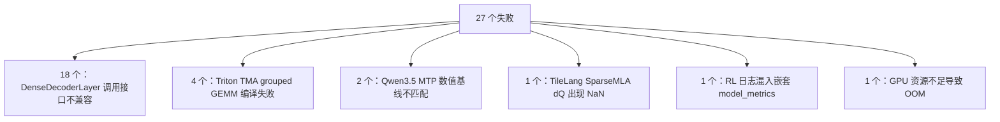
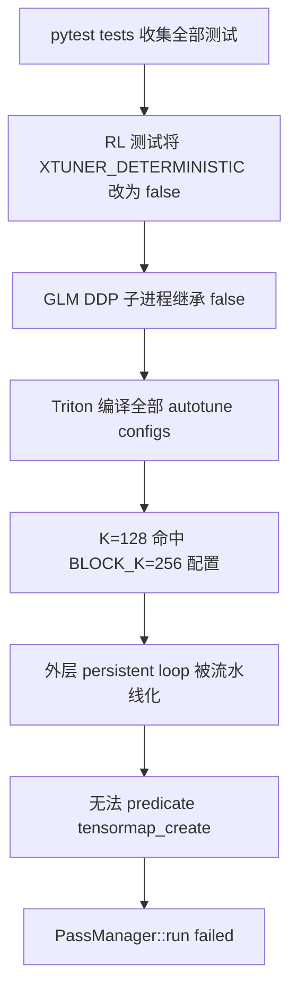

# GLM-5.2 PR 单测失败分析

## 结论

PR [#1967](https://github.com/InternLM/xtuner/pull/1967) 的
[unit_test](https://github.com/InternLM/xtuner/actions/runs/30022595263/job/89259786563)
共有 27 个失败，可归并为 6 类。24 个失败已有直接根因证据；Qwen3.5 的 2 个数值基线失败，以及
TileLang 的 1 个非稳定反向失败，还需要针对性复跑才能确定最终触发条件。



| 项目 | 结果 |
| --- | --- |
| Workflow run | [30022595263](https://github.com/InternLM/xtuner/actions/runs/30022595263) |
| 失败提交 | `fc47628dac0d72ea0a7bf88a8ea227b32228ae7b` |
| 汇总 | `27 failed, 523 passed, 24 skipped` |
| Pytest 用时 | `10216.88s (2:50:16)` |
| Lint | 通过 |

## 失败详情

### 1. DenseDecoderLayer 调用接口不兼容：18 个

结论：这是本 PR 引入的确定性代码回归。

`DenseDecoderLayer.forward` 被改为：

```python
def forward(
    self,
    *hidden_states,
    position_embeddings,
    seq_ctx,
):
```

`position_embeddings` 和 `seq_ctx` 因位于 `*hidden_states` 之后，只能按关键字传入；但
`xtuner/v1/model/dense/dense.py:101` 和
`xtuner/v1/model/dense/qwen3vl_text.py:67` 仍按三个位置参数调用。第三方 wrapper 是否介入只会改变
最外层报错形式，底层原因相同：

```text
DenseDecoderLayer.forward() missing 2 required keyword-only arguments:
'position_embeddings' and 'seq_ctx'
```

受影响用例：

1. `tests/engine/test_dense_train_engine.py::TestDenseEngine::test_dense_engine_train[cuda-1-1]`
2. `tests/engine/test_dense_train_engine.py::TestDenseEngine::test_dense_engine_train[cuda-1-2]`
3. `tests/engine/test_dense_train_engine.py::TestDenseEngine::test_dense_engine_train_swap_optimizer[cuda-1-1]`
4. `tests/engine/test_dense_train_engine.py::TestDenseEngine::test_dense_engine_train_swap_optimizer[cuda-1-2]`
5. `tests/model/test_qwen3_dense.py::TestQwen3Dense::test_fsdp_accuracy[cuda-1]`
6. `tests/model/test_qwen3_dense.py::TestQwen3Dense::test_qwen3_dense_run[cuda-1-False-0-01-chunk_cross_entropy]`
7. `tests/model/test_qwen3_dense.py::TestQwen3Dense::test_qwen3_dense_run[cuda-1-False-0-01-cross_entropy]`
8. `tests/model/test_qwen3_dense.py::TestQwen3Dense::test_sliding_windows[True-4-2048]`
9. `tests/model/test_qwen3_dense.py::TestQwen3Dense::test_sliding_windows[True-6-1024]`
10. `tests/model/test_qwen3_tile_embedding.py::TestQwen3Dense4B::test_qwen3vl_tie_embedding[cuda-1]`
11. `tests/model/test_qwen3_tile_embedding.py::TestQwen3Dense4B::test_tie_embedding[cuda-1]`
12. `tests/model/test_qwen3_vl.py::TestQwen3VL::test_fsdp_qwen3_run[cuda-1-False-0-01]`
13. `tests/model/test_qwen3_vl.py::TestQwen3VL::test_fsdp_qwen3_run[cuda-2-False-0-01]`
14. `tests/model/test_qwen3_vl.py::TestQwen3VL::test_fsdp_qwen3_run[cuda-8-False-0-01]`
15. `tests/model/test_qwen3_vl.py::TestQwen3VL::test_qwen3vl_run[cuda-1-0-01]`
16. `tests/model/test_qwen3_vl.py::TestQwen3VL::test_qwen3vl_run[cuda-2-0-01]`
17. `tests/model/test_qwen3_vl.py::TestQwen3VL::test_qwen3vl_run[cuda-8-0-01]`
18. `tests/rl/test_rl_colocate_trainer_integration.py::TestRLColocateTrainerIntegration::test_rl_train_with_sft`

### 2. Triton TMA grouped GEMM 编译失败：4 个

#### 2.1 结论

四个用例均在 `m_grouped_gemm_TMA_triton3_4.py` 编译相同 kernel 时失败，并非四个独立的
GLM-5.2 模型逻辑错误，也不是 `torch.compile` 自身的问题。

根因是 TMA descriptor 在 persistent tile loop 内动态创建。当 autotune 编译
`BLOCK_N=64, BLOCK_K=256, num_stages=3` 配置时，GLM tiny 测试的 `K=128` 使 K 循环折叠为
一次迭代。Triton 3.5.1 随后尝试流水线化外层 tile loop，却无法为
`ttng.tensormap_create` 生成 predicate，最终导致编译失败。

日志中的最底层诊断是：

```text
m_grouped_gemm_TMA_triton3_4.py:102:12:
error: 'ttng.tensormap_create' op pipeliner doesn't know how to predicate this op.
LLVM ERROR: Fatal pipeliner error
RuntimeError: PassManager::run failed
```

#### 2.2 CI 触发链

Action 使用 `pt29_20260520_fb46fea` 镜像，通过 `unit_test.yaml` 执行完整的 `pytest tests`。
虽然 `CI_ENV.sh` 设置了 `XTUNER_DETERMINISTIC=true`，但 pytest 收集
`tests/rl/test_qwen35_vl_moe_async_train_2step.py` 时，该模块在顶层将变量改为 `false` 且没有恢复。
之后 GLM DDP 测试通过 `spawn` 创建的子进程继承 `false`，因此不再将 autotune 固定到首个 config，
而是继续编译包含 `BLOCK_K=256` 的全部配置。



#### 2.3 最小复现证据

使用 `pt29_glm1`、H200、Torch 2.9.1、Triton 3.5.1 和干净 Triton cache，对
`A=(256, 128)`、`B=(2, 256, 128)`、`size_per_group=(128, 128)` 直接调用公共
`m_grouped_gemm`：

| 实现 | `XTUNER_DETERMINISTIC` | 结果 |
| --- | --- | --- |
| 当前实现 | `false` | 稳定复现相同 `tensormap_create` 编译错误 |
| 当前实现 | `true` | 仅编译首个 `BLOCK_K=64` config，通过 |
| 包含 `4496b0e6` 修复的实现 | `false` | 完整 autotune 通过，PyTorch 对比 `max_abs_diff=0.0` |

这说明环境变量污染是 CI 触发条件，循环内动态 TMA descriptor 才是 kernel 的真实缺陷。

#### 2.4 修复方案

采用提交 `4496b0e6` 的 descriptor-hoist 方案；本分支对应的 cherry-pick 提交为
`49c0c546`：

1. 将 A、B 的 `tl.make_tensor_descriptor` 移到 persistent tile loop 外。
2. descriptor 使用完整静态形状：A 为 `[M, K]`，B 为 `[B_ROWS, K]` 或 `[B_ROWS, N]`。
3. 增加 `B_ROWS` kernel 参数。
4. C 改用带边界 mask 的 `tl.store`，避免在每个 tile 内创建 C descriptor。
5. 测试模块对 `XTUNER_DETERMINISTIC=false` 的修改限定在模块执行期，并在结束后恢复原值。

仅强制确定性模式或删除 `BLOCK_K=256` config 可以暂时绕过失败，但会掩盖非确定性模式下仍可触发的
kernel 缺陷，不作为最终方案。

#### 2.5 受影响用例

1. `tests/engine/test_glm52_moe_train_engine.py::TestGlm52OptimizedEngine::test_sp2_ep4_micro2_compile_offload_train_step`
2. `tests/model/test_glm52_moe.py::TestGlm52SequenceParallel::test_mtp_loss_and_gradients_match_full_sequence`
3. `tests/model/test_glm52_mtp_checkpoint_repro.py::TestGlm52CompiledMTPCheckpoint::test_shared_mtp_depths_train_with_compile_and_topk_offload`
4. `tests/model/test_glm52_mtp_checkpoint_repro.py::TestGlm52MicroBatchMTPCheckpoint::test_nested_micro_batch_inputs_preserve_gradients`

#### 2.6 小结

四个失败共享同一条路径：全量测试污染确定性环境变量，使 Triton 编译到不兼容的流水线配置；将
TMA descriptors 提升到循环外可从 kernel 层消除问题，同时恢复测试环境变量可避免测试顺序影响后续
DDP 子进程。

### 3. Qwen3.5 MTP 数值基线不匹配：2 个

结论：失败现象已确定，但仅凭本次日志不能区分“硬编码 golden 已过期”和“共享 MoE 路径产生数值回归”。

测试期望 text loss 为 `1.5416`，两个并行配置实际都得到
`1.5147979259490967`。实际绝对差为 `0.0268021`；在 `atol=0.01, rtol=0.01`
下允许差值约为 `0.025416`，只超出约 `0.001386`。

两个配置得到完全相同的值，说明失败不是 SP1/SP4 之间的不一致，更像共同模型路径、checkpoint
或依赖环境相对旧 golden 的漂移。要确定最终原因，需要使用同一 checkpoint 分别运行 merge-base
和当前提交。

受影响用例：

1. `tests/model/test_qwen3_5.py::TestQwen3_5_VL::test_qwen3_5_vl_run_mtp[cuda-1-0-01]`
2. `tests/model/test_qwen3_5.py::TestQwen3_5_VL::test_qwen3_5_vl_run_mtp[cuda-4-0-01]`

### 4. TileLang SparseMLA 反向 dQ 非稳定：1 个

结论：CI 中 TileLang forward 和 LSE 已通过，只在 dQ 对比时出现大面积 NaN；该问题在隔离环境中不稳定复现。

CI 证据：

```text
Mismatched elements: 388224 / 589824 (65.8%)
Greatest absolute difference: nan at index (16, 0, 0)
```

失败断言是 `q_tilelang.grad` 对 `q_ref.grad`，位于
`tests/module/attention/test_dsa_mla.py:268`。使用 `pt29_glm1`、H200 和 GPU 文件锁隔离复跑同一
node id，结果为 `1 passed`。因此可以确定问题位于 TileLang backward 的运行结果，而不是 forward；
但当前证据还不能确定是测试顺序、kernel cache 还是运行时状态触发。

受影响用例：

1. `tests/module/attention/test_dsa_mla.py::TestAcceleratedSparseMLA::test_tilelang_forward_backward_matches_torch`

### 5. RL 日志错误处理嵌套 model_metrics：1 个

结论：这是本 PR 引入的确定性数据结构回归。

`MoE.post_micro_batch_forward` 新增了嵌套字典 `model_metrics`。RL worker 在
`xtuner/v1/rl/trainer/worker.py:850` 将整个 `train_step_info` 展开进
`train_metrics`；随后 `xtuner/v1/train/rl_trainer.py:1379` 假设每个指标都是标量并执行
`sum(value)`，最终对 `int` 和 `dict` 求和：

```text
TypeError: unsupported operand type(s) for +: 'int' and 'dict'
```

受影响用例：

1. `tests/rl/test_qwen35_vl_moe_async_train_2step.py::TestQwen35VLMoEAsyncTrain2Step::test_qwen35_vl_moe_async_train_2step_and_metrics`

### 6. GLM-5.2 SFT smoke test 显存不足：1 个

结论：直接失败原因是 CI 节点 GPU 资源不足，而不是 loss 非有限。

测试需要再申请 `6.00 GiB` 时，GPU 0 仅剩 `2.48 GiB`；日志显示两个进程分别占用
`50.89 GiB` 和 `86.68 GiB`，合计 `137.57 GiB`。现有日志无法确认额外占用来自前序测试未及时退出，
还是 runner 上的并发任务，但该用例尚未运行到最终 loss 断言。

受影响用例：

1. `tests/train/test_glm52_sft_smoke.py::TestTinyGlm52SFT::test_one_step_sft_produces_finite_loss`

## 总结与处理顺序

本次失败不是 27 个独立问题。建议先修复 Dense 调用接口和 RL `model_metrics` 展开逻辑，这两项可直接
消除 19 个确定性回归；再处理 Triton TMA kernel 的编译兼容性。Qwen3.5 应在同一 checkpoint
上对比 merge-base，TileLang 应在完整测试顺序下复跑，SFT smoke test 则应在确认 GPU 清理完成后重试。
