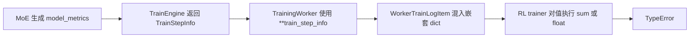
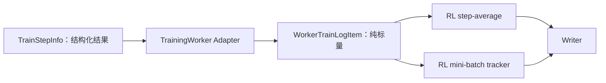

# MoE Load-Balance Model Metric TODO

## 结论

当前 PR 暂时撤销新增的 `model_metrics` 及 MoE 专家负载分位数指标，保留原有
`logs_info["maxvio"]`，先恢复所有训练路径的兼容性。

后续使用独立 PR 重新增加这些指标：由 `TrainingWorker` 在 Ray seam 显式将
`TrainStepInfo.model_metrics` 封送为纯标量 `WorkerTrainLogItem`，同时覆盖 RL policy 和 RL
附带 SFT 两条路径。不得将模型诊断指标并入 `logs_info` 或 `extra_info`。

## 问题

提交 `13242e21` 在共享的 `TrainStepInfo` 中增加了：

```python
model_metrics: NotRequired[dict[str, float]]
```

`MoE.post_micro_batch_forward()` 随后返回专家 token 数的 mean、min、max 和分位数。普通 SFT
`Trainer` 显式消费了该字段，但 RL `TrainingWorker` 仍将剩余的 `train_step_info` 整体展开到
`WorkerTrainLogItem`：



最小复现得到两个确定性错误：

```text
TypeError: unsupported operand type(s) for +: 'int' and 'dict'
TypeError: float() argument must be a string or a real number, not 'dict'
```

受影响用例：

```text
tests/rl/test_qwen35_vl_moe_async_train_2step.py::
TestQwen35VLMoEAsyncTrain2Step::
test_qwen35_vl_moe_async_train_2step_and_metrics
```

该问题影响所有通过通用 `MoE` 返回这些指标的 RL 模型，并非 Qwen3.5 专属问题。

## 当前 PR 的处理

本 PR 只撤销模型诊断指标相关改动：

1. 删除 `BatchForwardInfo.model_metrics`。
2. 删除 `MoE.post_micro_batch_forward()` 中专家 token 数的 mean、min、max 和分位数计算。
3. 删除普通 SFT `Trainer` 对 `model_metrics` 的文本及 tracker 输出。
4. 恢复 `logs_info["maxvio"] = maxvio.item()`。
5. 保留同一提交增加的 `step_seqlen_tokens`、`seqlen_tgs` 及其日志。

这样 `TrainStepInfo` 不再携带新增的嵌套字段，RL worker 返回值重新满足现有纯标量假设。

## 当前验证

在 `pt29_glm1` 环境持有 8 卡文件锁，按原配置完整执行此前失败的用例：

```text
tests/rl/test_qwen35_vl_moe_async_train_2step.py::
TestQwen35VLMoEAsyncTrain2Step::
test_qwen35_vl_moe_async_train_2step_and_metrics
```

本地环境原先缺少 CI 镜像 Dockerfile 已安装的 `dlblas`，因此仅从 `/tmp` 临时注入
`dlblas==0.0.7`，没有修改 conda 环境或测试配置。两步真实 Qwen3.5 MoE 异步 RL 训练最终通过：

```text
1 passed, 49 warnings in 869.81s (0:14:29)
```

## 后续独立 PR 的方案

### 1. 指标语义

保持三个字段的职责独立：

| 字段 | 职责 |
| --- | --- |
| `logs_info` | reduced loss；普通 Trainer 会添加 `loss/` 前缀 |
| `extra_info` | micro-batch forward/loss 临时统计，并按白名单执行 sum、min 或 max 归约 |
| `model_metrics` | 完整训练 step 结束后已经计算完成的模型诊断标量 |

`maxvio` 暂时保留为 `logs_info` 中的历史兼容字段；新的专家负载分布指标不得继续扩大这一例外。

### 2. TrainingWorker 作为 Adapter

在 Ray seam 前集中完成指标封送：

1. 显式拆分 `logs_info`、`extra_info`、`model_metrics`、运行时统计和 `total_loss`。
2. 仅展开已知的 `model_metrics: dict[str, float]`，不递归展开任意字典。
3. RL policy 和 RL 附带 SFT 路径使用相同的纯标量传输不变量。
4. `WorkerTrainLogItem` 的 Interface 应表达“动态名称的标量映射”，不再使用不完整的固定字段制造虚假约束。
5. 不新增只负责 `pop` 和 `update` 的浅 helper。



期望生成的指标包括：

```text
train_metrics/worker_0/moe_load_balance/expert_tokens_mean
train_metrics/worker_0/step_avg_moe_load_balance/expert_tokens_mean
sft_train_metrics/worker_0/moe_load_balance/expert_tokens_mean
```

### 3. 测试

后续 PR 必须通过公共训练行为验证最终 tracker，而不是测试内部字典操作：

1. MoE SFT：验证专家负载 min、分位数、mean、max 的顺序和有限性。
2. MoE RL：验证 mini-batch 与 step-average 指标都存在且为标量。
3. RL 附带 SFT：验证 `sft_train_metrics` 不再静默丢弃模型指标。
4. JSONL 与 TensorBoard Writer 继续只接收平坦的标量映射。
5. 完整运行此前失败的 Qwen3.5 两步异步 RL 用例。

## 不采用的方案

### 放入 `logs_info`

虽然可以绕开嵌套字典，但普通 Trainer 会把指标记录成：

```text
loss/moe_load_balance/expert_tokens_mean
```

模型诊断指标会被错误归类为 loss。

### 放入 `extra_info`

`ModelForwardExtraLogInfo.get()` 只输出登记在 sum、min、max 白名单中的字段；新字段会被静默丢弃。
此外，这些专家负载分位数已经基于完整 step 计算完成，不应再次进入 micro-batch 归约流程。

### 在 RL trainer 递归展开或跳过字典

递归展开会掩盖 `WorkerTrainLogItem` 的纯标量 Interface 错误；跳过字典虽然可能避免异常，但会静默丢失
指标，而且不能同时保证 step-average 与 mini-batch 两个消费点正确。

## 总结

当前 PR 通过撤销未完整接入所有消费者的 `model_metrics` 恢复兼容性。后续 PR 应保留独立的模型诊断
指标语义，并在 `TrainingWorker` 集中完成结构化训练结果到纯标量 RL 日志的转换，再通过真实 SFT、RL
和 Writer 行为测试锁定该 Interface。
