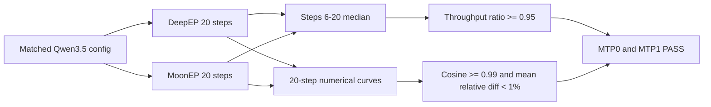
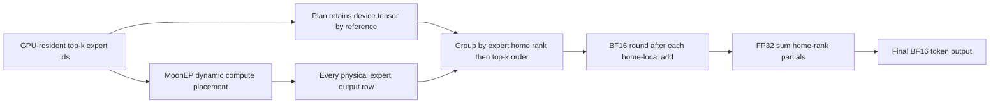
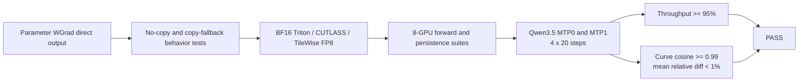
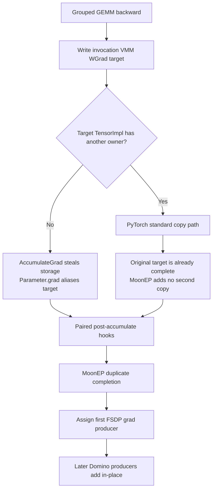

# XTuner MoonEP 最终验收报告

## 结论

MoonEP 第一版验收通过。真实 Qwen3.5-35B-A3B 在 8×H200、BF16、FSDP2×EP4、TP1、micro1、SP1、Direct landing、`torch.compile` 和 Triton grouped GEMM 下完成无 MTP 与 MTP1 两组独立 20-step 训练。MoonEP 的稳态吞吐分别为 DeepEP 的 `101.10%` 和 `100.95%`，全部 loss/grad-norm 曲线满足 cosine `>= 0.99` 且 mean relative difference `< 1%`。



## 版本、环境与完整配置

| 项目 | 最终值 |
| --- | --- |
| XTuner commit | `21edfccc6eb9531a3b851f448162ca9045841f5d` |
| MoonEP-mod commit | `c14bd43001efd8233950bb99e8eac9b1bafbdcc4` |
| 实际 imported module | `/mnt/shared-storage-user/zhaopenghao/github/MoonEP-mod/moonep/__init__.py` |
| Python 环境 | `pt212_cu132` |
| PyTorch / CUDA | `2.12.1+cu132` / `13.2` |
| 硬件 | `8 × NVIDIA H200`，同一节点、同一 GPU lock |
| 模型 / tokenizer | `/mnt/shared-storage-user/llmrazor-share/model/Qwen3.5-35B-A3B` |
| 数据 | `/mnt/shared-storage-user/llmrazor-share/data/alpaca` |
| 训练 | 20 steps、seed 0、global batch 8、micro1、SP1、TP1 |
| packing | hard/global pack，pack length 65536；每 step 有效 text tokens 65535 |
| FSDP | EP4、reshard-after-forward、recompute 1.0、BF16 param/reduce、CPU offload 关闭 |
| MoE | 256 routed experts、1 shared expert、top-k 8、hidden 2048、expert hidden 512 |
| MoonEP | Direct landing、staging reference 关闭、`moonep_num_sms=64`、router FP32、router async offload 关闭 |
| MTP0 / MTP1 | `mtp_config=None` / `MTPConfig(num_layers=1, share_weights=False)` |
| attention / compile | FlexAttention；model compile 开启；MHA 保留必要 graph boundary |
| grouped GEMM | Triton backend；CUTLASS grouped-GEMM 环境开关未设置 |
| optimizer / LR | AdamW，lr `6e-5`，wd `0.01`，betas `(0.9, 0.95)`，cosine，min lr `1e-6` |
| loss | token CE，chunk size 1024；balancing alpha `0.001`；z-loss 未启用 |
| 运行开关 | deterministic、activation offload 关闭、`XTUNER_COMPILE_NO_INPLACE_BUFFERS=1` |

完整可执行配置由 [`tests/acceptance/sft_qwen35_moonep_acceptance.py`](tests/acceptance/sft_qwen35_moonep_acceptance.py) 固化。四次运行的完整 `TrainerConfig` 序列化、环境、GPU 列表和 commit 记录在：

- `work_dirs/moonep_qwen35_acceptance_numsms64_20260806/deepep_mtp0_pack65536/acceptance_manifest.json`
- `work_dirs/moonep_qwen35_acceptance_numsms64_20260806/moonep_mtp0_pack65536/acceptance_manifest.json`
- `work_dirs/moonep_qwen35_acceptance_numsms64_20260806/deepep_mtp1_pack65536/acceptance_manifest.json`
- `work_dirs/moonep_qwen35_acceptance_numsms64_20260806/moonep_mtp1_pack65536/acceptance_manifest.json`

每一对运行只改变 dispatcher；MTP0/MTP1 之间只改变 `mtp_config`。checkpoint、seed、data order、batch、packing、compile、grouped-GEMM backend 和有效 token 数保持一致，未使用 tiny fallback。

## 汇总结果

| Gate | DeepEP median tokens/s | MoonEP median tokens/s | MoonEP / DeepEP | 判定 |
| --- | ---: | ---: | ---: | --- |
| MTP0，steps 6–20 | 5980.999158 | 6047.072872 | 1.011047 | PASS |
| MTP1，steps 6–20 | 5357.163811 | 5408.172454 | 1.009522 | PASS |

| Gate / curve | Cosine similarity | Mean relative difference | Finite | 判定 |
| --- | ---: | ---: | --- | --- |
| MTP0 balancing loss | 0.999999457 | 0.125065% | 是 | PASS |
| MTP0 LM loss | 0.999999893 | 0.042458% | 是 | PASS |
| MTP0 total loss | 0.999999895 | 0.041001% | 是 | PASS |
| MTP0 grad norm | 0.999997502 | 0.617857% | 是 | PASS |
| MTP1 balancing loss | 0.999999495 | 0.097961% | 是 | PASS |
| MTP1 LM loss | 0.999999908 | 0.037720% | 是 | PASS |
| MTP1 MTP loss | 0.999999851 | 0.052021% | 是 | PASS |
| MTP1 total loss | 0.999999918 | 0.035629% | 是 | PASS |
| MTP1 grad norm | 0.999997885 | 0.596727% | 是 | PASS |

机器判定原始结果：

- `work_dirs/moonep_qwen35_acceptance_numsms64_20260806/mtp0_comparison.json`
- `work_dirs/moonep_qwen35_acceptance_numsms64_20260806/mtp1_comparison.json`

## 全部 step 样本

下表均来自 rank0 JSONL tracker。`D/M` 分别表示 DeepEP/MoonEP；吞吐单位为 text tokens/s。

### MTP0

| Step | Tokens | D tgs | M tgs | D LM | M LM | D balance | M balance | D grad | M grad |
| ---: | ---: | ---: | ---: | ---: | ---: | ---: | ---: | ---: | ---: |
| 1 | 65535 | 603.970795 | 524.940559 | 1.773294 | 1.773294 | 0.046640 | 0.046640 | 13.966041 | 13.966249 |
| 2 | 65535 | 4835.278424 | 5385.177892 | 1.521926 | 1.521964 | 0.050049 | 0.050048 | 9.080240 | 9.086527 |
| 3 | 65535 | 5770.731912 | 6034.992442 | 1.365020 | 1.365216 | 0.048120 | 0.048120 | 5.327021 | 5.327210 |
| 4 | 65535 | 5854.139580 | 6021.995611 | 1.377670 | 1.377603 | 0.046269 | 0.046280 | 5.233148 | 5.229651 |
| 5 | 65535 | 5945.250162 | 6045.244762 | 1.258727 | 1.258612 | 0.044309 | 0.044310 | 2.087173 | 2.081547 |
| 6 | 65535 | 5915.801775 | 5983.754081 | 1.226042 | 1.226590 | 0.043948 | 0.043934 | 2.668679 | 2.693851 |
| 7 | 65535 | 5570.920714 | 6047.072872 | 1.213357 | 1.213405 | 0.042965 | 0.042927 | 1.316353 | 1.332625 |
| 8 | 65535 | 5980.999158 | 6037.725194 | 1.218081 | 1.217793 | 0.041834 | 0.041776 | 1.455758 | 1.446736 |
| 9 | 65535 | 5973.671835 | 6053.299736 | 1.048689 | 1.048741 | 0.041272 | 0.041215 | 1.674650 | 1.676064 |
| 10 | 65535 | 5978.923609 | 6041.462388 | 0.964830 | 0.964658 | 0.041251 | 0.041179 | 1.039011 | 1.038908 |
| 11 | 65535 | 5937.751650 | 6039.508682 | 0.911528 | 0.912260 | 0.041213 | 0.041155 | 0.576906 | 0.595887 |
| 12 | 65535 | 5979.053792 | 6017.482725 | 0.905457 | 0.904467 | 0.041333 | 0.041258 | 0.776147 | 0.774419 |
| 13 | 65535 | 5994.664405 | 6059.001686 | 0.831355 | 0.832179 | 0.041536 | 0.041502 | 0.648973 | 0.650542 |
| 14 | 65535 | 5995.323127 | 6064.369313 | 0.890192 | 0.889374 | 0.041670 | 0.041644 | 0.773139 | 0.781651 |
| 15 | 65535 | 5970.146254 | 6033.630371 | 0.864115 | 0.864910 | 0.041659 | 0.041618 | 0.479307 | 0.478931 |
| 16 | 65535 | 6006.083716 | 6057.358304 | 0.834636 | 0.834863 | 0.041634 | 0.041506 | 0.495848 | 0.497376 |
| 17 | 65535 | 5993.445405 | 6045.864780 | 0.903759 | 0.903254 | 0.041556 | 0.041442 | 0.464058 | 0.462978 |
| 18 | 65535 | 6007.869436 | 6058.219273 | 0.775073 | 0.775021 | 0.041609 | 0.041498 | 0.607856 | 0.615238 |
| 19 | 65535 | 6003.403651 | 6048.246045 | 0.768512 | 0.767578 | 0.041550 | 0.041447 | 0.922044 | 0.934641 |
| 20 | 65535 | 5990.520574 | 6048.586094 | 0.713907 | 0.714186 | 0.041562 | 0.041462 | 1.169436 | 1.181100 |

### MTP1

| Step | Tokens | D tgs | M tgs | D LM | M LM | D MTP | M MTP | D balance | M balance | D grad | M grad |
| ---: | ---: | ---: | ---: | ---: | ---: | ---: | ---: | ---: | ---: | ---: | ---: |
| 1 | 65535 | 612.621340 | 589.989906 | 1.773311 | 1.773311 | 0.180334 | 0.180334 | 0.047979 | 0.047979 | 14.821214 | 14.821090 |
| 2 | 65535 | 4337.691528 | 4619.106449 | 1.526788 | 1.527073 | 0.182865 | 0.182873 | 0.051397 | 0.051396 | 10.497808 | 10.511930 |
| 3 | 65535 | 5238.465952 | 5386.561926 | 1.361307 | 1.360493 | 0.165063 | 0.164956 | 0.049329 | 0.049326 | 5.817982 | 5.800820 |
| 4 | 65535 | 5304.440261 | 5386.238306 | 1.382398 | 1.383007 | 0.181404 | 0.181346 | 0.047632 | 0.047637 | 5.601584 | 5.597272 |
| 5 | 65535 | 5323.515088 | 5405.216185 | 1.258595 | 1.258608 | 0.148653 | 0.148596 | 0.045633 | 0.045630 | 2.168504 | 2.172486 |
| 6 | 65535 | 5306.707459 | 5379.111003 | 1.227557 | 1.227497 | 0.146125 | 0.146050 | 0.045142 | 0.045141 | 2.839369 | 2.834599 |
| 7 | 65535 | 5245.528678 | 5402.705291 | 1.214627 | 1.214581 | 0.139715 | 0.139843 | 0.044338 | 0.044338 | 1.349653 | 1.345385 |
| 8 | 65535 | 5347.934038 | 5408.172454 | 1.215610 | 1.215546 | 0.142457 | 0.142564 | 0.043080 | 0.043053 | 1.475603 | 1.484050 |
| 9 | 65535 | 5371.497384 | 5413.390015 | 1.045903 | 1.046501 | 0.124420 | 0.124546 | 0.042465 | 0.042438 | 1.639586 | 1.661787 |
| 10 | 65535 | 5341.682585 | 5374.012548 | 0.964530 | 0.965213 | 0.117001 | 0.117084 | 0.042420 | 0.042428 | 1.027340 | 1.035107 |
| 11 | 65535 | 5361.278270 | 5401.674369 | 0.910250 | 0.910648 | 0.110725 | 0.110807 | 0.042370 | 0.042421 | 0.628514 | 0.648877 |
| 12 | 65535 | 5314.849744 | 5385.311568 | 0.904738 | 0.905174 | 0.109708 | 0.109802 | 0.042521 | 0.042572 | 0.833935 | 0.840378 |
| 13 | 65535 | 5373.938372 | 5427.729020 | 0.830882 | 0.830533 | 0.102534 | 0.102578 | 0.042744 | 0.042791 | 0.719311 | 0.719515 |
| 14 | 65535 | 5373.191159 | 5425.151772 | 0.891017 | 0.891030 | 0.108324 | 0.108356 | 0.042807 | 0.042897 | 0.804236 | 0.807345 |
| 15 | 65535 | 5357.163811 | 5397.933021 | 0.864968 | 0.864662 | 0.105612 | 0.105614 | 0.042725 | 0.042833 | 0.499308 | 0.506832 |
| 16 | 65535 | 5370.361869 | 5424.859043 | 0.839349 | 0.838967 | 0.103927 | 0.103930 | 0.042687 | 0.042777 | 0.537040 | 0.537480 |
| 17 | 65535 | 5363.475958 | 5412.419488 | 0.905974 | 0.905936 | 0.109087 | 0.109135 | 0.042587 | 0.042674 | 0.488166 | 0.489826 |
| 18 | 65535 | 5316.188092 | 5422.644470 | 0.775146 | 0.776467 | 0.096551 | 0.096671 | 0.042633 | 0.042718 | 0.663638 | 0.658692 |
| 19 | 65535 | 5296.794596 | 5419.670546 | 0.769381 | 0.769731 | 0.097351 | 0.097428 | 0.042580 | 0.042657 | 0.972644 | 0.976478 |
| 20 | 65535 | 5371.099584 | 5402.320056 | 0.715974 | 0.715598 | 0.092360 | 0.092387 | 0.042592 | 0.042668 | 1.219918 | 1.227012 |

## 关键缺陷修复与性能选择

最终验收前的数值差异不是梯度丢失，而是 BF16 非结合性：DeepEP 先按 expert home rank 在 grouped GEMM 中形成 BF16 top-k partial，再用 FP32 合并 rank partial；MoonEP 动态 compute placement 若直接按 compute rank 分组，会改变舍入顺序。



`MoonEPCommPlan.topk_experts` 只保留调用方 device tensor 引用；combine kernel 不读取 route 值到 host，也不增加 device copy。public EP4/top-k8 红测在修复前能稳定复现 compute-rank grouping 与 home-rank grouping不一致，修复后 EP2/4/8、真实 tiny grouped GEMM 和正式 Qwen3.5 均通过。

H200 通信 microbenchmark 对 `num_sms` 的同 workload 结果如下；总时延是 planning、dispatch、expert copy、prefetch 和 combine forward/backward 微基准之和：

| `num_sms` | Combine fwd us | Combine bwd us | 近似总时延 us |
| ---: | ---: | ---: | ---: |
| 32 | 1380 | 1202 | 4319.6 |
| 64 | 1151 | 1161 | 3953.3 |
| 96 | 1220 | 1204 | 3999.9 |

因此 XTuner 新增 model-scoped `moonep_num_sms`，H200 验收默认 64，并原样传给唯一 `MoonEP Buffer`；其他部署可在 model config 调整。

## Profiler 与回归证据

`test_qwen_direct_hot_path_has_no_full_weight_copy_or_host_sync` 先用 staging path 校准 shape-based copy detector，再分别 profile Production Direct 和 `MTP shared + micro2 + reentrant + SP4 + compile`：

- 完整 BF16 home-weight `aten::copy_`：`0`。
- 完整 local `[2B]` dW clone/copy/zeros temporary：`0`。
- `MoonEP::planning` 到 duplicated-gradient handoff ranges 内 `cudaDevice/Event/StreamSynchronize`：`0`。
- 组合 tiny path peak allocated `< 1 GiB`。

当前提交的完整回归结果：

| Suite | 结果 |
| --- | --- |
| MoonEP-mod EP2/EP4/EP8 public integration | 每 rank `16 passed, 2 skipped` |
| MoonEP-mod EP4 combine kernels | 每 rank `14 passed` |
| XTuner Direct profiler gate | `1 passed` |
| XTuner MoonEP forward/MTP/Domino/SP/compile | `16 passed`，492.84s |
| XTuner DCP/HF/offload/optimizer/lifecycle | `10 passed`，310.41s |
| XTuner dispatcher（DeepEP/All2All/NoEP/optional MoonEP） | `13 passed, 1 skipped` |
| XTuner config/acceptance unit tests | `15 passed` |

所有 GPU 测试均通过 `/mnt/shared-storage-user/zhaopenghao/github/xtuner/zdev/gpu_lock.sh` 获取 8 卡文件锁。误将自带 `DistributedTestBase` spawn 的 profiler test 再包一层 `torchrun -n8` 会形成 64 workers；该错误调用已排除，正式命令使用单个 pytest parent。

## 复现命令

```bash
tests/acceptance/run_qwen35_moonep_acceptance.sh deepep 0 65536 work_dirs/moonep_qwen35_acceptance_numsms64_20260806
tests/acceptance/run_qwen35_moonep_acceptance.sh moonep 0 65536 work_dirs/moonep_qwen35_acceptance_numsms64_20260806
tests/acceptance/run_qwen35_moonep_acceptance.sh deepep 1 65536 work_dirs/moonep_qwen35_acceptance_numsms64_20260806
tests/acceptance/run_qwen35_moonep_acceptance.sh moonep 1 65536 work_dirs/moonep_qwen35_acceptance_numsms64_20260806

PYTHONPATH=. python -m xtuner._testing.moonep_acceptance compare \
  --deepep work_dirs/moonep_qwen35_acceptance_numsms64_20260806/deepep_mtp0_pack65536 \
  --moonep work_dirs/moonep_qwen35_acceptance_numsms64_20260806/moonep_mtp0_pack65536 \
  --output work_dirs/moonep_qwen35_acceptance_numsms64_20260806/mtp0_comparison.json

PYTHONPATH=. python -m xtuner._testing.moonep_acceptance compare \
  --deepep work_dirs/moonep_qwen35_acceptance_numsms64_20260806/deepep_mtp1_pack65536 \
  --moonep work_dirs/moonep_qwen35_acceptance_numsms64_20260806/moonep_mtp1_pack65536 \
  --output work_dirs/moonep_qwen35_acceptance_numsms64_20260806/mtp1_comparison.json
```

## 首版边界与待办

本报告只声明 BF16、TP1、node-local EP2/4/8（正式性能测试 EP4）、FSDP2、训练与本报告覆盖的 MTP/Domino/SP 能力。TP、FP8、跨节点 MoonEP、FSDP `no_sync`、pipeline parallel、decoding 不纳入第一版验收声明。XTuner 自管 expert 参数及其 DCP save/load 适配继续保留为后续待办；正式路径仍由 FSDP 唯一拥有参数与 checkpoint identity。

## 最终结论

MoonEP dispatcher 已在真实 Qwen3.5 SFT 上满足首版 Definition of Done：两组 20-step 数值门禁和 95% 吞吐门禁全部通过，Direct FSDP-to-VMM 路径保持 BF16 计算/通信、FP32 shard optimizer 流程，并由 profiler 固化无完整权重 copy、无 full-dW temporary、MoonEP 热路径无 host sync。

## 2026-08-29 Parameter 梯度 No-Copy 重构验收

### 结论

本轮重构验收通过。MoonEP 的 call-local expert weight 现为 leaf `Parameter`，grouped GEMM 可将 WGrad 直接写入 VMM target；生产路径由 `AccumulateGrad` 接管同一 storage，不再产生完整 local dW staging copy。真实 Qwen3.5-35B-A3B 的 MTP0/MTP1 两组 20-step 正式验收中，MoonEP 稳态吞吐分别为 DeepEP 的 `96.74%` 与 `97.10%`，全部 loss/grad-norm 曲线通过数值门禁。



### 版本、环境与验收范围

| 项目 | 验收值 |
| --- | --- |
| XTuner commit | `52c9705ad25320a88567364dc076332fefaa944f` |
| MoonEP-mod commit | `c14bd43001efd8233950bb99e8eac9b1bafbdcc4` |
| 实际 imported module | `/mnt/shared-storage-user/zhaopenghao/github/MoonEP-mod/moonep/__init__.py` |
| Python / PyTorch / CUDA | `pt212_cu132` / `2.12.1+cu132` / `13.2` |
| 硬件 | 同一节点 `8 x NVIDIA H200`，所有 GPU 测试均持有 8 卡文件锁 |
| 正式模型与数据 | Qwen3.5-35B-A3B / Alpaca，真实 checkpoint，无 tiny fallback |
| 正式训练 | BF16、FSDP2、EP4、TP1、SP1、micro1、global batch 8、hard/global pack 65536、20 steps、seed 0、`torch.compile` |
| 正式性能算子 | BF16 Triton grouped GEMM；steps 6-20 计算吞吐中位数 |
| 功能算子矩阵 | BF16 Triton、BF16 CUTLASS、TileWise FP8 FWD/DGrad + BF16 Triton WGrad |
| 验收输出根目录 | `work_dirs/moonep_ep_extend_acceptance_nocopy_20260829` |

四次正式运行的完整 config、环境、GPU 与版本记录分别位于：

- `work_dirs/moonep_ep_extend_acceptance_nocopy_20260829/deepep_mtp0_pack65536/acceptance_manifest.json`
- `work_dirs/moonep_ep_extend_acceptance_nocopy_20260829/moonep_mtp0_pack65536/acceptance_manifest.json`
- `work_dirs/moonep_ep_extend_acceptance_nocopy_20260829/deepep_mtp1_pack65536/acceptance_manifest.json`
- `work_dirs/moonep_ep_extend_acceptance_nocopy_20260829/moonep_mtp1_pack65536/acceptance_manifest.json`

每一对运行仅切换 dispatcher；checkpoint、data order、packing、compile、dtype、grouped-GEMM backend 与有效 token 数保持一致。

### 正式 20-step 数值与性能结果

| Gate | DeepEP median tokens/s | MoonEP median tokens/s | MoonEP / DeepEP | 判定 |
| --- | ---: | ---: | ---: | --- |
| MTP0，steps 6-20 | 5962.276258 | 5767.752399 | 0.967374 | PASS |
| MTP1，steps 6-20 | 5343.249998 | 5188.428713 | 0.971025 | PASS |

| Gate / curve | Cosine similarity | Mean relative difference | Finite | 判定 |
| --- | ---: | ---: | --- | --- |
| MTP0 balancing loss | 0.999999918 | 0.033117% | 是 | PASS |
| MTP0 LM loss | 0.999999976 | 0.015764% | 是 | PASS |
| MTP0 total loss | 0.999999977 | 0.015077% | 是 | PASS |
| MTP0 grad norm | 0.999999295 | 0.259798% | 是 | PASS |
| MTP1 balancing loss | 0.999999874 | 0.043555% | 是 | PASS |
| MTP1 LM loss | 0.999999959 | 0.023972% | 是 | PASS |
| MTP1 MTP loss | 0.999999909 | 0.046970% | 是 | PASS |
| MTP1 total loss | 0.999999966 | 0.022482% | 是 | PASS |
| MTP1 grad norm | 0.999995169 | 0.726449% | 是 | PASS |

机器判定原始结果为：

- `work_dirs/moonep_ep_extend_acceptance_nocopy_20260829/mtp0_comparison.json`
- `work_dirs/moonep_ep_extend_acceptance_nocopy_20260829/mtp1_comparison.json`

两个比较器均以退出码 `0` 完成，`passed=true`。正式性能结论只覆盖 BF16 Triton；FP8 与 CUTLASS 是本轮新增的 public-op、编译和 8 卡端到端功能/数值验收，不据此声明正式吞吐。

### Parameter 梯度存储语义



- 无额外 target alias 时，CPU、CUDA eager 与 `torch.compile(fullgraph=True)` 均实测 `Parameter.grad.data_ptr() == target.data_ptr()`，即 no-copy 快路径。
- 调用端保留额外 target alias 时，`AccumulateGrad` 按 PyTorch 标准语义复制到 `.grad`；原 VMM target 已包含完整 WGrad，MoonEP 直接消费它，不再执行第二次回拷。
- 两块 fused projection 的 post-accumulate hooks 都到达后才触发 duplicated-gradient completion；第一个 microbatch 直接赋予 FSDP unsharded Parameter `.grad` storage，Domino 后续 producer 才执行 `add_`。
- `_ExpertWeightAutograd` 已删除，未增加替代 invocation、schedule 或 capability 实体。普通 EP 传 `grad_weight_out=None` 并保持自然 allocation-return；MoonEP 才提供 caller-owned output storage。

### Grouped GEMM 与完整回归

| 路径 | FWD / DGrad | WGrad 与动态 EP 适配 | 验收结果 |
| --- | --- | --- | --- |
| BF16 Triton | 现有 one-segment kernel | 可选 direct-output；`M=0` 在 stride 检查前完整写零 | eager/compile/no-copy/copy fallback 通过 |
| BF16 CUTLASS | raw grouped backend、device counts | mutable output custom op；支持 empty expert 与 `M=0` | eager/compile 与 8 卡训练通过 |
| TileWise FP8 | AdaptiveGEMM 动态量化 FWD/DGrad | BF16 Triton direct-output WGrad；返回前释放 target alias | public op 与 8 卡训练通过 |
| 普通/DeepEP | 所选标准算子 | `grad_weight_out=None`，自然返回 dW | 原行为回归通过 |

| Suite | 结果 |
| --- | --- |
| public GMM / GroupedLinear / FP8 storage behavior | `21 passed` |
| MoonEP 六阶段与 dispatcher contracts | `9 passed` |
| 8 卡 BF16 MoonEP / DeepEP 两步数值回归 | `1 passed` |
| 8 卡 TileWise FP8 两步 loss / grad-norm 回归 | `1 passed`，38.76s |
| 8 卡 CUTLASS 两步 MoonEP / DeepEP 回归 | `1 passed`，36.19s |
| direct、普通 microbatch、MTP micro2 + SP4 profiler | `1 passed`，41.82s |
| Qwen / GLM、direct/staging、FP8、MTP、Domino、reentrant、shared expert、SP2/4/8 完整 forward suite | `17 passed`，513.96s |
| DCP save/load、跨进程 async DCP、HF export、offload、optimizer 与 lifecycle | `10 passed`，308.14s |
| Qwen3.5 正式 DeepEP/MoonEP x MTP0/MTP1 | `4 x 20 steps`，两个 compare 均 PASS |

Profiler 校准后确认 production direct path 的完整 home-weight copy、local `[2B]` dW staging/materialization 与 MoonEP range 内 host sync 均为 `0`。这使 no-copy 从实现假设变为持续回归门禁。

### 复现命令

```bash
tests/acceptance/run_qwen35_moonep_acceptance.sh deepep 0 65536 work_dirs/moonep_ep_extend_acceptance_nocopy_20260829
tests/acceptance/run_qwen35_moonep_acceptance.sh moonep 0 65536 work_dirs/moonep_ep_extend_acceptance_nocopy_20260829
tests/acceptance/run_qwen35_moonep_acceptance.sh deepep 1 65536 work_dirs/moonep_ep_extend_acceptance_nocopy_20260829
tests/acceptance/run_qwen35_moonep_acceptance.sh moonep 1 65536 work_dirs/moonep_ep_extend_acceptance_nocopy_20260829

PYTHONPATH=. python -m xtuner._testing.moonep_acceptance compare \
  --deepep work_dirs/moonep_ep_extend_acceptance_nocopy_20260829/deepep_mtp0_pack65536 \
  --moonep work_dirs/moonep_ep_extend_acceptance_nocopy_20260829/moonep_mtp0_pack65536 \
  --output work_dirs/moonep_ep_extend_acceptance_nocopy_20260829/mtp0_comparison.json

PYTHONPATH=. python -m xtuner._testing.moonep_acceptance compare \
  --deepep work_dirs/moonep_ep_extend_acceptance_nocopy_20260829/deepep_mtp1_pack65536 \
  --moonep work_dirs/moonep_ep_extend_acceptance_nocopy_20260829/moonep_mtp1_pack65536 \
  --output work_dirs/moonep_ep_extend_acceptance_nocopy_20260829/mtp1_comparison.json
```

### 最终结论

Parameter WGrad no-copy 重构已达到本轮 Definition of Done：统一 grouped GEMM caller-owned output storage 后，BF16 Triton、CUTLASS 与 TileWise FP8 可复用同一调用端；copy fallback 仍严格遵循 PyTorch Parameter 语义；完整 forward、持久化、profiler 和真实 Qwen3.5 MTP0/MTP1 门禁全部通过。历史首版结论中的 FP8 边界由本节的功能验收结果更新，但正式性能声明仍限定为 BF16 Triton。
