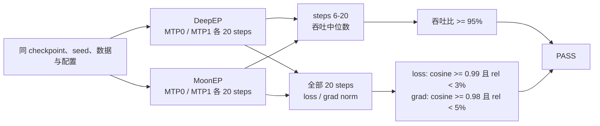
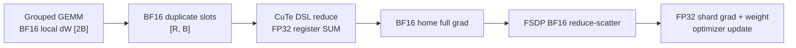

# XTuner MoonEP 09-02 最终验收报告

## 结论

MoonEP 第一版接入通过最终验收。真实 Qwen3.5-35B-A3B 在 8×H200、BF16、FSDP2×EP4、TP1、`torch.compile` 下完成 MTP0 与 MTP1 各一组 DeepEP/MoonEP 20-step 对照训练。MoonEP 稳态吞吐分别为 DeepEP 的 `108.49%` 和 `112.09%`；全部 loss 与 grad-norm 曲线满足冻结门槛。



## 版本与配置

正式训练 manifest 记录 XTuner `6d5f4b82aa3a9337537ebd7941942c22312afd8a`；整理提交历史后的等价产品代码位于 `3f5414f8`，两者在 `xtuner/v1` 下没有差异。MoonEP-mod 为 `d4494473fb0932dcc35f3a44a0e3b31827f5e282`。

| 项目                    | 验收值                                                                            |
| ----------------------- | --------------------------------------------------------------------------------- |
| Python / PyTorch / CUDA | `pt212_cu132` / `2.12.1+cu132` / `13.2`                                           |
| 硬件                    | 单节点 `8 × NVIDIA H200`                                                          |
| 模型 / 数据             | Qwen3.5-35B-A3B / Alpaca                                                          |
| 训练                    | 20 steps、seed 0、global batch 8、pack length 65536                               |
| 并行                    | FSDP2、EP4、TP1、SP1、micro1、reshard after forward                               |
| dtype                   | BF16 param、forward/backward、EP 通信与 FSDP reduce-scatter；FP32 optimizer shard |
| MoE                     | 256 routed experts、1 shared expert、top-k 8、router FP32                         |
| MoonEP                  | Direct VMM landing、staging reference 关闭、`moonep_num_sms=64`                   |
| MTP0 / MTP1             | `None` / `MTPConfig(num_layers=1, share_weights=False)`                           |
| grouped linear          | Triton；未启用 `grouped_gemm` CUTLASS 路径                                        |
| optimizer               | AdamW，lr `6e-5`，wd `0.01`，betas `(0.9, 0.95)`                                  |

完整配置、环境和 GPU 列表保存在 `work_dirs/moonep_0902_final_pass/*/acceptance_manifest.json`。四个 run 只切换 dispatcher 或 MTP 配置；checkpoint、seed、数据顺序、有效 token 数、packing、compile、optimizer 与 grouped-linear backend 保持一致。

## 20-step 结果

### 吞吐

吞吐只统计 compile/warm-up 后的 steps 6～20，单位为 text tokens/s。

| Gate | DeepEP median | MoonEP median | MoonEP / DeepEP | 判定 |
| ---- | ------------: | ------------: | --------------: | ---- |
| MTP0 |      5447.278 |      5909.833 |        108.491% | PASS |
| MTP1 |      3035.483 |      3402.410 |        112.088% | PASS |

### 数值曲线

| Gate / curve        |      Cosine | Mean relative difference | 判定 |
| ------------------- | ----------: | -----------------------: | ---- |
| MTP0 balancing loss | 0.999998824 |                0.114532% | PASS |
| MTP0 LM loss        | 0.999996055 |                0.269665% | PASS |
| MTP0 total loss     | 0.999996339 |                0.258404% | PASS |
| MTP0 grad norm      | 0.999883706 |                2.536973% | PASS |
| MTP1 balancing loss | 0.999999748 |                0.071091% | PASS |
| MTP1 LM loss        | 0.999999130 |                0.121277% | PASS |
| MTP1 MTP loss       | 0.999999091 |                0.105620% | PASS |
| MTP1 total loss     | 0.999999269 |                0.110629% | PASS |
| MTP1 grad norm      | 0.999980890 |                1.107751% | PASS |

机器判定结果：

- `work_dirs/moonep_0902_final_pass/mtp0_comparison.json`
- `work_dirs/moonep_0902_final_pass/mtp1_comparison.json`

两份结果均为 `passed=true`。

## 关键语义与验证

### BF16 duplicate-gradient return

正式路径由 MoonEP `Buffer.reduce_grad_bf16(...)` 归还 duplicate expert 梯度。两份 projection 共用 publication/reuse barrier；CuTe DSL kernel 从 BF16 VMM slot 读取，在 FP32 寄存器中执行 `SUM`，最后一次舍入写回 BF16 home gradient。原有 FP32 `Buffer.reduce_grad(...)` 保持不变。



EP2/4/8 public API 测试覆盖空 slot、重复 expert、连续 slot 复用和精确参与集合；最终真实训练使用 EP4。FSDP2×EP4 tiny 测试验证 duplicate contribution 在 reduce-scatter 前落入完整 BF16 gradient。

### 生命周期与并发

Runtime 只拥有模型级 Buffer/workspace，Dispatcher 拥有层级行为，InvocationState 只保存单次 forward/backward 的 plan、event 与 gradient slot。权重预取在 `dispatch` 阶段发起，`dispatch_postprocess` 只等待 device event 并消费 alias。

真实路径已覆盖：

- 同一 layer 多个 forward 后按原序和逆序 backward；
- Domino micro-batch=2；
- MTP reentrant original forward 与 replay；
- Direct VMM landing 的 validate-before-mutate、安装与卸载；
- 普通 AdamW 同步 DCP、同步/异步 HF export 与 router offload。

### 无 host sync

profiler 对真实 router 与 MoonEP direct hot path 的门禁结果为：

- router count 路径无 `cudaStreamSynchronize`；
- dispatch、weight prefetch、combine、duplicate-grad return 区间无 host/device/stream synchronize；
- 完整 home weight copy 为 `0`；
- 完整 local `[2B]` dW temporary/copy 为 `0`。

FSDP/NCCL 与 MoonEP 统一在 caller current stream 上形成一致的 device-side 顺序；没有用 host synchronize 修补跨 rank 依赖。

### 回归结果

| Suite                                                     | 结果                                 |
| --------------------------------------------------------- | ------------------------------------ |
| MoonEP-mod EP2/4/8、BF16 reduce、peer-skew 与连续调用     | PASS                                 |
| XTuner acceptance/config contracts                        | `23 passed`                          |
| persistence/router/landing/workspace/GroupedGEMM 组合回归 | `38 passed`                          |
| pre-commit（ruff、format、mypy 等）                       | PASS；mypy 检查 367 个 source files  |
| Qwen3.5 MTP0/MTP1 DeepEP/MoonEP                           | `4 × 20 steps`，两个 compare 均 PASS |

Muon cold DCP resume、SwapAdamW cold DCP resume 与 process-mode async DCP 对应 `todo_bug_fix/0003～0005`。它们是已有通用基线问题，不影响本报告的普通 AdamW、`debug_skip_save=True` 正式训练，相关实现与回归测试留给独立 PR。

## 复现命令

```bash
tests/acceptance/run_qwen35_moonep_acceptance.sh deepep 0 65536 work_dirs/moonep_0902_final_pass
tests/acceptance/run_qwen35_moonep_acceptance.sh moonep 0 65536 work_dirs/moonep_0902_final_pass
tests/acceptance/run_qwen35_moonep_acceptance.sh deepep 1 65536 work_dirs/moonep_0902_final_pass
tests/acceptance/run_qwen35_moonep_acceptance.sh moonep 1 65536 work_dirs/moonep_0902_final_pass

PYTHONPATH=. python -m xtuner._testing.moonep_acceptance compare \
  --deepep work_dirs/moonep_0902_final_pass/deepep_mtp0_pack65536 \
  --moonep work_dirs/moonep_0902_final_pass/moonep_mtp0_pack65536 \
  --output work_dirs/moonep_0902_final_pass/mtp0_comparison.json

PYTHONPATH=. python -m xtuner._testing.moonep_acceptance compare \
  --deepep work_dirs/moonep_0902_final_pass/deepep_mtp1_pack65536 \
  --moonep work_dirs/moonep_0902_final_pass/moonep_mtp1_pack65536 \
  --output work_dirs/moonep_0902_final_pass/mtp1_comparison.json
```

所有 GPU 测试均先通过 `/mnt/shared-storage-user/zhaopenghao/github/xtuner/zdev/gpu_lock.sh` 获取 8 卡文件锁。

## 首版边界与待办

本报告只声明 BF16、TP1、单节点 EP2/4/8（正式性能测试 EP4）、FSDP2、MTP 与已覆盖的 Domino micro-batch 能力。以下内容继续作为后续待办：

- 跨节点 MoonEP；
- XTuner 自管 expert 参数及其 DCP save/load；
- Muon、SwapAdamW 与 process-mode async DCP 的通用基线修复；
- EP+TP、FP8、pipeline parallel、FSDP `no_sync` 与 decoding。

## 最终结论

MoonEP dispatcher 已达到首版 Definition of Done：FSDP2×EP4 的 BF16 权重与梯度生命周期正确，MTP0/MTP1 真实 20-step 数值和性能门槛全部通过，关键热路径保持无 host sync；未实现能力已明确留在后续待办中。
