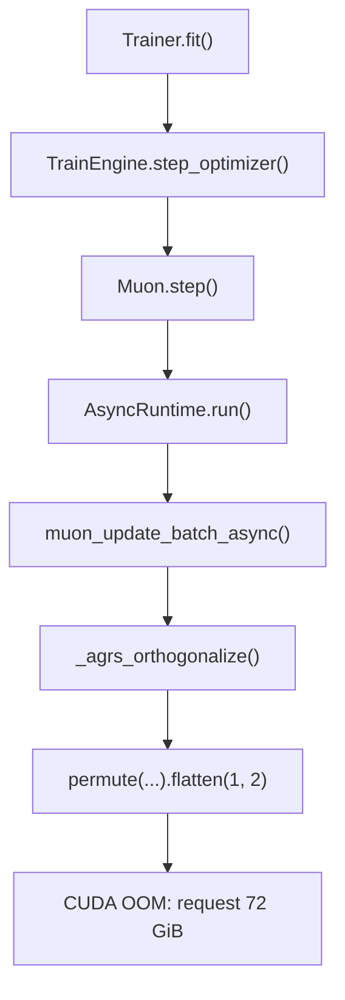
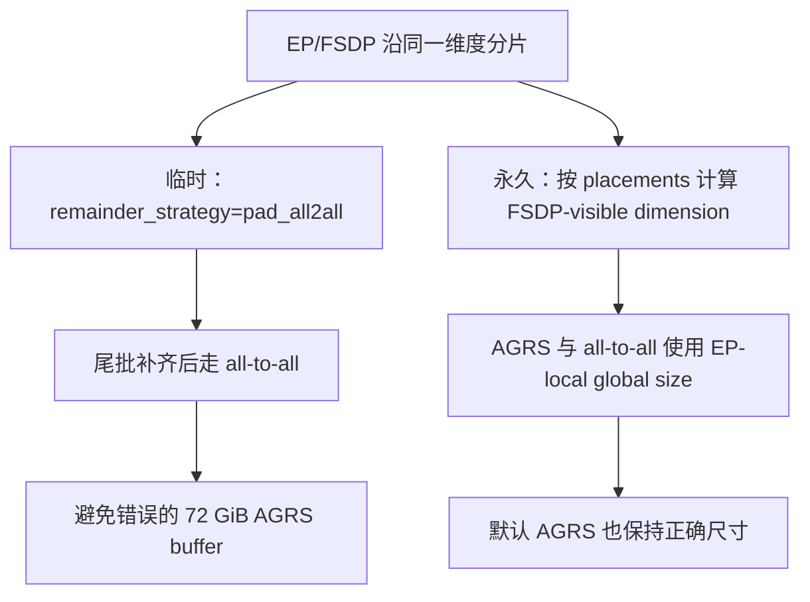

# GLM-5.2 512 卡 Muon 更新阶段 OOM

## 结论

这次 OOM 的根因是 **EP 与 FSDP 同时沿参数第 0 维分片时，AGRS 使用了错误的“全局维度”**。`DTensor.size(0)` 是包含 EP 的完整模型维度，但 AGRS 的 FSDP process group 只能在固定 EP rank 内恢复参数，因此它应该使用 **EP-local global dimension**。修复前代码直接把前者传给 AGRS，令 padding 行数放大为正确值的 8 倍；本分支已加入临时绕过和永久修复。

这不是 `TypedStorage` warning、显存碎片或 sequence parallel collective 的故障。错误在 Muon optimizer step 的 AGRS 尾批中触发。

## 触发调用链



对应代码路径：

1. [`xtuner/v1/engine/train_engine.py`](xtuner/v1/engine/train_engine.py) 调用 `optimizer.step()`。
2. [`xtuner/v1/optim/muon.py:432-462`](xtuner/v1/optim/muon.py:432) 的 `Muon.step()` 创建 Muon 异步任务，并以最多 3 个任务重叠执行。
3. [`xtuner/v1/optim/muon.py:596-747`](xtuner/v1/optim/muon.py:596) 按 DTensor mesh、placement、shape 分组并决定通信策略。
4. 对尾批，`use_agrs` 为真，任务进入 [`muon_update_batch_async`](xtuner/v1/optim/muon.py:870)。
5. 修复前 [`xtuner/v1/optim/muon.py`](xtuner/v1/optim/muon.py) 将 `X[0].size(shard_dim)` 作为 `global_shard_dim_size` 传入 AGRS；当前由任务创建阶段根据 mesh placement 传入 FSDP 视角的有效维度。
6. [`xtuner/v1/optim/muon.py:975-1029`](xtuner/v1/optim/muon.py:975) 先分配 all-gather buffer，再重排并 flatten；尾批 `R > 1` 时 flatten 会物化一份新的 contiguous tensor。

## 这次配置如何命中该路径

GLM-5.2 的专家参数和 mesh 定义见 [`xtuner/v1/model/moe/glm52/glm52.py`](xtuner/v1/model/moe/glm52/glm52.py) 与 [`xtuner/v1/model/moe/moe.py:1518-1542`](xtuner/v1/model/moe/moe.py:1518)：

- 总 rank 数：512；EP：8；因此专家 FSDP group 大小 `W = 512 / 8 = 64`。
- SP=8 负责 sequence 维度，不改变这里专家参数的 FSDP group 大小。
- routed experts：256；`hidden_size=6144`；`moe_intermediate_size=2048`。
- `fused_w2` 的 DTensor 全局 shape：
  `(256 × 6144, 2048) = (1,572,864, 2,048)`。
- [`MuonConfig.build`](xtuner/v1/config/optim.py:175) 对 `fused_w2` 使用 `num_experts=256`。
- EP 后 Muon 在每个 EP rank 上看到的专家数为 `256 / 8 = 32`。

当前作业中同形 `fused_w2` 参数共 76 个（75 个 MoE decoder layer，加 1 个物理 MTP layer），于是按 FSDP group size 64 分成：

```text
64 个参数（完整批） + 12 个参数（remainder，R=12）
```

对这组参数，`_create_muon_tasks` 的判断是：

```text
ns_num_experts = 32
32 % 64 != 0                       # 不能走 local
64 % 32 == 0，但 76 < 64 为 false    # 不走 subgroup all-gather
=> group process group size = 64
=> 12 参数的尾批走 AGRS
```

## 错误的显存计算

EP 和 FSDP 都沿第 0 维分片，所以每个 rank 实际拥有：

```text
local_rows = 1,572,864 / 8 / 64 = 3,072
```

但是 AGRS 收到的是 `X[0].size(0)=1,572,864`。在 [`_agrs_orthogonalize`](xtuner/v1/optim/muon.py:989-1007) 中因此计算出：

```text
错误：padded_shard_size = ceil(1,572,864 / 64) = 24,576
正确：padded_shard_size = ceil((1,572,864 / 8) / 64) = 3,072
```

错误值是正确值的 8 倍。对于 `R=12`、bf16、`cols=2,048`：

```text
ag_output = (W × R, padded_shard_size, cols)
          = (64 × 12, 24,576, 2,048)
          = 72 GiB
```

all-gather 完成后，代码在 [`muon.py:1017`](xtuner/v1/optim/muon.py:1017) 附近（外部作业日志中的 line 996，因版本行号偏移）执行：

```python
full_params = ag_reshaped.permute(1, 0, *range(2, ag_reshaped.ndim)).flatten(1, 2)
```

`permute` 后的 tensor 非 contiguous；`flatten(1, 2)` 会再申请一份约 72 GiB 的 contiguous storage。日志显示每张 H200 只有约 35.8 GiB 空闲，而进程已经使用约 104.2 GiB，因此在这一行申请第二份大 buffer 时失败。日志目录中的 512 个 rank 均请求同样的 `72.00 GiB`，与该计算完全吻合。

```mermaid
flowchart LR
    A["EP=8 + FSDP=64"] --> B["fused_w2: 76 params"]
    B --> C["batch 64 + remainder R=12"]
    C --> D["AGRS"]
    D --> E["DTensor.size(0)=1,572,864"]
    E --> F["错误 padded rows=24,576"]
    F --> G["ag_output=72 GiB"]
    G --> H["flatten copy 再申请 72 GiB"]
    H --> I["每卡仅约 35.8 GiB free"]
    I --> J["OOM"]
```



## 为什么 256 卡可以运行

已有 256 卡 Muon 运行记录（[`sft_glm_256gpu_256k_profile0727.md`](sft_glm_256gpu_256k_profile0727.md)）使用 EP=8，此时专家 FSDP group 为：

```text
W = 256 / 8 = 32
fused_w2 的 EP-local expert 数 = 256 / 8 = 32
32 % 32 == 0 => local path
```

`fused_w2` 不会进入 AGRS，因此不会暴露这个 EP-local global dimension 问题。512 卡把 FSDP group 从 32 增大到 64，才产生上述尾批路径。

## 问题是如何引入的

从提交历史看，`7d2c6bb7`（“support uneven agrs”）把 AGRS 改为显式接收 `global_shard_dim_size`，并在调用处直接传入 DTensor 的 `X[0].size(shard_dim)`。这对只有 FSDP 分片的参数是正确的；对 EP/FSDP 同维度分片则把 EP 维度也算进来了。随后 `9c4f3219` 将不足满批的默认策略设为 AGRS，使 512 卡的 `fused_w2` 尾批稳定命中该代码。原先基于本地 shard 重建 full dimension 的实现没有这个维度放大。

## 本地机制级最小复现

已添加 [`.dev_scripts/repro_muon_agrs_ep_oom.py`](.dev_scripts/repro_muon_agrs_ep_oom.py)，分为两部分：

- 单进程 CPU 模式：按 GLM-5.2 的真实 shape 打印 72 GiB / 正确 9 GiB 的 buffer 计算，并验证 `permute + flatten` 会复制 storage；不会申请 72 GiB。
- 4 rank CUDA/NCCL 模式：在最小 `(FSDP=2, EP=2)` mesh 上调用生产实现 `_agrs_orthogonalize`，验证 DTensor 全局 shape 与 EP-local shape 的差异，以及错误/正确参数分别进入 Newton-Schulz 的 shape。

CPU 计算检查：

```bash
source /mnt/shared-storage-user/zhaopenghao/miniconda3/etc/profile.d/conda.sh
conda activate pt29_glm2
PYTHONPATH=. python .dev_scripts/repro_muon_agrs_ep_oom.py
```

4 rank CUDA 检查（使用本地 GPU 锁）：

```bash
GPU_LOCK_DEVICES=0,1,2,3 \
/mnt/shared-storage-user/zhaopenghao/github/xtuner/zdev/gpu_lock.sh -n \
bash -lc 'source /mnt/shared-storage-user/zhaopenghao/miniconda3/etc/profile.d/conda.sh && \
conda activate pt29_glm2 && \
PYTHONPATH=. torchrun --standalone --nproc_per_node=4 \
.dev_scripts/repro_muon_agrs_ep_oom.py --distributed --device cuda'
```

该复现不故意申请生产规模的 72 GiB，而是验证同一生产函数和同一 shape 变换；因此能安全地证明机制，不依赖完整 GLM-5.2 前向/反向。

## 已实现的两个方案

### 临时方案：尾批使用 padded all-to-all

`MuonConfig` 现在暴露并传递 `remainder_strategy`，默认值仍为 `"agrs"`，因此不改变既有配置。复现该作业时可显式切换：

```python
optim_cfg = MuonConfig(
    lr=lr,
    enable_all2all=True,
    remainder_strategy="pad_all2all",
)
```

尾批会先补齐到 FSDP group size，再走 all-to-all，不会申请错误尺寸的 AGRS all-gather buffer。该方案要求 all-to-all 可用；`enable_all2all=False` 会强制走 AGRS，不能作为本问题的规避手段。

### 永久修复：传递 FSDP 视角的有效维度

`Muon._create_muon_tasks` 现在检查 DTensor placements：从参数全局维度开始，除去与 FSDP 沿同一 tensor dimension 分片的非 FSDP mesh factor（本例为 EP），再将结果同时传给 AGRS 和 all-to-all。不会写死 EP size，默认 `remainder_strategy="agrs"` 也能安全工作。

对本次 `fused_w2`：

```text
DTensor rows                 = 1,572,864
FSDP-visible global rows    = 1,572,864 / 8 = 196,608
padded rows per FSDP rank   = 196,608 / 64 = 3,072
each AGRS buffer (R=12)     = 9 GiB
```



## 回归与验证

新增 `tests/optim/test_muon.py::TestMuonFSDP.test_muon_ep_fsdp_remainder_uses_fsdp_global_dimension`：4 rank、`(FSDP=2, EP=2)` 的真实 DTensor/Muon step，故意构造 AGRS 尾批，并通过公开的 Newton-Schulz callback 检查输入维度。修复前测试失败（看到 12 行），修复后只看到正确的 6 行。

临时方案也加入现有 FSDP 端到端数值测试，覆盖默认 AGRS、禁用 all-to-all 和 `pad_all2all` 三种组合。

验证结果：

```text
PYTHONPATH=. python -m pytest tests/optim/test_muon.py -q
12 passed
```

`.dev_scripts/repro_muon_agrs_ep_oom.py` 仍提供安全的机制级复现：CPU 模式打印生产 shape 的 72 GiB/9 GiB 计算，4-rank CUDA 模式调用生产 AGRS 实现验证错误与正确维度；它不会申请生产规模的 72 GiB buffer。

## 最终判断

```text
512 卡 + EP8 => FSDP group 64
GLM-5.2 fused_w2 尾批 R=12 => AGRS
AGRS 使用含 EP 的 DTensor global dim => padding 放大 8 倍
非 contiguous flatten 再复制一份 => 72 GiB 申请失败
```

因此此次 72 GiB 申请的根因已通过永久修复消除；重新运行 512 卡作业时仍应观察 256k/SP8 的其他显存峰值。调整 allocator 参数或消除 TypedStorage warning 本身不能解决原始 OOM。
